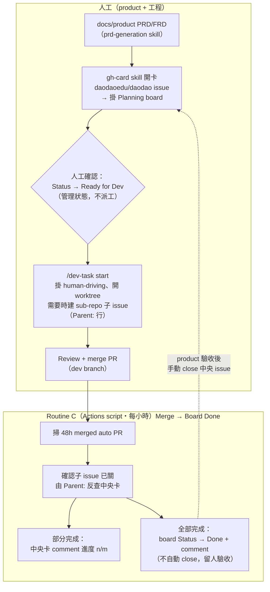
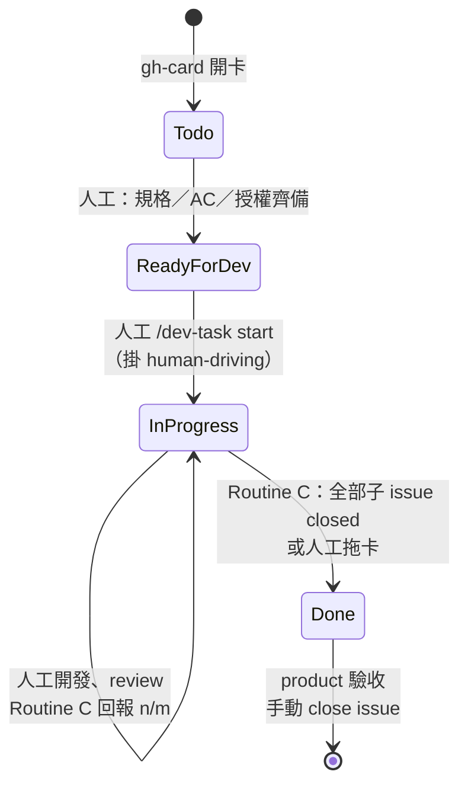

# GitHub Pipeline — Board 回寫自動化架構（Routine C）

> **退役註記（2026-09-20，#241）**：自動派工 Routine A（Board → Sub-repo Dispatch）與 Routine B（Claude cloud 實作）已整批退役。OpenSpec 於 #237 退役後 Routine A 的 spec gate 失去輸入、只會把 Ready for Dev 卡退回 `needs-spec`；Routine B 依賴 Routine A 的鏡像 issue，從未穩定跑通。程式（`bin/pipeline/dispatch.ts`、`pipeline-dispatch.yml`）已刪除，prompt 與模板封存於 [docs/archive/automation/](../archive/automation/README.md)。**pipeline 現在只剩 Routine C**（merged PR → Board Done）；所有開發走人工 [dev-task](../../.claude/skills/dev-task/SKILL.md)。

> 2026-08 起取代 Notion pipeline。任務管理層從 Notion DB 遷移到
> **GitHub org Project「Planning」** + **daodaoedu/daodao 中央 issues**。
> Notion 完全退場；舊架構文件見 [architecture.md](architecture.md)（僅供考古）。

## 總覽

- **管理層（source of truth）**
  - 中央 issues：[daodaoedu/daodao/issues](https://github.com/daodaoedu/daodao/issues) — feature 卡，product 視角，附 FRD / POC 連結
  - 看板：[orgs/daodaoedu/projects/10「Planning」](https://github.com/orgs/daodaoedu/projects/10)
  - Status 流：`Todo`（待規劃）→ `Ready for Dev`（規格、AC 與授權齊備；**不再觸發派工**）→ `In Progress`（人工 `/dev-task` 開工）→ `Done`（全部子 issue 關閉，待驗收）
- **工程層**
  - 開發由 `/dev-task` 在 worktree 隔離進行；跨 repo 子 issue 由人工（或 `/publish-tasks`）建立，body 保留 `Parent: daodaoedu/daodao#N` 一行讓 Routine C 反查
  - Routine C 把 merged PR 的完成狀態回寫 board
- **人工開工標記**：`human-driving`（`/dev-task` start 自動掛）；`Ready for Dev` 只是管理狀態

## 全流程圖

## 狀態機（中央卡視角）

## Label 體系

### 中央 repo（daodaoedu/daodao）

| Label | 誰加 | 現況 |
|---|---|---|
| `human-driving` | 人工／`/dev-task` start | 人工開工標記（保留） |
| `scope:XS/S/M/L` | 人工 | 複雜度標注（保留，供規劃與 board 篩選） |
| `repo:<sub-repo>` | 人工 | 目標 repo 標注（保留，board 篩選用） |
| `auto`、`auto:plan-only`、`auto:auto-pr` | — | **不再使用**（Routine A／B 退役；label 保留不刪） |
| `needs-spec`、`dispatched` | — | **不再使用**（原 Routine A 產出；label 保留不刪，舊卡片仍可能帶有） |

### Sub-repo（子 issue／PR）

`auto` label 仍是 Routine C 掃 merged PR 的條件；`spec-pending`、`spec-merged`、`human-coding`、`manual`、`stop-after-plan`、`automation:hold` 等 Routine B 時代 labels **不再使用**（保留不刪）。

## Routine 清單

| Routine | 執行方式 | 排程 | 入口 | 職責 | 狀態 |
|---|---|---|---|---|---|
| A — Board → Dispatch | GitHub Actions script | — | ~~`pipeline-dispatch.yml` → `bin/pipeline/dispatch.ts`~~ | 掃 board、spec gate、拆卡開鏡像 issue | **已退役（2026-09-20）** |
| B — Dispatch + PR patrol | Claude cloud routine | — | ~~[routine-b-prompt-v2.md](../archive/automation/routine-b-prompt-v2.md)~~ | 實作 auto issue、開 PR、巡 PR | **已退役（2026-09-20）** |
| C — Merge → Board Done | **GitHub Actions**（純 script） | 每小時 `:37` UTC | [pipeline-board-sync.yml](../../.github/workflows/pipeline-board-sync.yml) → `bin/pipeline/board-sync.ts` | merged PR → 關子 issue → board 回寫 | 運作中 |

判斷邏輯集中在 `bin/pipeline/lib.ts`（純函式、vitest 覆蓋：`parseParentIssue`、`parseClosingIssues`、`buildProgressComment`、`buildAllDoneComment`）；gh CLI 呼叫在 `bin/pipeline/gh.ts`；board／repo 常數在 `bin/pipeline/types.ts`。
Workflow 支援 `workflow_dispatch` 手動觸發 + `dry_run`／`hours`。運維手冊見 [routine-c-prompt.md](routine-c-prompt.md)，行為規範見 `.claude/skills/gh-pipeline/`。

環境需求：repo secret `GIT_HUB_ACCESS_TOKEN` 需含 `repo` + `project` scope
（Actions 內建 GITHUB_TOKEN 摸不到 org project）。

未來可升級：Routine C 改事件驅動（sub-repo `pull_request: closed` → `repository_dispatch`
到中央 repo），merge 當下即回寫，不用 hourly 輪詢。

緊急停止：monorepo root 放 `.automation-paused` 檔案，Routine C 直接退出。

## 安全邊界

- Routine C 只做 issue comment／close 與 board Status 回寫，不寫 code、不開 PR。
- 高風險 repo `daodao-storage` / `daodao-infra` 的 migration／IaC 一律人工 `/dev-task`。
- `human-driving` label → 人工開工標記；Routine C 不因它改變行為。

## Context Pack（確定性檢索，2026-08-20 加入）

依「Context Pack 實戰筆記」引入：review／實作只看 diff 會漏掉「同類呼叫點、
被改模組的 importer、進行中的工作」——這三種都是確定性查詢，不需要 RAG。

| 元件 | 位置 | 用途 |
|---|---|---|
| `retrieve-context.sh` | monorepo `.github/scripts/`（sub-repo 各自 vendor 一份） | rg/git/gh 打包 diff 外脈絡成 context-pack.md：① 改動 symbol 的 caller ② 被改檔案的 importer ③ 同呼叫模式的其他出現點 ④ in-flight 工作（open PR 交集 + 近 21 天 commit）⑤ 精簡 repo map |
| `test-retrieve-context.sh` | 同上 | fixture 回歸：重演「修 1 個漏 N 個」案例，斷言 pack 必列出漏掉的檔案；改腳本必過 |
| Reviewer 規則 | sub-repo `code-review.yml` 的 system prompt | 每個 ⚠ 位置判斷「需不需要同樣的修改」；同缺陷未提 → 🔴 Incomplete scope |
| 人工實作前查 in-flight（原 Routine B Step 0） | `dev-task` start 防撞檢查（原 `agentic-flows.md` 已封存於 `docs/archive/automation/gh-pipeline-references/`） | 實作前查 in-flight 衝突；開 PR 前自查 ⚠ 位置，範圍外的在 PR body 註記 Known incomplete scope |

噪音採**分級摘要**（命中 >60 或分散 >15 檔 → 壓一行計數；每檔 ≤3 行；pack ≤16KB）。
已內建的 CI 坑解法：merge-base 兩點 diff、rg 無命中 `|| true`、截斷前先 sort、BSD/GNU 相容。

Root AI Code Review 會在送出 diff 前產生 Context Pack，並把兩者一起送到 Workers AI。
CI 一律從 PR 的 **base SHA** 讀取可信版本的 `retrieve-context.sh`，不執行 PR checkout
中可被修改的腳本；diff 與 pack 使用相同的 `merge-base → head SHA`。目前 PR 會從
open PR 交集排除，避免把自己誤判為 in-flight 衝突。diff、pack 與 review body 都透過
`$RUNNER_TEMP` 檔案跨 step 傳遞，不使用固定 heredoc delimiter。

首次合併時會執行 base branch 上既有的可信腳本版本；只有 base 完全沒有該腳本或腳本執行
失敗時，CI 才會安全降級成 diff-only review。合併後的後續 PR 才會使用這次更新的 Context Pack。
共享設定同步 Action 先通過 branch policy 與同步契約回歸測試，再為各 target repo 的
default branch 建立獨立 PR，同步三個 workflow、可信 Context Pack 腳本與 regression contracts。
同步流程只開 PR，並在 run summary 列出待審連結；完成 CI checks 與 review 後依正常流程合併，
不使用 ruleset bypass。未設定 required checks 的 repo 也不會因啟用 auto-merge 而立即合併。
Branch Base Check 與同步使用相同的 repository default branch，因此 dev/main 專案均可接收
普通 PR；release/hotfix 另可使用 main、production、prod 等 production 分支名稱。

Fixture 覆蓋 TypeScript importer、JSX 呼叫模式、Python dotted module、current PR 排除，
以及超過 pipe buffer 時仍保持 UTF-8 完整行截斷。

## 相關 skills

| Skill | 用途 |
|---|---|
| `gh-card` | 開中央卡 + 掛 board（取代 notion-card） |
| `gh-pipeline` | Routine C 行為規範與除錯 |
| `prd-generation` | 產 PRD（OpenSpec 已退役） |
| `publish-tasks` | 把已確認計畫的未完成任務發成 sub-repo 子 issue（人工批次，不觸發自動化） |
| `dev-task` | 人工隔離 worktree 開發流程 |
| `post-merge-wrapup` | merge 後核對驗收與部署證據、更新 docs/product |

## 已退役元件

| 元件 | 狀態 |
|---|---|
| Notion 任務 DB（`3549cc81...`） | 退場，不再讀寫 |
| `bin/notion-sync/`、`bin/routine-dispatch/` | 退役（omc 時代） |
| `bin/routine-c/sync-done.ts` | 退役，由 `bin/pipeline/board-sync.ts` 取代 |
| workflows `routine-a-notion-sync.yml` / `routine-c-sync-done.yml` | 已刪除 |
| **Routine A** `bin/pipeline/dispatch.ts` + `pipeline-dispatch.yml` | 2026-09-20 刪除（#241）；運維手冊封存 [routine-a-prompt.md](../archive/automation/routine-a-prompt.md) |
| **Routine B** Claude cloud routine | 2026-09-20 退役（#241）；prompt 封存 [routine-b-prompt-v2.md](../archive/automation/routine-b-prompt-v2.md) |
| `bin/pipeline/review-evals.ts` + `review-evals.yml` | 週報已停（#237 刪 workflow、#241 刪腳本） |
| `bin/openspec-headless.ts`、`bin/pipeline-status.ts` | 已刪除 |
| `.github/skills/openspec-*` | 2026-09-20 刪除（#237 標 DEPRECATED、#241 移除） |
| skills `notion-card` / `notion-pipeline` | 標記 DEPRECATED（git 歷史可考） |
