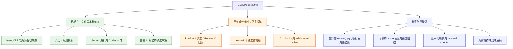
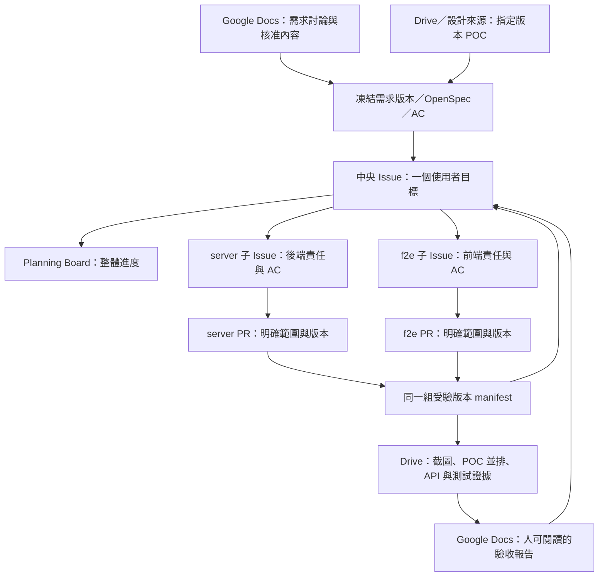
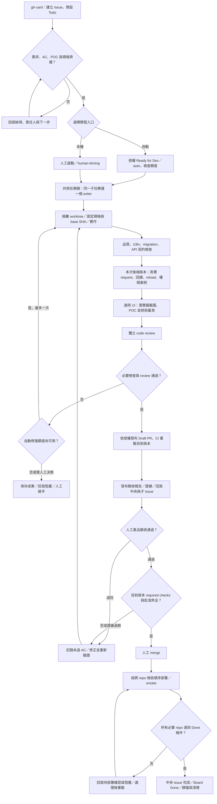
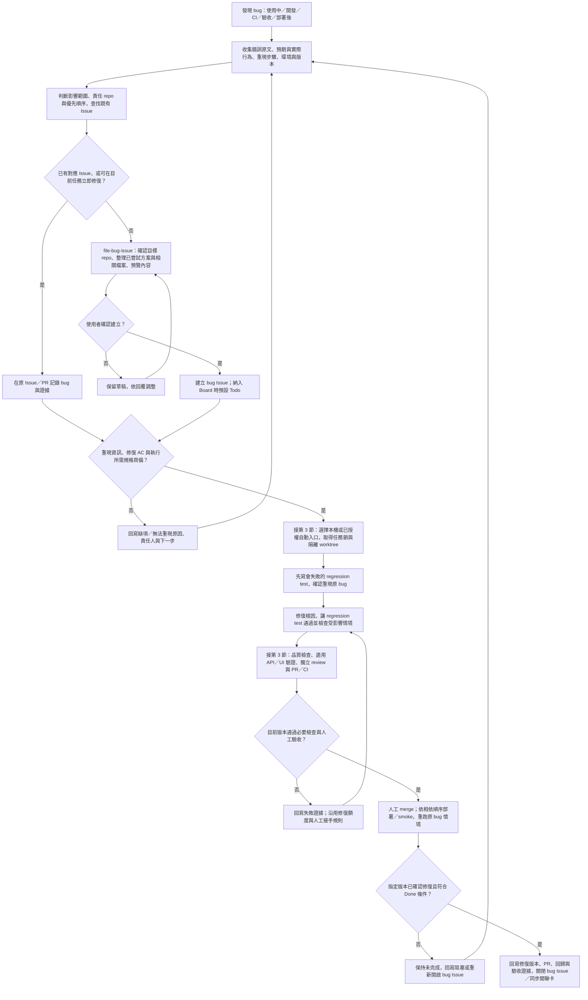
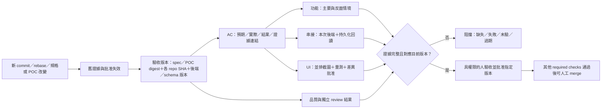
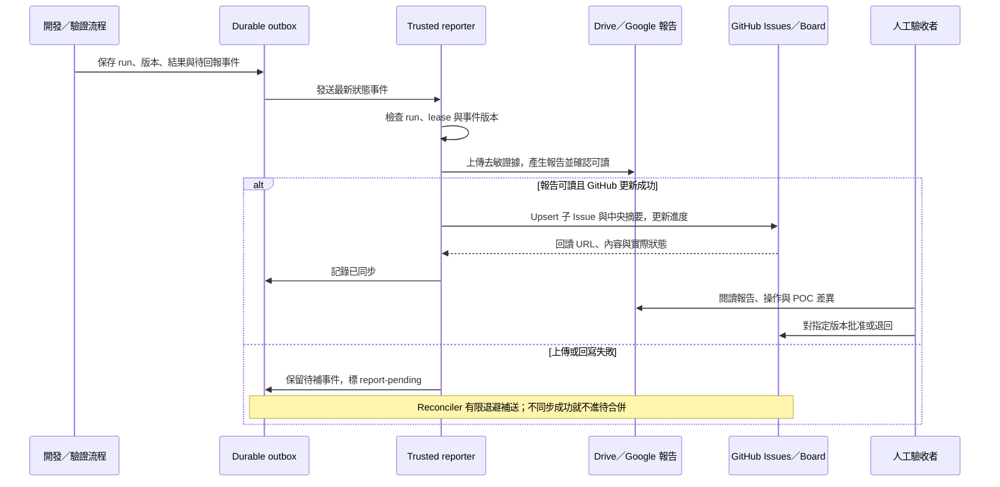
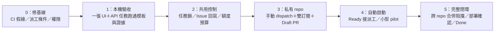

# 島島阿學開發流程圖解

> 註（2026-09-20，#241）：自動派工 Routine A／B 與 merge 回寫 Routine C 皆已退役，board 由 skill 呼叫 `bin/pipeline/board.ts` 回寫；下文提到 Routine A 派工、`dispatch.ts`、雙 gate 之處為歷史規劃，現行以人工 `/dev-task` 為準。

> 註（2026-09-20）：OpenSpec 已退役，下文提及 OpenSpec change／tasks.md 之處已不適用；規格以 docs/product 與 Issue 驗收契約為準。舊 `openspec/` 已封存於 `docs/archive/openspec/`。

> 日期：2026-09-12。定位：以 Mermaid 說明目前成果、目標流程與待實作範圍。
> **規劃與模板已建立，不代表自動化已完成。** 本文依本次對話與工作區盤點整理，未新增 GitHub、runner 或部署驗證。

詳細規則以[共用開發流程](issue-to-acceptance-workflow.md)為準；額度見[分配政策](agent-budget-policy.md)，可複製格式見[模板索引](../../templates/development/README.md)。圖中的狀態是目標語意，不表示 GitHub Board 已有相同欄位。

Issue 欄位、labels、Board 狀態及中央／子卡／PR 關聯統一見 [GitHub Issue 管理規範](github-issue-management.md)，適用一般需求與下方 Bug 流程。

## 1. 現在完成到哪裡？

「已建立」只表示檔案／skill 存在及已做對應格式檢查，沒有宣稱遠端部署完成。可以依文件人工執行；可靠的全自動閉環仍需下方待辦落地。

## 2. Issue、PR、Google 文件各管什麼？

- 中央 Issue 管目標與跨 repo 完成度；子 Issue 引用中央 AC，不另訂需求。
- PR 管程式變更與合併證據；單一子 PR 合併不代表中央目標完成。
- Google Docs 供討論／閱讀，執行使用已核准快照；manifest 記錄實際版本與驗證結果。
- 同 repo 的小任務可直接由中央 Issue 關聯 PR，不必為形式多拆一張子卡。

開卡使用 [gh-card](../../.claude/skills/gh-card/SKILL.md)。預設 Todo；「建立 Issue」與「啟動自動開發」是不同操作。

## 3. 完整目標流程：自動與本機共用驗收

本圖省略各階段通往阻塞回報的線：登入失效、額度不足、runner 離線、證據上傳失敗均須保存結果並回寫，不能當成功。人工修正可繼續，但不會重設同一自動 run 的修復上限。

私有 repo 的自動流程沿用雙 provider review；本機可採獨立 reviewer session 或人類 reviewer。Codex 訂閱 CI 的公開 repo 限制與 runner 設計見[雙訂閱 v2](dual-subscription-development-workflow.md)，不能把同一自動入口無條件套到所有 repos。

**現況提醒（2026-09-20 更新）：** 自動派工已退役（`dispatch.ts` 已刪除），圖中的雙 gate 與派工屬歷史目標政策；未準備好保持 Todo，人工任務加 `human-driving`。共用任務鎖與上述 required checks 也尚未完整實作。

## 4. Bug 通報與修復流程

Bug／CI 錯誤通報由 [gh-card](../../.claude/skills/gh-card/SKILL.md) 分流至 [file-bug-issue](../../.claude/skills/file-bug-issue/SKILL.md)。開發中可立即處理、且屬於目前任務的錯誤，可在原 Issue／PR 留下重現與修復證據；無法立即修復或需要獨立追蹤時，走 bug 開卡流程。

- 重現資料包含發生環境、服務／commit 版本、錯誤訊息與已嘗試方案；移除憑證及個資。暫時無法重現時保留追蹤，不標記為已修復。
- 修復 AC 以原 bug 的預期行為與受影響情境為基準。跨 repo 問題沿用第 2 節的中央／子 Issue 與同組受驗版本；單一 repo 修好不代表整體完成。
- 純 UI layout／CSS 不要求 React unit test，改以可重現操作及修復前後瀏覽器證據驗證；邏輯 bug 依[共用開發流程](issue-to-acceptance-workflow.md)先留下失敗的 regression test，再修復。
- 開 bug 卡不會自動授權開發。自動入口仍須符合第 3 節的規格、額度與派工條件；阻塞任務未解除前不能繼續，人工接手也不重設同一自動 run 的修復上限。
- PR 合併後仍需確認部署與原 bug 情境；沒有部署需求時，依事先定義的替代完成條件驗收。若原 Issue 含其他 AC，修復此 bug 後仍須逐項確認才能關閉原 Issue。

**現況提醒：** 本節串接既有 bug 通報與 regression test 規則，以及第 3 節的目標驗收流程；不代表 bug 分類、派工、回寫或重新開啟 Issue 已自動化。

## 5. 合併前，如何確認驗收證據可信？

截圖好看不等於後端串接成功，HTTP 200 不等於資料已持久化，測試通過不等於產品已驗收。純後端等不適用項可附理由 N/A；缺少必要證據不能以 N/A 放行。

## 6. 自動完成後，如何回到 Issue 更新？

每次更新包含：PR、報告、截圖、API／POC 結果、AC 通過數、未完成事項、阻塞原因與下一步。重試更新同一摘要，舊 run 不得覆蓋新狀態。失敗或部分完成也走回報流程。

這是**待實作的可靠回寫設計**。現有 Routine C 的「子 Issue 全 closed → Done」需改造；中央 Done 應以必要 PR 合併、產品驗收與部署確認為準。沒有部署需求的任務，在契約中先定義替代完成條件。

## 7. AI 額度與導入順序

方案已確認為 Claude Max US$100、Codex Pro、Cloudflare Paid；實際餘額尚未讀取。

| 工作 | 預設分配 |
|---|---|
| 開卡欄位、狀態、檢查、報告排版與回寫 | 腳本／模板，不耗模型推理 |
| 需求分類、摘要與翻譯初稿 | Workers AI，需有人或規則查核 |
| 實作與困難推理 | 一個 Claude Code 或 Codex writer |
| 獨立 review | 另一 provider，或本機人工 reviewer |
| 真實串接、截圖、migration 與翻譯結構檢查 | 測試與瀏覽器工具，模型不代替證據 |

訂閱人工保留水位、Workers AI 工程上限與 quota unknown 處理沿用[額度政策](agent-budget-policy.md)，不在圖解另訂一套數字。

完成標準是實際跑過成功、驗收退回、額度不足、回報失敗重試與人工接手等路徑，證明版本、狀態與證據一致；不是只有流程圖畫到 Done。
