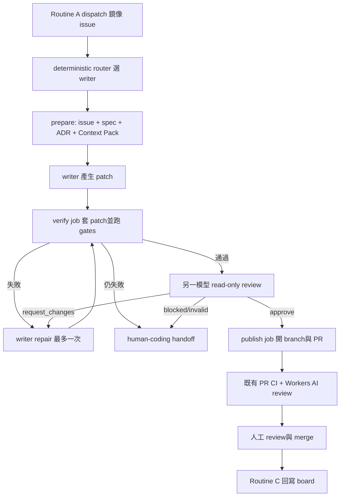

# Claude Code + Codex 訂閱雙 Agent 自動化 PRD

> 註（2026-09-20，#241）：本 PRD 所依賴的 Routine A（`pipeline-dispatch.yml`／`dispatch.ts`）與 Routine B 已退役，pipeline 只剩 Routine C；若要導入雙訂閱 agent，dispatch 層需重新設計，不能沿用下文描述的現況。

> 註（2026-09-20）：OpenSpec 已退役，下文提及 OpenSpec change／tasks.md 之處已不適用；規格以 docs/product 與 Issue 驗收契約為準。舊 `openspec/` 已封存於 `docs/archive/openspec/`。

> 狀態：Draft（Phase 1 方案 + 補洞）
> 日期：2026-09-12
> 範圍：daodao 工程自動化；不屬於終端使用者產品功能，不納入 `product_status_manifest.yml`

## 1. 需求背景

daodao 現有 pipeline 已將工作拆成三段：Routine A 以 GitHub Actions 做確定性 dispatch、
Routine B 由 Claude cloud routine 做 agentic implementation、Routine C 以 GitHub Actions 回寫完成狀態。
現有 PR review 與 Spec Drafter 另使用 Cloudflare Workers AI。

使用者同時持有 Claude Code 與 ChatGPT/Codex 訂閱，希望把兩份訂閱投入自動化開發，
降低單一模型盲點，同時維持既有 spec gate、TDD、branch protection、high-risk repo plan-only
與人工 merge 邊界。

本需求不是讓兩個 agent 同時修改同一個 checkout。核心模型為：

- 一張 issue 同一時間只有一個 **writer**。
- 另一個模型以獨立 context 擔任 **reviewer**。
- 模型 job 只產 patch／review artifact，不持有 GitHub 寫權限。
- 測試、branch、commit、push、開 PR 由沒有模型憑證的確定性 job 執行。

## 2. 現況驗證

### 已存在

- Routine A：`.github/workflows/pipeline-dispatch.yml`，每小時 dispatch Ready for Dev 卡片。
- Routine B：`docs/automation/routine-b-prompt-v2.md`，目前由 Claude cloud routine 實作與巡 PR。
- Routine C：`.github/workflows/pipeline-board-sync.yml`，回寫 merged PR 狀態。
- `human-driving`、`human-coding`、`.automation-paused` 與 high-risk repo plan-only 邊界。
- Context Pack、test-first、changed-files cap、verification retry 與既有 AI review/eval 基礎。
- Branch guard 已接受 `auto/`、`claude/`、`codex/` 分支。

### 尚不存在

- `anthropics/claude-code-action@v1` 的訂閱 OAuth workflow。
- ChatGPT-managed Codex auth 的 persistent self-hosted runner。
- 跨模型 writer/reviewer handoff contract。
- per-issue writer lease、provider routing、訂閱額度 fallback 與雙模型評測資料。

因此本需求是擴充現有 Routine B，不重做 Routine A/C。

## 3. 目標

### MVP 目標

1. Claude 與 Codex 都能使用個人訂閱認證處理 private daodao sub-repositories。
2. 每張 issue 由一個 writer 產生 patch，另一個 reviewer 產生結構化 verdict。
3. agent 無法直接 push protected branch 或自行 merge。
4. 只有通過對應 sub-repo deterministic gates 的 patch 才能開 PR。
5. 任一訂閱不可用、額度耗盡或認證失效時 fail closed，保留可重試狀態。
6. 延續既有 Routine A/C、labels、Context Pack、high-risk repo 與人工驗收流程。

### Pilot 成功指標

以前 10 張 `scope:XS`／`scope:S` private-repo issue 為 pilot：

| 指標 | 通過條件 |
|---|---|
| Protected branch 直接寫入 | 0 次 |
| 重複 writer 執行 | 0 次 |
| 模型憑證出現在 log/artifact | 0 次 |
| 開 PR 前 required gates 執行率 | 100% |
| Reviewer verdict 留存率 | 100% |
| 7 天內 merge 或明確 human handoff | 至少 8/10 |
| 每張 issue 人工寫入介入次數 | 中位數不超過既有目標 2 次 |

Pilot 數據不足以前，不宣稱 Claude 或 Codex 更適合特定任務類型。

## 4. User Stories

- As a maintainer, I want Claude 與 Codex 分別寫作和審查同一張 issue，so that 我能降低單一模型自我認可的風險。
- As a maintainer, I want 每張 issue 有單一 writer lease，so that 兩個 agent 不會互相覆寫 branch 或重複開 PR。
- As a maintainer, I want 使用現有訂閱而非 API billing，so that 自動化消耗能落在既有訂閱限制內。
- As a reviewer, I want PR 附上 writer、reviewer、gates 與已知限制，so that 我能快速判斷是否值得合併。
- As an operator, I want auth、quota 或 runner failure 明確分類，so that pipeline 不會悄悄降級成未審查的 PR。

## 5. 核心決策

### 5.1 執行拓樸

MVP 使用一組隔離的 Linux self-hosted runner，專供 private daodao automation：

- Codex subscription：persistent `CODEX_HOME` 保存並刷新 ChatGPT-managed `auth.json`。
- Claude subscription：`CLAUDE_CODE_OAUTH_TOKEN` 只注入 Claude job。
- Runner 不使用日常開發電腦；使用獨立 VM，runner user 無 production credentials。
- Codex job 設 repository-level concurrency，避免同一份 `auth.json` 被並行刷新。
- 每次任務使用乾淨 checkout／worktree；任務結束清理 workspace，但保留受控的 Codex auth store。

Repository 邊界：目前 `daodao` 根 repo 與 `daodao-f2e` 是 public，其餘七個 sub-repos 是 private。
OpenAI 官方明確要求此 ChatGPT-managed auth flow 不得用於 public/open-source repositories，因此：

- 雙訂閱 workflow 只部署到 private sub-repos，並由 root Routine A 做不含模型憑證的 dispatch。
- Public `daodao`／`daodao-f2e` 不掛載 Codex `auth.json`；先維持 Claude subscription +
  Workers AI review，或由人類在本機以 Codex subscription review。
- 若未來要求 public repo 也全自動雙 agent，必須改用供 CI 使用的 API／enterprise token 模式，
  不在本 PRD 的 subscription-only scope。

官方依據：

- Claude Code Action 支援以 `claude setup-token` 產生的訂閱 OAuth token：
  <https://docs.anthropic.com/en/docs/claude-code/github-actions>
- Codex 官方將 ChatGPT-managed CI auth 定位為 trusted private automation 的進階方案，
  並建議 persistent self-hosted runner：
  <https://developers.openai.com/codex/auth/ci-cd-auth>

### 5.2 Writer 分配

新增三個可選 label：

- `agent:claude`：Claude writer、Codex reviewer。
- `agent:codex`：Codex writer、Claude reviewer。
- `agent:auto`：由 deterministic router 分配；未指定時視為 `agent:auto`。

Pilot 的 `agent:auto` 使用 issue number 奇偶交替，避免根據主觀印象路由：

- 偶數：Claude writer。
- 奇數：Codex writer。

Pilot 後才依實測 merge rate、review dissent、failure rate、耗時與人工介入調整路由。

### 5.3 單一 Writer Lease

Routine A dispatch 後，Routine B 每張 private-repo 鏡像 issue 觸發目標 private repo 內的一個獨立
workflow dispatch，並使用：

```text
concurrency group = dual-agent-{repository}-{issue-number}
cancel-in-progress = false
```

Workflow 開始時寫入 `agent:running`；成功、失敗或 handoff 時移除。`concurrency` 是執行鎖，
label 是可觀測狀態，不把 label 當原子鎖。

### 5.4 權限分離

| Job | 模型憑證 | GitHub 權限 | 可修改 checkout | 產物 |
|---|---|---|---|---|
| prepare | 無 | contents/issues read | 否 | issue/context bundle |
| writer | 單一 provider | contents read | 是，本機限定 | binary patch + summary |
| verify | 無 | contents read | 是 | gate logs + verified patch |
| reviewer | 另一 provider | contents read | 否 | JSON verdict |
| repair | 原 writer provider | contents read | 是，最多一次 | revised patch |
| publish | 無 | contents/PR/issues write | 是 | branch + PR + issue comment |

任何 job 都不能同時持有模型憑證與 GitHub write token。Secrets 不得透過 artifact 傳遞。

## 6. 主流程



### 流程規則

1. `prepare` 只讀 default branch 上受信任的 workflow／scripts，再讀 issue、OpenSpec、ADR 與 Context Pack。
2. Issue、PR body、diff 與 repository content 一律視為不可信資料，不允許覆蓋 system policy。
3. Writer 不執行 push、PR、label 或 merge；只輸出 patch 與結構化摘要。
4. `verify` 依 target repo 執行 AGENTS.md 指定 gates；不得在帶模型憑證的 process environment 內跑 dependency lifecycle scripts 或 tests。
5. Reviewer只取得 patch、Context Pack、spec 與去敏後 gate summary，不取得 writer 對話紀錄。
6. Reviewer schema 固定為 `approve | request_changes | blocked`，finding 必須附 `path:line`、severity、evidence。
7. 最多一輪 repair；第二次驗證或 reviewer 仍不通過即 `human-coding`。
8. `publish` 重新從 verified patch 建乾淨 branch，分支沿用 `auto/<issue>-<slug>`，開 PR 後不自動 merge。

## 7. 功能需求

### FR-1：訂閱認證

- Claude job SHALL 只透過 `CLAUDE_CODE_OAUTH_TOKEN` secret 使用 Claude 訂閱。
- Codex job SHALL 使用 persistent file-backed `CODEX_HOME/auth.json` 的 ChatGPT-managed auth。
- Codex auth SHALL 只由單一 serialized workflow stream 使用。
- Auth 缺失、401、refresh failure 或 quota exhaustion SHALL fail closed 並分類記錄。
- Workflow SHALL 不得把 OAuth token、`auth.json` 或其內容寫入 log、cache、artifact、PR 或 issue。

### FR-2：任務路由與租約

- Router SHALL 尊重 `agent:claude`／`agent:codex` 明確指定。
- `agent:auto` SHALL 使用可重現的 deterministic rule，不讓模型自行選擇 writer。
- 同一 repository + issue SHALL 同一時間最多一個 active writer workflow。
- `human-driving`、`automation:hold`、`.automation-paused` SHALL 優先於所有 agent labels。

### FR-3：Writer/Reviewer contract

- Writer SHALL 只修改 issue/spec 允許的路徑，並遵守 changed-files cap。
- Reviewer SHALL 使用另一個 provider，且不得修改 patch。
- Reviewer SHALL 不得看到 writer chain-of-thought 或完整 session，只看可稽核 artifacts。
- Provider 不可用時 SHALL 不得由 writer 自我 review 後直接 publish。

### FR-4：驗證與發布

- Verify job SHALL 沒有任何 Claude/Codex credential。
- Required gates 全綠且 reviewer approve 後，publish job 才可取得 GitHub write permission。
- Storage/infra SHALL 保持 plan-only，雙 agent 不會放寬此規則。
- PR body SHALL 記錄 writer、reviewer、workflow run、gate 結果、repair 次數與 known incomplete scope。

### FR-5：可觀測性與額度

- 每次執行 SHALL 記錄 provider role、狀態、耗時、turn count、gate 結果、verdict 與 handoff reason。
- 不要求從訂閱模式取得精確金額；無法取得可靠 token/cost 時 SHALL 記為 unavailable，不得估算成帳單。
- Quota exhaustion SHALL 標記 provider-specific cooldown，避免每小時重試消耗 Actions minutes。
- Weekly eval SHALL 分開統計 Claude-writer 與 Codex-writer cohort。

## 8. 驗收條件

### AC-1：Claude writer / Codex reviewer

- Given private repo 的 `scope:XS` issue 標記 `agent:claude`
- When dual-agent workflow 執行
- Then Claude 產生 patch、deterministic gates 通過、Codex 產生有效 verdict，且只有 publish job 建立 PR

### AC-2：Codex writer / Claude reviewer

- Given private repo 的 `scope:S` issue 標記 `agent:codex`
- When dual-agent workflow 執行
- Then Codex 產生 patch、Claude 獨立 review，PR metadata 正確記錄雙方角色

### AC-3：並發去重

- Given 同一 issue 被 schedule 與人工 dispatch 同時觸發
- When 兩個 workflow 使用相同 concurrency group
- Then 同一時間只有一個 writer 執行，且只建立一個 branch/PR

### AC-4：驗證失敗

- Given writer patch 無法通過 target repo required gates
- When repair 後仍失敗
- Then 不開 PR、移除 `agent:running`、加 `human-coding` 並留下去敏錯誤摘要

### AC-5：Reviewer 不可用

- Given reviewer subscription quota exhausted 或 auth 失效
- When writer patch 已通過 gates
- Then verified patch 可保留為 private artifact，但 publish job 不執行

### AC-6：憑證隔離

- Given workflow 完成或失敗
- When 掃描 logs、artifacts、workspace 與 PR content
- Then 不存在 Claude OAuth token、Codex `auth.json` 或可還原的 bearer token

### AC-7：人工與高風險閘門

- Given issue 有 `human-driving`，或 target repo 為 storage/infra
- When workflow 被觸發
- Then 前者完全退出；後者最多產出 plan/review，不產生 code PR

## 9. Edge Cases

| 情境 | 預期處理 |
|---|---|
| Claude quota exhausted | 標記 Claude cooldown；不自動改由 Codex writer，避免角色在半途漂移 |
| Codex refresh token 被撤銷 | 停止 Codex cohort並要求從 trusted machine reseed；不得反覆印 401 detail |
| Codex workflow 並發 | repository concurrency 序列化；每個 auth store 不跨 runner/machine 共用 |
| Runner 中途離線 | lease 依 workflow conclusion/reconcile job 清理；patch 未驗證不得 publish |
| Reviewer 回傳無效 JSON | 重試一次格式修復；仍無效則 `blocked` |
| Reviewer 誤判或兩模型分歧 | 留存 verdict，最多一輪 repair；最終交人，不讓兩個模型無限辯論 |
| Issue body 有 prompt injection | 以資料區塊傳入；工具、路徑與權限由 harness 強制，不採用 issue 內要求的額外權限 |
| PR head 修改 workflow/script | privileged job 使用 default/base ref 的 trusted workflow 與 scripts |
| Patch 修改 workflow、secret、migration | write-path policy 阻擋；storage/infra 保持 plan-only |
| Subscription telemetry 缺 token 數 | 記錄 turn/runtime/outcome，不推算成本 |
| Existing Workers AI review 與 reviewer 重複 | Pilot 保留為 advisory；以 finding overlap/接受率決定後續是否縮減 |
| Public repo 誤載 Codex managed auth | Workflow 啟動前驗證 repository visibility；非 private 立即退出且不還原 auth |

## 10. 風險與注意事項

| 風險 | 影響 | 緩解 |
|---|---|---|
| 個人 OAuth token 放入 CI | 帳號與 repo 暴露 | private repo、isolated runner、separate jobs、secret scanning、定期撤銷演練 |
| Codex auth 持久化 | refresh race或 token 外洩 | single stream、0600、獨立 volume、禁止 cache/artifact |
| 訂閱用途與限制改變 | automation 突然停止 | auth smoke、fail closed、人工 handoff；實作前再核對官方條款 |
| 兩模型都認可同一錯誤 | 錯誤進 PR | deterministic tests、spec、Context Pack、人工 merge |
| Reviewer 噪音增加 | 人類忽略 findings | 嚴格 schema、path:line evidence、沿用 false-positive knowledge/evals |
| Self-hosted runner 被 repository code 攻擊 | 憑證或內網受影響 | dedicated VM、無 production network/credentials、ephemeral workspace、deny egress where possible |
| 自動 retry 消耗兩份額度 | quota 快速耗盡 | 一輪 repair cap、provider cooldown、每輪 issue cap |

## 11. 分階段落地

### Phase 0：安全基線與 auth smoke

- 先校準 Routine B 契約漂移：`gh-pipeline` skill 仍提到已退役的 `state.ts`／`main.sh`／
  `spec-merged-scan.ts`，但 v2.2 prompt 已改為直接執行；實作前必須選定單一現行 contract。
- 盤點並補齊八個 sub-repo 的 `agent:*`／`agent:running`／`auto-pr-open` labels；目前不能假設全部存在。
- 確認各 repo required workflows／rulesets 實際生效；workflow 存在不等於 merge gate 已強制。
- 建立 dedicated self-hosted runner 與受限 runner group，只允許 private daodao repos。
- Claude `setup-token` 存為 environment/repository secret。
- Codex 設 file-backed credential store，trusted machine seed 一次，runner 持久化刷新後版本。
- 建 auth smoke workflow；只回傳 provider、成功/失敗與時間，不輸出憑證內容。
- 建 secret leakage regression scan 與 Codex concurrency test。
- 第三方 Actions 在正式 workflow pin 到完整 commit SHA，不只使用浮動 major tag。

### Phase 1：手動 Pilot

- 新增 `workflow_dispatch`，只接受明確 private repo、issue、writer inputs。
- 僅允許 `scope:XS/S`、非 storage/infra、private repo。
- 實作 prepare → writer → verify → reviewer → publish 五個權限隔離 job。
- 首批每個 provider 各 5 張 issue；不啟用 schedule，不自動 fallback writer。

### Phase 2：接入 Routine B

- Routine B scanner 不再直接實作，改為逐 issue dispatch reusable workflow。
- Routine A 傳遞 `agent:*` label；Routine C 不需改變。
- 加 provider cooldown、stale lease reconcile、PR patrol 與 weekly cohort eval。
- 既有 Claude cloud Routine B 先停用再切換，避免雙重消費者。

### Phase 3：資料驅動路由

- 根據 pilot 的 merge、dissent、failure、latency、intervention 指標調整 router。
- 評估是否讓某 provider 專責特定 repo/task；無足夠樣本則維持交替。
- 評估既有 Workers AI review 保留、縮減或只在高風險 diff 啟用。

## 12. 非目標

- 不自動 merge PR。
- 不讓 Claude 與 Codex 同時寫同一張 issue。
- 不在 public/fork PR 上暴露訂閱憑證。
- 不在 public `daodao`／`daodao-f2e` Actions 使用 Codex subscription `auth.json`。
- 不把個人日常電腦當 production runner。
- 不取消 OpenSpec、TDD、Context Pack、branch guard 或人工驗收。
- MVP 不做多 agent council、無限互修或跨 provider session continuation。

## 13. 需求補洞報告

### PM 視角

- [ ] 確認 pilot 涵蓋哪些 private sub-repos；public root/f2e 不進 Codex subscription pilot。
- [ ] 確認訂閱額度耗盡時的優先級：等待 cooldown 或立即 human handoff。
- [ ] 確認 pilot merge-rate 門檻是否接受 8/10。

### Backend / Infra 視角

- [ ] 決定 self-hosted runner provider、OS image、patch level、backup/reseed 流程。
- [ ] 確認 runner 是否允許 outbound internet；若允許，定義目的地 allowlist。
- [ ] 定義 Codex auth volume 加密、ownership 與 destroy/revoke runbook。
- [ ] 確認 GitHub App/PAT 是否能做到 publish job 專用、repo-scoped 最小權限。

### Frontend / UI/UX 視角

- [ ] 本期沒有產品 UI；GitHub labels、check summary 與 PR body 是操作介面。
- [ ] 定義 quota/auth/blocked 的一致 check summary 與人工下一步。

### QA 視角

- [ ] 建立 seeded good patch、bad patch、prompt injection、quota failure、401、runner crash fixtures。
- [ ] 驗證 fork PR、`pull_request_target` 與 workflow-ref trust boundary。
- [ ] 做一次憑證撤銷、Codex reseed 與 stale lease disaster drill。
- [ ] 驗證兩個同時 dispatch 不會建立兩個 PR。

## 14. 開發前必確認問題

1. Dedicated self-hosted runner 要放在家中主機、獨立雲端 VM，還是既有 infra？本 PRD 推薦獨立雲端 VM。
2. Pilot 是否同意限定為 private sub-repos 的 10 張 XS/S issue，且全部人工 merge？本 PRD 預設同意。
3. Claude/Codex writer 是否採奇偶交替，還是你想指定某一個固定當 writer？本 PRD推薦先交替取樣。
4. Provider quota 用完時要等待下一個額度週期，還是直接 `human-coding`？本 PRD預設立即 handoff，避免排程反覆空轉。
5. Public `daodao`／`daodao-f2e` 是否接受先維持單一 subscription agent + Workers AI review？
   本 PRD 預設接受，不用 Codex managed auth 冒險。

## 15. PRD 定稿後下一步

本 PRD 未經使用者確認前不建立 OpenSpec change。定稿後在 daodao monorepo 建立 OpenSpec，
至少拆成 runner/auth、workflow contract、router/lease、review schema、eval/operations 五組 tasks，
並先實作 Phase 0/1，不直接啟用 scheduled Routine B。
