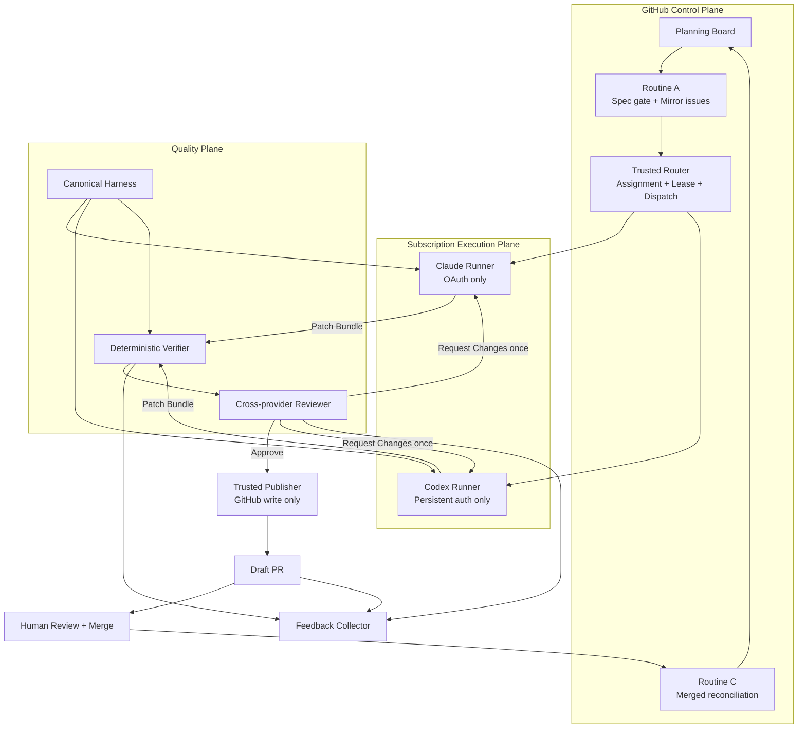
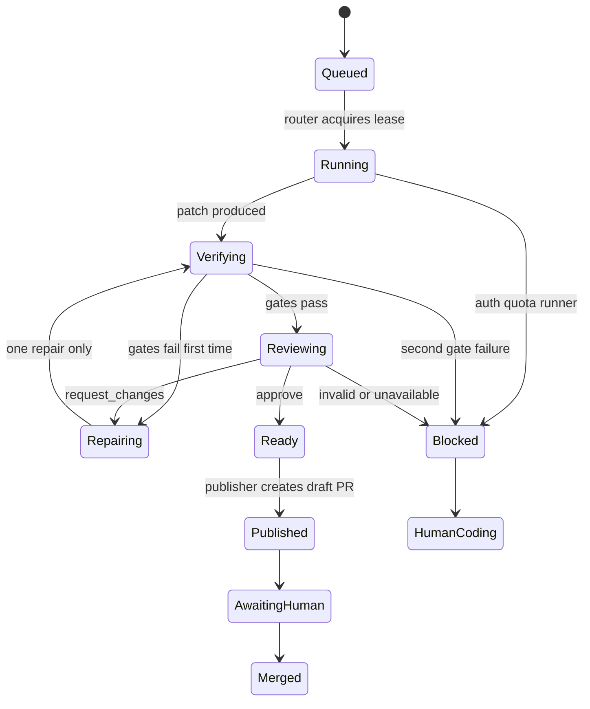

# Claude Code + Codex 訂閱雙 Agent 開發流程規劃 v2

> 狀態：Draft — 待 Phase 0 安全基線與使用者確認
>
> 日期：2026-09-12
>
> 類型：工程自動化流程，不屬於終端使用者產品功能，不納入 `product_status_manifest.yml`
>
> 範圍：daodao root control plane、private sub-repositories、isolated runners、shared agent harness
>
> 關聯文件：[GitHub Pipeline](github-pipeline.md)、[雙訂閱 Agents PRD](dual-subscription-agents-prd.md)、[Actions 設計檢查](github-actions-design-review.md)

## 1. 需求背景

配套提案：[Issue 到開發、驗收與合併](issue-to-acceptance-workflow.md)、[額度分配政策](agent-budget-policy.md)、[文件模板](../../templates/development/README.md)。前者細化本機／自動共用 lease、Google Docs／Drive 驗收包、Issue 回寫與 Done 定義；後者補充 admission budget。均待實作，不改變本文 Phase 0 前置條件。

daodao 現有 pipeline 已將工程工作分為三段：Routine A 從 Planning Board 派送 mirror issues，
Routine B 由外部 Claude cloud routine 實作與巡 PR，Routine C 在 merge 後回寫狀態。
本機開發環境另有 Claude hooks、profile rules、Gate Ledger、Context Pack、AI Code Review 與
shared-config sync。

目前的缺口不是「沒有 agent」，而是這些能力仍分散在 Claude-specific hooks、外部 Routine B
與多支 GitHub Actions 中，尚未形成 Claude Code、Codex、CI 都能共同遵守的 deterministic
harness。現行 Routine B 也讓 agent 直接修改、push 與開 PR，不適合承載個人訂閱認證。

本規劃參考 Dev Harness／Mai CLI 的四個核心模式：

- **Gates > Guidelines**：高信心規則由機器攔截，其餘先 advisory 並累積數據。
- **Clean Context**：writer 不審查自己的程式碼；reviewer 不取得 writer session。
- **Convergence = PR**：執行環境可拋棄，永久成果以 PR 與可追溯 manifest 為準。
- **Feedback Loop**：從人類修改、誤報與 regression 改善 profiles，但變更仍需 PR review。

本地參考來源：`/Users/xiaoxu/Downloads/dev-harness-mai-cli-architecture.md`。本規劃只採用其
設計模式，不依賴該檔案存在，也不照搬 EC2 fleet、token pool、24 workflows 或大型 Bash CLI。

## 2. 現況驗證

### 2.1 已存在，直接沿用

| 能力 | 現有位置 | v2 定位 |
|---|---|---|
| Board → mirror issue | `.github/workflows/pipeline-dispatch.yml`、`bin/pipeline/dispatch.ts` | Routine A control plane |
| Merge → Board Done | `.github/workflows/pipeline-board-sync.yml`、`bin/pipeline/board-sync.ts` | Routine C reconciliation |
| Claude lifecycle hooks | `.claude/hooks/`、`.claude/settings.json` | Host adapter 與即時 feedback |
| Profile rules | `.claude/hooks/profiles/*.json` | 搬到 host-neutral canonical profiles |
| Gate Ledger | `.claude/hooks/lib.sh`、`analyze-ledger.sh` | 本機 ledger；schema 需擴充 |
| Pre-PR gate | `.claude/hooks/pre-pr-gate.sh` | Harness deterministic rule（2026-09-19 起六道：Status、POC 比對、核心旅程矩陣、Deferred 開卡、PR body 驗證證據、前端 pattern parity） |
| PR evidence gate（CI） | `.github/workflows/pr-evidence-gate.yml`、`.github/scripts/check-pr-evidence.sh` | Pre-PR gate 的 CI 版，涵蓋 Codex／手動 gh／runner；advisory，升 block 需 repo variable + ruleset |
| Validation parity | `scripts/check-validation-parity.py` | 前端手寫驗證規則 vs openapi pattern 的 signal（#188 教訓） |
| Context Pack | `.github/scripts/retrieve-context.sh` | Prepare/reviewer input |
| False-positive knowledge | `.github/review-knowledge/` | Reviewer deterministic context |
| Workers AI review | `.github/workflows/code-review.yml` | Pilot 期間保留為 advisory |
| Shared config sync | `.github/workflows/sync-claude-config.yml` | 重構為 stable branch/upsert sync |
| OpenSpec gate | Central issue + Routine A | 唯一 acceptance contract |

### 2.2 已存在但必須重構

- `.claude/hooks` 的核心規則綁定 `CLAUDE_TOOL_*` payload，Codex 不能直接共用。
- Gate Ledger 主要記錄 block/warn，缺少完整 evaluation/pass denominator。
- Shared-config sync 每次建立新 branch，會累積重複 PR。
- 現行 Routine B 同時持有模型能力與 GitHub write 能力。
- 現有 AI review fail-open，只能作 advisory，不能代表 verified review。
- Routine A/C 缺少 concurrency，且現有 GitHub wrapper 有 shell string injection。

### 2.3 尚未存在

- Trusted agent router 與 provider assignment。
- Per-repository + issue writer lease。
- Claude/Codex 共用的 host-neutral Harness CLI。
- Provider-isolated subscription runners。
- Task、patch、verification、review、run manifest schemas。
- 無模型憑證的 trusted publisher。
- Provider cooldown、stale lease reconciliation 與雙 cohort eval。

## 3. 目標

### 3.1 MVP 目標

1. Claude Code 與 Codex 都能由 GitHub Actions 編排，在 private sub-repository 使用個人訂閱。
2. 每張 issue 同一時間只有一個 writer，另一個 provider 擔任 clean-context reviewer。
3. Claude、Codex、本機開發與 CI 共用同一套 canonical policy/profile。
4. 模型 job 只產 patch 或 verdict，不持有 GitHub write、merge 或 deploy credential。
5. Deterministic gates 與 reviewer approve 後，獨立 publisher 才能建立 draft PR。
6. 所有 handoff 都能由 base SHA、artifact digest、profile version 與 workflow URL 追溯。
7. Auth、quota、runner、gate 或 reviewer failure 一律 fail closed 並交回人類。

### 3.2 Pilot 成功指標

| 指標 | 通過條件 |
|---|---|
| Protected branch 直接寫入 | 0 次 |
| 同 issue 同時執行多個 writer | 0 次 |
| 訂閱認證出現在 log/artifact/PR | 0 次 |
| Patch 套用前 schema + digest 驗證 | 100% |
| 開 PR 前 required gates 執行率 | 100% |
| Cross-provider verdict 留存率 | 100% |
| Provider failure 被誤判成成功 | 0 次 |
| 10 張 XS/S pilot 在 7 天內 merge 或明確 handoff | 至少 8 張 |
| 每張 issue 人工寫入介入次數 | 中位數不超過 2 次 |

Pilot 樣本不足以前，不宣稱 Claude 或 Codex 更適合特定 repository 或任務類型。

## 4. User Stories

- As a maintainer, I want GitHub Actions 自動路由 Claude 或 Codex 實作，so that Ready for Dev
  的工作能進入一致的工程流程。
- As a reviewer, I want writer 和 reviewer 來自不同 provider，so that writer 不會用同一份上下文
  自我認可。
- As a security owner, I want 模型 credential 與 GitHub write token 分離，so that prompt injection
  不能直接變成 repository 寫入。
- As an operator, I want auth、quota、gate 和 runner failure 有固定分類，so that workflow 不會以
  綠燈掩蓋未完成工作。
- As a developer, I want Claude、Codex 與 CI 使用同一套 profiles，so that 不同入口不會得到
  互相矛盾的規則。
- As a maintainer, I want profiles 從真實 review data 演化，so that block rules 保持低誤報。

## 5. 核心設計原則

### 5.1 Model job 與 Publisher 分離

模型 worker 的成功產物是 verified patch，不是 branch 或 PR。整條 pipeline 的永久收斂點才是 PR。

任何單一 job 都不得同時持有：

- Claude/Codex subscription credential。
- GitHub contents/pull-requests/issues write token。
- Production、SSH、cloud 或 deploy credential。

### 5.2 Hooks 提供回饋，CI 才是權威 Gate

Claude/Codex hooks 用來縮短 feedback loop，但 hook 可能因 host、版本、設定或信任狀態沒有執行。
所有 required gates 必須能由獨立 CLI 在無模型 credential 的 CI job 重跑。

### 5.3 OpenSpec 是唯一 Acceptance Contract

Routine A 已要求中央 issue 具 OpenSpec。Scope M/L 不再讓 Routine B 自由建立第二套 subrepo spec。
Spec 缺失或 digest 不一致時回到 `needs-spec`，writer 不自行補需求。

### 5.4 Label 是投影，不是鎖

Labels 供人類觀察與操作；真正互斥由 GitHub Actions concurrency、idempotency key 與 run manifest
保證。Workflow 轉移 label 前仍需驗證前一狀態。

### 5.5 Advisory First

新 profile rule 預設 warn。升級 block 前至少需要：

- 足夠 evaluation denominator。
- 真實觸發樣本。
- 無合理 false positive 或已有精確 exclude。
- Fixture regression test。
- ADR 與人工 review。

## 6. Target Architecture



### 6.1 Control Plane

Root `daodao` 負責：

- Planning Board 與 central issues。
- Routine A spec gate、mirror issue 與初始 routing labels。
- Trusted Router：解析 labels、選 writer、建立 lease key、dispatch target workflow。
- Routine C merge reconciliation。
- Canonical harness、schemas、profile versions 與 feedback dataset。

Root control plane 不保存或使用 Codex subscription `auth.json`。

### 6.2 Execution Plane

Private sub-repository 接收 trusted dispatch 後執行：

```text
prepare
  → writer
  → verify
  → reviewer
  → optional repair once
  → re-verify
  → publish draft PR
```

Claude 與 Codex 使用不同 runner identity。MVP 可放在同一台隔離 Linux VM，但至少使用不同
OS user、runner label、service 與 credential directory。

Codex MVP 只註冊一個會讀取該 `auth.json` 的 runner service，且一次只執行一個 job。
GitHub `concurrency` 只在單一 repository 內有效，無法阻止不同 sub-repositories 同時使用同一份
auth store；因此 auth serialization 由「單一實體 runner、單一 service、無 replica」保證。
若未來需要擴充容量，必須先設計跨 repo global lease，不得直接讓多台機器共用同一份 `auth.json`。

### 6.3 Quality Plane

Quality Plane 提供：

- Canonical profiles 與 high-risk policy。
- Repository-specific gate manifest。
- Path、scope、patch 與 artifact validation。
- Context Pack 與 false-positive knowledge。
- Cross-provider clean-context review。
- Schema validator 與 run manifest assembler。

### 6.4 Feedback Plane

Feedback collector 蒐集：

- Reviewer verdict 與人類 disposition。
- PR merge/reject/handoff。
- 人類在 agent patch 後的修改量。
- CI repair 次數。
- 14 天內相關 regression。
- 各 profile rule evaluated/pass/warn/block 數量。

Collector 只能建立 case file 或提出 profile/prompt change PR，不能自行修改 production policy。

## 7. Canonical Harness

### 7.1 建議目錄

```text
automation/harness/
├── profiles/
│   ├── common.json
│   ├── frontend.json
│   ├── node-service.json
│   ├── python-ai.json
│   ├── cloudflare-worker.json
│   ├── database.json
│   └── infrastructure.json
├── schemas/
│   ├── task-bundle.schema.json
│   ├── patch-bundle.schema.json
│   ├── gate-report.schema.json
│   ├── review-verdict.schema.json
│   └── run-manifest.schema.json
├── policy.json
├── repo-map.json
└── known-false-positives.json

bin/agent/
├── router.ts
├── lease.ts
├── prepare.ts
├── gate-runner.ts
├── artifact-contract.ts
├── manifest.ts
└── feedback.ts

adapters/
├── claude/
│   └── hooks.json + payload adapter
└── codex/
    └── hooks.json + payload adapter
```

### 7.2 Repository Gate Profiles

| Repository | Profile | Authoritative gates | Auto code pilot |
|---|---|---|---|
| `daodao-server` | `node-service` | `pnpm test`、`pnpm run lint`、`pnpm run typecheck` | Yes |
| `daodao-ai-backend` | `python-ai` | `make test`、`make lint` | Yes |
| `daodao-worker` | `cloudflare-worker` | `pnpm test`、`pnpm run typecheck` | Yes |
| `daodao-admin-ui` | `frontend` | `pnpm test`、`pnpm run lint`、`pnpm run typecheck` | Yes |
| `daodao-mcp` | 由 repo manifest 定義 | 依該 repo AGENTS/CI | 待盤點 |
| `daodao-storage` | `database` | migration-specific validation | No，plan-only |
| `daodao-infra` | `infrastructure` | IaC validation | No，plan-only |
| `daodao-f2e` | `frontend` | `pnpm test`、`pnpm run lint`、`pnpm run typecheck` | No Codex subscription；public repo |
| root `daodao` | `common` | root contracts | No Codex subscription；public repo |

Sub-repository 的 `automation/repo-profile.json` 只宣告 package manager、commands、allowed paths、
changed-file cap、UI/browser requirement 與 default branch；不得複製中央 policy 規則。

## 8. Identity 與認證設計

### 8.1 Claude Subscription

- 由可信任機器執行 `claude setup-token`。
- Token 存為 protected environment secret `CLAUDE_CODE_OAUTH_TOKEN`。
- 只注入 Claude invocation，不設為整個 job/global environment。
- Token 綁定個人訂閱，不視為可任意分享的 organization credential。
- Claude tool subprocess SHALL 看不到 OAuth token；若 CLI/runtime 無法證明此隔離，writer 不得
  執行 repository scripts，所有 install/test/lint 改由無模型 credential 的 verifier 執行。

### 8.2 Codex Subscription

- 在可信任機器設定 file-backed credential store 並執行 `codex login`。
- 將 `auth.json` seed 至 dedicated self-hosted runner 的 persistent `CODEX_HOME`。
- 只在檔案不存在時 seed；不得每次用舊 secret 覆蓋刷新後版本。
- 一份 `auth.json` 只能由一台 runner 或一條 serialized workflow stream 使用。
- `auth.json` 存在 runner host，但不可掛入 agent tool filesystem sandbox；tool subprocess 不得
  讀取 `CODEX_HOME`，且 repository commands預設無外部網路。
- 401/refresh failure 時停用 cohort，從可信任機器 reseed。
- `auth.json` 不得放入 repository、cache、artifact、log 或 PR。
- Subscription auth 只用於 trusted private automation，不載入 public/open-source repository job。

官方依據：

- <https://docs.anthropic.com/en/docs/claude-code/github-actions>
- <https://developers.openai.com/codex/auth/ci-cd-auth>
- <https://developers.openai.com/codex/github-action>

OpenAI 官方 GitHub Action 的標準用法以 API key 為主；本規劃的 subscription-only Codex 路徑是
GitHub Actions 驅動 self-hosted runner 上的 `codex exec`，不是將 ChatGPT 登入憑證當 API key 傳入。

## 9. 權限與 Runner Matrix

| Job | Runner | 模型 credential | GitHub permission | Repo code execution | 產物 |
|---|---|---|---|---|---|
| router | GitHub-hosted trusted ref | 無 | issues read/write、actions write | 僅 trusted base script | dispatch + lease projection |
| prepare | GitHub-hosted | 無 | contents/issues read | 不執行 head code | Task Bundle |
| Claude writer/reviewer | self-hosted Claude identity | Claude only | contents read | Agent sandbox內 | Patch 或 Verdict |
| Codex writer/reviewer | self-hosted Codex identity | Codex only | contents read | Agent sandbox內 | Patch 或 Verdict |
| verify | GitHub-hosted或無 credential runner | 無 | contents read | Yes | Gate Report + verified patch |
| publish | GitHub-hosted protected environment | 無 | contents/PR/issues write | 僅套用 verified patch | Branch + Draft PR |
| feedback collector | GitHub-hosted | 無 | contents/PR/issues read | 不執行 PR code | Sanitized evaluation bundle |

模型 job 必須 `persist-credentials: false`，不得取得 production network 或 deploy secrets。
Model client 可連線至 provider，但 agent所啟動的 shell/tool subprocess預設 network denied。
如果無法把 model client network與tool subprocess network分開，MVP writer只能做檔案修改與
靜態查詢，不得執行 dependency lifecycle scripts；驗證一律移到 verify job。

## 10. Artifact Contracts

### 10.1 Task Bundle

必要欄位：

```json
{
  "schemaVersion": 1,
  "repository": "daodaoedu/daodao-server",
  "mirrorIssue": 468,
  "centralIssue": 141,
  "baseSha": "...",
  "spec": {
    "slug": "change-slug",
    "digest": "sha256:..."
  },
  "contextDigest": "sha256:...",
  "scope": "S",
  "allowedPaths": ["src/**", "src/**/__tests__/**"],
  "writer": "claude",
  "reviewer": "codex",
  "harnessVersion": "...",
  "profileVersion": "...",
  "leaseKey": "daodao-server-468"
}
```

Issue title/body、OpenSpec 文字與 repository content 都是 untrusted data；不得由其改寫 allowed paths、
provider、tools、network 或 permission policy。

### 10.2 Patch Bundle

包含：

- Binary patch。
- Base SHA 與 patch SHA-256。
- Changed files 清單。
- Writer provider、run ID、harness/profile version。
- 結構化摘要與 known incomplete scope。

不包含：subscription credential、auth store、完整 session transcript 或 chain-of-thought。

Verifier 套用前必須檢查：

- Base SHA 完全相符。
- Artifact digest 與 schema 正確。
- 無 absolute path、`../`、symlink escape 或 submodule escape。
- Changed files 皆符合 allowed paths/cap。
- Workflow、secret、migration、infra 等 protected paths 符合 policy。
- Binary file、oversized patch與不允許的 file mode change符合repo policy。

### 10.3 Gate Report

每個 gate 記錄 command ID、exit code、duration、sanitized log digest 與 retry count。Command 本身從
trusted repo profile 取出，不接受模型或 issue 提供任意 shell command。

### 10.4 Review Verdict

```json
{
  "schemaVersion": 1,
  "verdict": "approve",
  "reviewer": "codex",
  "patchDigest": "sha256:...",
  "acceptance": [
    {
      "id": "AC-1",
      "status": "pass",
      "evidence": ["src/example.ts:42"]
    }
  ],
  "findings": [
    {
      "severity": "high",
      "confidence": 0.95,
      "path": "src/example.ts",
      "line": 42,
      "evidence": "..."
    }
  ]
}
```

`verdict` 只允許 `approve | request_changes | blocked`；每條 acceptance status 只允許
`pass | fail | uncertain`。Finding 必須有可核對 path:line、severity、confidence 與 evidence。
任一 required acceptance 為 `fail` 或 `uncertain` 時不得 approve。
模型輸出的 approve 只是 publisher 的必要條件之一，不能單獨觸發 merge。

### 10.5 Run Manifest

Manifest 串接所有 digest、base SHA、provider roles、gate results、repair count、workflow URLs、狀態轉移、
handoff reason 與 final PR。Publisher 必須重新驗證 manifest 和所有 digest。

`repairCount` 是整條 pipeline 共用的全域計數器，上限為 1。若第一次 repair 已用於 gate failure，
之後 reviewer 再提出 `request_changes` 時直接 handoff；不得把 gate repair 與 review repair各算一次。

## 11. Routing、Lease 與 Label State

### 11.1 Routing Labels

- `agent:claude`：Claude writer、Codex reviewer。
- `agent:codex`：Codex writer、Claude reviewer。
- `agent:auto`：pilot 使用 issue number 奇偶交替，取得無偏基線。

同一 issue 只能存在一個 routing label；未指定時視為 `agent:auto`。

### 11.2 Observable State Labels

```text
agent:queued
agent:running
agent:reviewing
agent:ready
agent:blocked
```

失敗原因寫入 Check Summary/run manifest，不為每個 reason 建 label。既有 `human-driving`、
`human-coding`、`.automation-paused` 優先於所有 agent state。

### 11.3 Authoritative Lease

```text
concurrency group = dual-agent-{repository}-{issue-number}
cancel-in-progress = false
```

Concurrency 是 runtime lock；`leaseKey + run ID + base SHA` 是 idempotency identity；label 只是投影。
Reconciler 定期尋找已結束或失聯 run 殘留的 `agent:running`，確認 workflow conclusion 後才能清理。

這個 issue concurrency 與 Codex auth serialization 是不同的鎖：

- Issue lock：避免同 repo、同 issue 有兩個 writer。
- Auth lock：避免不同 repos 同時刷新或覆寫同一份 Codex `auth.json`。

MVP 的 auth lock 由單一 Codex runner service保證，不依賴 repository-scoped concurrency。

### 11.4 State Machine



## 12. 主流程

### 12.1 Manual Pilot

1. Maintainer 從 default branch 手動 dispatch，輸入 private target repo、mirror issue 與 writer。
2. Router 驗證 repository visibility、scope、high-risk policy、OpenSpec 與 active PR/lease。
3. Prepare 從 trusted base SHA 建立 Task Bundle 與 Context Pack。
4. Writer runner 建立乾淨 worktree，使用單一 provider subscription 產生 patch。
5. Verify 在無模型 credential 的乾淨 checkout 驗證 patch contract、套 patch並跑 repo gates。
6. 第一次 gate failure可使用全 pipeline唯一一次 repair；失敗或額度已用完則進 `human-coding`。
7. Gates 通過後由另一 provider 做 clean-context review。
8. `request_changes` 僅在 `repairCount=0` 時進 repair；invalid/blocked/provider unavailable 或額度已用完直接 handoff。
9. Reviewer approve 後，Publisher 重新驗證 manifest/digests並建立 draft PR。
10. 既有 CI、Workers AI advisory review 與人工 review 接手；不自動 merge。
11. Merge 後由 Routine C 回寫 mirror issue 與 Planning Board。

### 12.2 Routine A Integration

1. Central issue 進入 Ready for Dev。
2. Routine A 執行現有 spec gate、拆卡與高風險 repo policy。
3. Mirror issue 建立後加 routing/status labels。
4. Trusted Router 以 repository dispatch 或 target workflow dispatch 啟動 private repo workflow。
5. 初期仍保留 scheduled scanner 作 lost-event reconciliation。
6. 切換前停用舊 CCR Routine B，避免兩個 consumer 同時執行。

### 12.3 Merge Fast Path

Sub-repo PR merge 後可送 `agent-pr-merged` repository dispatch 回 root，讓 Routine C 即時更新；
原 hourly Routine C 保留為 reconciliation，避免 webhook 或 dispatch 遺失。

### 12.4 Cutover 與 Rollback

Cutover 順序：

1. 設定 `.automation-paused`，停止建立新任務。
2. 等待現行 CCR Routine B 已執行工作完成或人工 handoff。
3. 停用舊 Routine B schedule/consumer。
4. 清點所有 `auto` issues、existing branches、open PR 與殘留 state labels。
5. 啟用新 Router，但先維持 manual dispatch。
6. 完成 smoke/E2E後才開 scheduled reconciliation。

Rollback 條件包括重複 writer、credential incident、Publisher發布錯誤 digest、連續 provider auth
失敗或 reconciliation 無法恢復。Rollback 時先 pause Router並 drain running jobs；只有確認新 workflow
不再消費 issue後，才能重新啟用舊 Routine B。不得讓兩套 consumer同時運作。

## 13. Workflow Ownership

### Root `daodao`

預計新增或重構：

- `.github/workflows/agent-router.yml`
- `.github/workflows/sync-agent-harness.yml`
- `.github/workflows/agent-feedback.yml`
- `bin/agent/*`
- `automation/harness/*`

現有 Routine A/C 只增加安全修正、routing metadata 與事件接點，不承擔模型執行。

### Private Sub-repositories

每個 pilot repo 只新增：

- `.github/workflows/dual-agent-task.yml`
- `automation/repo-profile.json`
- 必要的 host adapter link/generated config。

Canonical profiles、schemas 與 prompts 仍由 root 擁有，透過 stable sync branch + PR upsert 散布。

### Runner Host

Runner-only、不得 commit 的內容：

- Codex persistent auth volume。
- Claude/Codex runner services 與 OS users。
- Workspace janitor。
- Reseed/revoke/rotation runbook。
- Egress、filesystem 與 process sandbox policy。

## 14. 例外流程

| 情境 | 預期處理 |
|---|---|
| Claude quota exhausted | Claude cohort cooldown；當次不切換 writer，進 human handoff |
| Codex refresh failure/401 | 停止 Codex cohort、去敏摘要、trusted reseed |
| Reviewer unavailable | 保存 verified patch，禁止 publisher，進 blocked/handoff |
| Reviewer invalid JSON | 格式修復重試一次；仍無效則 blocked |
| Writer 沒產生 patch | blocked，不建立空 PR |
| Base branch 在執行中前進 | Patch 不重用；重新 prepare 或交人處理 |
| 同 issue 重複 dispatch | 同 concurrency group 排隊；idempotency 檢查已有 PR/run |
| Runner 中途離線 | Workflow conclusion/reconciler 清理 label；未驗證 artifact 不 publish |
| Issue 含 prompt injection | 當資料處理；不得改 tools、paths、network、provider 或 permission |
| Patch 修改 workflow/secrets | Protected-path policy block |
| Patch修改 existing migration | Block；storage 始終 plan-only |
| Public repo dispatch | Codex subscription立即退出；不還原 auth store |
| `human-driving` 中途加入 | 下一個 deterministic boundary 停止並 handoff |
| `.automation-paused` 存在 | Router 不啟新工作；running job 在安全 checkpoint 停止 |
| Artifact digest 不符 | 視為 contract/security failure，不嘗試修補 |

## 15. 驗收條件

### AC-01：Claude Writer + Codex Reviewer

- Given private pilot repo 的 XS/S issue 標記 `agent:claude`
- When dual-agent workflow 執行
- Then Claude 只產 patch、deterministic gates 通過、Codex 回傳有效 verdict，且只有 Publisher 建 PR

### AC-02：Codex Writer + Claude Reviewer

- Given private pilot repo 的 XS/S issue 標記 `agent:codex`
- When workflow 執行
- Then Codex 使用 persistent managed auth 產 patch、Claude clean-context review，PR 記錄雙方角色

### AC-03：Credential Isolation

- Given 任一成功或失敗 run
- When 掃描 logs、artifacts、workspace、PR 與 process boundaries
- Then 不存在 OAuth token、Codex `auth.json`、refresh token 或可還原 bearer credential

### AC-04：Single Writer

- Given schedule 與 manual dispatch 同時觸發同一 issue
- When workflow 使用相同 lease key
- Then 同一時間最多一個 writer，且最多建立一張 PR

### AC-05：Gate Failure

- Given patch 第一次驗證失敗
- When writer repair 後再次失敗
- Then Publisher 不執行、狀態為 blocked、issue 進 `human-coding`

### AC-06：Reviewer Failure

- Given verified patch 但 reviewer auth/quota/schema 失敗
- When workflow 收斂
- Then patch 可短期保留，但沒有 PR，check summary 明確列出 handoff reason

### AC-07：Artifact Integrity

- Given 任一 patch、gate report 或 verdict 被修改或對錯 base SHA
- When下一個 consumer 驗證 contract
- Then consumer fail closed，且不執行 untrusted payload

### AC-08：Human/High-risk Override

- Given issue 有 `human-driving`，或 target 是 storage/infra
- When Router 掃描
- Then前者完全退出，後者最多產出 plan/review，不產 code PR

### AC-09：Hooks 與 CI 一致性

- Given相同 fixture 分別經 Claude adapter、Codex adapter 與 CI Harness CLI
- When執行相同 profile version
- Then三者得到相同 deterministic rule result

### AC-10：Public Repository Boundary

- Given root或 `daodao-f2e` 的 task 誤觸 Codex subscription workflow
- When workflow 執行 visibility preflight
- Then在讀取 Codex auth以前退出並產生明確 blocked status

## 16. 測試策略

### Unit / Contract

- Router label precedence、provider assignment、high-risk policy。
- Lease/idempotency 與 state transitions。
- Artifact schema、digest、base SHA 與 path validation。
- Repo profile command selection。
- Review verdict normalization。
- Gate Ledger denominator 與 aggregation。

### Security Regression

- Issue title/body shell injection fixture。
- Prompt injection fixture。
- Absolute path、`../`、symlink、submodule escape。
- Malicious patch 修改 workflow、auth、secret path。
- Binary/oversized patch與 file mode change。
- Fork PR/same-repo PR/trusted dispatch secret boundary。
- Log/artifact credential pattern scan。
- Concurrent `auth.json` access 必須失敗或序列化。

### End-to-End

- Claude → Codex 成功路徑。
- Codex → Claude 成功路徑。
- Gate repair一次成功與二次失敗。
- Reviewer unavailable。
- Stale lease reconciliation。
- Publisher重驗 digest 後開 draft PR。
- Merge event fast path + Routine C reconciliation。

## 17. 風險與緩解

| 風險 | 影響 | 緩解 |
|---|---|---|
| 個人 OAuth/auth.json 進 CI | 帳號與 private code 暴露 | Provider-isolated runner、protected environment、sandbox、定期 revoke drill |
| Agent執行惡意 repo code | 讀取模型 credential或外傳 | 模型 sandbox、network deny、auth path不掛入tool sandbox、verify另 job |
| 兩模型共同誤判 | 有缺陷 patch 進 PR | Deterministic tests、OpenSpec、Context Pack、人工 merge |
| Actions事件遺失 | Issue卡住 | Event fast path + scheduled reconciliation |
| Labels競態 | 重複 writer/PR | Concurrency + idempotency manifest，不以 label當鎖 |
| Reviewer噪音 | 人類忽略 findings | Strict schema、path:line evidence、false-positive dataset |
| Profile自動演化失控 | 規則誤擋所有工作 | 只提出 PR、fixture + ADR + human review |
| 訂閱政策或登入機制變更 | Automation停止 | Auth smoke、provider cooldown、reseed runbook、實作前重查官方文件 |
| Self-hosted runner殘留 workspace | Private code/credential殘留 | Disposable worktree/container、janitor、post-job audit |
| Pilot範圍過大 | 難定位故障 | 單一 private repo起步、manual dispatch、XS/S only |

## 18. 分階段落地

### Phase 0 — Security Baseline

- [ ] 修正 `bin/pipeline/gh.ts` shell string injection。
- [ ] 驗證 `pipeline-board-sync` manual input。
- [ ] 拆分 `product-status-drift` PR fixture/trusted live job。
- [ ] 啟用 main ruleset與 required checks。
- [ ] Actions default permission改 read。
- [ ] 拆分 Project、cross-repo read、publisher與deploy credentials。
- [ ] Privileged manual workflow限制 trusted ref/environment。
- [ ] Secret-bearing actions pin完整 commit SHA。

Exit gate：Actions security regression通過，live GitHub設定有獨立證據。

### Phase 1 — Host-neutral Harness

- [ ] 定義 canonical profiles、policy、schemas、repo map。
- [ ] 抽出 deterministic Harness CLI。
- [ ] 建 Claude與Codex payload adapters。
- [ ] 建 adapter parity fixtures。
- [ ] 擴充 Gate Ledger evaluation denominator。
- [ ] 將 shared sync改為 stable branch + PR upsert。

Exit gate：同一 fixture在 Claude、Codex與 CI產生相同 deterministic verdict。

### Phase 2 — Single-provider Manual Pilot

- [ ] 建立 isolated runner identities與 auth smoke。
- [ ] 選定一個 private、非高風險 subrepo。
- [ ] Manual dispatch跑 prepare → writer → verify。
- [ ] 驗證 workspace cleanup與 credential scan。
- [ ] 驗證 failure/handoff，不開 PR。

Exit gate：Claude與Codex各自至少完成一張 verified patch，未授予 GitHub write。

### Phase 3 — Cross-provider Review + Publisher

- [ ] 接入另一 provider clean-context reviewer。
- [ ] 實作唯一一次 repair loop。
- [ ] 實作 manifest/digest validation。
- [ ] 建立 protected Publisher job。
- [ ] 產生 draft PR，保留人工 merge。

Exit gate：兩個方向各完成一條 end-to-end draft PR，所有失敗路徑 fail closed。

### Phase 4 — Ten-issue Pilot

- [ ] Claude writer 5 張、Codex writer 5 張 XS/S issue。
- [ ] `agent:auto` 使用奇偶交替，不做主觀 routing。
- [ ] 蒐集 merge、dissent、repair、latency、handoff與人類修改量。
- [ ] 保留 Workers AI advisory review比較 finding overlap。

Exit gate：Pilot metrics達標，且 security/credential incidents為 0。

### Phase 5 — Routine B Cutover

- [ ] 停用現行 CCR Routine B consumer。
- [ ] Routine A新增 routing metadata與 dispatch事件。
- [ ] 啟用 Agent Router與 scheduled reconciliation。
- [ ] 啟用 provider cooldown、stale lease cleanup、PR patrol。
- [ ] Merge event fast path接入 Routine C。
- [ ] 演練 pause、drain、舊 Routine B rollback，證明兩套 consumer不會重疊。

Exit gate：連續兩週無重複 writer、遺失卡片或未分類失敗。

### Phase 6 — Feedback Improvement

- [ ] 建 sanitized case-file collector。
- [ ] 將 human disposition與14日 regression接入 eval。
- [ ] Profile/prompt改善只以 PR提出。
- [ ] 評估是否對 scope M啟用較深 review。

不在 pilot前導入 fleet autoscaling、auto-merge或常態 multi-skeptic deep review。

## 19. 需求補洞報告

### PM 視角

- [ ] 確認第一個 private pilot repo。
- [ ] 確認 pilot quota exhaustion採立即 `human-coding`，不等待自動重試。
- [ ] 確認 8/10 merge或明確 handoff為可接受門檻。
- [ ] 確認舊 Routine B切換窗口與 rollback條件。

### UI/UX 視角

- [ ] 定義 queued/running/reviewing/blocked 的 Check Summary格式。
- [ ] 定義每個 blocked reason的單一步驟人工處置。
- [ ] 確保 label不會多到讓 issue介面難以理解。
- [ ] Draft PR body優先呈現「人要判斷的事」，再列 AI已驗證證據。

### Backend / Infra 視角

- [ ] 決定 runner VM provider、patch與rebuild週期。
- [ ] 定義 Codex auth volume加密、ownership、backup/reseed/revoke。
- [ ] 定義 runner egress allowlist與tool sandbox。
- [ ] 決定 Publisher使用 GitHub App或 fine-grained token。
- [ ] 定義 artifacts retention、digest與刪除策略。

### Frontend 視角

- [ ] UI變更是否需要browser evidence、四態與RWD gate，由 repo profile宣告。
- [ ] Public `daodao-f2e` 不使用 Codex subscription automation的替代流程要明確。

### QA 視角

- [ ] 建 seeded good/bad patch fixtures。
- [ ] 建 prompt/shell/path injection fixtures。
- [ ] 演練 quota、401、runner crash、digest mismatch與stale lease。
- [ ] 做 credential revoke/reseed disaster drill。
- [ ] 驗證兩次並發 dispatch只產生一張 PR。

## 20. 開發前決策

以下使用預設值即可進入 OpenSpec，除非 maintainer另行調整：

| 決策 | 建議預設 |
|---|---|
| 第一個 pilot repo | `daodao-server`，若當時有低風險 XS/S issue |
| Runner topology | 一台隔離 Linux VM、兩個 OS user/runner identity |
| Writer routing | Issue number奇偶交替；明確 label優先 |
| Quota/auth failure | 當次 fail closed + `human-coding` |
| Repair上限 | 一次 |
| PR狀態 | Draft，永不auto-merge |
| Artifact retention | 1–3 天，依GitHub能力取最短可運維值 |
| High-risk repos | Storage/infra維持 plan-only |
| Public repos | 不使用Codex subscription auth |
| Existing Workers AI review | Pilot保留advisory，用於比較，不作verified gate |

## 21. 非目標

- 不建立 Mai CLI等級的團隊環境管理工具。
- 不在 MVP 建 EC2 per-task fleet或 AMI pipeline。
- 不建立或輪換多個個人訂閱 token pool。
- 不讓 provider在任務中途自動互換 writer角色。
- 不讓模型直接 push、approve、undraft、merge或deploy。
- 不在 public/fork PR載入Codex managed auth。
- 不讓兩個模型無限辯論或無限repair。
- 不將 chain-of-thought存入 artifacts或 PR。
- 不以AI共識取代 deterministic evidence與人工驗收。

## 22. 完成判定與下一步

本文件狀態只有在以下條件成立時才能從 Draft 改為 Ready for Implementation：

1. Phase 0安全項目已有 owner與執行順序。
2. Runner topology與第一個 pilot repo已確認。
3. Canonical Harness目錄、schema ownership與sync方式已確認。
4. GitHub ruleset、Publisher identity與subscription credential邊界已確認。
5. 舊 Routine B cutover/rollback策略已確認。

定稿後，應在 root daodao建立 OpenSpec change，至少拆成：

1. `actions-security-baseline`
2. `agent-harness-contracts`
3. `subscription-runner-auth`
4. `dual-agent-task-workflow`
5. `router-lease-publisher`
6. `feedback-evals-operations`

實作只能先進 Phase 0/1，不直接啟用 scheduled agent或停用現行 Routine B。

## 23. 改善摘要

| 維度 | 舊版缺口 | v2 做法 |
|---|---|---|
| Harness | 以 Claude hooks為中心 | Host-neutral core + Claude/Codex adapters + CI verifier |
| Worker | 單一isolated runner描述較粗 | Provider identity隔離 + disposable workspace + auth boundary |
| Handoff | Patch/verdict概念有但contract不完整 | 五種schema、base SHA、digest、version與manifest |
| State | Concurrency + labels | 明確routing/status分離，manifest為authoritative state |
| Spec | 未完全處理中央/subrepo重複 | Central OpenSpec為唯一acceptance contract |
| Ledger | 只有事件紀錄 | 加evaluation denominator、human disposition與regression |
| Cutover | 接入Routine B | 明確先停舊consumer，再啟新Router，附rollback gate |
| Publisher | 已有權限分離概念 | Protected publisher重新驗證完整artifact chain |
| Public repos | Codex限制已有說明 | Visibility preflight成為可測AC |
| Feedback | Weekly cohort eval | Case-file PR、fixture、ADR與人工review後才改規則 |
