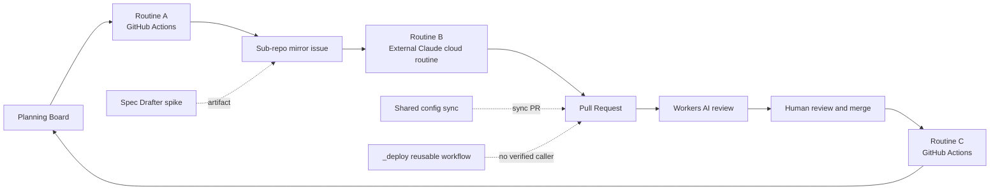
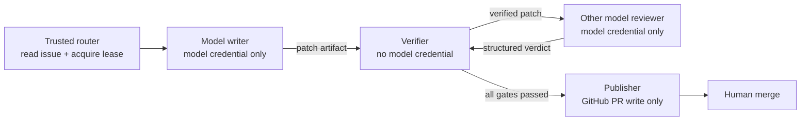

# GitHub Actions 設計檢查 — 雙訂閱 Agent 導入前安全與可靠性評估

> 狀態：Needs Work
>
> 審查日期：2026-09-12
>
> 審查範圍：root `.github/workflows/`、`bin/pipeline/`、跨 repository 設定同步，以及 Claude Code + Codex 訂閱自動化的導入前提
>
> 基準 commit：`f249705af7b2359b1b3b4cb297d28b748ccc1a93`（審查時 local `HEAD` = `origin/main`）
>
> 關聯文件：[GitHub Pipeline](github-pipeline.md)、[雙訂閱 Agents PRD](dual-subscription-agents-prd.md)

## 1. Executive Summary

目前 GitHub Actions 已具備任務派送、PR 輔助審查、設定同步、狀態回寫與部署模板，
但整體仍是「確定性控制平面 + 外部 Claude Routine + Workers AI review」，不是完整的
Claude Code + Codex 雙 agent 自動開發系統。

現有 Routine A/C 的最近一次排程成功，代表 workflow 可以啟動並完成 no-op 掃描；
這不等於已驗證完整的 issue dispatch、agent implementation、PR review、merge 與 board 回寫鏈路。

在導入 Claude Code 或 Codex 訂閱憑證以前，必須先處理以下四個阻斷項目：

1. `main` 沒有 branch protection 或 repository ruleset，Actions 預設 token 權限仍為 write。
2. Routine A 與 Routine C 存在 shell command injection，執行時持有跨 repo／Project PAT。
3. `product-status-drift` 會在 PR context 執行可由 PR 修改的程式，同時接觸跨 repo PAT。
4. 現有 AI review 是 fail-open，只能作為 advisory review，不能作為 verified gate。

結論：現有 pipeline 可以保留並逐步強化；雙訂閱 agent 應擴充 Routine B，不能直接把
Claude/Codex 憑證加入現有 PR-triggered jobs。

## 2. 現況架構



### 2.1 Workflow inventory

| Workflow | Trigger | 主要責任 | 寫入／外部副作用 | Concurrency |
|---|---|---|---|---|
| `_deploy.yml` | `workflow_call` | build image、SSH deploy | Docker Hub、部署主機、Discord | 無 |
| `auto-pr-description.yml` | PR opened | AI 產生 PR 描述 | 修改 PR title/body | 無 |
| `branch-base-check.yml` | PR events | inline branch/base validation | 無 | 無 |
| `branch-guard.yml` | `pull_request_target` | trusted branch policy | 無 | 無 |
| `branch-guard-regression.yml` | PR paths | branch guard regression | 無 | 無 |
| `code-review.yml` | PR opened/synchronize | Workers AI review | PR comment | per PR，取消舊 run |
| `pipeline-dispatch.yml` | hourly/manual | Board → mirror issues | issues、labels、comments、Project | 無 |
| `pipeline-board-sync.yml` | hourly/manual | merged PR → Board Done | issues、comments、Project | 無 |
| `product-status-drift.yml` | PR/weekly/manual | 跨 repo product status scan | Discord on scheduled failure | 無 |
| `review-evals.yml` | weekly/manual | 蒐集 review evaluation | commit/push `evals.md` | global，不取消 |
| `shared-config-regression.yml` | PR paths/manual | shared config contracts | 無 | 無 |
| `spec-drafter-spike.yml` | manual | AI 起草 OpenSpec | artifact、job summary | 無 |
| `sync-claude-config.yml` | main push/weekly/manual | 同步共用設定 | 跨 repo branch 與 PR | global，不取消 |

### 2.2 雙訂閱整合狀態

目前 repository 內沒有以下元件：

- Claude Code Action 的訂閱 OAuth workflow。
- Codex subscription persistent runner workflow。
- 單一 writer lease 與 per-issue concurrency。
- Claude writer／Codex reviewer 或反向 routing。
- 結構化的 patch、review verdict、publisher handoff contract。
- 訂閱額度、認證失效與 provider fallback 狀態機。

因此 [雙訂閱 Agents PRD](dual-subscription-agents-prd.md) 仍是規劃，尚未部署。

## 3. Findings

### F-01 — Critical：缺少強制合併治理

Live repository 設定顯示：

- `main` 沒有 branch protection。
- repository rulesets 為空。
- Actions default workflow permission 為 write。
- Actions 被允許 approve pull requests。
- repository 沒有 configured environment。

影響：required checks、AI reviewer 或 deterministic gates 即使存在，也沒有 repository-level
規則保證 merge 前必須通過；未來 agent 或被入侵的 workflow 可能取得超出任務需要的寫入能力。

建議：

1. 建立 `main` ruleset，禁止直接 push，要求 pull request。
2. 將 deterministic test、branch guard 與必要 review 設為 required checks。
3. 將 Actions default workflow permission 改為 read。
4. 每個 workflow 以 job 或 workflow 級 `permissions` 明確加回最小權限。
5. 為 model credential 與 production deploy 建立 protected environments。

### F-02 — Critical：Routine A issue title shell injection

`bin/pipeline/gh.ts` 以 `execSync(string)` 執行 `gh` command；`createIssue()` 將 issue title
拼入雙引號 shell string，只 escape `"`。在雙引號內，`$()` 與反引號仍可執行。

資料流：

```text
central issue title
  → dispatch.ts / lib.ts
  → createIssue()
  → execSync(shell string)
  → runner command execution
```

Workflow 執行時同時持有 `GIT_HUB_ACCESS_TOKEN`，該 token 具跨 repo 與 organization Project
操作能力。攻擊者不需要控制 workflow，只要惡意 title 被維護者放入 Ready for Dev 即可能觸發。

證據：

- `bin/pipeline/gh.ts:10-11`
- `bin/pipeline/gh.ts:91-104`
- `bin/pipeline/dispatch.ts:89,145,165`
- `.github/workflows/pipeline-dispatch.yml:38-45`

建議：將所有 `gh` wrapper 改成 `execFileSync()` 或 `spawnSync()`，所有參數使用 argv 傳遞，
不得使用 shell string composition。

### F-03 — Critical：Routine C manual input shell injection

`pipeline-board-sync.yml` 將手動輸入的 `hours` 直接插入 shell command；同一步持有廣權 PAT。

證據：`.github/workflows/pipeline-board-sync.yml:42-50`。

建議：輸入值先放入 `env`，驗證為數字並限制合理範圍，再以 bash array 傳入；若操作需求固定，
改用受限的 `choice` input。

### F-04 — High：PR-controlled code 接觸跨 repo PAT

`product-status-drift.yml` 由 `pull_request` 觸發，checkout PR merge/head content，接著使用
`GIT_HUB_ACCESS_TOKEN` checkout 多個 repository，最後執行 PR 可修改的 checker script。

證據：

- `.github/workflows/product-status-drift.yml:7-13`
- `.github/workflows/product-status-drift.yml:24-59`
- `.github/workflows/product-status-drift.yml:69-76`

Fork PR 通常拿不到 secrets，但 same-repo branch、bot branch 與未來 agent branch 仍可能取得。

建議拆成兩條路徑：

- PR fixture job：`permissions: {}`、無跨 repo secrets，只測純邏輯。
- Trusted live scan：僅 schedule 或 trusted manual dispatch，執行 default branch/base SHA 的 checker。

所有 secret-bearing checkout 應設定 `persist-credentials: false`。

### F-05 — High：Privileged manual workflow 可執行非預設 ref

Routine A、Routine C、review eval 與 shared config sync 都支援 `workflow_dispatch`，checkout
當次 ref 後將 PAT 交給 repository script。若 collaborator 能對自選 branch dispatch，尚未合併的
script 就可能取得跨 repo PAT。

受影響位置：

- `.github/workflows/pipeline-dispatch.yml:3-6,21-45`
- `.github/workflows/pipeline-board-sync.yml:3-6,25-50`
- `.github/workflows/review-evals.yml:3-16,29-59`
- `.github/workflows/sync-claude-config.yml:23-29,63-70,137-156`

建議在執行 privileged step 前驗證 trusted default ref，並使用 protected environment approval。

### F-06 — High：AI Code Review fail-open

現有 code review 在以下情況仍可讓 job 成功：

- provider secrets 不存在。
- 兩個模型呼叫都失敗。
- normalize 後結果不符合 schema。
- workflow 僅張貼「Review 未完成」留言。

證據：`.github/workflows/code-review.yml:97-101,177-181,322-330,350-374`。

目前行為適合作為 advisory reviewer；如果要成為 required gate，應將 provider unavailable、
schema invalid 與 missing verdict 明確輸出成 failing check。模型 verdict 本身仍不應直接觸發 merge。

### F-07 — High：Deploy 預設路徑未被實際證明且可能錯誤成功

`_deploy.yml` 目前在 workspace 找不到 caller，sync workflow 也沒有散布它。歷史上曾因 reusable
workflow 語法錯誤產生 jobless failure；修正後尚未找到成功的 `workflow_call` 執行證據。

預設 SSH deploy path 另有以下問題：

- runner shell 設定的 `APP_ENV`、`DEPLOY_PATH`、`BRANCH_NAME` 等變數沒有傳入 remote shell。
- `docker compose pull || true` 忽略 image pull 失敗，可能用舊 image 啟動後回報成功。
- `StrictHostKeyChecking=no` 使前面的 `known_hosts` 準備失去保護效果。
- PAT 放入 remote clone URL，可能留在部署主機的 `.git/config`。
- 沒有 deployment concurrency，較舊 run 可能覆蓋較新部署。

證據：`.github/workflows/_deploy.yml:125-185`。

建議將 deploy workflow 獨立修正及驗證，不納入第一階段雙 agent pilot。

### F-08 — Medium：Routine A/C 缺少 concurrency

兩者同時支援 hourly schedule 與 manual dispatch，但沒有 concurrency group。程式內的 idempotency
採「先搜尋、再建立／留言」，兩個 run 並行仍存在 TOCTOU race。

建議使用穩定 concurrency group 並設定 `cancel-in-progress: false`；writer workflow 則另以
repository + issue number 建立 per-issue group。

### F-09 — Medium：Draft PR 轉 Ready 不會觸發 review

`code-review.yml` 只監聽 `opened`、`synchronize`，且 draft PR 會被跳過。`ready_for_review`
不會自然產生 `synchronize`，因此 draft 轉 ready 後若沒有新 push，就不會執行 review。

證據：`.github/workflows/code-review.yml:3-16`。

建議加入 `ready_for_review` trigger。

### F-10 — Medium：Branch policy 有兩個維護來源

Root 同時存在 inline `pull_request` 版 `branch-base-check.yml` 與 trusted
`pull_request_target` 版 `branch-guard.yml`，兩個 job 都使用 `Branch flow rules` 名稱。
Shared config sync 目前只同步舊版 `branch-base-check.yml`，sub-repositories 尚未承接新版 boundary。

建議決定單一 canonical implementation，補齊 regression contract 後再透過 sync PR 散布。

### F-11 — Medium：Shared config sync 會累積重複 PR

每次執行都以 run identity 建立新 branch，沒有尋找並更新既有 open sync PR。Global concurrency
只能避免同時執行，不能避免下週再次為同一差異開 PR。

Live 查詢時，多個 sub-repository 同時存在 2–3 張 open sync PR，證實這不是理論風險。

證據：`.github/workflows/sync-claude-config.yml:127-157`。

建議使用每個 target repo 固定 sync branch 並 upsert PR，或明確 supersede／關閉舊 PR。

**2026-09-20 處置**：workflow 新增「Supersede older open sync PRs」step，開新 PR 前關閉同 repo 所有 open 的 `chore/sync-claude-config-*` PR 並留言指向新 run；加上 required checks 過了就自動 merge，正常情況不會再有 open sync PR 堆積。

### F-12 — Medium：共用萬用 PAT 與 action supply-chain 風險

`GIT_HUB_ACCESS_TOKEN` 同時用於 Project 寫入、跨 repo read、review metrics 與 production clone；
多數第三方 Actions 使用 movable major tags，沒有 pin 完整 commit SHA。

建議至少拆成：

- `PIPELINE_PROJECTS_TOKEN`
- `CROSS_REPO_READ_TOKEN`
- `DEPLOY_CLONE_TOKEN`

優先改用限縮 repository 與 operation 的 GitHub App installation token／fine-grained PAT。
Secret-bearing workflow 的 actions 應 pin 完整 SHA，由 Dependabot 或 Renovate 更新。

### F-13 — Medium：Spec Drafter 可讀取 workspace 外路徑

`spec-drafter-spike.yml` 從 issue body 擷取類似路徑的文字，直接讀取並送進模型。沒有拒絕
absolute path、`../` 或 repository symlink。

證據：`.github/workflows/spec-drafter-spike.yml:44-60,96-124`。

建議以 `realpath` 驗證結果位於 `$GITHUB_WORKSPACE/`，並拒絕 symlink 和越界路徑；artifact
另需設定短 `retention-days` 及 source SHA／digest provenance。

## 4. 已有的良好控制

- `branch-guard.yml` 使用 trusted default branch checkout、`persist-credentials: false`、
  `contents: read`，而且不執行 PR code。這可作為 future trusted reviewer 的參考。
- `branch-guard-regression.yml` 對 PR code 使用 `permissions: {}`，沒有保留 checkout credential。
- `code-review.yml` 從 base SHA 取得 trusted context/knowledge scripts，不執行 head branch 版本。
- AI review prompt 明確把 diff/context 視為不可信資料，輸出也有結構驗證。
- Code review 已有 per-PR concurrency，並以 head SHA marker 避免舊結果冒充最新 review。
- Shared config sync 先跑 regression contracts、開 PR；2026-09-20 起等目標 repo required checks 全綠後自動 squash merge（`--admin` 只跨過 review 要求，不跨過 checks），紅燈或 30 分鐘超時就留 PR 給人。
- Routine A/C 的規則邏輯已有 Vitest 覆蓋。

上述控制可以沿用，但「prompt 有防注入文字」與「格式驗證」不能取代 credential isolation、
deterministic policy 與 repository ruleset。

## 5. Live Evidence

審查當下，local `HEAD` 與 `origin/main` 均為 `f249705af7b2359b1b3b4cb297d28b748ccc1a93`，
因此 workflow code 與遠端 main 一致。

| Evidence | 結果 | 解讀 |
|---|---|---|
| [Routine A run `34693655872`](https://github.com/daodaoedu/daodao/actions/runs/34693655872) | success，dispatch 0 | 排程與 no-op path 正常 |
| [Routine C run `34694486896`](https://github.com/daodaoedu/daodao/actions/runs/34694486896) | success，update 0 | 排程與 no-op path 正常 |
| [`_deploy.yml` failure `34685260618`](https://github.com/daodaoedu/daodao/actions/runs/34685260618) | 修正前的 jobless failure | 修正後沒有成功 deploy proof |
| Shared config contracts | 16/16 passed | 同步契約測試正常 |
| Branch guard regression | passed | 現有 policy fixture 正常 |
| Pipeline Vitest | 47 tests passed | 純規則邏輯基線正常 |
| `actionlint` | YAML 可解析；6 個 shellcheck info | 仍有 quoting 維護項目 |

近期 Actions logs 另顯示 Node 20 deprecation warning，GitHub 已強制部分 actions 使用 Node 24。
應在確認新版 release 後升級 `checkout`、`setup-node`、`pnpm/action-setup`，並 pin 完整 SHA。

### 5.1 Evidence boundary

本次已驗證：

- 基準 commit 下的 root workflows、pipeline scripts 與文件。
- GitHub live workflow inventory、近期 run logs、default Actions permission、branch protection、rulesets 與 environments。
- Shared config open PR 數量與 sub-repository workflow hash drift。
- Local contract、regression、pipeline tests 與 `actionlint` 結果。

本次尚未驗證：

- `_deploy.yml` 修正後的實際 caller 與 production deployment。
- Routine A/C 有外部寫入副作用的完整成功路徑；近期兩次成功 run 都是 no-op。
- Claude Code／Codex 訂閱在 GitHub-hosted 或 self-hosted runner 的登入生命週期。
- 任一 future dual-agent workflow 的 credential redaction、quota handling 與 end-to-end handoff。

Fallback、推論或規劃內容不得當成上述 live proof。

## 6. 雙訂閱 Agent 導入 Gate

### Phase 0 — Security prerequisites

- [ ] 修正 `gh.ts` 所有 shell string composition。
- [ ] 驗證並安全傳遞 `pipeline-board-sync` inputs。
- [ ] 拆分 `product-status-drift` 的 PR fixture 與 trusted live scan。
- [ ] 啟用 `main` ruleset、required checks 與禁止直接 push。
- [ ] Actions default permission 改為 read。
- [ ] 拆分跨 repo、Project、deploy credentials。
- [ ] 限制 privileged manual dispatch 至 trusted ref／protected environment。

### Phase 1 — Control-plane reliability

- [ ] Routine A/C 加入 concurrency。
- [ ] Code review 加入 `ready_for_review`。
- [ ] 統一 branch policy canonical workflow。
- [ ] Shared config 改為 stable branch + PR upsert。
- [ ] 將第三方 actions pin 完整 SHA。
- [ ] 修正或停用未接線的 `_deploy.yml`。

### Phase 2 — Dual-agent pilot

- [ ] 僅在 private sub-repositories 啟用 subscription workflows。
- [ ] 一張 issue 同時只有一個 writer lease。
- [ ] Writer 與 reviewer 使用不同 provider。
- [ ] 模型 job 只產出 patch／verdict artifact，不持有 GitHub write token。
- [ ] Publisher job 不持有模型 credential，只在 deterministic gates 通過後開 PR。
- [ ] Provider unavailable、quota exhausted、invalid verdict 一律 fail closed。
- [ ] 保留人工 merge；不得讓模型文字直接觸發 shell、approve 或 merge。
- [ ] 先以 10 張 `scope:XS/S` issue 進行 pilot，再依數據決定 routing。

## 7. 建議的責任分離



核心原則：模型 credential、repository write token 與 production credential 不得出現在同一 job。
PR diff、issue body、repository files 與 reviewer文字都視為不可信資料；跨 job 只傳遞具 schema、
source SHA 與 digest 的 artifacts。

## 8. 完成判定

只有同時具備以下證據，才可將本文件狀態改為 Ready for Pilot：

1. Phase 0 所有項目完成並有 regression tests。
2. GitHub live ruleset／permission 設定已驗證。
3. Secret-bearing jobs 無法從 untrusted ref 執行。
4. 所有模型失敗路徑都會產生 failing check 或明確 human handoff。
5. Private test repository 完成至少一次 writer → verifier → reviewer → publisher end-to-end run。
6. Logs、artifacts、PR comments 中沒有 subscription credential 或 auth store 內容。

本文件是現況審查與導入 gate，不代表上述修正已完成，也不構成 production readiness 證明。
