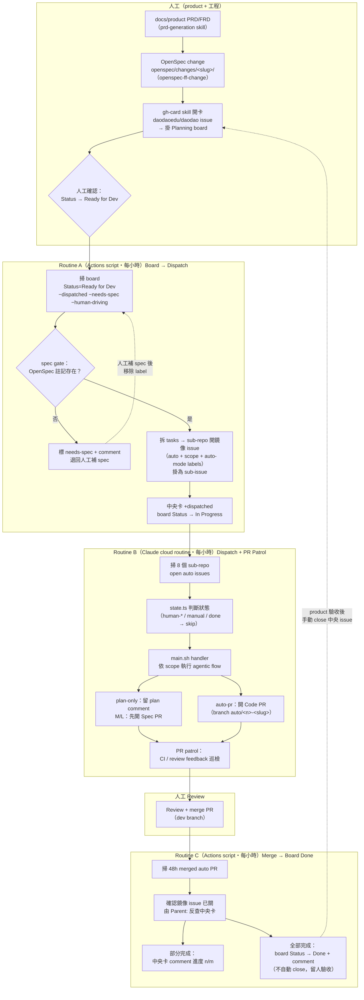
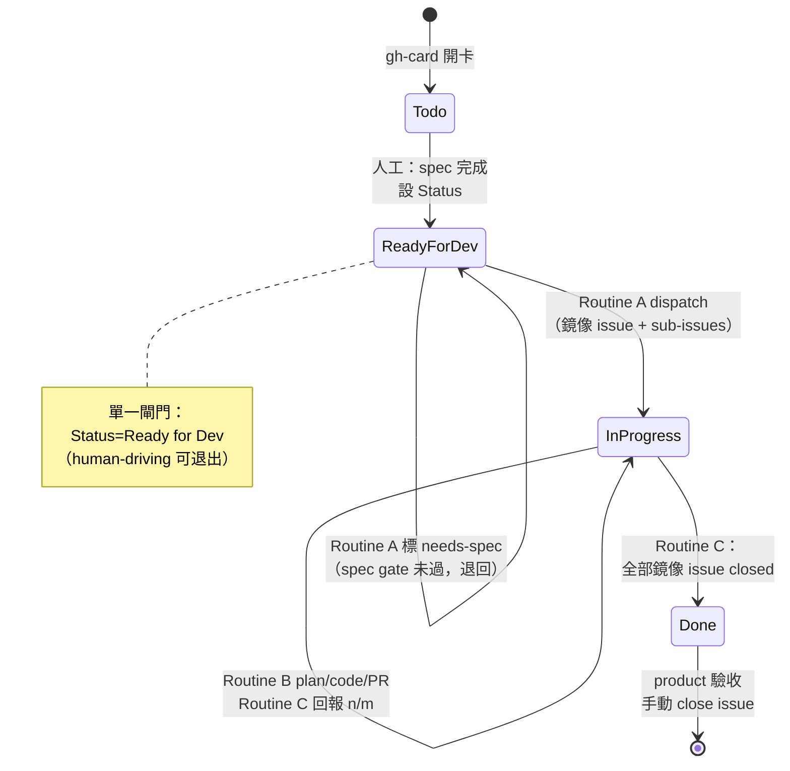
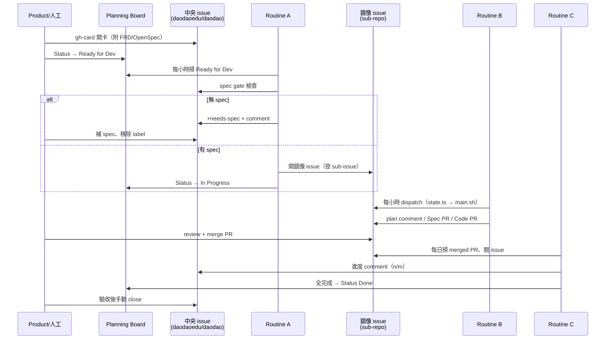

# GitHub Pipeline — Board → Issue → Plan → PR 自動化架構

> 2026-08 起取代 Notion pipeline。任務管理層從 Notion DB 遷移到
> **GitHub org Project「Planning」** + **daodaoedu/daodao 中央 issues**。
> Notion 完全退場；舊架構文件見 [architecture.md](architecture.md)（僅供考古）。

## 總覽

- **管理層（source of truth）**
  - 中央 issues：[daodaoedu/daodao/issues](https://github.com/daodaoedu/daodao/issues) — feature 卡，product 視角，附 FRD / POC 連結
  - 看板：[orgs/daodaoedu/projects/10「Planning」](https://github.com/orgs/daodaoedu/projects/10)
  - Status 流：`Todo`（待規劃）→ `Ready for Dev`（spec 完成）→ `In Progress`（已 dispatch）→ `Done`（全部鏡像 issue 關閉，待驗收）
- **工程層（雙軌 issue）**
  - Routine A 把 Ready for Dev 的中央卡 dispatch 成 sub-repo **鏡像 issue**（掛 sub-issue）
  - Routine B 對鏡像 issue 做 plan / code / 開 PR
  - Routine C 把 merged PR 的完成狀態回寫 board
- **單一閘門**：board `Status=Ready for Dev` 即派工（Ready for Dev = 派工佇列）；不想被 pipeline 碰的卡掛 `human-driving` 退出
- **Spec gate**：中央 issue body 必須註記 `OpenSpec: openspec/changes/{slug}/` 且該 change 有含未完成 task 的 tasks.md，否則標 `needs-spec` 退回。Acceptance Criteria 不能取代——AC 只給人工開發（`human-driving` + `/dev-task`）用；規格層級判定見 [docs/workflow.md Phase 1.5](../workflow.md#phase-15規格層級判定)

## 全流程圖

## 狀態機（中央卡視角）

## 角色分工

## Label 體系

### 中央 repo（daodaoedu/daodao）

| Label | 誰加 | 意義 |
|---|---|---|
| `human-driving` | 人工 | 退出 pipeline（Ready for Dev 也不派工） |
| `auto:plan-only` / `auto:auto-pr` | 人工 | 執行模式；未掛一律 plan-only |
| `scope:XS/S/M/L` | 人工 | 複雜度，決定 agentic flow |
| `repo:<sub-repo>` | 人工 | 目標 repo 標注（board 篩選用） |
| `dispatched` | Routine A | 已 dispatch，避免重複處理 |
| `needs-spec` | Routine A | spec gate 未過，人工補 spec 後移除 |
| `human-driving` | 人工 | pipeline 立即退場 |

### Sub-repo（鏡像 issue）

沿用舊制：`auto`、`auto:plan-only/auto-pr`、`scope:*`、`human-coding`、`spec-merged`、`human-driving`。

## 三支 Routine（A/C 是 Actions script，只有 B 是 Claude）

| Routine | 執行方式 | 排程 | 入口 | 職責 |
|---|---|---|---|---|
| A — Board → Dispatch | **GitHub Actions**（純 script） | 每小時 `:07` UTC | [pipeline-dispatch.yml](../../.github/workflows/pipeline-dispatch.yml) → `bin/pipeline/dispatch.ts` | 掃 board、spec gate、規則化拆卡、開鏡像 issue |
| B — Dispatch + PR patrol | **Claude cloud routine**（agentic） | 每小時 `:27` | [routine-b-prompt-v2.md](routine-b-prompt-v2.md) | 實作 auto issue、開 PR、巡 PR |
| C — Merge → Board Done | **GitHub Actions**（純 script） | 每小時 `:37` UTC | [pipeline-board-sync.yml](../../.github/workflows/pipeline-board-sync.yml) → `bin/pipeline/board-sync.ts` | merged PR → 關鏡像 issue → board 回寫 |

判斷邏輯集中在 `bin/pipeline/lib.ts`（純函式、vitest 覆蓋）；gh CLI 呼叫在 `bin/pipeline/gh.ts`。
兩支 Action 都支援 `workflow_dispatch` 手動觸發 + `dry_run`。運維手冊見
[routine-a-prompt.md](routine-a-prompt.md) / [routine-c-prompt.md](routine-c-prompt.md)。

**拆卡規則（Routine A）**：tasks.md 每個 `## section` 一張鏡像 issue；target repo 依
「section 標題 → task 內文提及的 sub-repo 名稱 → 卡片唯一 `repo:*` label」判定；
判不出 → 標 `needs-spec` 退回人工補註記。

共用行為規範：`.claude/skills/gh-pipeline/`（Routine B 執行 agentic phase 前必載）。

環境需求：repo secret `GIT_HUB_ACCESS_TOKEN` 需含 `repo` + `project` scope
（Actions 內建 GITHUB_TOKEN 摸不到 org project）。**Notion env 全部移除。**

未來可升級：Routine C 改事件驅動（sub-repo `pull_request: closed` → `repository_dispatch`
到中央 repo），merge 當下即回寫，不用 hourly 輪詢。

緊急停止：monorepo root 放 `.automation-paused` 檔案，三支 routine 都會直接退出。

## 安全邊界（沿用舊制）

- 高風險 repo `daodao-storage` / `daodao-infra` → 強制 plan-only，永不自動開 PR
- Routine A 每輪最多 dispatch 3 張中央卡；Routine B 每輪最多實際操作 5 個 issue
- token 超 cap / verification 2 次失敗 → `human-coding` 移交人類
- `human-driving` label → routine 立即退場

## Context Pack（確定性檢索，2026-08-20 加入）

依「Context Pack 實戰筆記」引入：review／實作只看 diff 會漏掉「同類呼叫點、
被改模組的 importer、進行中的工作」——這三種都是確定性查詢，不需要 RAG。

| 元件 | 位置 | 用途 |
|---|---|---|
| `retrieve-context.sh` | monorepo `.github/scripts/`（sub-repo 各自 vendor 一份） | rg/git/gh 打包 diff 外脈絡成 context-pack.md：① 改動 symbol 的 caller ② 被改檔案的 importer ③ 同呼叫模式的其他出現點 ④ in-flight 工作（open PR 交集 + 近 21 天 commit）⑤ 精簡 repo map |
| `test-retrieve-context.sh` | 同上 | fixture 回歸：重演「修 1 個漏 N 個」案例，斷言 pack 必列出漏掉的檔案；改腳本必過 |
| Reviewer 規則 | sub-repo `code-review.yml` 的 system prompt | 每個 ⚠ 位置判斷「需不需要同樣的修改」；同缺陷未提 → 🔴 Incomplete scope |
| Routine B Step 0 | `gh-pipeline/references/agentic-flows.md` | 實作前查 in-flight 衝突；開 PR 前自查 ⚠ 位置，範圍外的在 PR body 註記 Known incomplete scope |

噪音採**分級摘要**（命中 >60 或分散 >15 檔 → 壓一行計數；每檔 ≤3 行；pack ≤16KB）。
已內建的 CI 坑解法：merge-base 兩點 diff、rg 無命中 `|| true`、截斷前先 sort、BSD/GNU 相容。

Root AI Code Review 會在送出 diff 前產生 Context Pack，並把兩者一起送到 Workers AI。
CI 一律從 PR 的 **base SHA** 讀取可信版本的 `retrieve-context.sh`，不執行 PR checkout
中可被修改的腳本；diff 與 pack 使用相同的 `merge-base → head SHA`。目前 PR 會從
open PR 交集排除，避免把自己誤判為 in-flight 衝突。diff、pack 與 review body 都透過
`$RUNNER_TEMP` 檔案跨 step 傳遞，不使用固定 heredoc delimiter。

首次合併時會執行 base branch 上既有的可信腳本版本；只有 base 完全沒有該腳本或腳本執行
失敗時，CI 才會安全降級成 diff-only review。合併後的後續 PR 才會使用這次更新的 Context Pack。
共享設定同步 Action 會為各 target repo 建立獨立 PR，並同步兩個 workflow、可信 Context Pack
腳本與 regression contracts；由具 ruleset bypass 權限的同步 bot 合併，失敗時保留 GitHub CLI
錯誤並讓 workflow 明確失敗，不會靜默留下待人工處理的 PR。

Fixture 覆蓋 TypeScript importer、JSX 呼叫模式、Python dotted module、current PR 排除，
以及超過 pipe buffer 時仍保持 UTF-8 完整行截斷。

## 相關 skills

| Skill | 用途 |
|---|---|
| `gh-card` | 開中央卡 + 掛 board（取代 notion-card） |
| `gh-pipeline` | Routine A/B/C 行為規範（取代 notion-pipeline） |
| `prd-generation` → `openspec-ff-change` | 產 spec（spec gate 的前置） |
| `publish-tasks` | 手動把 OpenSpec tasks 發成 sub-repo issues（Routine A 的手動版） |
| `dev-branch-workflow` | 人工開發分支流程 |
| `post-merge-wrapup` | merge 後歸檔 openspec change、更新 docs/product |

## 已退役元件

| 元件 | 狀態 |
|---|---|
| Notion 任務 DB（`3549cc81...`） | 退場，不再讀寫 |
| `bin/notion-sync/` | 退役，由 `bin/pipeline/dispatch.ts` 取代 |
| `bin/routine-c/sync-done.ts` | 退役，由 `bin/pipeline/board-sync.ts` 取代 |
| workflows `routine-a-notion-sync.yml` / `routine-c-sync-done.yml` | 已刪除，由 `pipeline-dispatch.yml` / `pipeline-board-sync.yml` 取代 |
| Claude cloud routines「daodao Routine A / C」 | 已停用（A/C script 化後只留 cloud Routine B） |
| `bin/pipeline-status.ts` | 保留（無 NOTION_API_KEY 時自動省略 Notion 區塊；「Pending sync」區塊待改為 board 掃描） |
| skills `notion-card` / `notion-pipeline` | 標記 DEPRECATED（git 歷史可考） |
