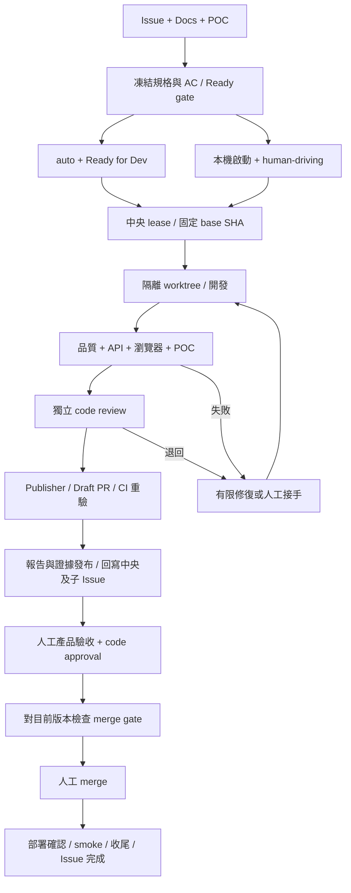

# 島島阿學：Issue 到開發、驗收與合併的共用流程

> 註（2026-09-20）：OpenSpec 已退役，下文提及 OpenSpec change／tasks.md 之處已不適用；規格以 docs/product 與 Issue 驗收契約為準。舊 `openspec/` 已封存於 `docs/archive/openspec/`。

> 日期：2026-09-12。狀態：Draft／可供定案的流程提案，尚未實作自動化。
> 本文承接[雙訂閱 v2](dual-subscription-development-workflow.md)，補足 Google Docs／Drive、人工入口、產品驗收與 Issue 回寫契約。
> 本文的命令介面、check 名稱、欄位與狀態皆為目標設計，除「現況」明列者外，不代表已部署。

搭配使用：[額度分配政策](agent-budget-policy.md)與[可複用文件模板](../../templates/development/README.md)。下文內嵌格式是閱讀示例，正式複製以模板目錄為準。

Issue 欄位、labels、Board 狀態與關聯設定見 [GitHub Issue 管理規範](github-issue-management.md)，其中明列遠端現況與程式尚未支援的部分。

## 1. 建議採用的方式

先看圖解：[開發流程 Mermaid 文件](development-workflow-diagrams.md)，區分已建立能力與待實作的完整閉環。

**GitHub Issue 管工作與狀態，Google Docs 管需求討論與驗收閱讀，Drive 留存 POC 與截圖；開發與 CI 共用一套可重跑的驗收契約。**

兩個開發入口收斂到相同流程：

- 自動入口：建立中央 Issue → 規格齊備 → maintainer 設 `auto` 與 Board `Ready for Dev` → 自動開發。
- 本機入口：指定中央 Issue → 取得任務鎖並設 `human-driving` → Claude Code／Codex 協助開發，也可由人直接修改。

「開 Issue」可觸發整理需求與缺項檢查；只有通過 Ready gate 的 Issue 才執行程式修改。授權者可在建立時一併完成 Ready 操作，取得一次送件的體驗。

兩者都必須完成：實作 → 品質檢查 → 真實後端串接 → 瀏覽器／POC 驗證 → 獨立 code review → Draft PR → 自動回寫 Issue → 人工驗收 → merge gate → 人工 merge → 部署確認與收尾。

### 目標與角色

| 角色 | 要完成的事 | 判定成果 |
|---|---|---|
| 需求提出者 | 在 Issue 連結 Google 需求文件與 POC，描述目標 | 每項需求都有 AC 編號與可觀察結果 |
| 開發者／writer | 從同一 Issue 自動或本機啟動 | 可重現 patch、測試與已知未完成範圍 |
| reviewer | 從乾淨上下文檢查 diff、契約與證據 | finding 有位置、原因、處置與重驗結果 |
| 驗收者 | 看 Google 報告並重現指定操作 | 對指定版本逐項接受或退回 |
| maintainer | 審核例外、合併與跨 repo 上線順序 | required checks 與簽核均對應目前版本 |

本流程屬工程自動化，不納入產品上線 manifest。程式碼存在、CI 通過、可部署、實際上線分別舉證。

## 2. 現況與新增範圍

本次以 local working tree 查核，未驗證 GitHub live rulesets、runner 登入或 Drive 分享設定。

| 能力 | 現況證據 | 本次規劃 |
|---|---|---|
| Issue 自動派工 | `bin/pipeline/dispatch.ts` 已檢查 OpenSpec、`human-driving` 等條件 | 保留 Routine A，接 v2 router |
| 本機隔離開發 | `.claude/skills/dev-task/SKILL.md` 定義 worktree 與驗收流程 | 抽出雙 host 共用執行契約 |
| POC 比對與 Google 報告 | `dev-task/references/` 有 browser、poc-compare、verify-report 草案；部分未追蹤／未提交 | 加入版本綁定、證據留存、權限與 CI 重驗 |
| Board 收尾 | `bin/pipeline/board-sync.ts` 在所有 mirrors closed 後標 Done，中央 Issue 仍開啟 | 改成明確區分 merged、deployed、accepted |
| 雙訂閱 harness | v2 仍為規劃，`bin/agent/` 尚不存在 | 分階段實作，不把設計命令當可用指令 |
| 翻譯與 migration | 本機 hooks 與各 repo CI 能力不一致 | 將可確定規則改為共同 CLI 與 required checks |

既有 `verify-report.md` 有將報告／圖片設為 anyone-reader 的操作；本提案改為指定驗收群組存取。若圖片內嵌需公開網址，使用受限 Drive 連結或受控報告頁，不以自動公開解決。

本次另核對的 CI 缺口：

- 開卡 skill 後續查核：`bin/pipeline/dispatch.ts` 尚未實作中央 `auto` label 檢查；本文雙 gate 是目標政策，未補齊前 Todo／human-driving 才是開卡時採用的防派工方式。

- `daodao-f2e/.github/workflows/linode-ci.yml`、`mobile-ci.yml` 與 `daodao-server/.github/workflows/continuous-integration.yml` 有背景命令後裸 `wait`；個別命令失敗可能未傳遞到總結果，需優先修復。
- `daodao-f2e/.github/workflows/update-i18n.yml` 是手動更新，且 script／locale 路徑與目前 checkout 不符，不能作翻譯 gate。
- `.github/workflows/code-review.yml` 在模型或設定失敗時可 exit 0，目前為 advisory。
- storage 的 `schema-sync-check.yml`／`ci-postgres.yml` 有靜態 drift 與 clean install 檢查，但不能取代舊資料 incremental migration；現行跨 repo schema 檢查未綁本次配套 SHA。

以上為 direct checkout 與 root 的本次盤點；導入前須對照 `projects/*` 的實際開發 base，避免同步不同版本規則。

## 3. 文件分工與需求版本

| 載體 | 唯一職責 | 必填資訊 |
|---|---|---|
| 中央 GitHub Issue | 任務索引、狀態、責任人、子 repo 進度 | 需求／POC／OpenSpec／報告／PR 連結、AC 摘要、執行狀態 |
| Google 需求文件 | 討論、產品決策與設計說明 | 文件 ID、確認人、確認時間、已選定版本 |
| OpenSpec 或小任務 AC 檔 | 執行時的驗收契約 | AC ID、Given/When/Then、repo、測試資料、必需證據 |
| Drive 任務資料夾 | 保留原型、截圖、報告附件 | Issue ID / run ID / 版本，驗收群組存取 |
| Google 驗收報告 | 提供非工程人員閱讀的驗收視圖 | 逐項結果、並排圖、操作方式、差異、阻塞與簽核連結 |
| Run manifest / `task.md` | 機器執行紀錄／本機工作摘要 | SHA、digest、測試結果、狀態、lease 與報告索引 |

Google 文件會變動，不能只存 URL。Ready 時記錄文件 ID、modified time，匯出核准內容並計算 SHA-256；POC 同樣固定檔案版本與 digest。若無法取得穩定 revision，匯出快照就是執行基準。

自動化與 M/L 任務沿用 OpenSpec；S 人工任務允許 Issue AC，但啟動時必須凍結成同 schema 的 acceptance snapshot。`task.md`、PR 與報告從此產生投影，不各自另寫驗收標準。

開發中需求或 POC 變更須建立新契約版本、列出差異與需重跑項目；不可悄悄使用 Google 文件最新內容。Agent 不得自行降低 AC、修改 POC 基準或核准差異。

### 中央 Issue 範本

```markdown
## 目標與範圍
- 使用者問題：
- 本次包含／不包含：
- 需求文件：<Google Docs URL>
- POC：<Drive/Figma/branch URL + 指定版本>
- OpenSpec: openspec/changes/<slug>/
- 涉及 repos／前後相依：
- 驗收者：@<maintainer>
- 風險：UI / API / i18n / migration / permissions / infra

## 驗收條件
- AC-01 Given ... When ... Then ...
- AC-02 Given ... When ... Then ...

## 驗收環境
- 測試環境、測試角色與資料準備方式：
- 語系、桌機／手機尺寸：
- POC 差異的既有決策：

## 執行政策
- 模式：auto / local
- Writer：auto / claude / codex
- 已授權範圍：<repos、paths、可否由 publisher commit/push/開 Draft PR>
- Merge：人工
```

未填必要資訊 → `needs-spec`，回寫缺項清單；純後端可將 POC／UI 明確設 N/A 並附理由。只有「做完這功能」不可進 Ready。

## 4. 兩個入口與同一條執行鏈



### 自動入口

1. Routine A 驗證規格，拆分子 Issue 與依賴；router 從 trusted policy 選 writer。
2. 私有 repo 的訂閱 runner 產 patch；無模型憑證的 verifier 執行測試與瀏覽器驗證。
3. 另一 provider 以乾淨上下文 review。沿用 v2：全流程自動修復最多一次；auth、quota 或 review 不可用則保留成果並回報 blocked，不偷偷切付費 API。
4. 檢查通過後由獨立 publisher 建 Draft PR；publisher 使用被允許的 GitHub 寫入權限，不執行任務程式。
5. CI 重新驗證 PR 版本；建立完整報告、回寫 Issue 後才標「開發完成，待人工驗收」。

v2 的 private auto flow 保留 cross-provider review 要求。Public repo 採本機開發／人工 review；如需全自動，需另立符合認證邊界的方案，不能直接套用私有 Codex runner。

### 本機入口

目前可指定 agent：「依 `.claude/skills/dev-task/SKILL.md`，從中央 Issue #N 啟動，完成開發與驗收報告。」Codex 需明確讀取該 skill，不能假設有 Claude slash command。

目標 CLI 介面如下，**尚未實作，不可直接執行**：

```text
dao task start <issue-url> --mode local --writer codex
dao task verify <issue-url>
dao task report <issue-url>
dao task resume <issue-url> --run <run-id>
dao task finish <issue-url>
```

啟動後以 `projects/<repo>` 為來源，對明確 base ref/SHA 建 `worktrees/<issue>-<slug>/<repo>`；每個任務使用獨立 port、瀏覽器 context 與測試資料 namespace。進入子 repo 前先讀其 AGENTS／CLAUDE 指引。

本機與自動化必須使用**同一中央 lease service**，key 為 repository + issue；跨 repo 任務逐 repo 取 lease，依穩定排序防止死鎖。GitHub repository-scoped concurrency 或本機 lockfile 都不足以保證兩入口互斥。

lease 至少含 owner、run ID、heartbeat、期限與遞增 fencing token。lease 失效或人工接手後，舊 runner 的 patch 發布與狀態回寫必須被拒絕。加 `human-driving` 先要求自動任務在 checkpoint 停止，確認釋放後才開始本機寫入。

離線可持續本機工作，但無法確認鎖或同步時，不宣稱已正式接手，不發布同任務 PR。quota 用完可由人接手現有 worktree；恢復時仍需重驗身份、版本與 lease。

本機 commit/push 依現行 AGENTS 與 skills；自動 publisher 的事先授權須在啟用 pilot 前寫入受審核政策。本文提案本身不更改目前的確認規則。

## 5. 驗收必須回答的四個問題

### A. 功能是否完成目標？

每個 AC 都有 Given/When/Then、操作步驟、預期與實際結果，狀態限 `pass / fail / blocked / not-run / n/a`。N/A 必須有適用性理由；required AC 不能用 N/A 逃避。空白、未測、無證據不可算 pass。

測試不要求每個 React layout 寫 unit test；新增純邏輯要有測試，bug 要先以 regression test 重現。關鍵 UI 操作透過瀏覽器驗收。

### B. 是否正確串接後端？

UI 截圖與 HTTP 200 都不足以證明串接。每條受影響資料流要驗：

1. 瀏覽器從本次前端觸發真實 request，記錄 method、route、request ID、去敏 payload 與 response。
2. 證明目標後端是本次版本：記 server commit／image digest、API base URL、schema migration version；後端有變更時不能連舊版 shared dev 冒充驗證。
3. 寫入後以 GET 或受控 DB 查詢回讀相同 ID，再 reload 頁面確認持久化；讀取功能以已知 seed 對照內容。
4. 驗證失敗、空資料、驗證錯誤、未登入／無權限，以及需求相關的重複送出與跨使用者存取。
5. 實際 API 失敗時，UI 不得用 mock/fallback 假資料顯示成功。mock 測試另標 unit/contract，不當整合證據。

服務需 test health/version mechanism 或可核對啟動紀錄；沒有版本證明就標 blocked。登入使用專用測試角色，不能以 admin-only 測試取代一般使用者授權驗證。

### C. UI 是否與 POC 相符？

- 固定 POC snapshot、瀏覽器版本、viewport、DPR、字型、資料與互動狀態；預設桌機 1440×900、手機 390×844，任務可補尺寸。
- 每個 UI AC 留 POC／實作並排圖、實作單圖與必要操作前後圖；至少涵蓋成功、loading、空資料、error，依適用性追加 dialog、disabled、長文案與溢出。
- 量測 spacing、寬高、字級、圓角、對齊與捲動行為，保存 JSON 差異表；再目視檢查遮罩、缺元件、圖像與按鈕樣式。
- 用基準先定義允許差異與容差，不能在失敗後調高 threshold；只有圖片 POC 的屬性無法量測時明列限制並人工比較。
- 差異逐一列「修復」或「已批准例外」。例外必須有具權限的人、時間、原因、POC/spec digest 與適用範圍；agent 寫一句「刻意設計」不能放行。

瀏覽器 driver 可使用專案支援的 Playwright 測試 runner，人工複核可用可用的 browser 工具；介面無關的 evidence schema 才是共同標準。這是本機／受控測試環境驗收，不以 retired 網頁抓取工具做公開研究。

### D. 驗收的是不是準備合併的版本？

驗收 key 至少包含：central issue、run ID、spec/POC digest、各 repo base/head SHA、patch digest、backend image/schema version、harness/profile version、測試資料版本。

新 commit、rebase、base 更新、需求或 POC 變動使舊 approval 失效。重跑受影響驗證，由 trusted verifier 產生新完整 manifest；不得沿用舊圖而只改報告 SHA。跨 repo 要記錄同一組 tested revisions，而非只看 f2e SHA。

## 6. 清楚可閱讀的驗收包

```text
Drive / Development / issue-<N> / run-<ID>/
  requirements/       核准需求與 POC 快照
  evidence/           截圖、並排圖、去敏 API 證據、測試摘要
  acceptance-report   Google 文件（供人閱讀）
  manifest.json       版本與檔案 digest 索引
```

report/manifest 在本機或受控 artifact store 先產出；Google Docs 是相同資料生成的閱讀視圖。二進位附件以 client-native upload／檔案傳輸上傳，不把圖片 base64 塞入模型上下文。

驗收證據建議保留到完成後至少 90 天，核准結論與 digest 隨版本長期保存；v2 的 1–3 天短期 patch/session artifact 保留不適用最終驗收包。worktree cleanup 前確認遠端證據可讀且 digest 相符。

預設只授權指定驗收群組，確認驗收者可開啟；不留 JWT、cookie、密碼或真實個資。上傳失敗時保留本機資料並標「證據待同步」，不得回報驗收包已完成。

### Google 驗收報告範本

```markdown
# Issue #N：<功能> — Run <ID>
結論：開發完成／部分完成／阻塞；人工驗收：待處理／通過／退回
Issue / PRs / 需求文件 / POC / OpenSpec / manifest：<連結>
受驗版本：<各 repo SHA、後端、DB schema、規格與 POC digest>
環境：<URL、角色、seed、瀏覽器、尺寸、日期>

## 目標與操作
<使用者目標、可重現操作、測試登入取得方式，不含憑證>

## 逐項驗收
| AC | 預期結果 | 實際結果 | 狀態 | 截圖／API／測試證據 |
|---|---|---|---|---|
| AC-01 | ... | ... | pass | ... |

## POC 對照
<並排圖、數值差異表、核准例外連結>

## 後端串接
<request → response → 回讀／reload，版本與權限案例>

## 品質與 code review
<CI checks、reviewer、findings、修復與重驗>

## 未完成、風險與部署順序
<不能留白；沒有則明寫 none>

## 人工驗收
<待核准版本與 AC；具權限的 GitHub approval record 連結>
```

驗收者在 Google 文件討論，最終批准由 GitHub 上可驗證身份的操作記錄，綁定 acceptance key；不用 agent 摘要或文件內自由文字當 merge 授權。

## 7. Code review 與常見錯誤的阻擋

Hooks 提供即時提醒，CI 在無模型憑證環境重跑才是合併依據。下列 check 名稱為待實作契約：

| Required check | 阻擋條件 | 驗證方法 |
|---|---|---|
| `quality` | lint/typecheck/test/build 有任一必要命令失敗 | 個別 exit code 彙整；不能用裸 `cmd & wait` 當成功判斷 |
| `i18n-contract` | 必填語系漏 key、空值、ICU placeholders/plural 不相容、動態 key 無法解析且未宣告 | 依 repo 真實 locale config 遞迴比對、parser、fixture；必要語系操作與長文案截圖 |
| `api-contract` | OpenAPI/schema/client 型別漂移、request/response 不符合契約 | 生成後 diff、contract tests、相容性檢查 |
| `migration-safety` | 改寫已套用 migration、缺 migration、升級失敗、破壞相容性、缺回復計畫 | 舊版 seed DB → apply → ledger 重跑 no-op → 新舊服務相容測試 |
| `integration` | 真實資料流、權限或持久化 AC 失敗／未執行 | 本次前後端與測試 DB 的 API + 瀏覽器驗證 |
| `ui-poc-evidence` | 缺圖、required 狀態未驗、未批准 POC 差異或版本過期 | schema/digest/probe coverage + 視覺複核結果 |
| `review-verdict` | review 缺失、不可用、格式錯誤、未處理 blocker | 獨立 reviewer、finding disposition、目前版本綁定 |
| `acceptance-signoff` | required AC 未過、未有具權限人員簽核、簽核過期 | trusted approval record + acceptance key |
| `delivery-report` | 中央／子 Issue 未回寫、報告無法存取、manifest 缺漏 | publisher 回讀驗證與 report digest |

翻譯 key 一致只證明結構；語意正確、台灣用語與漏翻仍需 reviewer 和必要語系 UI 驗收。新 hardcoded-text 掃描先 advisory，累積正反 fixtures 後才升級 blocking，避免把品牌名與使用者內容誤擋。

Migration：只新增版本，不修改已套用 SQL。rollback 可行時在測試 DB 演練；不可逆變更須提供 forward-fix／備份還原演練與核准，不強迫每支 SQL 都有危險的 down。SQL 本身不必一律 idempotent，但 migration runner 對已套用版本必須 no-op。storage/infra 仍沿用 v2 plan-only，自動任務不能執行正式 migration。

既有 AI review 留言保持 advisory；正式 `review-verdict` 另建 fail-closed check。High/Critical 或破壞 AC 的 finding 阻擋，其他 finding 需有處置；誤判豁免須綁 rule、位置、SHA 與證據，不能全域壓掉同類告警。

required aggregator 必須固定執行。path filtering 的不適用項由 trusted classifier 明確 N/A；job missing、cancelled、timeout 或未知 skip 都不能當 pass。實作 branch ruleset 時綁可信 check 來源，防止 PR 自改 workflow 產生假綠燈。是否已在 GitHub 設為 required，需另有 live 設定證據。

## 8. 自動回寫 Issue：交付的必要步驟

**自動化開發結束一定回到 Issue 填資訊與狀態，包括失敗、部分完成與等待人工；本機 finish 同樣使用這個回寫器。**

由 trusted reporter/publisher 執行 GitHub 寫入，不由持模型憑證的 writer 自己宣稱完成。

| 事件 | 子 Issue 回寫 | 中央 Issue／Board 投影 |
|---|---|---|
| 接單／開始 | run、writer、範圍、目前階段 | 進行中；列各 repo 子任務 |
| 修復／阻塞 | 失敗 check、去敏錯誤、已嘗試、成果位置、接手方式 | 阻塞／部分進行中；指明責任人 |
| 開發與驗證完成 | PR、CI、報告、截圖、串接、POC、review、未完成範圍 | 開發完成，待人工驗收 |
| 人工驗收退回 | 未過 AC、原因與指定版本 | 需修正 |
| 人工驗收通過 | 批准者、版本、時間 | 待合併；仍須 merge checks |
| PR 合併 | merged SHA、URL、部署相依 | 已合併，待部署確認 |
| 部署／smoke 通過 | environment、deployment ID、smoke evidence | 所有必要 repo 完成後才 Done |
| 取消／暫停 | 原因、可保留成果、lease 釋放狀態 | 取消／暫停，不假裝完成 |

狀態以 run manifest / durable event store 為權威，Issue labels 與 Board 欄位為投影。以上是語意狀態，導入時映射現有 Board 欄位；不要假設欄位已存在。需求未涉及部署時，先在契約中定義其完成條件與 N/A 原因。

### 固定摘要留言

```markdown
<!-- daodao-delivery:central-<N> -->
## 開發結果：待人工驗收
- 執行：<run URL / run ID>；最後更新：<時間>
- 模式／Writer／Reviewer：<auto|local / provider / reviewer>
- 規格與版本：<spec digest、各 repo SHA>
- PR：<repo#PR，狀態>
- 驗收報告：<Google Docs URL>
- 截圖與 POC 並排：<Drive folder>
- 後端串接：<通過／未過／未驗 + 回讀證據>
- 品質與 review：<checks、finding disposition>
- AC：<pass X/Y；fail、blocked、not-run 清單>
- 未完成項目：<none 或明確列出>
- 下一步：@<驗收者> 依報告驗收目前版本；通過後由 maintainer merge
```

中央摘要呈現全部子 repo 的狀態與連結；子 Issue 呈現自身範圍及中央卡。不能用第一個子 PR 完成覆蓋整體狀態。

### 可靠性與去重

- 每次執行有 run ID，事件 key 為 issue + run + stage + sequence；重試採 upsert 同一摘要留言，保留精簡階段紀錄，不重複洗版。
- durable outbox 先記待發布事件；GitHub／Drive 短暫失敗做有限退避，之後由 scheduled reconciler 補送，獨立於模型 job 是否仍存活。
- 接受更新前檢查 lease fencing token、最新 run 與狀態版本；舊 run 晚到的 success 不可覆蓋較新 blocked/取消/人工接手。
- 分別記錄「開發結果」與「回報同步結果」。寫回失敗標 `report-pending`；保留 artifact 與待補送事件，`delivery-report` 不通過，禁止進待合併。
- 回寫後回讀 comment／Board 確认 link 與狀態正確；reconciler 同時核對 PR merge 事實，不能只看 Issue closed。
- 使用 GitHub App 或最小 repo 權限 publisher；Issue 文字只當資料，不能注入 shell、改狀態政策或指定憑證。

Routine C 需改掉「mirrors 全 closed → Done」的簡化條件。保留人工 merge，依實際合併、部署與產品批准分階段收尾；所有必要 repo 達成契約後再關中央 Issue、歸檔 OpenSpec 與清理 worktree。

## 9. 訂閱方案與執行環境

使用者已確認：Claude Max US$100、Codex Pro、Cloudflare Paid。分工、人工保留水位及 Paid 帳號的工程呼叫上限見[額度分配政策](agent-budget-policy.md)；實際剩餘額度尚未讀取。

2026-09-12 經 Groundlane 查核官方文件：

- Claude Code GitHub Actions 支援個人訂閱 OAuth token；token 綁個人，不能視為組織共用帳號。[Claude 官方文件](https://code.claude.com/docs/en/github-actions)
- Codex 官方建議 CI 採 API key；其訂閱帳號 CI 進階路徑限 trusted private automation，要求保存更新的 auth store 並序列化使用，明確排除 public/open-source repo。本文因此保留 v2 的 private-only 自動化限制。[Codex CI 認證](https://developers.openai.com/codex/auth/ci-cd-auth)

此限制針對該 CI 認證流程，不推論成「本機 Codex 不能開發公開 repo」。依 v2 的 repo 分類，root/f2e 走本機互動入口；正式接入前重新查 GitHub visibility。

建議先以現有電腦進行人工 pilot，確認證據規格可用，再以受控常開 runner 接私有 repo 自動化。電腦睡眠／離線時自動任務排隊或 blocked；若要求無人值守，就需要常開主機。runner、CI 與儲存仍可能有費用，訂閱不等於基礎設施免費。

Private auto 的 writer/reviewer 沿用 v2 隔離與無 credential verifier；本機採獨立 reviewer session 或人類 code reviewer，但報告與 checks 不降級。訂閱額度、Google 授權與 auth smoke 在 pilot 實測，無法保證永久登入或無限吞吐量。

## 10. 導入順序與可驗收交付

| 階段 | 要實作的產物 | Exit gate |
|---|---|---|
| 0. 修正基線 | v2 Phase 0、修復 CI exit-code 吞錯、盤點真實命令與 locale 路徑 | 注入失敗確實紅燈；live required checks 可證明 |
| 1. 本機共用驗收 | Issue/AC/report/manifest schema、POC/API 證據、受限 Drive 發布 | 一張含 UI＋API 的真實任務可由驗收者依報告重現 |
| 2. Issue 回寫與 lease | reporter、outbox、中央／子卡彙整、人工接手 | 斷網重試不重複留言；雙入口不重複寫；失敗也能回報 |
| 3. 私有 repo 手動 dispatch | v2 harness、兩訂閱 runner、review、publisher | 兩 provider 各一條成功與失敗路徑，能產 PR 並回寫 |
| 4. 自動啟動 pilot | Ready gate 接 Routine A、停舊 Routine B、reconciler | 10 張 XS/S 無重複 writer；成功／阻塞均回報 |
| 5. 跨 repo 與合併阻擋 | 相依版本 manifest、merge gate、部署與 Routine C 改造 | 前後端＋schema 同一版本鏈驗過，無過期證據可 merge |

跨 repo 通常依 storage expand → server 向後相容 → client → 必要資料回填 → 獨立 contract cleanup 的順序發佈，依任務設計調整。跨 repo PR 在合併前用測試環境驗整組 revisions；不能等 feature merge 才第一次驗真正串接。

Phase 1 即可改善日常人工驗收；不必等待所有 runner 建完。高風險 migration／infra 第一階段保持人工執行，低風險 private server 任務先試自動化，f2e 用本機完成完整瀏覽器驗收。

### 流程本身的驗收案例

1. Given 合格 auto Issue，When 執行成功，Then Draft PR、完整報告、中央與子 Issue 摘要均存在，狀態為待驗收而非 Done。
2. Given 相同 Issue 被自動與本機同時啟動，When 取得 lease，Then 只有一個 writer，舊 fencing token 無法發布。
3. Given UI 顯示成功但 API 未寫入，When 回讀與 reload，Then integration fail 且不可 merge。
4. Given 少一個必要語系 key 或 placeholder 不符，When checks 執行，Then i18n-contract fail。
5. Given 修改已套用 migration 或舊資料升級失敗，When migration-safety 執行，Then fail 並要求人工處置。
6. Given POC 差異未批准或截圖缺失，When ui-poc-evidence 執行，Then fail，報告指出對應 AC。
7. Given PR 已批准後新增 commit，When merge gate 執行，Then 舊驗收與 review 失效。
8. Given provider／reviewer quota 用盡，When run 結束，Then 保留成果、回寫 blocked 與下一步，不產虛假完成。
9. Given GitHub 或 Drive 寫入中斷，When reconciler 重試，Then 同一摘要更新一次、證據可讀後才 delivery-report pass。
10. Given 舊 run 回報較新 run 之後抵達，When reporter 驗證版本，Then 不覆蓋最新狀態。
11. Given 子 Issue 全 closed 但部署 smoke 未過，When Routine C 執行，Then 中央卡不能 Done。
12. Given checks 缺失、cancelled 或背景命令失敗，When aggregator 執行，Then fail 而非 skip-success。

### 需求補洞與預設決策

| 視角 | 已補入 | 定案／pilot 時需確認 |
|---|---|---|
| PM | Done 定義、Issue 回寫、AC 與需求版本 | 驗收者、Board 欄位映射 |
| UI/UX | POC 基準、並排圖、數值量測、差異批准 | 首張任務的 POC 版本與 viewport |
| Backend | 真實串接、資料回讀、權限、schema 版本 | 測試環境與專用帳號 |
| Frontend | 多語系、四態、錯誤不假成功 | 必要語系與 repo 實際 scripts |
| QA/Ops | 版本綁定、缺失阻擋、回報重試、lease | Drive 群組、90 天保留政策與常開 runner |

預設採「本機先跑通 → 私有 repo 自動化 → 人工驗收／人工 merge」，不導入 auto-merge。定案後可將上述階段拆成 OpenSpec 與 GitHub implementation issues；本文不代表已授權發布 Issues、修改 Google 文件、commit 或遠端設定。
