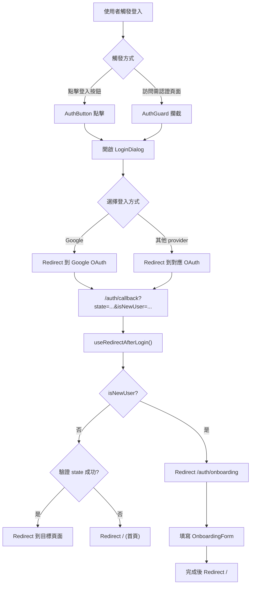
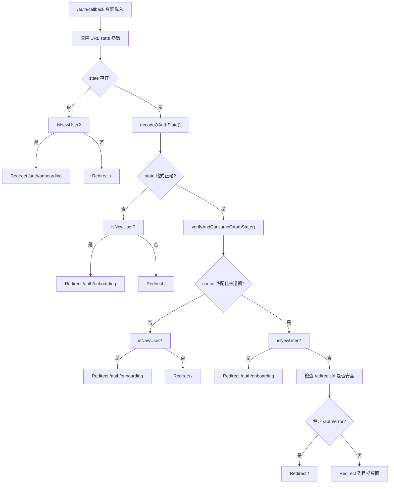
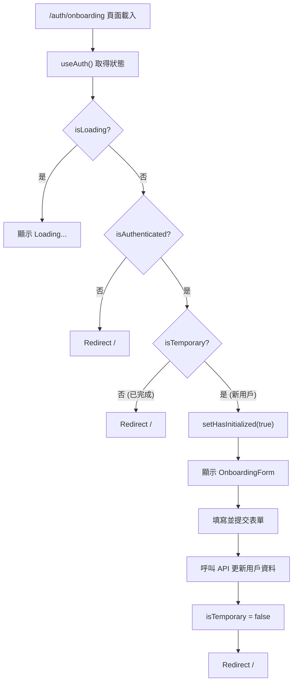
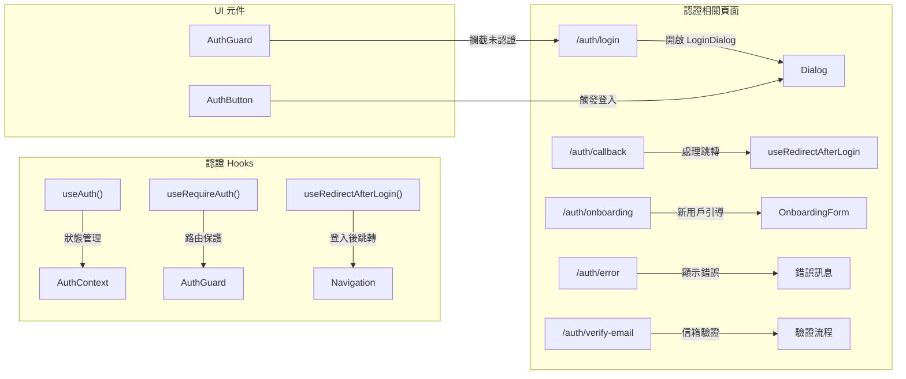
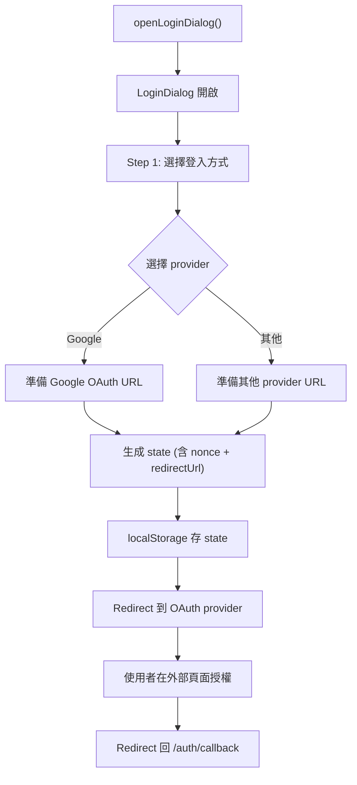
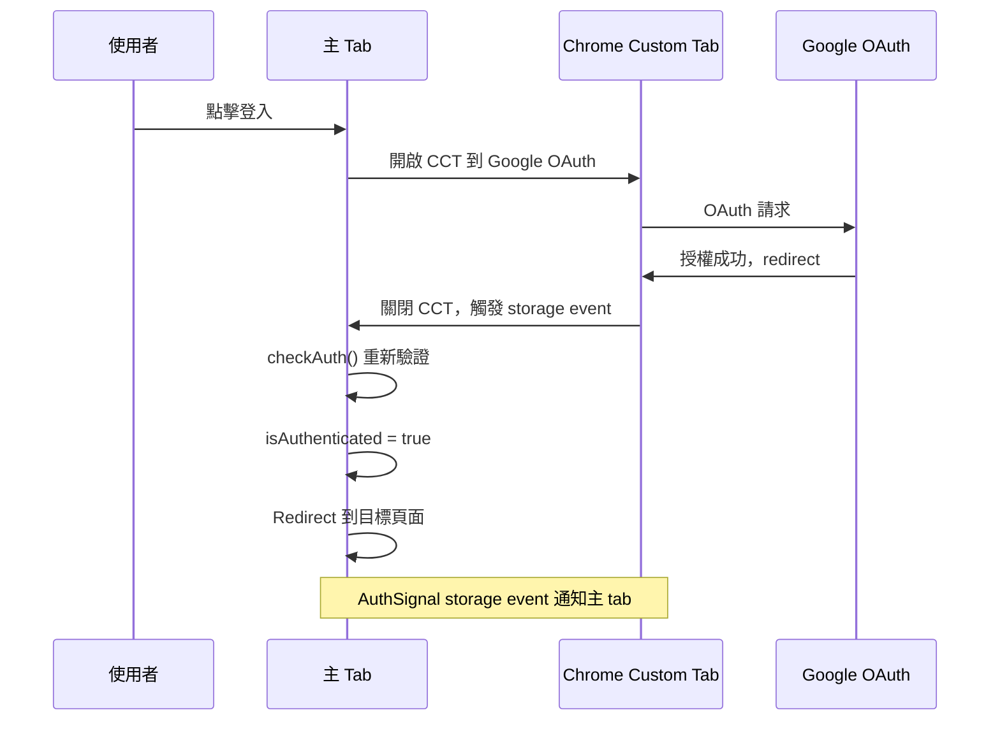

# daodao-f2e 登入與認證流程

本文從瀏覽器操作角度整理 `daodao-f2e/apps/product` 的登入、OAuth、Onboarding 流程。

## 登入流程總覽

## OAuth State 驗證流程

## Onboarding 流程

## 各頁面職責

## 登入 Dialog 流程

## Android Chrome Custom Tab 場景

## 相關程式位置

- `daodao-f2e/apps/product/src/app/[locale]/auth/login/page.tsx`
- `daodao-f2e/apps/product/src/app/[locale]/auth/callback/page.tsx`
- `daodao-f2e/apps/product/src/app/[locale]/auth/onboarding/page.tsx`
- `daodao-f2e/packages/auth/src/hooks/use-auth.ts`
- `daodao-f2e/packages/auth/src/hooks/use-redirect-after-login.ts`
- `daodao-f2e/packages/auth/src/lib/auth-provider.tsx`
- `daodao-f2e/packages/auth/src/lib/auth-client.ts`
