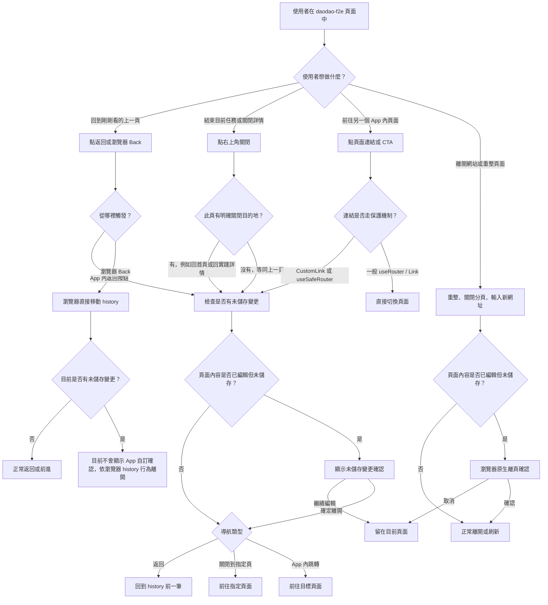
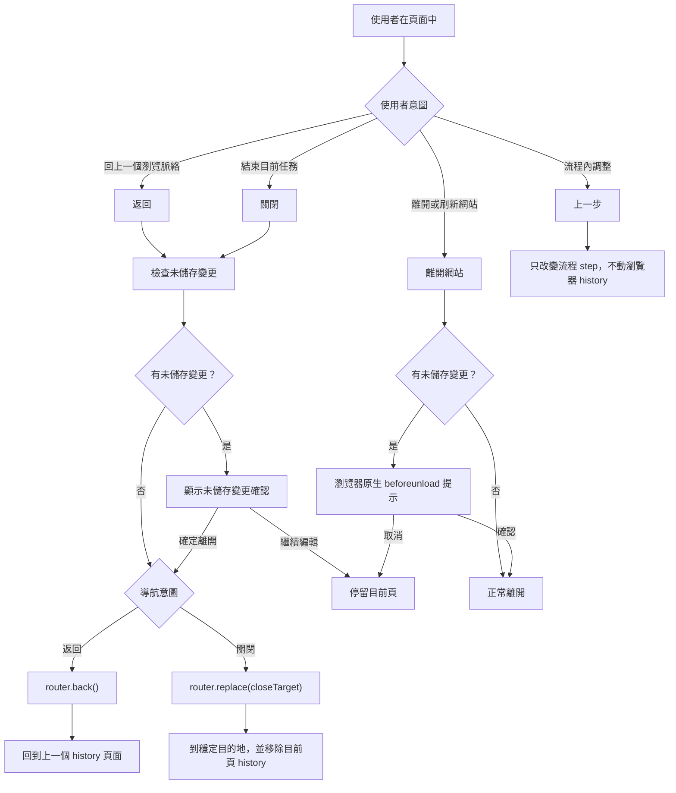
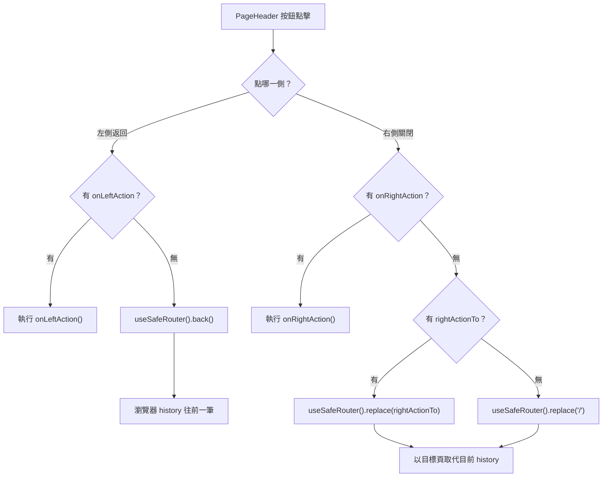
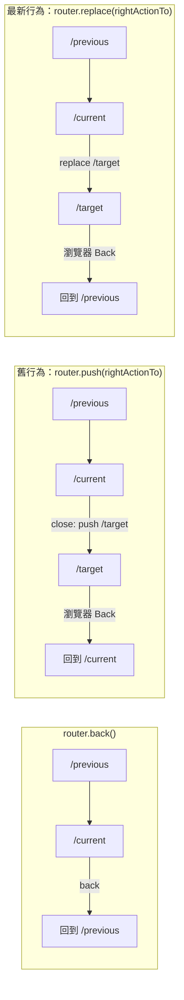
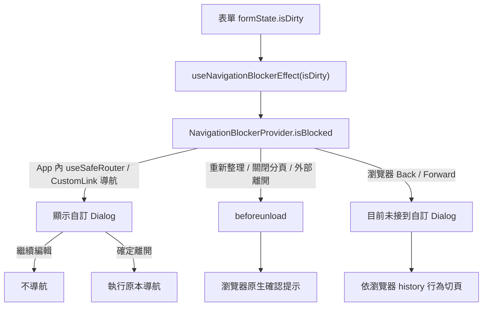
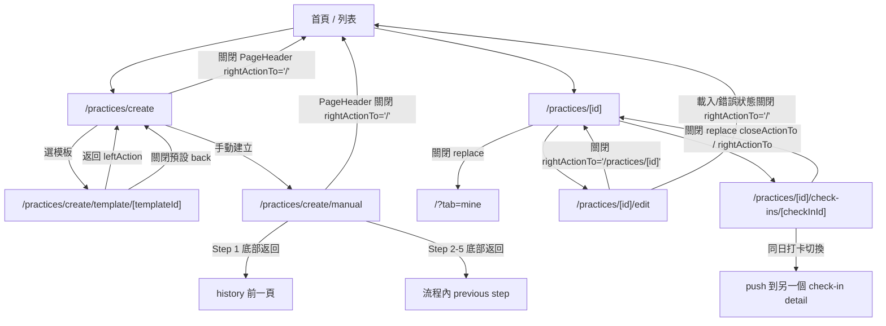

# daodao-f2e 頁面返回與關閉邏輯

本文從瀏覽器操作角度整理 `daodao-f2e/apps/product` 目前的返回、關閉與離頁保護邏輯。內容以 `daodao-f2e` 遠端 `origin/dev` 最新狀態為準。

## 核心結論

- 頁面標題列主要由 `PageHeader` 控制。
- `PageHeader` 使用 `useSafeRouter()`，因此會先檢查是否有未儲存變更。
- `rightActionTo` 目前實作是 `router.replace(rightActionTo)`，符合「關閉目前任務」的 UX 語意。
- `PageHeader` 右上角關閉若沒有指定 `rightActionTo`，目前會 `router.replace("/")`，不再預設 `router.back()`。
- 瀏覽器工具列 Back/Forward 目前沒有自訂 `popstate` 攔截，會走瀏覽器/Next.js 原生 history 行為。
- 重新整理、關閉分頁、輸入新網址離開時，若 `NavigationBlockerProvider.isBlocked = true`，會觸發瀏覽器原生 `beforeunload` 提示。

## 瀏覽器操作總覽：使用者體驗版

這張圖以使用者心智模型整理：使用者不是在思考 `router.push` 或 `router.back`，而是在做「回上一層」、「放棄這個任務」、「離開網站」、「避免資料遺失」幾種行為。

### UX 解讀

- 「返回」應讓使用者回到上一個看過的脈絡，適合使用 `router.back()`。
- 「關閉」應讓使用者結束目前任務，通常應回到穩定目的地，例如首頁、實踐詳情、設定首頁。
- 「關閉到指定頁」目前已使用 `replace`，使用者再按瀏覽器 Back 不會回到剛剛關閉的頁面，較符合「已離開這個任務」的直覺。
- 有未儲存變更時，App 內按鈕和 `CustomLink` 會顯示自訂確認；瀏覽器 Back/Forward 目前不會顯示同一套自訂確認。
- 關閉分頁、重新整理、輸入新網址時，只能顯示瀏覽器原生 `beforeunload` 提示，文案不可完全自訂。

## 現況差異與優化方向

| 場景 | 最新現況 | 使用者感受 | 後續優化 | 優先級 |
|------|----------|------------|----------|--------|
| 右上角關閉到指定頁 | `rightActionTo` 已走 `router.replace()` | 關閉後按瀏覽器 Back 不會回到剛關閉的頁面 | 維持；文件與註解已一致 | 已完成 |
| 右上角關閉但沒有指定目的地 | 目前 `router.replace("/")` | 會穩定回首頁，不再依賴 history | 若某些頁面應回模組首頁，明確補 `rightActionTo` | 中 |
| 實踐詳情關閉 | 目前 `router.replace("/?tab=mine")` | 回到我的實踐脈絡，避免關閉後循環 | 檢查從公開頁、搜尋、通知進入時是否也都應回 mine | 中 |
| 返回上一頁 | 多數情境走 `router.back()` | 符合「回到剛剛看過的地方」 | 保留 `back()`，但避免拿它當「關閉任務」用 | 高 |
| 瀏覽器 Back 且有未儲存資料 | 目前不會顯示 App 自訂確認 | 可能直接離開編輯頁，資料保護感不一致 | 評估加入 history blocker 或在高風險表單避免依賴瀏覽器 Back | 中 |
| App 內連結 | `CustomLink` 會保護，一般 `useRouter` 不一定 | 同樣是跳頁，有些會提醒、有些不會 | 高風險頁面統一使用 `useSafeRouter` 或 `CustomLink` | 中 |
| 關閉分頁 / 重整 | 走瀏覽器原生 `beforeunload` | 有保護，但提示文案受瀏覽器限制 | 保留，並避免把它當主要 UX | 低 |
| 建立流程 Step 內返回 | Step 1 返回 history，Step 2-5 回上一步 | 大致合理 | 文案與 icon 可區分「上一步」和「離開建立」 | 中 |

## 建議優化後的 UX 流程

### 建議決策規則

| 使用者看到的動作 | 建議實作 | 原因 |
|------------------|----------|------|
| 返回 | `router.back()` | 回到上一個瀏覽脈絡，符合瀏覽器模型 |
| 關閉 | `router.replace(target)` | 結束目前任務，不應讓 Back 回到已關閉頁 |
| 上一步 | component state / form step state | 流程內移動，不應污染瀏覽器 history |
| 前往詳情 / 編輯 / 下一頁 | `router.push(target)` | 使用者是在新增一個瀏覽脈絡 |
| 儲存成功後離開表單 | `router.replace(successTarget)` 或清掉 dirty 後 `push` | 避免 Back 回到已提交的編輯狀態 |

### 剩餘建議改動

1. 檢查所有沒有指定 `rightActionTo` 的 `PageHeader`，確認預設回首頁是否符合該頁 UX。
2. 檢查 `/?tab=mine` 是否適合作為所有實踐詳情關閉落點；若從通知、公開頁、搜尋頁進入，可能需要保留來源脈絡。
3. 高風險表單頁面優先統一 App 內跳轉入口，避免部分按鈕繞過 `useSafeRouter`。
4. 若要處理瀏覽器 Back 的未儲存資料保護，需要另行設計 history blocker；這會影響瀏覽器原生行為，應單獨評估。

## PageHeader 返回與關閉

`PageHeader` 的左側返回與右側關閉目前邏輯如下：

### History 效果

## 未儲存變更保護

目前會設定 `useNavigationBlockerEffect(form.formState.isDirty)` 的表單包含：

- 建立實踐手動流程：`/practices/create/manual`
- 編輯實踐：`/practices/[id]/edit`
- 帳號設定表單
- 公開資訊設定表單
- 領域偏好設定表單

## 主要頁面行為對照

## 相關程式位置

- `daodao-f2e/apps/product/src/components/layout/page-header.tsx`
- `daodao-f2e/packages/ui/src/hooks/use-safe-router.tsx`
- `daodao-f2e/packages/ui/src/hooks/navigation-blocker.tsx`
- `daodao-f2e/packages/ui/src/hooks/use-unsaved-changes-confirm.tsx`
- `daodao-f2e/packages/ui/src/components/custom-link.tsx`
- `daodao-f2e/apps/product/src/components/check-in/date-selector/mobile.tsx`
- `daodao-f2e/apps/product/src/app/[locale]/practices/create/manual/page.tsx`
- `daodao-f2e/apps/product/src/app/[locale]/practices/[id]/edit/page.tsx`
