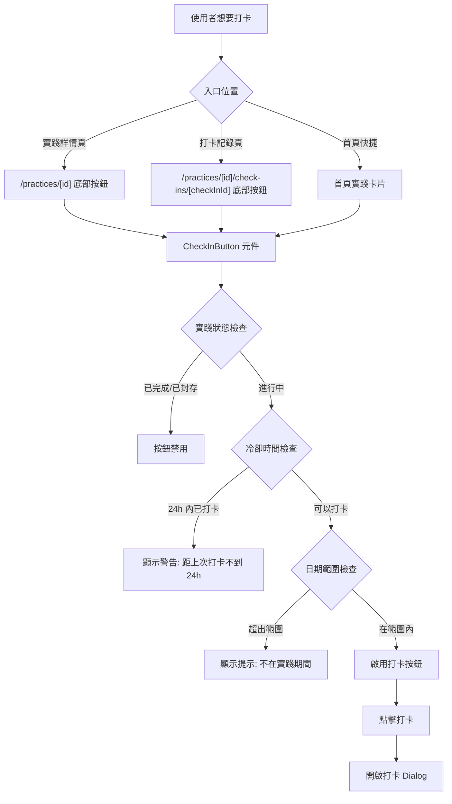
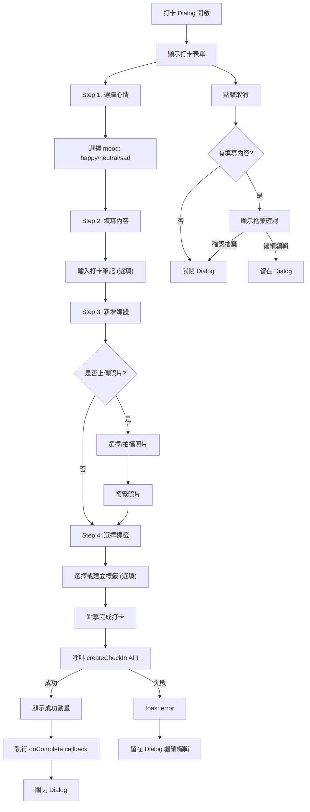
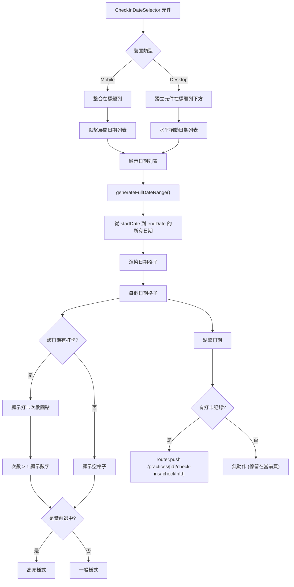
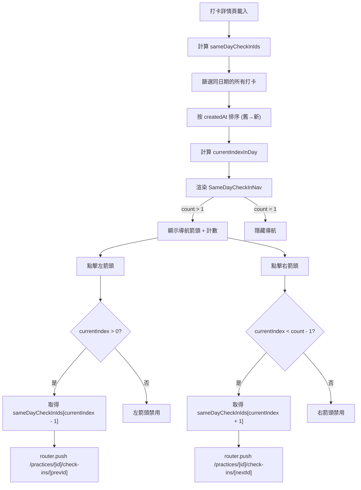
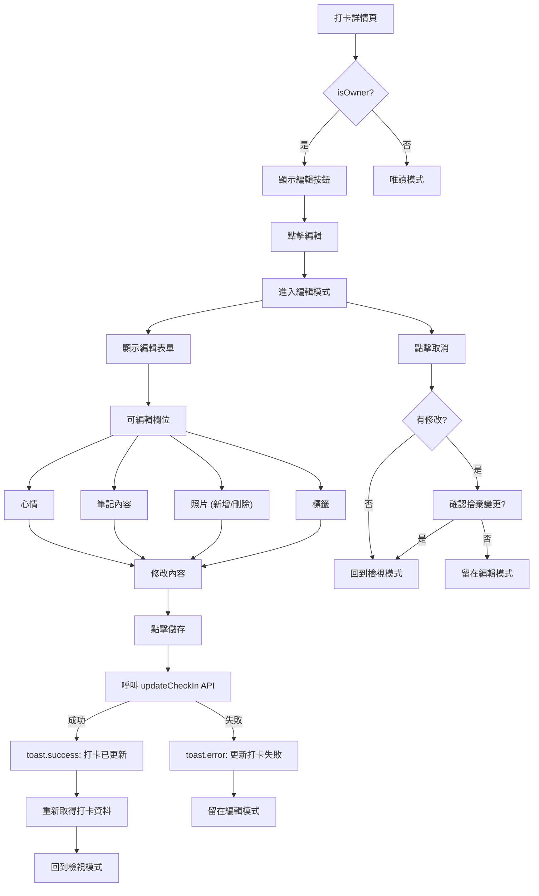
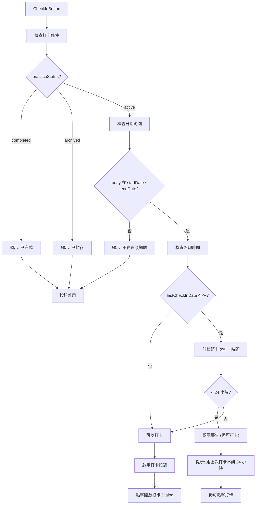

# daodao-f2e 打卡流程

本文從瀏覽器操作角度整理 `daodao-f2e/apps/product` 的打卡功能流程。

## 打卡入口總覽

## 打卡 Dialog 流程

## 打卡日期選擇器流程

## 同日多筆打卡導航

## 打卡編輯流程

## 打卡狀態與限制

## 相關程式位置

- `daodao-f2e/apps/product/src/components/check-in/check-in-button.tsx`
- `daodao-f2e/apps/product/src/components/check-in/check-in-date-selector/`
- `daodao-f2e/apps/product/src/components/check-in/same-day-check-in-nav.tsx`
- `daodao-f2e/apps/product/src/components/check-in/check-in-detail.tsx`
- `daodao-f2e/apps/product/src/app/[locale]/practices/[id]/check-ins/[checkInId]/page.tsx`
- `daodao-f2e/packages/api/src/services/check-in.ts`
