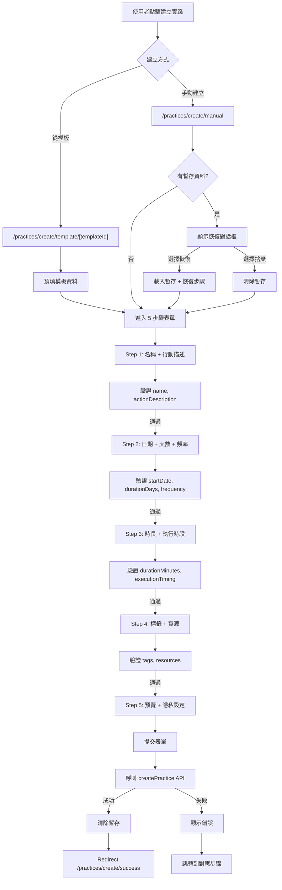
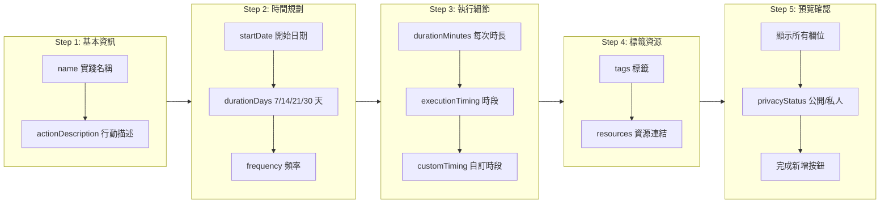
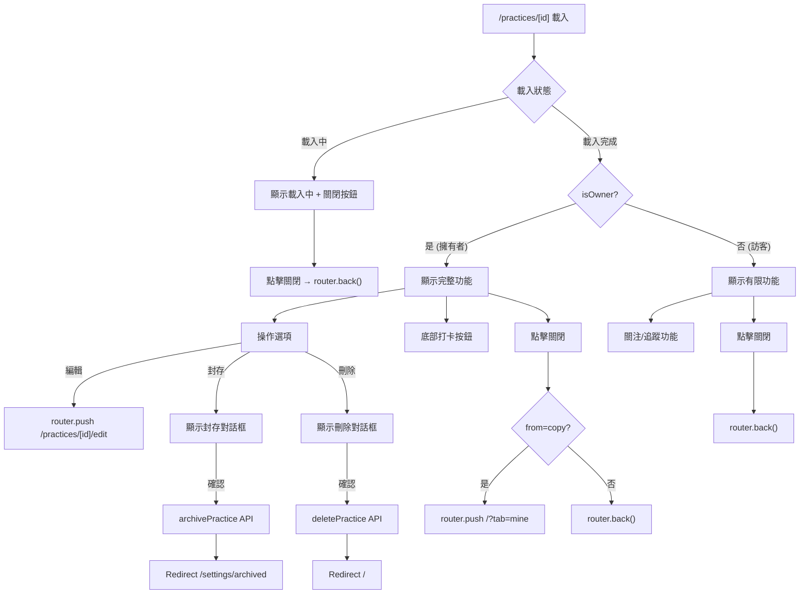
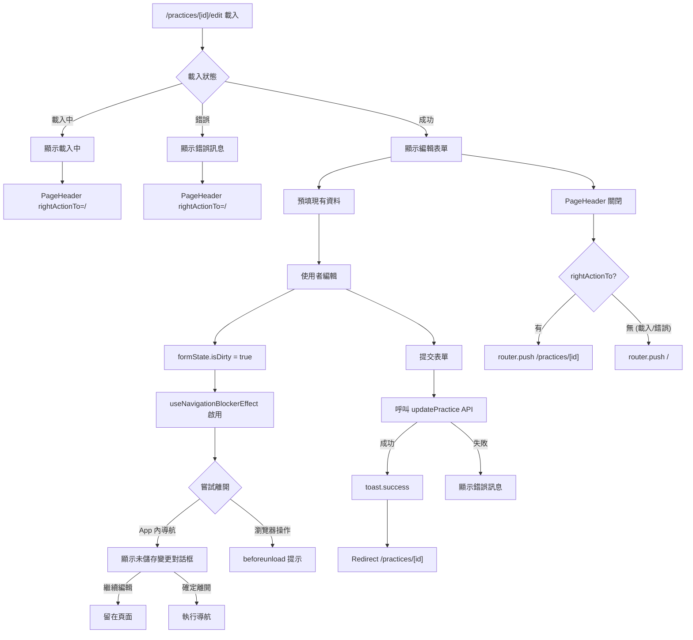
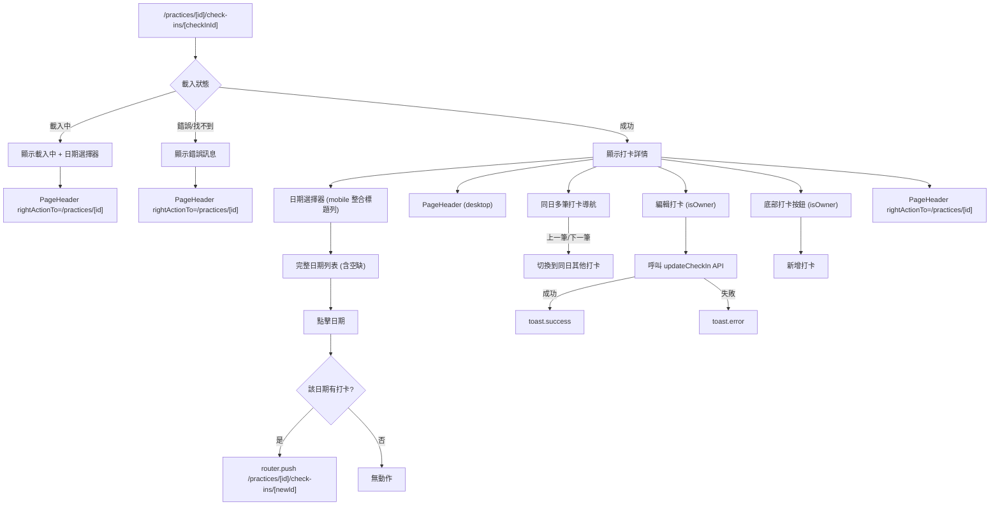

# daodao-f2e 實踐 CRUD 流程

本文從瀏覽器操作角度整理 `daodao-f2e/apps/product` 的實踐建立、編輯、刪除、封存流程。

## 實踐建立流程總覽

## 手動建立 5 步驟詳解

## 實踐詳情頁面流程

## 實踐編輯流程

## 打卡記錄詳情流程

## 封存與刪除對話框流程

```mermaid
flowchart TD
    subgraph Archive["封存流程"]
        A_START["點擊封存"] --> A_DIALOG["開啟封存對話框"]
        A_DIALOG --> A_CONFIRM{"使用者確認?"}
        A_CONFIRM --> |"是"| A_API["archivePractice API"]
        A_CONFIRM --> |"否"| A_CANCEL["取消"]

        A_API --> A_SUCCESS["成功 → Redirect /settings/archived"]
        A_API --> A_FAIL["失敗 → toast.error"]
    end

    subgraph Delete["刪除流程"]
        D_START["點擊刪除"] --> D_DIALOG["開啟刪除對話框"]
        D_DIALOG --> D_CONFIRM{"使用者確認?"}
        D_CONFIRM --> |"是"| D_API["deletePractice API"]
        D_CONFIRM --> |"否"| D_CANCEL["取消"]

        D_API --> D_SUCCESS["成功 → Redirect /"]
        D_API --> D_FAIL["失敗 → toast.error"]
    end

    subgraph Restore["復原流程 (已封存)"]
        R_START["點擊復原"] --> R_DIALOG["開啟封存對話框 (顯示復原)"]
        R_DIALOG --> R_CONFIRM{"使用者確認?"}
        R_CONFIRM --> |"是"| R_API["restorePractice API"]
        R_CONFIRM --> |"否"| R_CANCEL["取消"]

        R_API --> R_SUCCESS["成功 → toast.success"]
        R_API --> R_FAIL["失敗 → toast.error"]
    end
```

## 相關程式位置

- `daodao-f2e/apps/product/src/app/[locale]/practices/create/manual/page.tsx`
- `daodao-f2e/apps/product/src/app/[locale]/practices/[id]/page.tsx`
- `daodao-f2e/apps/product/src/app/[locale]/practices/[id]/edit/page.tsx`
- `daodao-f2e/apps/product/src/app/[locale]/practices/[id]/check-ins/[checkInId]/page.tsx`
- `daodao-f2e/apps/product/src/hooks/use-archive-practice-dialog.ts`
- `daodao-f2e/apps/product/src/hooks/use-delete-practice-dialog.ts`
- `daodao-f2e/apps/product/src/components/practice/create/manual/steps/step-*.tsx`
