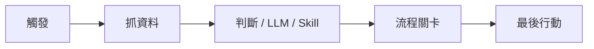

# Daodao Workflow 文件入口

這個資料夾整理 daodao Workflow / AI Service Management 的產品規劃、應用場景、學習旅程、架構與資料庫設計。文件依讀者分成兩條主線：

| 讀者 | 先讀 | 用途 |
|---|---|---|
| PM / 產品 / 營運 | [pm-guide.md](./pm-guide.md) | 判斷要做哪些場景、給誰用、優先順序、最後行動與審核規則 |
| 工程 / Tech Lead | [engineering-guide.md](./engineering-guide.md) | 理解系統邊界、模組責任、API、DB、執行流程與實作分期 |

## 核心概念

Workflow 不是單純的「AI prompt 管理」，而是一套可配置的流程引擎：

它支援三類產品需求：

1. **營運自動化**：降低重複工作、做實驗、監控品質、處理例外。
2. **個人學習旅程體驗**：根據使用者階段，推進 onboarding、實踐、打卡、反思、回歸。
3. **學習生態圈**：促進回應、留言、關注、連結、挑戰、複製與社群擴散。

## 建議閱讀順序

### PM / 產品 / 營運

1. [pm-guide.md](./pm-guide.md)
2. [scenario-taxonomy.md](./scenario-taxonomy.md)
3. [application-scenarios.md](./application-scenarios.md)
4. [skill-alignment.md](./skill-alignment.md)

### 工程 / Tech Lead

1. [engineering-guide.md](./engineering-guide.md)
2. [skill-alignment.md](./skill-alignment.md)
3. [architecture-and-flows.md](./architecture-and-flows.md)
4. [database-recording.md](./database-recording.md)

## 細節文件

| 文件 | 內容 |
|---|---|
| [application-scenarios.md](./application-scenarios.md) | 50 個可應用場景、學習旅程、Funnel 分析模型、學習生態圈 Workflow、最後行動目錄、優先級 |
| [scenario-taxonomy.md](./scenario-taxonomy.md) | 三大場景分類：營運、個人旅程、生態圈 |
| [skill-alignment.md](./skill-alignment.md) | 對齊 Claude Agent Skills：Skill bundle、SKILL.md、版本、sandbox runtime |
| [architecture-and-flows.md](./architecture-and-flows.md) | 系統架構、流程圖、node 類型、實作順序 |
| [database-recording.md](./database-recording.md) | 對話、draft、正式 workflow、Skill Registry、run、approval 如何入庫 |

## MVP 建議

第一階段建議不要只做單一事件，而是三類場景各挑一個：

| 類別 | MVP | 驗證能力 |
|---|---|---|
| 營運自動化 | 任務推薦 A/B 測試 | dry-run、eval、prompt 比較 |
| 個人學習旅程體驗 | Onboarding 漏斗 | journey scan、condition、通知、任務推進 |
| 學習生態圈 | 快速反應後留言引導 | social signal、低風險 LLM、互動提升 |
| 橫跨場景 | 完成實踐後鼓勵信 | data-fetch、skill-call 或 llm-call、approval-gate、email output |
