# AI Service Management：可應用場景規劃

本文件整理 `add-ai-service-management` 可支援的實際場景，整合「單一事件 Workflow」、「學習旅程 Workflow」與「學習生態圈 Workflow」三種編排範圍，並把 Funnel 視為 Journey / Ecosystem 中常用的分析與推進模型。重點放在「對話建立 Workflow」、「資料白名單」、「LLM / Skill 生成」、「流程關卡」、「Journey / Ecosystem 狀態」與「輸出審核」如何組合使用。

## 本文件如何閱讀

這份文件不是單純的案例列表，而是把 Workflow 應用分成「判斷框架 → 設計規則 → 實作策略 → 場景池 → 優先級 → 詳細案例」六層。

| 章節 | 回答的問題 | 適合讀者 |
|---|---|---|
| 1. 整體框架 | Workflow 場景可以分成哪些層級？ | PM / Tech Lead |
| 2. Know-how | 這類系統背後有哪些專業概念？ | PM / Product Strategy |
| 3. Output 與風險 | Workflow 最後能做什麼？哪些要審核？ | PM / Engineering |
| 4. 場景選型 | 什麼適合放進 Workflow Engine？什麼不適合？ | PM / Tech Lead |
| 5. 長期狀態 | Journey、Funnel、生態圈狀態要怎麼分期做？ | Engineering / Tech Lead |
| 6-8. 場景池總覽 | 單一事件、Journey、生態圈各有哪些候選？ | PM / 營運 |
| 9. 詳細場景 | 單一事件核心場景的資料、流程、關卡、輸出怎麼設計？ | PM / Engineering |
| 10-12. MVP 與優先級 | 第一批應該驗證什麼？怎麼用對話建立？場景先後順序是什麼？ | PM / 營運 |
| 13. Journey 詳細場景 | Journey 如何用 Funnel 方式拆階段、找卡點與設計介入？ | PM / Product Strategy |
| 14. 附錄 | 從其他產品文件延伸出的 50 個候選場景 | PM / 營運 |

閱讀順序建議：

1. 要做產品判斷：先看第 1、4、6-8、12 章。
2. 要做技術設計：先看第 3、5、9-11 章。
3. 要找可用場景：先看第 6-8 章，再到第 9 或第 13 章找細節。
4. 要避免過度自動化：先看第 2、3、4 章的風險與審核原則。

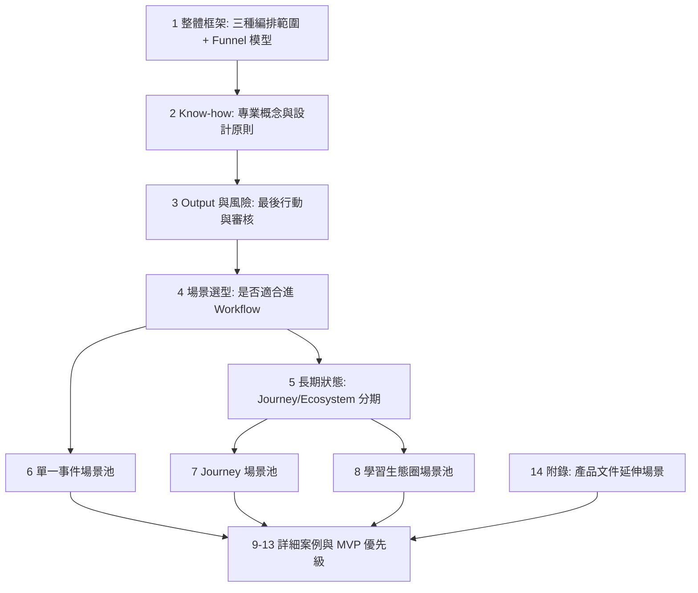

## 1. 整體框架：Workflow 編排範圍與 Funnel 模型

| 編排範圍 | 問題形式 | 例子 | 適合能力 |
|---|---|---|---|
| 單一事件 Workflow | 當 X 發生時，要做什麼？ | 完成實踐後寄鼓勵信 | trigger + nodes + output |
| 學習旅程 Workflow | 使用者目前處於哪個學習狀態？應該被怎麼陪伴？ | 從冷啟動、開始、持續、完成到分享 | journey state + stage transitions |
| 學習生態圈 Workflow | 多個使用者、內容、挑戰或關係如何互相推進？ | 留言引導、Buddy 推薦、挑戰擴散、實踐複製鏈 | graph / cohort signals + trust rules + multi-party output |

Funnel 不是獨立於 Journey 的第四種編排範圍，而是一種分析與推進模型：把 Journey 或 Ecosystem 的目標拆成階段，觀察使用者、內容、關係或挑戰卡在哪一關，再決定介入方式。

| 模型 | 用途 | 可套用範圍 | 例子 |
|---|---|---|---|
| Funnel | 拆階段、看轉換、找卡點 | Journey / Ecosystem | onboarding funnel、推薦到實踐轉換、挑戰參與漏斗 |
| Journey State | 追蹤長期狀態與階段轉移 | Journey | active、stuck、completed、dropped、paused |
| Ecosystem State | 追蹤多人、多內容、多關係的健康度與流通 | Ecosystem | social graph、copy chain、challenge cohort、trust signals |

單一事件適合驗證 Workflow Engine 的基本能力；學習旅程把多個事件放進單一使用者的一段時間脈絡；學習生態圈則再往外擴一層，處理多人互動、內容流通、社群安全與網絡擴散。它的重點不是單一使用者是否完成下一步，而是「哪個人、內容、實踐或挑戰之間應該被連起來，以及這個連結是否安全、健康、有價值」。

## 2. Know-how：專業名詞與設計概念

這類系統不是單純的 workflow automation，而是把幾個領域的概念放在同一個產品引擎裡：

| 概念 | 用在 daodao 的意思 | 對應設計問題 |
|---|---|---|
| Journey Orchestration | 跨 email、站內、push、任務、推薦等 touchpoints，根據使用者狀態決定下一個最佳動作 | 這個使用者現在應該收到什麼、不要收到什麼、何時應該等一下？ |
| Next Best Action / Next Best Experience | 在多個可能介入中選一個最適合的下一步 | 要寄信、站內提醒、建立草稿、推薦 Buddy，還是暫時不打擾？ |
| Event-driven Workflow | 用事件流觸發流程，而不是只靠人工批次 | `practice.completed`、`reaction.clicked`、`recommendation.disliked` 後要做什麼？ |
| State Machine / Journey State | 把使用者、實踐、挑戰或關係放進明確階段 | active、stuck、completed、dropped、paused 如何轉換？ |
| Learning Analytics | 從學習行為資料產生可行動 insight | 哪些訊號代表卡住、進步、回歸、需要支持？ |
| Adaptive Learning | 根據學習者狀態調整任務、內容、節奏與回饋 | 下一個實踐、probe、反思問題要怎麼個人化？ |
| Community Flywheel / Engagement Loop | 使用者行動帶來內容、互動與新行動，形成循環 | 打卡如何帶來留言，留言如何帶來連結，連結如何帶來持續實踐？ |
| Network Effects | 新使用者、內容或關係會增加其他人的價值 | 更多公開實踐、回答、挑戰參與者如何讓推薦與共鳴更好？ |
| Multi-sided Platform | 平台同時服務不同角色與互動面 | 學習者、創作者、Buddy、挑戰參與者、營運方的利益如何平衡？ |
| Trust & Safety | 管理社交、內容、隱私、騷擾與風險輸出 | 哪些內容要擋、審、降權、隱藏或建立工單？ |
| Human-in-the-loop | 自動流程中保留人工審核、修正、評分 | 哪些 LLM 文案、標籤、推薦、對外輸出不能直接自動化？ |
| Experimentation / Lift Measurement | 用 A/B、holdout、cohort 比較介入是否有效 | 這個提醒真的提高 activation，還是只是打擾？ |

可以延伸參考的相鄰概念：

| 概念 | 用在 daodao 的意思 | 對應設計問題 |
|---|---|---|
| Customer Data Platform / Unified Profile | 把使用者 profile、行為、偏好、通知紀錄、社交互動整理成可決策的統一視圖 | Workflow 判斷下一步時，資料來源是不是一致、即時、可追溯？ |
| Real-time Personalization | 根據最新事件與上下文即時調整內容、時機、渠道 | 使用者剛完成打卡、剛 dislike 推薦、剛回訪時，要不要立刻改變體驗？ |
| Decisioning Engine | 將規則、模型、偏好、風險、頻率限制組合成決策層 | 多個 workflow 同時想觸發時，誰優先？誰被 suppress？ |
| Suppression / Frequency Capping | 控制訊息頻率與互斥條件，避免過度打擾 | 一週最多幾封？剛收到召回信的人是否停止其他提醒？ |
| Lifecycle Stage | 把使用者分成 activation、engagement、retention、reactivation 等生命週期階段 | 不同階段的目標、訊息、推薦與指標是否不同？ |
| Early Warning System | 及早偵測可能流失、卡住、低品質或高風險狀態 | 哪些訊號需要早期介入，而不是等到使用者完全沉睡？ |
| Intervention Design | 把介入設計成可測量、可回收、可調整的產品動作 | 一次提醒、任務草稿、Buddy 推薦、人工關懷，哪個才是合適介入？ |
| Scaffolding | 提供低壓、漸進式支架，降低空白頁與行動門檻 | 留言開頭、承諾宣言、反思問題、第一個實踐草稿要怎麼輔助？ |
| Self-regulated Learning | 支持使用者設定目標、監控進度、反思與調整策略 | Workflow 是在推任務，還是在幫使用者建立自我調節能力？ |
| Social Graph | 把人、人與實踐、人與挑戰、人與內容的關係建模 | Buddy 推薦、共鳴推薦、連結請求、傳播鏈要看哪些關係？ |
| Reputation / Trust Signals | 用互動品質、檢舉、完成率、可見性與歷史行為衡量可信度 | 哪些內容值得擴散？哪些連結請求或留言需要審核？ |
| Moderation Queue | 把需要人工處理的內容、關係或操作集中成審核佇列 | Trust & Safety 不應散落在各 workflow，而要能分流、分級、追蹤處理結果。 |
| Incrementality / Holdout | 用保留組或增量測量確認 workflow 真的造成效果 | 轉換率變好是因為介入有效，還是本來這群使用者就會回來？ |
| Cohort Analysis | 按註冊時間、來源、persona、行為階段追蹤結果 | 哪些 cohort 需要不同 onboarding、召回或推薦策略？ |
| North Star Metric / Input Metrics | 把最終價值指標拆成可被 workflow 影響的前置指標 | daodao 要優先推 completed practices、meaningful interactions，還是 learning assets？ |

### 2.1 可以參考的四個專業脈絡

這些概念可以分成四組，不需要全部照搬，但可以幫助 daodao 決定 workflow engine 應該長成什麼樣子。

| 脈絡 | 可借用的能力 | daodao 對應位置 |
|---|---|---|
| Customer Journey Orchestration / Lifecycle Marketing | journey builder、cross-channel touchpoints、real-time trigger、suppression、frequency capping、A/B test | onboarding email、週報、召回、訂閱提示、push / in-app notification |
| Next Best Action / Decisioning | 統一決策層、propensity score、channel model、value / risk model、priority arbitration | 多個 workflow 同時觸發時，決定要提醒、推薦、建立草稿、送審，或什麼都不做 |
| Learning Analytics / Adaptive Learning | learning signals、early warning、intervention、scaffolding、self-regulated learning support | 打卡下降、反思不足、第一次實踐卡住、人物誌探針、學習 DNA、低壓引導 |
| Community / Ecosystem / Trust & Safety | social graph、engagement loop、reputation signals、moderation queue、network effects、community health | 留言引導、Buddy 推薦、共鳴推薦、挑戰擴散、實踐複製鏈、隱私與連結風險 |

### 2.2 daodao 採用原則

daodao 不應把這套系統做成純行銷 automation。比較適合的定位是：

> 以學習進展為核心的 Journey / Ecosystem Decisioning Layer。

也就是說，Workflow Engine 不只負責「事件發生後執行動作」，還要逐步負責：

1. 讀取使用者、實踐、內容、關係、挑戰的狀態。
2. 判斷目前屬於哪個 journey / ecosystem stage。
3. 決定是否需要介入，以及介入方式。
4. 控制訊息頻率、風險、審核與不可逆 output。
5. 記錄結果，供後續 eval、cohort analysis、A/B test 使用。

### 2.3 建議落地成的系統能力

| 能力 | 說明 | 不做會怎樣 |
|---|---|---|
| Unified signal registry | 定義 workflow 可以讀哪些事件、欄位與衍生訊號 | 每個 workflow 自己抓資料，資料來源失控 |
| Decision priority / suppression | 多個 workflow 同時命中時，決定優先級、互斥與冷卻時間 | 使用者被重複提醒，造成打擾與退訂 |
| Journey / ecosystem state | 記錄 user、practice、challenge、connection、recommendation 的階段狀態 | 只能做單點事件，無法追蹤卡點與轉換率 |
| Intervention catalog | 把 email、站內提醒、任務草稿、Buddy 推薦、人工關懷等介入標準化 | 每個場景都重新定義 output，難以比較效果 |
| Trust & safety gate | 對社交、隱私、敏感推論、對外發送建立審核與分級規則 | 生態圈 workflow 容易把錯誤推薦或高風險內容放大 |
| Experiment / holdout support | 支援 A/B、holdout、cohort analysis、eval 標記 | 很難知道 workflow 是否真的造成提升 |
| Outcome feedback loop | 把 open、click、完成、打卡、留言、複製、退訂、檢舉回寫成訊號 | workflow 只能發出動作，不能學習哪種介入有效 |

### 2.4 不建議第一階段追求的能力

- 不要一開始就做全自動 Next Best Action。Phase 1 應先讓 PM / admin 能看見命中原因與手動審核。
- 不要讓 LLM 直接決定高風險 output。LLM 可以生成候選、理由與信心分數，但最後要經過 condition / schema / gate。
- 不要把所有 journey 都建成長期狀態表。只有需要長期追蹤、跨 workflow 協作、轉換率分析的旅程才需要正式 state。
- 不要只優化 engagement。學習產品要同時看 learning progress、reflection quality、meaningful interaction、trust signals。

設計 know-how：

- 把「觸發」和「決策」分開：事件只代表有事發生，不代表一定要介入。
- 把「個人狀態」和「生態狀態」分開：個人 journey 看單一使用者；生態 workflow 看人、內容、關係、挑戰、推薦之間的互動。
- 每個介入都要有 suppress / cooldown：避免同一使用者被 email、push、站內訊息重複打擾。
- LLM 不直接做高風險寫回：先產生 structured output，再經 schema、condition、approval gate。
- 生態圈 workflow 要同時看價值與風險：例如 Buddy 推薦不只看 match，也要看互動歷史、隱私設定與騷擾風險。
- 指標不要只看點擊：journey 看 activation / retention / completion；生態圈看 meaningful interaction、copy chain、reciprocity、report rate、mute / unsubscribe。

## 3. Output 與風險：最後行動

Workflow 最後通常會落到一個 `output` node，或先經過 `approval-gate` 再執行 `output`。以下是目前規劃中可支援或適合預留的最後行動類型。

| 最後行動 | 對應 output target | 常見用途 | 是否建議關卡 |
|---|---|---|---|
| 寄 Email | `notification` / `email` | onboarding email、鼓勵信、週報、召回信、互動摘要 | 是，對外寄送建議先審核或抽樣審核 |
| 站內通知 | `notification` / `in_app` | 鈴鐺通知、任務提醒、互動提醒、挑戰提醒 | 視內容風險；純系統事件可免審 |
| Push 通知 | `notification` / `push` | 即時提醒、打卡提醒、連結請求 | 是，批量或 LLM 文案建議審核 |
| 寫回 DB | `db` | 建立推薦、更新狀態、保存 AI 摘要、寫入標籤 | 是，影響核心資料時要審核 |
| 建立草稿 | `db` | 公告草稿、email 草稿、週報草稿、匯出草稿 | 否，草稿本身可作為審核前狀態 |
| 發放 Badge | `db` | early user badge、挑戰達標 badge、人物誌完成 badge | 視規則；規則明確可免審 |
| 更新使用者標籤 | `db` | 高風險標記、活躍分群、偏好標籤、ESCO 技能標籤 | 是，尤其是風險/心理/能力推論 |
| 建立任務 / 實踐 | `db` | onboarding task、個人化實踐草稿、下一步任務 | 是，若直接進入用戶工作區 |
| 建立推薦卡 | `db` | 探索相關主題、下一步推薦、Buddy 推薦 | 可選；低風險可免審 |
| 更新通知偏好 | `db` | email 退訂、通知類型開關 | 否，使用者明確操作可直接寫入 |
| 建立審核工單 | `db` | 留言安全審核、隱私異常、AI 任務失敗處理 | 否，工單就是審核入口 |
| 呼叫外部 API | `webhook` / `tool-call` | CRM、Email service、Slack、Discord、文件生成服務 | 是，尤其是對外發送或不可逆操作 |
| 發 Slack / Discord | `webhook` / `notification` | admin alert、營運摘要、錯誤告警 | 可選；告警通常可免審 |
| 產生匯出檔案 | `tool-call` / `db` | Markdown/PDF 匯出、分享圖 payload | 是，若會公開或寄出 |
| 更新搜尋 / 向量索引 | `tool-call` | ESCO 標籤、人物誌摘要、實踐摘要入索引 | 可選；敏感資料入索引前建議審核 |
| 執行 retry / cancel | `tool-call` | AI backend 任務重試、取消任務 | 是，避免重複消耗資源 |
| 不做寫回，只保存 run | 無 output 或 dry-run | A/B 測試、prompt 比較、資料分析 | 否 |

### 3.1 最後行動的設計規則

- 對外發送：Email、Push、Webhook、Slack/Discord 若內容由 LLM 生成，預設應有 `approval-gate` 或抽樣審核。
- 寫入核心資料：更新用戶狀態、標籤、推薦、任務、badge 前，至少要有 schema 驗證；高風險欄位加人工關卡。
- 使用者明確操作：退訂、手動套用草稿、確認匯出等可直接寫入，但仍需留下 run / node_run 紀錄。
- 實驗型流程：A/B 測試與 dry-run 不應寫回業務資料，只保存 `workflow_runs` / `workflow_node_runs`。
- AI 生成內容：若後續會被 output 使用，`llm-call` 應設定 `output_schema`，例如 `{ subject, body }`、`{ label, reason, confidence }`。

## 4. 場景選型：什麼適合進 Workflow

適合放進 Workflow Engine 的場景通常符合以下模式：

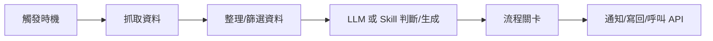

優先選擇：

- 需要營運快速調整規則、prompt、資料欄位或通知內容。
- 需要先 dry-run / A/B test，再決定是否上線。
- 需要人工審核關卡，避免 AI 輸出直接影響用戶或生產資料。
- 有明確 trigger、資料來源、輸出目標。

不適合第一階段放進 Workflow 的：

- 低延遲、強交易一致性的核心路徑。
- 需要複雜長期狀態機且每一步都有大量人工例外處理。
- 資料欄位尚未定義白名單，或 output 風險無法被 approval gate 控制。

## 5. 長期狀態：Journey / Ecosystem 實作策略

Funnel 可以先作為 Journey / Ecosystem 的分析模型導入，不需要一開始就建立完整狀態系統。

學習生態圈 Workflow 與 Journey 共用「狀態追蹤」思路，但狀態主體不一定是單一 `user_id`，也可能是 `practice_id`、`challenge_id`、`recommendation_id`、`connection_id` 或一段互動關係。Phase 1 可先用 scheduled scan / event workflow 計算 cohort、graph、interaction signals；Phase 2 再視需要新增關係狀態表或把狀態落在既有 social / recommendation / challenge tables。

### 5.1 Phase 1：不用新表，先用 scheduled scan 模擬

Phase 1 可以先把 Journey 視為一種 workflow pattern：

1. 用 `scheduled` 或 manual workflow 定期掃描使用者狀態。
2. `data-fetch` 抓取使用者行為資料。
3. `condition` 判斷使用者卡在哪一階段。
4. `llm-call` / `skill-call` 生成介入內容。
5. `approval-gate` 審核高風險內容。
6. `output` 發通知、建立任務、更新標籤或保存草稿。

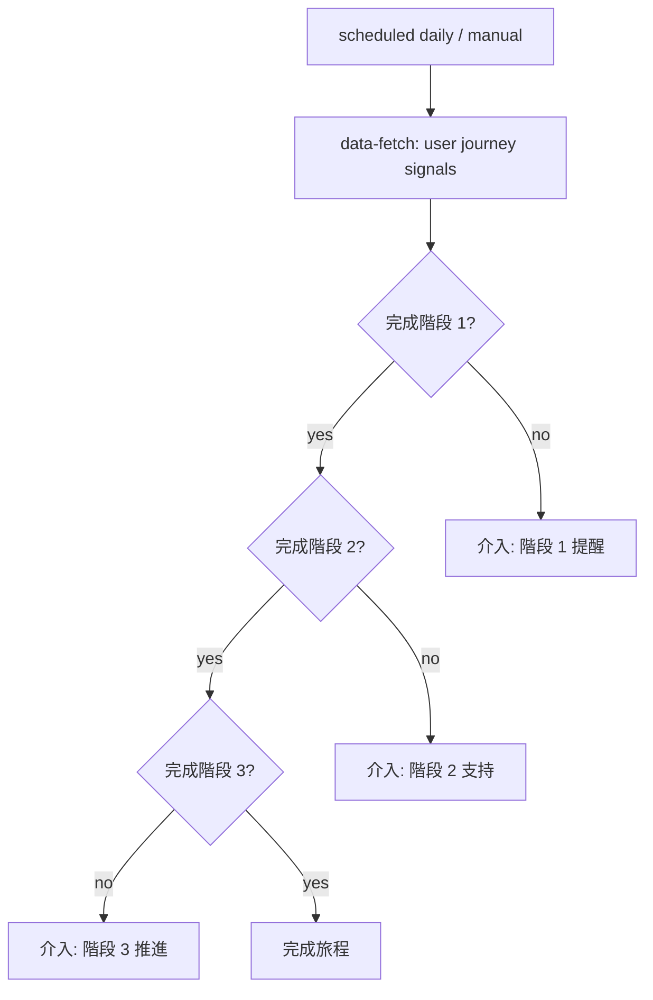

### 5.2 Phase 2：加入 Journey 狀態表

當要做長期追蹤、多人分群、轉換率分析與跨 workflow 協作時，建議新增：

```sql
workflow_journeys
- id
- name
- description
- is_active
- created_at
- updated_at

workflow_journey_stages
- id
- journey_id
- key
- label
- order_index
- entry_condition JSONB
- success_condition JSONB
- stuck_condition JSONB
- created_at

workflow_journey_members
- id
- journey_id
- user_id
- current_stage_id
- status: active | completed | dropped | paused
- entered_at
- stage_entered_at
- completed_at
- metadata JSONB

workflow_journey_events
- id
- journey_member_id
- event_name
- payload JSONB
- occurred_at

workflow_journey_interventions
- id
- journey_member_id
- stage_id
- workflow_run_id
- intervention_type
- status
- created_at
```

如果文件閱讀器支援 Mermaid，也可以用 ER diagram 表示關係：

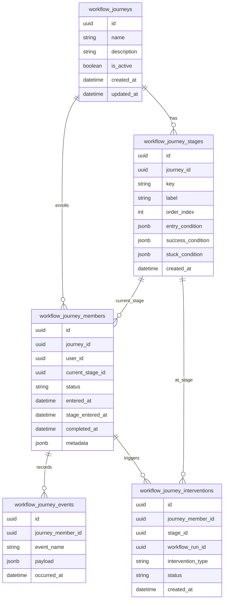

這樣可以回答：

- 每個使用者目前在哪個學習階段？
- 卡住多久了？
- 觸發過哪些介入？
- 哪些介入提高了下一階段轉換率？

### 5.3 Phase 3：Adaptive journey orchestration

基於 eval / conversion，自動選擇下一個介入策略：

- 哪種提醒對哪類 persona 有效。
- 哪個 prompt 轉換率高。
- 哪個階段需要人工作業。
- 哪些使用者不應再被打擾。

## 6. 場景池總覽：單一事件核心場景

| # | 場景 | 主要價值 | Trigger | 關卡 | Phase 建議 |
|---|---|---|---|---|---|
| 1 | 完成實踐後寄個人化鼓勵信 | 提升完成後回饋品質 | `practice.completed` | 信件審核 | Phase 1 manual 模擬，Phase 2 event |
| 2 | 實踐提交品質檢查 | 降低低品質內容進入系統 | `practice.submitted` | 人工複核可疑內容 | Phase 1 manual / Phase 2 event |
| 3 | 新用戶 onboarding 路線 | 個人化新手任務 | `user.created` | 路線審核 | Phase 1 manual |
| 4 | 課程完成後推薦下一步 | 增加持續學習 | `course.completed` | 推薦審核或自動門檻 | Phase 1 manual / Phase 2 event |
| 5 | 沉睡用戶召回 | 降低流失 | scheduled | 發送前審核 | Phase 2 scheduled |
| 6 | 每週學習週報 | 提升回訪與自我覺察 | scheduled | 抽樣審核 | Phase 2 scheduled |
| 7 | 高風險用戶標記 | 讓營運及早介入 | scheduled / event | 標記前審核 | Phase 1 manual |
| 8 | 社群公告草稿生成 | 降低公告撰寫成本 | manual | 發布審核 | Phase 1 |
| 9 | 任務推薦 A/B 測試 | 找出更好 prompt/策略 | manual dry-run | 無或結果評分 | Phase 1 |
| 10 | AI 回覆安全檢查 | 降低不當內容風險 | `message.created` | 高風險人工審核 | Phase 2 event |
| 11 | 企業/合作方週報 | 自動整理成外部報告 | scheduled | 對外寄送審核 | Phase 2 scheduled |
| 12 | 內部營運資料摘要 | 加速營運決策 | manual / scheduled | 可選 | Phase 1 manual |

## 7. 場景池總覽：學習旅程 Workflow

以下場景都可以用 Funnel 方式拆階段、看轉換與找卡點，但它們的編排範圍仍然是「學習旅程」。

| # | Journey | 主要價值 | Trigger | 關卡 | Phase 建議 |
|---|---|---|---|---|---|
| J1 | 新用戶 Onboarding 漏斗 | 註冊後 3 天內建立第一個實踐 | scheduled daily / `user.created` | AI 草稿與 email 模板審核 | Phase 1 scan，Phase 2 journey state |
| J2 | 第一次實踐啟動漏斗 | 從建立實踐推進到第一次打卡與連續打卡 | `practice.created` / scheduled | 低風險可免審 | Phase 1 scan |
| J3 | 主題實踐完成與資產化漏斗 | 把完成內容轉成可回顧、可分享資產 | `practice.completed` / progress event | 使用者確認匯出內容 | Phase 1 / Phase 2 |
| J4 | 人物誌顯影漏斗 | 從碎片回答形成學習 DNA | scheduled / dashboard opened | 敏感推論審核 | Phase 1 scan |
| J5 | 社交互動深化漏斗 | 把低摩擦互動導向 Buddy 關係 | social event / scheduled | 連結風險審核 | Phase 2 |
| J6 | 共同挑戰參與漏斗 | 從看見挑戰到報名、打卡、結營 | challenge lifecycle / scheduled | badge 規則可自動，文案抽審 | Phase 1 / Phase 2 |
| J7 | 推薦到實踐轉換漏斗 | 追蹤推薦是否真的轉成實踐 | `recommendation.shown` | 低風險可免審 | Phase 2 |
| J8 | 留存與重啟漏斗 | 活躍下降、沉睡、召回與重啟 | scheduled daily | 召回文案抽審 | Phase 2 |
| J9 | 學習成果外化漏斗 | 把長期學習紀錄轉成成果頁或分享內容 | scheduled / `practice.completed` | 使用者確認與公開前審核 | Phase 2 |
| J10 | 訂閱轉換漏斗 | 在高價值時刻提示升級 | premium moment event | 升級文案審核 | Phase 2 |
| J11 | Admin 維運漏斗 | 把 AI backend 異常整理成 admin 工作流 | scheduled hourly / failure event | retry / cancel 前審核 | Phase 1 / Phase 2 |

## 8. 場景池總覽：學習生態圈 Workflow

| # | Workflow | 主要價值 | Trigger | 關卡 | Phase 建議 |
|---|---|---|---|---|---|
| E1 | 快速反應後留言引導 | 把 reaction 轉成更高品質留言 | `reaction.clicked` | 低風險可免審 | Phase 1 |
| E2 | 連結請求原因輔助與風險篩查 | 降低社交空白頁與騷擾風險 | `connect.request.started/submitted` | 中高風險審核 | Phase 1 / Phase 2 |
| E3 | Buddy 請求時機偵測 | 把相似目標與互動關係轉成問責夥伴 | scheduled / `user.requests_buddy` | 使用者確認 | Phase 2 |
| E4 | 共同挑戰熱度與重啟 | 促進挑戰參與、達標、分享與下一期回流 | challenge lifecycle / scheduled | 文案抽審，badge 規則自動 | Phase 1 / Phase 2 |
| E5 | 推薦到實踐轉換 | 讓推薦不只曝光，而是轉成實踐與打卡 | `recommendation.shown` / feedback event | 低風險可免審 | Phase 2 |
| E6 | 優質可複製實踐偵測 | 找出值得精選、擴散、複製的學習路徑 | scheduled daily | 運營精選 | Phase 1 |
| E7 | 學習路徑傳播鏈分析 | 追蹤複製與再複製造成的社群影響力 | scheduled weekly | 可選 | Phase 2 |
| E8 | 學習孤獨感共鳴推薦 | 推薦相似掙扎與公開回答，促進共鳴 | `persona.answer.created` | 敏感主題審核 | Phase 2 |

---

## 9. 詳細場景：單一事件核心場景

以下 12 個場景用來驗證 Workflow Engine 的基本能力：trigger、data-fetch、condition、LLM / skill、approval gate、output、dry-run 與 eval。它們多數可以先用 manual 或 event trigger 做 MVP，不需要完整 Journey 狀態表。

### 1. 完成實踐後寄個人化鼓勵信

**目標**：用戶完成實踐後，寄出一封個人化鼓勵信，內容由 LLM 根據用戶資料與實踐內容生成。

**適合用對話建立的描述**：

> 當用戶完成實踐後，抓他的姓名、email、學習目標、本次實踐標題與完成內容，請 LLM 產生一封溫暖的鼓勵信，先給營運審核，核准後寄出。

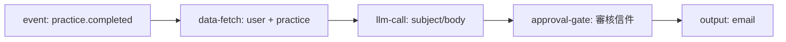

**資料欄位**：

- `user.name`
- `user.email`
- `user.learning_goals`
- `practice.title`
- `practice.completed_at`
- `practice.reflection`

**流程關卡**：

- `approval-gate` 顯示收件人、subject、body。
- Admin 可調整 subject/body。
- 核准後才進入 email output。

**輸出**：

- Email notification。
- 可把寄送紀錄寫入 `workflow_runs` / `workflow_node_runs`。

**Phase 建議**：

- Phase 1：用 manual trigger 模擬單一用戶。
- Phase 2：接 `practice.completed` event trigger。

---

### 2. 實踐提交品質檢查

**目標**：用戶提交實踐內容後，先由 LLM 判斷是否過短、離題、疑似複製貼上或缺少反思，再決定是否通過、退回補充或送人工審核。

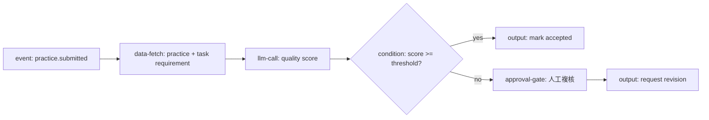

**資料欄位**：

- `practice.content`
- `practice.reflection`
- `task.title`
- `task.requirements`
- `user.learning_goals`

**流程關卡**：

- 低分或不確定結果進 `approval-gate`。
- Admin 可選擇通過、退回補充、標記問題。

**輸出**：

- 寫回實踐審核狀態。
- 通知用戶補充內容。

**Phase 建議**：

- Phase 1：manual dry-run 檢查歷史提交。
- Phase 2：event trigger 自動跑。

---

### 3. 新用戶 Onboarding 路線

**目標**：新用戶註冊或完成問卷後，根據目標與背景生成初始學習路線與前幾個任務。

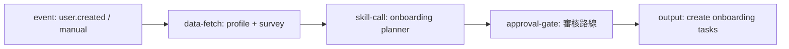

**資料欄位**：

- `user.name`
- `user.bio`
- `user.learning_goals`
- `survey.answers`
- `activity.saved_resources`

**流程關卡**：

- 營運審核「初始任務是否合理」。
- 可調整任務標題、順序、說明。

**輸出**：

- 寫入 onboarding tasks。
- 發歡迎信或站內通知。

**Phase 建議**：

- Phase 1 先 manual，由 admin 對單一新用戶生成。

---

### 4. 課程完成後推薦下一步

**目標**：用戶完成課程後，自動推薦下一個任務或資源，並附上推薦理由。

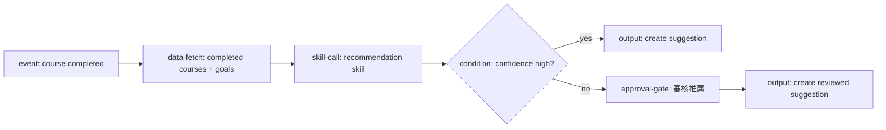

**資料欄位**：

- `user.learning_goals`
- `activity.completed_courses`
- `activity.saved_resources`
- `activity.viewed_resources`

**流程關卡**：

- 高信心可自動建立建議。
- 低信心進人工關卡。

**輸出**：

- `user_ai_suggestions`
- 站內通知。

**Phase 建議**：

- Phase 1：manual + A/B 測不同推薦 prompt。
- Phase 2：event trigger。

---

### 5. 沉睡用戶召回

**目標**：每天找出一段時間未回訪但曾有明確學習目標的用戶，產生低打擾、個人化召回訊息。

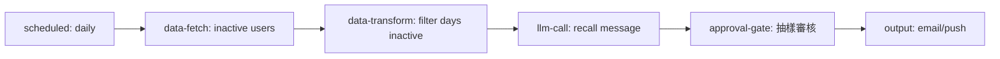

**資料欄位**：

- `user.name`
- `user.email`
- `user.learning_goals`
- `activity.last_seen_at`
- `activity.saved_resources`

**流程關卡**：

- 第一版建議全部審核。
- 穩定後可只抽樣審核，或對高風險文案審核。

**輸出**：

- Email / push notification。
- 寫入 campaign log。

**Phase 建議**：

- Phase 2 scheduled trigger。
- Phase 1 可 manual 跑小名單 dry-run。

---

### 6. 每週學習週報

**目標**：每週整理用戶學習活動，生成摘要、亮點與下週建議。

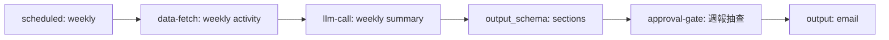

**資料欄位**：

- `activity.viewed_resources`
- `activity.saved_resources`
- `activity.completed_courses`
- `practice.completed_at`
- `practice.reflection`

**流程關卡**：

- 初期人工抽查。
- 若 LLM 輸出不符合 schema，直接 failed，不進 output。

**輸出**：

- 週報 email。
- 可回寫週報 archive。

**Phase 建議**：

- Phase 2 scheduled。

---

### 7. 高風險用戶標記

**目標**：根據用戶活動下降、任務失敗、負面反思等訊號，標記需要營運介入的用戶。

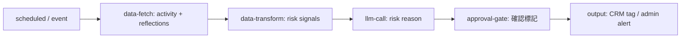

**資料欄位**：

- `activity.last_seen_at`
- `activity.completed_courses`
- `practice.reflection`
- `user.learning_goals`

**流程關卡**：

- 必須人工確認，避免錯誤標記。
- Admin 可選 tag、備註、下一步動作。

**輸出**：

- CRM tag。
- Slack / admin notification。

**Phase 建議**：

- Phase 1 manual 跑出候選名單。

---

### 8. 社群公告草稿生成

**目標**：根據近期活動、熱門課程、平台更新產生公告草稿，供營運修改後發布。

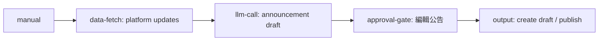

**資料欄位**：

- `platform.recent_updates`
- `activity.popular_resources`
- `course.new_courses`

**流程關卡**：

- Admin 編輯公告標題、內文、CTA。
- 預設只建立草稿，不直接發布。

**輸出**：

- 公告草稿。
- 若要發布，需另設 output approval。

**Phase 建議**：

- Phase 1 很適合，因為 manual trigger 即可。

---

### 9. 任務推薦 A/B 測試

**目標**：比較兩種推薦策略或 prompt，找出更適合用戶的下一步建議。

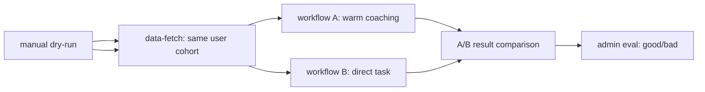

**資料欄位**：

- `user.learning_goals`
- `activity.completed_courses`
- `activity.saved_resources`

**流程關卡**：

- 通常不需要 approval gate，因為是 dry-run。
- 結果頁需要 admin eval。

**輸出**：

- 不寫回業務資料。
- 保存 A/B runs 與 eval。

**Phase 建議**：

- Phase 1。

---

### 10. AI 回覆安全檢查

**目標**：當系統要發送 AI 生成內容前，先檢查是否有不當建議、敏感資訊、過度承諾或風險語句。

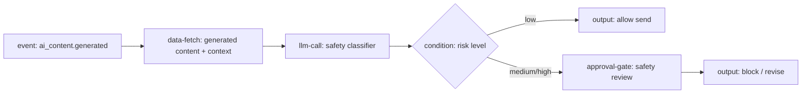

**資料欄位**：

- `generated_content.text`
- `generated_content.target_user`
- `workflow_run.context`

**流程關卡**：

- 中高風險內容送人工審核。
- Admin 可選擇放行、修改、封鎖。

**輸出**：

- allow/block/revise decision。
- 寫入 safety log。

**Phase 建議**：

- Phase 2 event trigger。

---

### 11. 企業 / 合作方週報

**目標**：針對合作方整理學員活動摘要、成效與待關注事項，產生對外報告草稿。

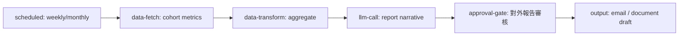

**資料欄位**：

- cohort 完成率
- 活躍度
- 熱門資源
- 低活躍用戶比例

**流程關卡**：

- 必須人工審核，因為是對外文件。
- Admin 可刪除敏感資訊。

**輸出**：

- Email。
- 報告草稿。

**Phase 建議**：

- Phase 2 scheduled。
- Phase 1 可 manual 生成單次報告。

---

### 12. 內部營運資料摘要

**目標**：營運手動選定時間區間，快速產生平台狀況摘要與可行動建議。

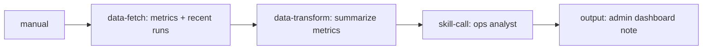

**資料欄位**：

- 活躍用戶數
- 完成實踐數
- A/B 測試結果
- workflow run 成本與錯誤率

**流程關卡**：

- 可選。若只是內部摘要，不一定需要 approval。

**輸出**：

- Admin dashboard note。
- Slack / internal notification。

**Phase 建議**：

- Phase 1 manual。

---

## 10. MVP 組合：第一批驗證什麼

第一批建議不要一次做太多，選能最大化驗證架構的三個：

### MVP 1：完成實踐後寄個人化鼓勵信

驗證能力：

- 對話建立 Workflow。
- data-fetch 白名單。
- llm-call + output_schema。
- approval-gate。
- email output。

### MVP 2：實踐提交品質檢查

驗證能力：

- LLM 分類與 JSON schema。
- condition 分支。
- 人工複核關卡。
- 寫回審核狀態。

### MVP 3：任務推薦 A/B 測試

驗證能力：

- dry-run。
- A/B run 關聯。
- node output 對比。
- eval 標記。

這三個合起來可以覆蓋 Workflow Engine 的核心風險：資料、LLM 格式、分支、人工關卡、不可逆 output、A/B 與評估。

## 11. 對話建立範例 Prompt

### 建立鼓勵信 Workflow

```text
當用戶完成實踐後，請抓取用戶姓名、email、學習目標、本次實踐標題和反思內容。
用 LLM 產生一封溫暖但不浮誇的鼓勵信，輸出 subject 和 body。
寄出前需要營運審核，可以修改 subject/body。
審核通過後寄 email。
```

### 建立品質檢查 Workflow

```text
當用戶提交實踐內容後，請檢查內容是否符合任務要求。
如果品質分數高於 0.8 就自動通過；如果低於 0.8，送給人工審核。
人工可以選擇通過、退回補充或標記問題。
```

### 建立推薦 A/B 測試

```text
我想比較兩種下一步任務推薦方式。
A 組用溫暖教練語氣，B 組用直接行動導向語氣。
請用同一批用戶資料 dry-run，不要寫回資料，讓我比較每個節點輸出。
```

## 12. 優先順序建議

| 優先級 | 場景 | 原因 |
|---|---|---|
| P0 | 完成實踐後寄鼓勵信 | 最符合目前需求，能驗證對話建立與人工關卡 |
| P0 | 實踐提交品質檢查 | 能驗證 condition、LLM schema、審核流 |
| P1 | 任務推薦 A/B 測試 | 能驗證實驗與 eval |
| P1 | 社群公告草稿生成 | 低風險、manual 即可用 |
| P2 | 沉睡用戶召回 | 需要 scheduled trigger 與發送策略 |
| P2 | 每週週報 | 需要 scheduled trigger 與批量發送 |
| P2 | AI 回覆安全檢查 | 需要 event trigger 與更完整安全策略 |

---

## 13. 詳細場景：學習旅程 Workflow

以下是跨事件、跨時間的學習旅程場景。它們不取代前面的單點 workflow，而是把多個單點事件串成「進展追蹤 + Funnel 卡點分析 + 介入成效評估」。

### J1. 新用戶 Onboarding 漏斗

來源：`docs/product/onboarding/*`

**目標**：讓新用戶在註冊後 3 天內建立第一個主題實踐，並完成至少一個人物誌回答。

**階段**：註冊完成 → 完成帳號設定 → 完成測驗或人物誌探針 → 建立第一個主題實踐 → 第一次打卡 → 在靈感區留言或互動 → 完成 onboarding badge。

**卡住時的最後行動**：

- 寄 onboarding email。
- 站內提示下一步。
- 建立第一個實踐草稿。
- 發 early user badge。

**關卡**：AI 產生的實踐草稿由使用者確認；email 序列文案由 admin 先審核模板。

### J2. 第一次實踐啟動漏斗

**目標**：使用者建立實踐後，不只停在草稿，而是進入持續打卡。

**階段**：建立實踐 → 設定開始日 → 第一次打卡 → 連續 3 次打卡 → 第一次反思 → 完成一個週期。

**最後行動**：站內通知、email、daily probe、建立反思草稿。

### J3. 主題實踐完成與資產化漏斗

來源：`docs/product/practice/export-frd.md`

**目標**：使用者完成實踐後，將內容轉成可回顧、可分享、可再次複製的學習資產。

**階段**：實踐進度達 80% → 實踐完成 → 補完覆盤 → 生成匯出草稿 → 使用者確認 → 匯出 Markdown/PDF → 分享或複製下一輪。

**最後行動**：建立匯出草稿、產生 PDF/Markdown、產生分享圖 payload。

### J4. 人物誌顯影漏斗

來源：`docs/product/persona/人物誌 PRD.md`

**目標**：讓使用者透過碎片化回答，逐步形成學習 DNA，並用於推薦與共鳴。

**階段**：看見 Daily Probe → 回答第一題 → 回答 3 題 → 解鎖對等揭露 → 形成初版學習 DNA → 用於推薦 / AI Mentor → 週期性更新 DNA。

**關卡**：心理特質摘要、敏感推論、公開展示前需要審核策略。

### J5. 社交互動深化漏斗

來源：`docs/product/social/*`

**目標**：把低摩擦互動逐步引導到高品質連結與 Buddy 關係。

**階段**：看見打卡 / 實踐 → 快速反應 → 留言 → 關注人或實踐 → 多次互動達門檻 → 送出連結請求 → 成為 Buddy / 問責夥伴。

**最後行動**：站內提示、連結原因草稿、連結請求、Buddy 推薦。

### J6. 共同挑戰參與漏斗

來源：`docs/product/challenge/frd.md`

**目標**：從看見挑戰、報名、打卡，到結營獎勵與下一期重啟。

**階段**：看見挑戰 → 點擊了解 → 填承諾宣言 → 報名成功 → 開始打卡 → 達標 → 結營分享 → 下一期重啟。

**最後行動**：挑戰通知、分享圖、badge、重啟 email。

### J7. 推薦到實踐轉換漏斗

來源：`docs/product/recommend/推薦 PRD.md`

**目標**：不只推薦內容，而是追蹤推薦是否真的轉成實踐。

**階段**：顯示推薦卡 → 使用者看見 Match Reason → 喜歡 / 不喜歡 → 點擊詳情 → 複製或加入實踐 → 第一次打卡 → 完成或回饋推薦品質。

**最後行動**：替補推薦、更新偏好、建立實踐草稿、A/B eval。

### J8. 留存與重啟漏斗

**目標**：從活躍、降頻、沉睡到重啟，根據不同階段提供不同支持。

**階段**：活躍使用 → 打卡頻率下降 → 連續 N 天未回訪 → 收到召回 → 點擊回來 → 重啟舊實踐或複製新實踐 → 恢復第一次打卡。

**最後行動**：週報、召回 email、重啟草稿、站內提示。

### J9. 學習成果外化漏斗

**目標**：把長期學習紀錄轉成可分享、可回顧、可展示的成果。

**階段**：累積足夠 check-ins → 完成實踐 → 補覆盤 → 生成摘要 → 產生匯出檔 → 分享到社群 / 個人頁 → 被複製或被關注。

**最後行動**：匯出、分享圖、公開頁更新、推薦到 Inspire Feed。

### J10. 訂閱轉換漏斗

來源：`docs/product/subscription/*`

**目標**：在使用者已經感受到價值後，再提示升級，而不是打斷核心學習。

**階段**：使用核心功能 → 觸及高價值時刻 → 看見升級提示 → 試用 / 了解方案 → 升級 → 續訂或流失預警。

**關卡**：升級文案需要審核，避免過度銷售。

### J11. Admin 維運漏斗

來源：`docs/product/admin/*`

**目標**：把 AI backend 健康、失敗任務、成本異常，整理成可處理的 admin 工作流。

**階段**：監測服務健康 → 偵測異常 → 分級 → 產生診斷摘要 → Admin 核准 retry / cancel → 記錄處理結果。

**最後行動**：Slack/Discord alert、重試任務、取消任務、建立工單。

### 優先做的三個 Journey

| 優先級 | Journey | 原因 |
|---|---|---|
| P0 | 新用戶 Onboarding 漏斗 | 直接對齊「註冊後 3 天建立第一個實踐」核心目標 |
| P0 | 第一次實踐啟動漏斗 | 補上從建立到第一次打卡、連續打卡的關鍵缺口 |
| P1 | 共同挑戰參與漏斗 | 階段清楚，適合 condition + scheduled + badge output |
| P1 | 推薦到實踐轉換漏斗 | 能把推薦從展示優化到真正轉換 |
| P2 | 留存與重啟漏斗 | 價值高，但需要更精準的通知節奏與打擾控制 |

---

## 14. 附錄：產品文件延伸場景

以下場景參考 `/docs/product` 內的 onboarding、notification、social、challenge、persona、recommend、inspire-feed、copy、practice export 等文件整理。這些不是要一次全部實作，而是作為 Workflow Engine 的應用池，後續可以依產品優先級挑選。

### 13. Onboarding 階梯式 Email 導流

來源：`docs/product/onboarding/Onboarding PRD.md`

**目標**：根據新用戶來源 S1/S2/S3，自動安排不同順序的 onboarding 任務與 email，引導完成第一個主題實踐。

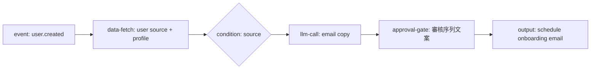

**資料欄位**：`user.source`、`user.email`、`user.onboarding_tasks`、`quiz.latest_result`、`practice.created_count`

**關卡**：第一次上線前審核每個來源的 L0/L1/L2 email 文案。

**價值**：把「不同來源用戶任務順序不同」變成可調整 workflow，而不是硬編碼。

### 14. Onboarding 任務完成偵測與下一步提醒

來源：`docs/product/onboarding/Onboarding FRD.md`

**目標**：使用者完成 Step N 後，自動偵測並推送下一步提醒；完成全部任務後發 badge。

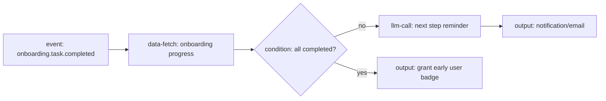

**資料欄位**：`onboarding.progress`、`user.source`、`user.email`、`badge.eligibility`

**關卡**：badge 發放可不審核；email 文案可抽樣審核。

### 15. 人物誌 Daily Probe 自動挑題

來源：`docs/product/persona/人物誌 PRD.md`

**目標**：根據用戶當前行為與未回答題目，挑選最適合的一題人物誌問題。

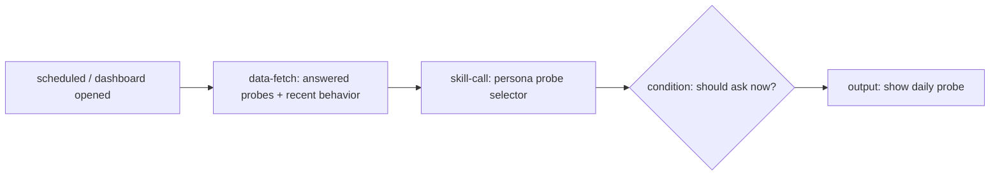

**資料欄位**：`persona.answered_questions`、`activity.recent_actions`、`practice.status`、`user.learning_goals`

**關卡**：新題庫或敏感題型上線前需要 admin 審核。

### 16. 人物誌回答摘要與學習 DNA 更新

來源：`docs/product/persona/人物誌 PRD.md`

**目標**：使用者累積回答後，LLM 將答案整理成「學習 DNA」摘要，供推薦與 AI Mentor 使用。

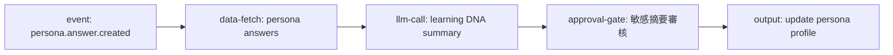

**資料欄位**：`persona.answers`、`user.learning_goals`、`practice.reflections`

**關卡**：若摘要包含心理特質推論，需人工審核或只內部使用。

### 17. 推薦區塊 Match Reason 生成

來源：`docs/product/recommend/推薦 PRD.md`

**目標**：對每張推薦卡產生「為什麼推薦」的可讀理由。

```mermaid
flowchart LR
  T[event: recommendation.generated]
  F[data-fetch: user interests + candidate item]
  L[llm-call: match reason]
  O[output: save recommendation reason]

  T --> F --> L --> O
```

**資料欄位**：`user.learning_goals`、`activity.viewed_resources`、`recommendation.candidate`、`recommendation.tags`

**關卡**：通常不需人工審核，可用 `output_schema` 控制格式。

### 18. 推薦負回饋後的替補推薦

來源：`docs/product/recommend/推薦 PRD.md`

**目標**：用戶點「不喜歡」後，記錄原因，降低相似內容權重並補上一張新卡。

```mermaid
flowchart LR
  T[event: recommendation.disliked]
  F[data-fetch: disliked item + user profile]
  X[data-transform: update negative preference]
  S[skill-call: select replacement]
  O[output: replace recommendation card]

  T --> F --> X --> S --> O
```

**資料欄位**：`recommendation.feedback`、`recommendation.tags`、`user.preference_history`

**關卡**：不需人工審核；可用 A/B 測不同替補策略。

### 19. Inspire Feed 卡片編排

來源：`docs/product/inspire-feed/打卡紀錄展示與互動_PRD_v1.1.docx.md`

**目標**：依固定節奏混排打卡、互動、實踐卡片，並根據 reactions/comments 決定打卡曝光數。

```mermaid
flowchart LR
  T[event: feed.requested]
  F[data-fetch: check-ins + activities + practices]
  X[data-transform: apply composition rules]
  O[output: feed composition]

  T --> F --> X --> O
```

**資料欄位**：`checkin.reactions_count`、`checkin.comments_count`、`practice.visibility`、`social.activities`

**關卡**：不需 LLM；這是 rule-based workflow 的好測試場景。

### 20. Inspire Feed 冷啟動補位

來源：`docs/product/inspire-feed/打卡紀錄展示與互動_PRD_v1.1.docx.md`

**目標**：內容池不足時，自動找冷啟動打卡補位，避免 feed 空洞或重複。

```mermaid
flowchart LR
  T[event: feed.slot.empty]
  F[data-fetch: cold start check-ins]
  C{condition: enough content?}
  O1[output: insert fallback cards]
  O2[output: degrade layout]

  T --> F --> C
  C -- yes --> O1
  C -- no --> O2
```

**資料欄位**：`checkin.created_at`、`checkin.author_id`、`checkin.visibility`、`feed.last_seen_items`

### 21. 快速反應後留言引導語生成

來源：`docs/product/social/prd.md`、`docs/product/inspire-feed/打卡紀錄展示與互動_PRD_v1.1.docx.md`

**目標**：使用者點「加油 / 啟發 / 共鳴 / 好奇」後，動態生成留言 placeholder 或建議回覆開頭。

```mermaid
flowchart LR
  T[event: reaction.clicked]
  F[data-fetch: reaction type + target content]
  L[llm-call: comment scaffold]
  O[output: show placeholder]

  T --> F --> L --> O
```

**資料欄位**：`reaction.type`、`checkin.content`、`practice.title`

**關卡**：不需人工審核，但需 guardrail 避免過度解讀。

### 22. 留言品質與安全提示

來源：`docs/product/social/prd.md`

**目標**：留言送出前檢查是否冒犯、太空泛、含敏感資訊；必要時建議改寫。

```mermaid
flowchart LR
  T[event: comment.submitted]
  F[data-fetch: comment + context]
  L[llm-call: safety/quality check]
  C{condition: safe?}
  Pass[output: publish comment]
  Gate[approval-gate: 高風險審核]
  Suggest[output: suggest rewrite]

  T --> F --> L --> C
  C -- yes --> Pass
  C -- no --> Gate --> Suggest
```

**資料欄位**：`comment.content`、`target.content`、`user.history`

**關卡**：高風險留言進人工審核；一般低風險直接提示改寫。

### 23. 連結請求原因輔助生成

來源：`docs/product/social/link-and-follow.md`

**目標**：當互動未滿 3 次、用戶必須填寫連結原因時，提供草稿或改寫建議。

```mermaid
flowchart LR
  T[event: connect.request.started]
  F[data-fetch: interaction history + target practice]
  C{condition: interactions >= 3?}
  L[llm-call: reason suggestion]
  O[output: fill connect reason draft]

  T --> F --> C
  C -- no --> L --> O
```

**資料欄位**：`social.interaction_count`、`target_user.profile`、`practice.title`

**關卡**：不需 admin，但需長度與語氣限制。

### 24. 連結請求風險篩查

來源：`docs/product/social/link-and-follow.md`

**目標**：檢查連結請求原因是否騷擾、廣告或不適當，降低社交風險。

```mermaid
flowchart LR
  T[event: connect.request.submitted]
  F[data-fetch: request reason + interaction history]
  L[llm-call: risk classifier]
  C{condition: low risk?}
  Send[output: send request]
  Gate[approval-gate: trust/safety review]

  T --> F --> L --> C
  C -- yes --> Send
  C -- no --> Gate
```

**資料欄位**：`connect.reason`、`social.interaction_count`、`report.history`

**關卡**：中高風險進審核。

### 25. 關注對象更新摘要

來源：`docs/product/notification/frd.md`、`docs/product/social/prd.md`

**目標**：每 4 小時聚合關注的人/實踐更新，產生不打擾但有意義的互動摘要。

```mermaid
flowchart LR
  T[scheduled: every 4 hours]
  F[data-fetch: follow updates]
  X[data-transform: group P1/P2]
  L[llm-call: digest copy]
  O[output: email/in-app notification]

  T --> F --> X --> L --> O
```

**資料欄位**：`followed_user.activities`、`followed_practice.checkins`、`notification.preferences`

**關卡**：初期可抽樣審核 email digest。

### 26. P1/P2 通知優先級分流

來源：`docs/product/notification/frd.md`

**目標**：留言、連結請求等 P1 置頂，reaction/follow 等 P2 合併顯示。

```mermaid
flowchart LR
  T[event: notification.batch.build]
  F[data-fetch: pending events]
  X[data-transform: priority sort/group]
  O[output: notification center batch]

  T --> F --> X --> O
```

**資料欄位**：`notification_events.type`、`notification_events.created_at`、`user.preferences`

**關卡**：不需 LLM；適合用來驗證 condition/data-transform。

### 27. Email 退訂後偏好同步

來源：`docs/product/notification/frd.md`

**目標**：使用者點 email footer 退訂後，立即更新該類通知偏好，並避免下一批 email 發送。

```mermaid
flowchart LR
  T[webhook: unsubscribe clicked]
  F[data-fetch: user notification preference]
  O[output: update preference]
  Confirm[output: confirmation page/email]

  T --> F --> O --> Confirm
```

**資料欄位**：`user.email`、`notification.preference_type`

**關卡**：不需 LLM；重點是資料一致性。

### 28. 共同挑戰報名承諾宣言輔助

來源：`docs/product/challenge/frd.md`

**目標**：使用者報名共同挑戰時，協助整理承諾宣言，降低空白頁焦慮。

```mermaid
flowchart LR
  T[event: challenge.join.started]
  F[data-fetch: challenge info + user goals]
  L[llm-call: commitment draft]
  O[output: fill declaration draft]

  T --> F --> L --> O
```

**資料欄位**：`challenge.title`、`challenge.period`、`user.learning_goals`

**關卡**：不需 admin；需要字數限制與安全提示。

### 29. 共同挑戰結營獎勵與重啟通知

來源：`docs/product/challenge/frd.md`

**目標**：挑戰結束後，掃描打卡次數；達標者發 badge，未達標者收到溫和重啟通知。

```mermaid
flowchart LR
  T[scheduled: challenge end + 1]
  F[data-fetch: participants + checkin count]
  C{condition: checkins >= target?}
  Badge[output: grant badge]
  Restart[llm-call: restart message]
  Notify[output: notification/email]

  T --> F --> C
  C -- yes --> Badge
  C -- no --> Restart --> Notify
```

**資料欄位**：`challenge.participants`、`challenge.checkin_count`、`badge.rules`

**關卡**：badge 規則可自動；重啟訊息可抽樣審核。

### 30. 共同挑戰 Pulse 熱度摘要

來源：`docs/product/challenge/frd.md`

**目標**：彙整挑戰總打卡數、送花數、活躍成員，產生大廳顯示用摘要。

```mermaid
flowchart LR
  T[scheduled / challenge page requested]
  F[data-fetch: challenge metrics]
  X[data-transform: aggregate pulse]
  L[llm-call: short social proof copy]
  O[output: update challenge pulse]

  T --> F --> X --> L --> O
```

**資料欄位**：`challenge.checkins_count`、`challenge.reactions_count`、`challenge.active_members`

### 31. 複製實踐後個人化改寫

來源：`docs/product/copy/複製.md`

**目標**：使用者複製他人實踐後，協助把標題、描述與週期調整成自己的版本，但不複製原作者打卡與留言。

```mermaid
flowchart LR
  T[event: practice.copied]
  F[data-fetch: source practice + user goals]
  L[llm-call: personalize copied practice]
  G[approval-gate: 使用者確認]
  O[output: update copied practice]

  T --> F --> L --> G --> O
```

**資料欄位**：`source_practice.title`、`source_practice.resources`、`user.learning_goals`

**關卡**：使用者確認，不一定是 admin。

### 32. 優質可複製實踐偵測

來源：`docs/product/copy/複製.md`

**目標**：根據複製次數、完成率、互動量找出值得推薦或放進靈感區的實踐。

```mermaid
flowchart LR
  T[scheduled: daily]
  F[data-fetch: copy stats + completion + reactions]
  X[data-transform: rank candidates]
  G[approval-gate: 運營精選]
  O[output: mark featured practice]

  T --> F --> X --> G --> O
```

**資料欄位**：`practice.copy_count`、`practice.completion_rate`、`practice.reactions_count`

### 33. 實踐完成後資產化匯出建議

來源：`docs/product/practice/export-frd.md`

**目標**：實踐完成後，自動整理 check-ins 與覆盤，生成 Markdown/PDF 匯出前的摘要與章節建議。

```mermaid
flowchart LR
  T[event: practice.completed]
  F[data-fetch: practice + check-ins + review]
  S[skill-call: asset export planner]
  G[approval-gate: 使用者確認匯出內容]
  O[output: create export draft]

  T --> F --> S --> G --> O
```

**資料欄位**：`practice.content`、`checkins.all`、`practice.review`、`user.name`

**關卡**：使用者確認；若公開分享需額外審核。

### 34. 匯出檔名與分享摘要生成

來源：`docs/product/practice/export-frd.md`

**目標**：按照規範生成 `[DaoDao_主題實踐]_[主題名]_[使用者名]_[完成日期]`，並產生分享摘要。

```mermaid
flowchart LR
  T[event: export.requested]
  F[data-fetch: practice metadata]
  L[llm-call: share summary]
  O[output: export metadata]

  T --> F --> L --> O
```

**資料欄位**：`practice.title`、`user.name`、`practice.completed_at`

### 35. 搜尋結果摘要與查詢改寫

來源：`docs/product/search/prd.md`

**目標**：使用者搜尋時，將自然語言查詢改寫成更好的搜尋 query，並為結果生成短摘要。

```mermaid
flowchart LR
  T[event: search.submitted]
  L[llm-call: query rewrite]
  F[data-fetch/tool-call: search]
  S[llm-call: result snippets]
  O[output: search response]

  T --> L --> F --> S --> O
```

**資料欄位**：`search.query`、`search.results`、`user.interests`

**關卡**：不需人工；需要 latency budget。

### 36. 地點資料補全與正規化

來源：`docs/product/location/demand.md`、`location-adjust/demand.md`

**目標**：使用者地點資料不完整或格式不一致時，自動正規化城市/國家欄位，並標記需人工確認的資料。

```mermaid
flowchart LR
  T[event: profile.location.updated]
  F[data-fetch: raw location + cities registry]
  L[llm-call/tool-call: normalize location]
  C{condition: confidence high?}
  O[output: update normalized location]
  G[approval-gate: admin review]

  T --> F --> L --> C
  C -- yes --> O
  C -- no --> G --> O
```

**資料欄位**：`user.location_raw`、`cities.registry`

### 37. 訂閱轉換提示

來源：`docs/product/subscription/demand.md`

**目標**：根據用戶使用狀態，在適當時機產生非侵入式的訂閱提示或方案推薦。

```mermaid
flowchart LR
  T[event: premium moment reached]
  F[data-fetch: usage + subscription status]
  L[llm-call: upgrade prompt]
  C{condition: eligible?}
  O[output: show subscription CTA]

  T --> F --> L --> C --> O
```

**資料欄位**：`user.subscription_status`、`usage.feature_hits`、`practice.count`

**關卡**：需要營運審核文案，避免過度銷售。

### 38. Quiz 結果個人化解讀

來源：`docs/product/quiz-store/*`

**目標**：使用者完成學習風格測驗後，將測驗結果轉成可行動的實踐建議。

```mermaid
flowchart LR
  T[event: quiz.completed]
  F[data-fetch: quiz result + user profile]
  L[llm-call: interpretation + actions]
  G[approval-gate: 模板上線前審核]
  O[output: save quiz insight / onboarding task]

  T --> F --> L --> G --> O
```

**資料欄位**：`quiz.latest_result`、`quiz.answers`、`user.learning_goals`

### 39. Admin AI 服務健康摘要

來源：`docs/product/admin/*`

**目標**：定期整理 AI backend、vector DB、cache、task queue 狀態，給 admin 一份可讀摘要。

```mermaid
flowchart LR
  T[scheduled: hourly/daily]
  F[tool-call: admin health APIs]
  X[data-transform: detect anomalies]
  L[llm-call: ops summary]
  O[output: admin alert / dashboard note]

  T --> F --> X --> L --> O
```

**資料欄位**：`ai_backend.health`、`task_queue.status`、`cache.stats`

**關卡**：重大異常可直接通知；低風險摘要寫 dashboard。

### 40. 失敗任務重試建議

來源：`docs/product/admin/api-ai-backend.md`

**目標**：AI backend 任務失敗時，整理錯誤原因與建議重試策略。

```mermaid
flowchart LR
  T[event: ai_task.failed]
  F[data-fetch/tool-call: task history]
  L[llm-call: failure diagnosis]
  G[approval-gate: admin approve retry]
  O[output: retry/cancel task]

  T --> F --> L --> G --> O
```

**資料欄位**：`task.type`、`task.error`、`task.retry_count`、`provider.status`

### 41. 主題實踐卡片顏色/視覺分組建議

來源：`docs/product/practice-card-color/*`

**目標**：根據實踐類型、領域與使用者偏好，建議卡片色彩或分類，幫助 dashboard 掃描。

```mermaid
flowchart LR
  T[event: practice.created/updated]
  F[data-fetch: practice metadata]
  L[llm-call: classify visual category]
  O[output: update card style token]

  T --> F --> L --> O
```

**資料欄位**：`practice.title`、`practice.category`、`practice.tags`

### 42. ESCO 技能標籤映射

來源：`docs/product/practice-esco/*`

**目標**：把實踐內容對應到 ESCO 技能/語言分類，供搜尋、推薦與履歷化匯出使用。

```mermaid
flowchart LR
  T[event: practice.created/completed]
  F[data-fetch: practice content]
  S[skill-call: ESCO mapper]
  G[approval-gate: low confidence review]
  O[output: save skill tags]

  T --> F --> S --> G --> O
```

**資料欄位**：`practice.title`、`practice.description`、`checkins.summary`、`esco.taxonomy`

### 43. Buddy 請求時機偵測

來源：`docs/product/social/prd.md`、`notification/frd.md`

**目標**：當使用者需要問責夥伴時，根據互動、目標與實踐狀態推薦可能的 Buddy。

```mermaid
flowchart LR
  T[event: user.requests_buddy / scheduled]
  F[data-fetch: goals + interactions + availability]
  S[skill-call: buddy matcher]
  G[approval-gate: user confirm]
  O[output: send connect request]

  T --> F --> S --> G --> O
```

**資料欄位**：`user.learning_goals`、`social.connections`、`practice.active_topics`

### 44. 非參與者挑戰導流 Banner 文案

來源：`docs/product/challenge/frd.md`

**目標**：對未參與共同挑戰的登入用戶，根據挑戰熱度產生 FOMO 但不焦慮的導流文案。

```mermaid
flowchart LR
  T[event: challenge.page.viewed]
  F[data-fetch: participant count + user status]
  C{condition: is participant?}
  L[llm-call: lurker banner copy]
  O[output: show banner]

  T --> F --> C
  C -- no --> L --> O
```

**資料欄位**：`challenge.participant_count`、`challenge.remaining_time`、`user.challenge_status`

### 45. 共同挑戰分享圖文案生成

來源：`docs/product/challenge/frd.md`

**目標**：報名成功或完成挑戰後，生成分享圖的標題、副標與 CTA。

```mermaid
flowchart LR
  T[event: challenge.joined/completed]
  F[data-fetch: challenge + user profile]
  L[llm-call: share card copy]
  G[approval-gate: template review]
  O[output: generate share image payload]

  T --> F --> L --> G --> O
```

**資料欄位**：`challenge.title`、`user.name`、`challenge.progress`

### 46. 隱私權限異常檢查

來源：`docs/product/social/prd.md`、`challenge/frd.md`

**目標**：檢查「僅限連結」「挑戰參與者」等權限邏輯是否有異常曝光風險。

```mermaid
flowchart LR
  T[scheduled: daily]
  F[data-fetch: visibility settings + access logs]
  X[data-transform: detect mismatches]
  G[approval-gate: admin review]
  O[output: create privacy incident task]

  T --> F --> X --> G --> O
```

**資料欄位**：`practice.visibility`、`challenge_participants`、`access_logs`

### 47. 內容互動成效回饋給創作者

來源：`docs/product/social/prd.md`、`inspire-feed PRD`

**目標**：定期整理創作者收到的 reactions/comments/follows，轉成有溫度的回饋摘要。

```mermaid
flowchart LR
  T[scheduled: weekly]
  F[data-fetch: creator content metrics]
  L[llm-call: creator encouragement summary]
  O[output: email/in-app summary]

  T --> F --> L --> O
```

**資料欄位**：`content.reactions`、`content.comments`、`follow.count`、`practice.copy_count`

### 48. 學習孤獨感共鳴推薦

來源：`docs/product/persona/人物誌 PRD.md`

**目標**：根據人物誌回答，推薦「有相似掙扎」的公開回答或實踐，而不是只推薦成就內容。

```mermaid
flowchart LR
  T[event: persona.answer.created]
  F[data-fetch: answer + public similar answers]
  S[skill-call: resonance matcher]
  G[approval-gate: sensitive topic review]
  O[output: show resonance recommendations]

  T --> F --> S --> G --> O
```

**資料欄位**：`persona.answer`、`public_persona_answers`、`practice.tags`

### 49. 學習路徑傳播鏈分析

來源：`docs/product/copy/複製.md`

**目標**：追蹤某個實踐被複製、再被複製的傳播鏈，找出具有社群影響力的學習路徑。

```mermaid
flowchart LR
  T[scheduled: weekly]
  F[data-fetch: copy graph]
  X[data-transform: calculate influence]
  L[llm-call: insight summary]
  O[output: admin report]

  T --> F --> X --> L --> O
```

**資料欄位**：`practice.copy_source_id`、`copy.events`、`practice.completion_rate`

### 50. 學習成果摘要 Email

來源：`docs/product/notification/frd.md`

**目標**：每週發送學習成果摘要，包含本週進度、互動、探索足跡與下一步建議。

```mermaid
flowchart LR
  T[scheduled: weekly]
  F[data-fetch: weekly learning footprint]
  L[llm-call: learning digest]
  G[approval-gate: sample review]
  O[output: weekly email]

  T --> F --> L --> G --> O
```

**資料欄位**：`practice.progress`、`checkins.weekly`、`social.reactions`、`recommendation.next_steps`

---

### 擴充後優先級建議

| 優先級 | 場景 | 為什麼優先 |
|---|---|---|
| P0 | Onboarding 階梯式 Email 導流 | 直接對齊註冊後 3 天內建立第一個實踐的核心目標 |
| P0 | 完成實踐後寄個人化鼓勵信 | 能驗證 event/manual、LLM、approval、email output |
| P0 | 實踐提交品質檢查 | 能驗證 condition、審核流、寫回狀態 |
| P0 | 人物誌 Daily Probe 自動挑題 | 對齊「漸進式顯影」，可先 manual/scheduled 實作 |
| P1 | 推薦區塊 Match Reason 生成 | 直接提升推薦可理解性，風險低 |
| P1 | P1/P2 通知優先級分流 | 多數是 rule-based，適合驗證 workflow engine 非 LLM 節點 |
| P1 | 共同挑戰結營獎勵與重啟通知 | 有明確 scheduled trigger、condition、output |
| P1 | 複製實踐後個人化改寫 | 對齊降低啟動摩擦，且適合 approval-gate |
| P2 | ESCO 技能標籤映射 | 對搜尋、推薦、匯出都有長期價值 |
| P2 | AI 回覆安全檢查 / 留言品質檢查 | 價值高但需要更完整安全策略 |
| P2 | 搜尋查詢改寫 | 需要 latency budget，適合後續優化 |
| P2 | Admin AI 服務健康摘要 | 內部效益高，但不是前台核心成長路徑 |
