# AI Service Management：架構與流程規劃圖

本文件用來快速理解 `add-ai-service-management` change 的整體規劃。原始需求散在 `proposal.md`、`design.md`、`tasks.md` 與各 capability spec；這裡把它們整理成架構圖、流程圖、資料模型與實作順序。

## 1. 一句話總覽

此 change 要把目前硬編碼在工程端的 AI/業務邏輯，抽象成 admin 可配置的 Workflow Engine：

- Admin 在 `daodao-admin-ui` 手動建立 Workflow、Node、Edge、Trigger、Skill，也可透過對話產生 Workflow draft 後確認套用。
- `daodao-server` 作為 orchestrator，負責 CRUD、靜態分析、拓撲排序、資料抓取、資料轉換、外部 API、output 寫回、approval、run 狀態與紀錄。
- `daodao-ai-backend` 作為 AI executor，負責 provider 清單、`llm-call`、`skill-call` sandbox runtime、Skill Agent 對話、LLM tracing、token/cost/latency 回報。
- `daodao-storage` 新增 workflow / run / node_run / skill / eval / approval 等資料表。

## 2. 系統架構圖

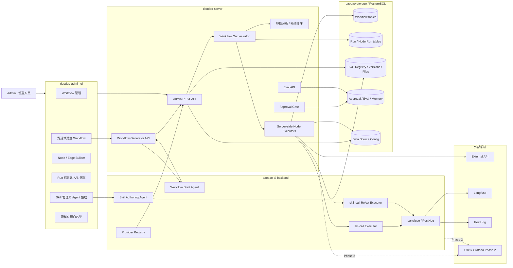

## 3. 核心模組責任

| 模組 | 責任 | 不負責 |
|---|---|---|
| `daodao-admin-ui` | Workflow/Skill/Data Source 設定、run 結果、A/B 對比、approval 操作 | 不直接碰 DB、不直接呼叫 provider |
| `daodao-server` | Orchestrator、CRUD API、Workflow draft 驗證與套用、靜態分析、server-side node 執行、run 狀態、DB 寫入、approval、eval | 不直接實作 provider 細節 |
| `daodao-ai-backend` | Provider 清單、LLM 執行、Skill bundle materialization、sandbox runtime、Skill ReAct loop、Workflow draft Agent、Skill Agent 對話、LLM observability | 不負責 Workflow 拓撲與業務資料寫回 |
| `daodao-storage` | workflow / run / skill / eval / approval / memory 持久化 | 不執行流程邏輯 |
| `daodao-worker` | Phase 1 暫不影響；Phase 2 可接 scheduled/event trigger 分發 | Phase 1 不作為核心執行器 |

## 4. Workflow 建立與設定流程

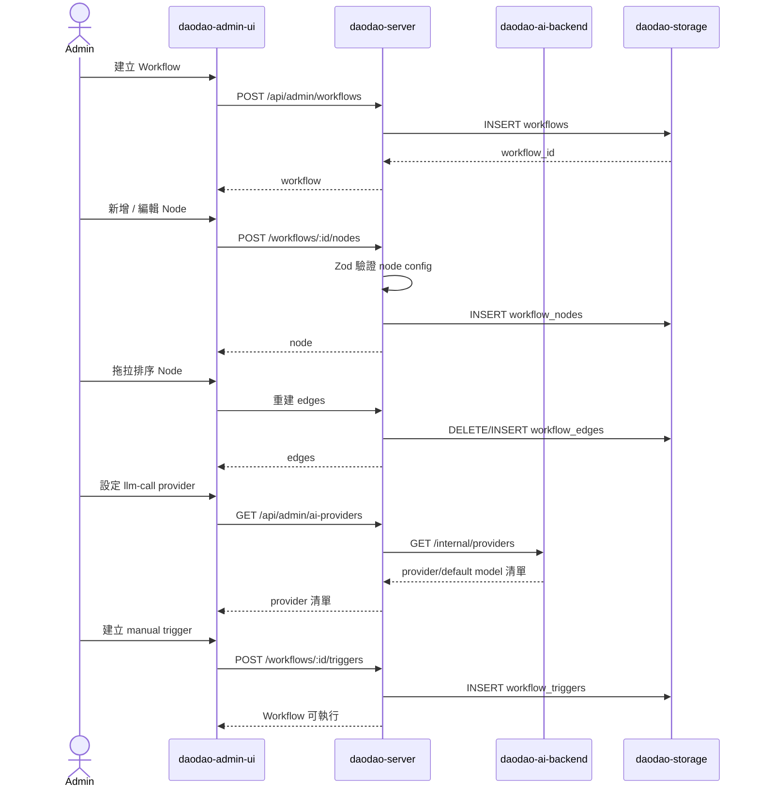

## 5. 對話式 Workflow 建立流程

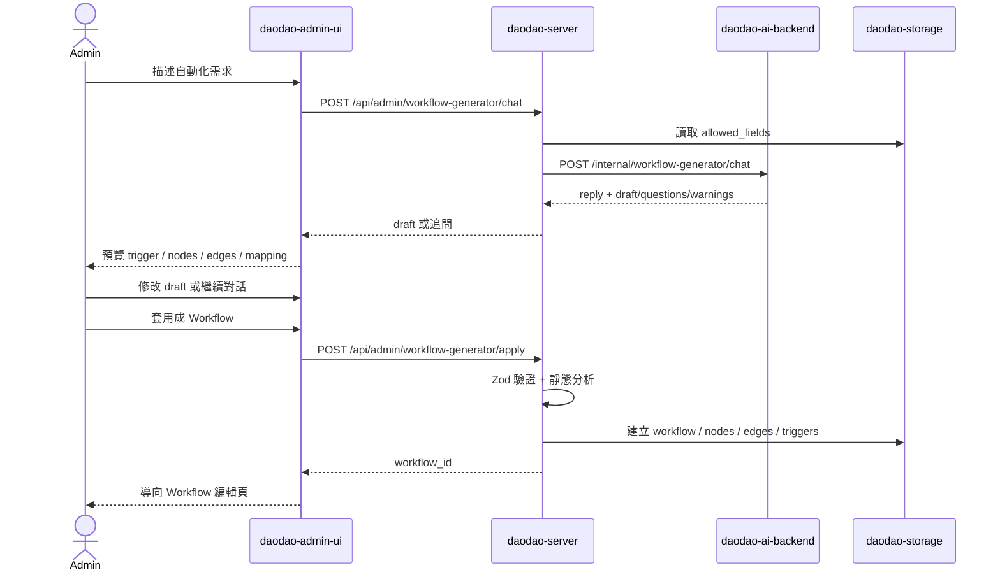

範例需求：

> 只要用戶完成實踐，就寄信給他，信裡的內容與欄位，有部分透過 LLM 加上我選定的資料。

對應 draft：

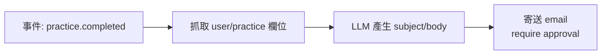

Phase 1 還不實際執行 event trigger，因此 UI 會提供「改成 manual trigger 供測試」選項；原始 event 意圖保留在 workflow description 或 draft metadata。

## 6. Workflow 執行主流程

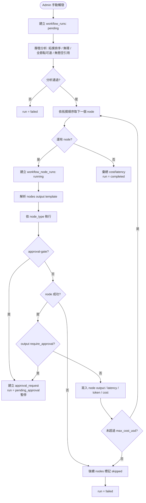

## 7. Node 類型與執行者

| Node 類型 | 執行者 | 主要輸入 | 主要輸出 | Phase 1 狀態 |
|---|---|---|---|---|
| `data-fetch` | `daodao-server` | source/scope/fields/filters | 白名單過濾後的 daodao 資料 | 開放 |
| `data-transform` | `daodao-server` | filter/limit 等 operations | 轉換後資料 | 開放 |
| `llm-call` | `daodao-ai-backend` | provider/model/system/prompt/output_schema | LLM output + token/cost/latency | 開放 |
| `skill-call` | `daodao-ai-backend` | skill_id/skill_version/provider/input/max_iterations | Skill ReAct output + trajectory | 開放 |
| `tool-call` | `daodao-server` | method/url/headers/body_template | HTTP response | 開放 |
| `approval-gate` | `daodao-server` | title/preview_template/actions/editable_fields | Admin 核准後 payload | 開放 |
| `output` | `daodao-server` | target/mapping/require_approval | DB 寫回 / notification / webhook | 開放 |
| `condition` | `daodao-server` | expression | true/false edge 選擇 | schema 預留，Phase 1 UI 不開放 |

## 8. `llm-call` 詳細流程

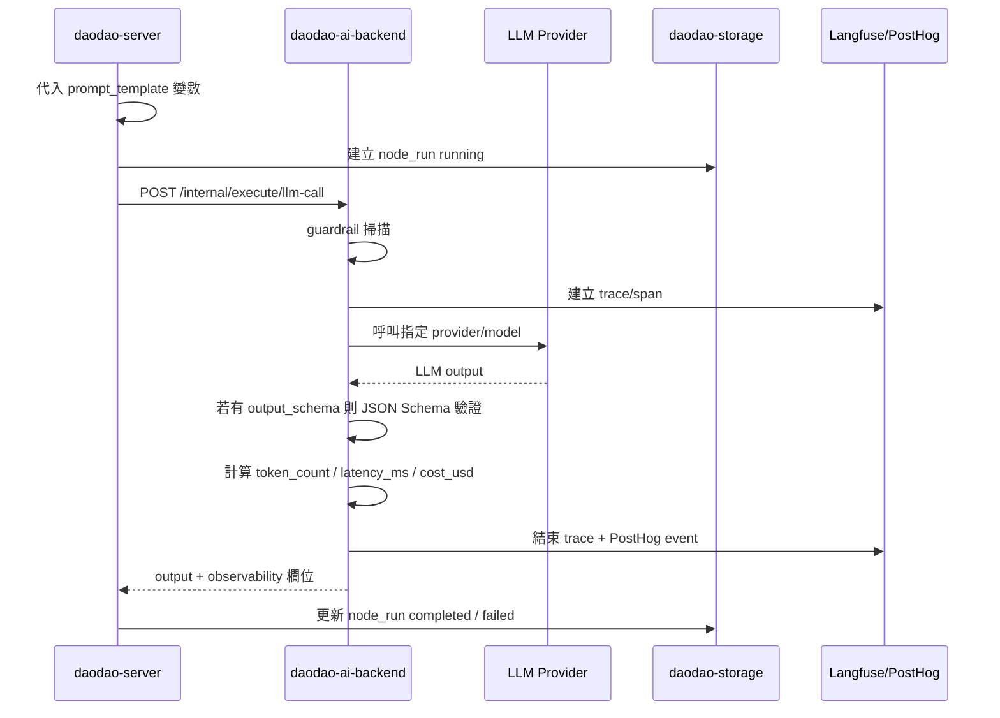

## 9. `skill-call` 詳細流程

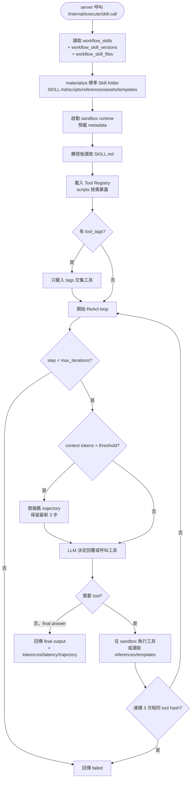

## 10. Approval Gate 流程

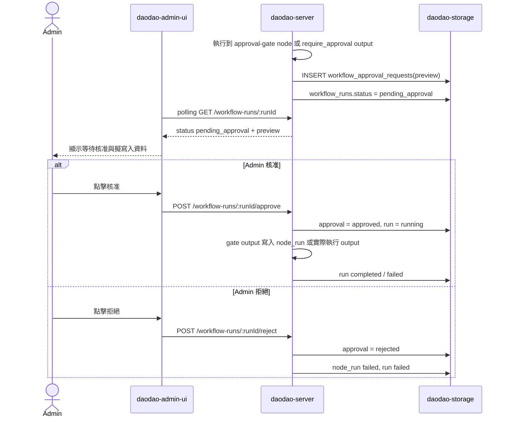

## 11. A/B 測試流程

```mermaid
flowchart LR
  Admin[Admin 選 Workflow A/B + scope]
  CreateAB[POST /api/admin/workflow-ab-tests]
  RunA[建立 workflow_a_run\nis_dry_run = true]
  RunB[建立 workflow_b_run\nis_dry_run = true]
  Link[建立 workflow_ab_tests 關聯]
  ExecuteA[執行 A dry-run]
  ExecuteB[執行 B dry-run]
  Result[結果頁左右並排顯示 node outputs]

  Admin --> CreateAB
  CreateAB --> RunA
  CreateAB --> RunB
  RunA --> Link
  RunB --> Link
  RunA --> ExecuteA
  RunB --> ExecuteB
  ExecuteA --> Result
  ExecuteB --> Result
```

重點：A/B 測試必須是 dry-run，因此 `output` node 不寫回業務資料，只保存 `workflow_node_runs` 的輸入、輸出、錯誤與 observability 欄位。

## 12. Skill 管理流程

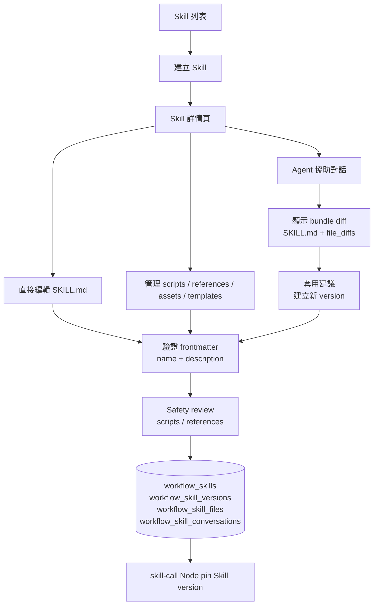

Skill 管理的重點不是「編輯一段 prompt」，而是維護可版本化的 Skill bundle。每次套用變更都產生新 version；production workflow 應 pin 到已通過 validation 與 safety review 的版本。

## 13. 資料模型關係圖

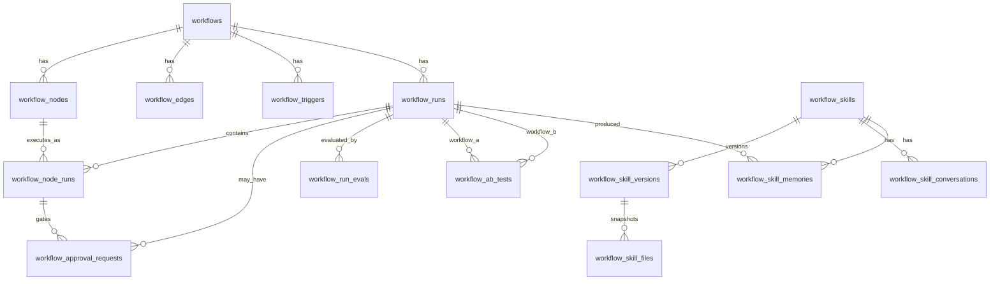

補充：`workflow_data_source_config` 是 singleton table，主鍵固定為 `id = 'singleton'`。

## 14. Run 狀態機

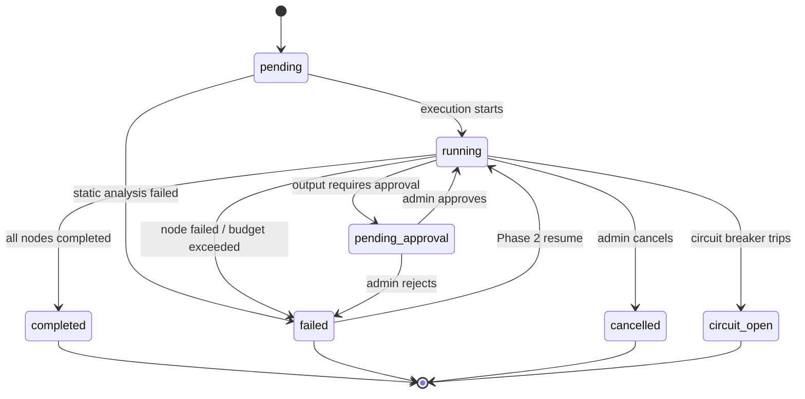

## 15. Phase 規劃

### Phase 1：可用的 Workflow Engine

目標是讓 admin 可以真的建立、執行、觀察與評估 workflow。

主要內容：

- DB migration：18 張核心資料表，包含 workflow 定義、run 紀錄、versioned skill bundle、approval/eval，以及對話式 generator 的 conversation/message/draft 版本。
- `daodao-ai-backend`：provider list、`llm-call`、`skill-call` materialization + sandbox runtime、Skill Agent chat、token/cost/latency、Langfuse/PostHog。
- `daodao-server`：Workflow CRUD、Node/Edge/Trigger CRUD、對話式 Workflow draft 驗證與套用、靜態分析、manual run、server-side node executors、approval、A/B dry-run、data source 白名單、eval。
- `daodao-admin-ui`：Workflow 列表、對話式建立、卡片式 Builder、Trigger、Run 結果、A/B 測試、Skill 管理、資料來源設定、Approval UI、Eval UI。
- 安全與穩定性：`output_schema`、Skill frontmatter validation、Skill version pinning、sandbox runtime、`max_iterations`、`max_cost_usd`、dead loop detection、circuit breaker、context compression。

### Phase 2：自動化、可觀測性與長流程韌性

主要內容：

- scheduled/event/webhook trigger 實際分發。
- OpenTelemetry + Grafana infrastructure metrics。
- Langfuse eval score sync、LLM-as-judge、trajectory evaluation。
- Checkpoint-resume。
- Tool Registry tags filtering。
- Memory Extractor。
- 條件分支 UI / graph editor 可在資料模型不改動的前提下演進。

### Phase 3：Agent 品質迭代

目前是 placeholder：

- Generator-Evaluator 即時迴圈。
- Context durability / drift 監測。

## 16. 推薦實作順序

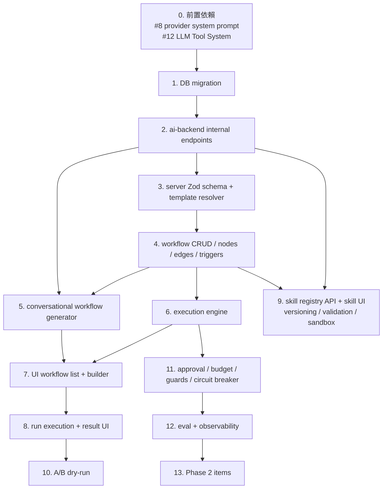

## 17. 目前需要特別注意的規劃點

| 風險 / 未決點 | 為什麼重要 | 建議處理 |
|---|---|---|
| Phase 1 scope 很大 | 同時包含 Workflow、Skill、A/B、approval、eval、observability、guards | 實作時切成 MVP slice：DB + manual linear workflow + llm-call/data-fetch/output，再逐步加 skill/AB/eval |
| 對話式建立可能產生錯誤 workflow | AI 可能誤選欄位、trigger 或 output mapping | 只允許產生 draft；套用前必須經 server Zod 驗證、靜態分析與 admin 確認 |
| `skill-call` 依賴 #12 Tool System | 沒有工具系統時 skill-call 只能退化成只讀 SKILL.md 的 LLM 執行，無 scripts/tool calling | 先讓 bundle registry、version pinning、materialization 可跑，工具能力在 #12 完成後接上 |
| Skill scripts 可能有安全風險 | scripts 是可執行內容，不應直接跑在 server process | scripts 必須 safety review，執行於 sandbox/container，並記錄 checksum |
| Skill 更新影響既有 workflow | 若 workflow 永遠吃 current version，生產結果會漂移 | production workflow pin `skill_version`，升版需 dry-run 與人工確認 |
| Data source 白名單需固定欄位來源 | UI 需要可選欄位清單，server 需要安全查詢映射 | 建議先用 hardcoded registry，不讓 admin 自由輸入 DB 欄位 |
| `{{nodes.<id>.output}}` 解析要避免隱性錯誤 | 引用錯誤會讓 LLM prompt 品質變差且難 debug | 執行前靜態分析應拒絕懸空引用；UI 只是提醒，不作唯一防線 |
| output 寫回是高風險操作 | LLM 錯誤輸出可能影響生產資料 | Phase 1 預設建議對 DB 寫回打開 `require_approval` |
| Cost/budget 欄位可能為 null | 有些 provider 或非 LLM node 沒有成本 | 彙總時只計算非 null；UI 不顯示 null cost |
| Circuit Breaker 儲存位置 | design 允許 Redis 或 in-memory，但 in-memory 多 instance 不一致 | 若 production 多 instance，應優先 Redis |

## 18. 閱讀順序

若要深入理解原始文件，建議照這個順序：

1. `proposal.md`：理解為什麼做、範圍與影響面。
2. `docs/architecture-and-flows.md`：先看整體架構與流程。
3. `docs/scenario-taxonomy.md`：先用「營運 / 個人旅程 / 生態圈」理解場景分類。
4. `docs/application-scenarios.md`：看可應用場景、學習旅程、Funnel 分析模型、學習生態圈 Workflow 與優先順序。
5. `docs/skill-alignment.md`：看 Workflow vs Skill 邊界與 Claude Agent Skills 對齊。
6. `docs/database-recording.md`：看對話、draft、workflow、Skill Registry、run、approval 如何入庫。
7. `design.md`：看 DB schema、API、observability、approval、guard 的細節。
8. `specs/ai-workflow-builder/spec.md`：看 Workflow Builder 的使用者需求。
9. `specs/ai-workflow-nlp-generator/spec.md`：看對話式 Workflow 建立需求。
10. `specs/workflow-skill-manager/spec.md`：看 Skill 管理需求。
11. `specs/ai-data-source-config/spec.md`：看資料白名單與安全邊界。
12. `specs/ai-workflow-ab-test/spec.md`：看 A/B dry-run。
13. `tasks.md`：轉成實作 checklist。
