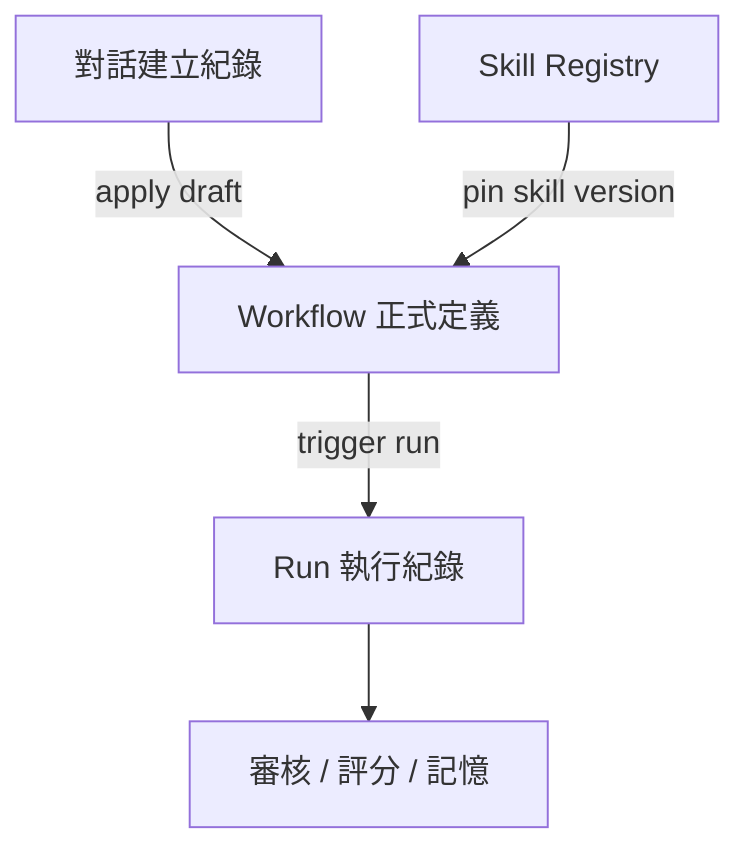
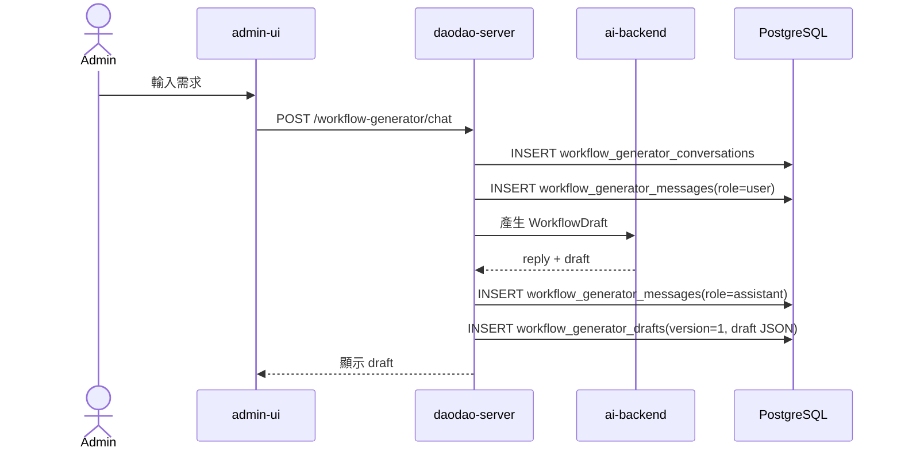
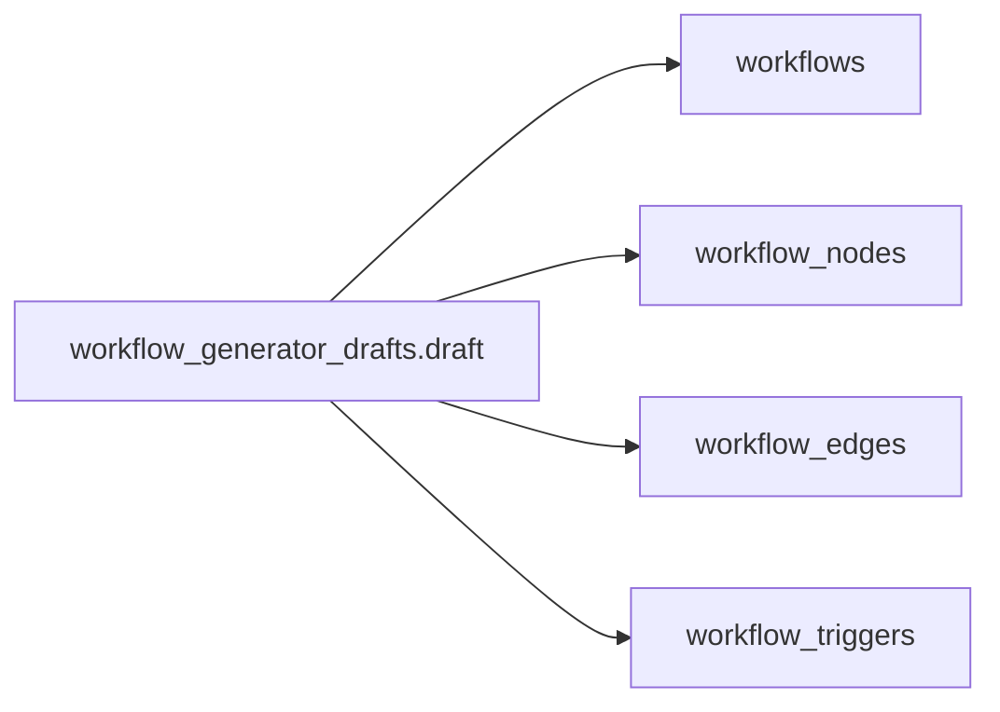
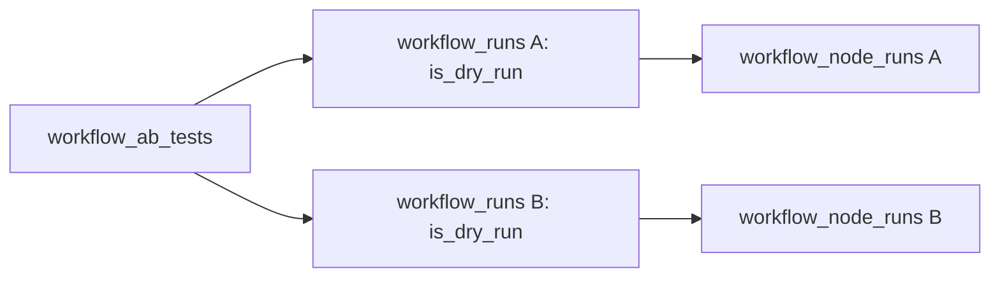

# AI Service Management：資料庫記錄方式

本文件說明 Workflow Engine 會如何把「對話建立內容」、「正式流程定義」、「Skill Registry」、「每次執行內容」、「流程關卡審核」記錄到資料庫。

## 1. 五層資料



| 層級 | 用途 | 主要 Tables |
|---|---|---|
| 對話建立紀錄 | 保存 admin 跟 AI 如何產生 workflow draft | `workflow_generator_conversations`, `workflow_generator_messages`, `workflow_generator_drafts` |
| Workflow 正式定義 | 保存已套用、可執行的流程結構 | `workflows`, `workflow_nodes`, `workflow_edges`, `workflow_triggers` |
| Skill Registry | 保存 Claude Agent Skills 對齊的 versioned skill bundle | `workflow_skills`, `workflow_skill_versions`, `workflow_skill_files`, `workflow_skill_conversations` |
| Run 執行紀錄 | 保存每次執行的 input/output/error/cost | `workflow_runs`, `workflow_node_runs` |
| 審核 / 評分 / 記憶 | 保存人工關卡、run 評分、skill memory | `workflow_approval_requests`, `workflow_run_evals`, `workflow_skill_memories` |

## 2. 對話建立 Workflow 時怎麼記錄

當 admin 用自然語言說：

> 當用戶完成實踐後，抓姓名、email、學習目標和實踐內容，產生一封鼓勵信，審核後寄出。

資料會這樣保存：



### `workflow_generator_conversations`

保存一次對話式建立流程的生命週期。

```sql
workflow_generator_conversations
- id
- status: drafting | applied | discarded
- applied_workflow_id
- created_at
- updated_at
```

### `workflow_generator_messages`

保存每一則 user / assistant 訊息。

```sql
workflow_generator_messages
- id
- conversation_id
- role: user | assistant | system
- content
- metadata
- created_at
```

### `workflow_generator_drafts`

保存每一版 AI 產生的 WorkflowDraft。這是追溯「AI 當時產生了什麼」的關鍵。

```sql
workflow_generator_drafts
- id
- conversation_id
- version
- draft                 -- 完整 WorkflowDraft JSON
- warnings
- missing_fields
- validation_errors
- status: draft | applied | discarded
- applied_workflow_id
- created_at
```

## 3. Draft 套用成正式 Workflow 時怎麼記錄

Admin 按下「套用成 Workflow」後，draft 不會直接覆蓋歷史，而是轉成正式表：



對應關係：

| Draft 欄位 | 正式資料表 |
|---|---|
| `workflow.name`, `workflow.description` | `workflows` |
| `nodes[]` | `workflow_nodes` |
| `edges[]` | `workflow_edges` |
| `triggers[]` | `workflow_triggers` |
| `warnings`, `missing_fields` | 保留在 `workflow_generator_drafts` |

套用後：

- `workflow_generator_drafts.status = 'applied'`
- `workflow_generator_drafts.applied_workflow_id = workflows.id`
- `workflow_generator_conversations.status = 'applied'`
- `workflow_generator_conversations.applied_workflow_id = workflows.id`

## 4. Workflow 定義怎麼記錄

正式 workflow 的定義是可執行版本。

### `workflows`

```sql
workflows
- id
- name
- description
- is_active
- max_cost_usd
- created_at
- updated_at
```

### `workflow_nodes`

每個 node 的完整設定放在 `config JSONB`。

```sql
workflow_nodes
- id
- workflow_id
- node_type
- label
- config
- position_x
- position_y
- created_at
```

範例：`llm-call` node config

```json
{
  "provider": "anthropic",
  "system_prompt": "你是 daodao 的學習陪伴信件撰寫助手。",
  "prompt_template": "根據以下資料產生一封鼓勵信：{{nodes.fetch_context.output}}",
  "output_schema": {
    "type": "object",
    "properties": {
      "subject": { "type": "string" },
      "body": { "type": "string" }
    },
    "required": ["subject", "body"]
  }
}
```

範例：`skill-call` node config

```json
{
  "skill_id": "skill_uuid",
  "skill_version": 3,
  "provider": "anthropic",
  "model_override": null,
  "input_template": "根據以下資料產生鼓勵信內容：{{nodes.fetch_context.output}}",
  "max_iterations": 10,
  "context_compress_threshold": 8000
}
```

`skill_version` 是 workflow 對 Skill bundle 的版本綁定。Skill 新版本發布後，不會自動改變既有 workflow 的執行結果；PM 或 admin 需要手動升級版本並 dry-run。

範例：`approval-gate` node config

```json
{
  "title": "審核信件內容",
  "preview_template": {
    "to": "{{nodes.fetch_context.output.user.email}}",
    "subject": "{{nodes.generate_email.output.subject}}",
    "body": "{{nodes.generate_email.output.body}}"
  },
  "actions": ["approve", "reject", "request_changes"],
  "editable_fields": ["subject", "body"],
  "on_reject": "fail"
}
```

### `workflow_edges`

記錄節點順序或分支。

```sql
workflow_edges
- id
- workflow_id
- source_node_id
- target_node_id
- label          -- condition 用 true/false
- created_at
```

### `workflow_triggers`

```sql
workflow_triggers
- id
- workflow_id
- trigger_type: manual | scheduled | webhook | event
- config
- is_active
- created_at
```

## 5. 每次執行怎麼記錄

每次 workflow 被觸發，建立一筆 run。

### `workflow_runs`

```sql
workflow_runs
- id
- workflow_id
- trigger_id
- is_dry_run
- status
- input
- total_cost_usd
- total_latency_ms
- checkpoint_state
- created_at
- started_at
- finished_at
```

`input` 會保存此次觸發的上下文，例如：

```json
{
  "scope": "single_user",
  "user_id": "user_123",
  "event": {
    "name": "practice.completed",
    "practice_id": "practice_456"
  }
}
```

### `workflow_node_runs`

每個 node 執行一次，就會有一筆 node run。

```sql
workflow_node_runs
- id
- run_id
- node_id
- status
- input
- output
- error
- token_count
- latency_ms
- cost_usd
- trajectory
- started_at
- finished_at
```

範例：`data-fetch` output

```json
{
  "user": {
    "name": "Alice",
    "email": "alice@example.com",
    "learning_goals": ["建立穩定練習習慣"]
  },
  "practice": {
    "title": "完成 20 分鐘反思",
    "completed_at": "2026-05-21T10:00:00Z"
  }
}
```

範例：`llm-call` output

```json
{
  "subject": "你完成了一個重要的練習",
  "body": "Alice，今天你完成了..."
}
```

## 6. 流程關卡怎麼記錄

`approval-gate` 或 `output.require_approval` 都使用 `workflow_approval_requests`。

```sql
workflow_approval_requests
- id
- run_id
- node_run_id
- status: pending | approved | rejected | changes_requested
- preview
- decision_payload
- decision_notes
- decided_at
- created_at
```

### Gate 開始時

`preview` 保存待審內容：

```json
{
  "to": "alice@example.com",
  "subject": "你完成了一個重要的練習",
  "body": "Alice，今天你完成了..."
}
```

### Admin 修改並核准後

`decision_payload` 保存最後通過版本：

```json
{
  "to": "alice@example.com",
  "subject": "完成練習，做得很好",
  "body": "Alice，今天你完成了 20 分鐘反思..."
}
```

接著該 `approval-gate` 的 `workflow_node_runs.output` 也會寫入同一份核准後 payload，讓後續 output node 可以引用：

```text
{{nodes.review_email.output.subject}}
{{nodes.review_email.output.body}}
```

## 7. A/B 測試怎麼記錄

A/B 測試不直接寫業務資料。



```sql
workflow_ab_tests
- id
- workflow_a_run_id
- workflow_b_run_id
- created_at
```

## 8. Skill Registry 怎麼記錄

DB 是 Skill Registry，不是 runtime。執行時 ai-backend 會依 `skill_id + version` 把資料 materialize 成標準資料夾：

```text
/tmp/skill-runtime/<run_id>/<skill_name>/
  SKILL.md
  scripts/
  references/
  assets/
  templates/
```

### `workflow_skills`

保存目前 Skill 的 metadata 與 current version。

```sql
workflow_skills
- id
- name
- description
- skill_md
- status: draft | active | archived
- current_version
- created_at
- updated_at
```

### `workflow_skill_versions`

保存每次 Skill bundle 變更後的版本，讓 Workflow 可以 pin 固定版本，避免 Skill 更新影響既有流程。

```sql
workflow_skill_versions
- id
- skill_id
- version
- skill_md
- changelog
- validation_status: pending | valid | invalid
- validation_errors
- safety_review_status: pending | approved | rejected
- created_at
```

### `workflow_skill_files`

保存該版本的檔案快照。`path` 必須落在 `scripts/`、`references/`、`assets/`、`templates/`。

```sql
workflow_skill_files
- id
- skill_id
- version
- category: scripts | references | assets | templates
- path
- content
- bytes
- checksum
- executable
- created_at
```

### `workflow_skill_conversations`

保存 admin 透過 Agent 協助建立或修改 Skill bundle 的對話紀錄。

```sql
workflow_skill_conversations
- id
- skill_id
- role: user | assistant
- content
- created_at
```

## 9. 評分與後續學習怎麼記錄

### `workflow_run_evals`

Admin 對 run 標記好/壞與備註。

```sql
workflow_run_evals
- id
- run_id
- rating: good | bad
- notes
- auto_score
- created_at
```

### `workflow_skill_memories`

Phase 2 用來保存從 skill-call trajectory 擷取出的長期記憶。

```sql
workflow_skill_memories
- id
- skill_id
- run_id
- memory_type: episodic | semantic
- content
- created_at
```

## 10. 一個完整例子

「完成實踐後寄鼓勵信」從建立到執行會留下：

1. `workflow_generator_conversations`
   - 這次對話建立流程。
2. `workflow_generator_messages`
   - Admin 的需求與 AI 的回覆。
3. `workflow_generator_drafts`
   - AI 產生的 WorkflowDraft v1、v2。
4. `workflows`
   - 正式 workflow。
5. `workflow_nodes`
   - `data-fetch`、`skill-call` 或 `llm-call`、`approval-gate`、`output`。
6. `workflow_edges`
   - 節點連線。
7. `workflow_triggers`
   - Phase 1 manual 或 Phase 2 `practice.completed` event。
8. `workflow_runs`
   - 某次用戶完成實踐後觸發的 run。
9. `workflow_node_runs`
   - 每個 node 的 input/output/error/cost。
10. `workflow_approval_requests`
   - 營運審核信件內容的 preview 與最後核准版本。
11. `workflow_run_evals`
   - Admin 事後標記這次結果好/壞。
12. 如果使用 `skill-call`：
   - `workflow_skills` 保存 Skill metadata。
   - `workflow_skill_versions` 保存被 workflow pin 的版本。
   - `workflow_skill_files` 保存該版本的 SKILL.md 以外檔案快照。

這樣可以回溯三件事：

- 這個 Workflow 是怎麼被 AI 對話產生的。
- 正式執行版本長什麼樣。
- 每次執行實際用了哪些資料、產生什麼內容、誰審核、最後輸出什麼。
