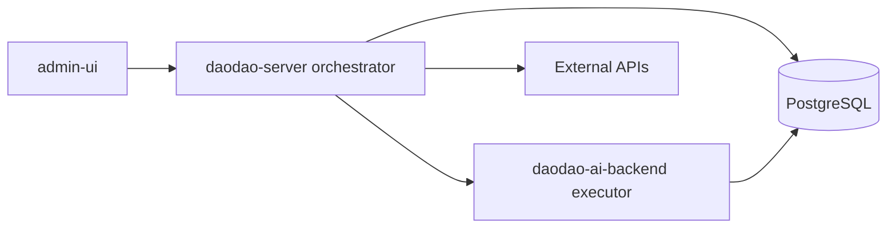
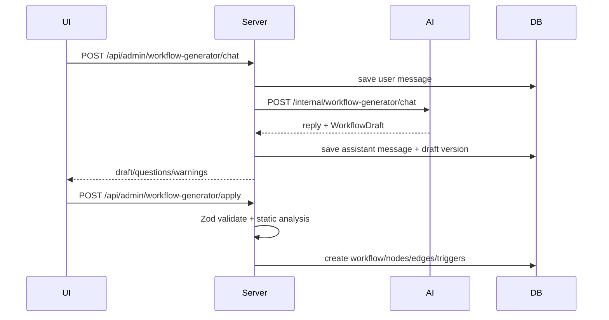
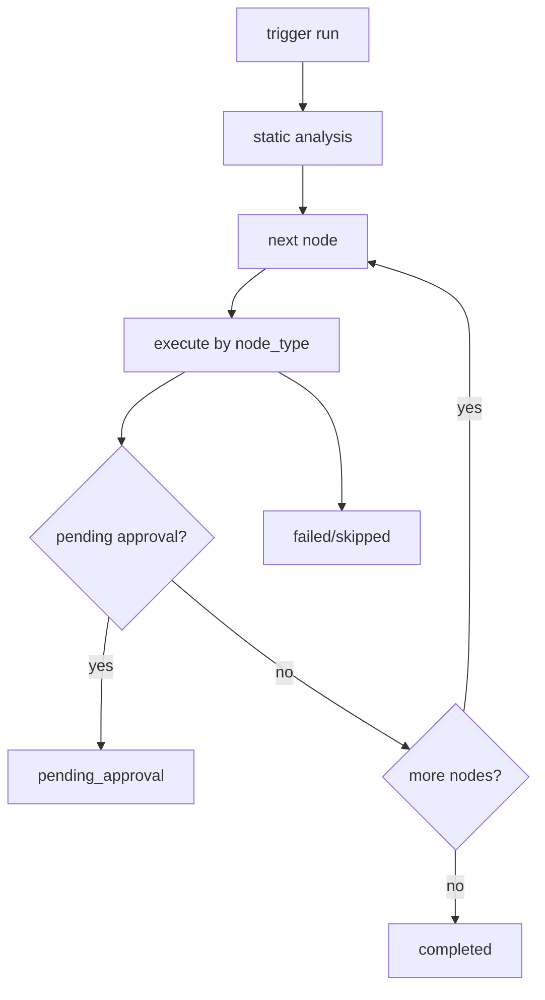

# Daodao Workflow：工程指南

這份文件給工程、Tech Lead 與後端/前端實作者閱讀。重點是系統邊界、資料流、DB、API 與實作分期。

## 1. 系統定位

Workflow Engine 將 AI 與業務邏輯從硬編碼改成可配置流程：

## 2. 模組責任

| 模組 | 責任 |
|---|---|
| `daodao-admin-ui` | Workflow Builder、對話建立、run 結果、A/B、approval、Skill 管理 |
| `daodao-server` | CRUD API、orchestration、靜態分析、template resolver、server-side node execution、approval、eval、DB 寫入 |
| `daodao-ai-backend` | provider registry、`llm-call`、`skill-call`、Workflow Draft Agent、Skill Agent、LLM tracing |
| `daodao-storage` | workflow 定義、run/node_run、generator draft、approval、eval、skill/memory tables |

## 3. Node 類型

| Node | 執行者 | 說明 |
|---|---|---|
| `data-fetch` | server | 依資料白名單抓 daodao 資料 |
| `data-transform` | server | filter / limit / aggregate |
| `llm-call` | ai-backend | provider/model/prompt/output_schema |
| `skill-call` | ai-backend | 載入指定 Skill version，materialize 成 Skill folder，在 sandbox runtime 中執行 ReAct loop |
| `tool-call` | server | 呼叫外部 HTTP API |
| `condition` | server | 表達式判斷與分支 |
| `approval-gate` | server | 暫停 run，等待人工核准/拒絕/修改 |
| `output` | server | DB 寫回、通知、webhook；可設定 `require_approval` |

## 4. 核心流程

### 對話建立

### 執行

## 5. 主要 API

| API | 用途 |
|---|---|
| `GET/POST /api/admin/workflows` | Workflow CRUD |
| `GET/POST /api/admin/workflows/:id/nodes` | Node CRUD |
| `GET/POST /api/admin/workflows/:id/edges` | Edge 管理 |
| `GET/POST /api/admin/workflows/:id/triggers` | Trigger 管理 |
| `POST /api/admin/workflows/:id/runs` | 手動觸發 run |
| `GET /api/admin/workflow-runs/:runId` | run + node_runs |
| `POST /api/admin/workflow-runs/:runId/approve` | 核准 gate |
| `POST /api/admin/workflow-runs/:runId/reject` | 拒絕 gate |
| `POST /api/admin/workflow-generator/chat` | 對話產生 draft |
| `POST /api/admin/workflow-generator/apply` | 套用 draft |
| `POST /api/admin/workflow-ab-tests` | A/B dry-run |
| `GET/PATCH /api/admin/workflow-data-sources` | 資料白名單 |
| `GET/POST /api/admin/workflow-skills` | Skill CRUD |

Internal AI backend:

| API | 用途 |
|---|---|
| `GET /internal/providers` | provider 清單 |
| `POST /internal/execute/llm-call` | 執行 LLM |
| `POST /internal/execute/skill-call` | 執行 Skill |
| `POST /internal/workflow-generator/chat` | 生成 WorkflowDraft |
| `POST /internal/workflow-skills/:skillId/chat` | Skill Agent 對話 |

## 6. DB 分層

| 層級 | Tables |
|---|---|
| Generator | `workflow_generator_conversations`, `workflow_generator_messages`, `workflow_generator_drafts` |
| Definition | `workflows`, `workflow_nodes`, `workflow_edges`, `workflow_triggers` |
| Execution | `workflow_runs`, `workflow_node_runs`, `workflow_ab_tests` |
| Governance | `workflow_approval_requests`, `workflow_run_evals`, `workflow_data_source_config` |
| Skills | `workflow_skills`, `workflow_skill_versions`, `workflow_skill_files`, `workflow_skill_conversations`, `workflow_skill_memories` |

## 7. Approval Gate 實作規則

- `approval-gate` node 執行時：
  - resolve `preview_template`
  - create `workflow_approval_requests`
  - set run `pending_approval`
  - pause execution
- approve:
  - save `decision_payload`
  - write gate node output
  - resume next node
- reject:
  - set node_run failed
  - set run failed
  - mark downstream skipped

`output.require_approval` 是不可逆 output 前的最後防線；`approval-gate` 是可放在流程中段的人工關卡。

## 8. Phase 切分

### Phase 1

- Manual trigger。
- Linear card builder，schema 支援 DAG。
- Core node types：`data-fetch`、`data-transform`、`llm-call`、`skill-call`、`approval-gate`、`output`。
- Workflow generator draft + apply。
- Run / node_run / approval / eval 紀錄。
- Data source whitelist。
- A/B dry-run。
- Claude Agent Skills 對齊：Skill bundle versioning、SKILL.md frontmatter 驗證、templates/、sandbox runtime materialization。
- Output schema、max_cost、max_iterations、dead loop detection、circuit breaker。

### Phase 2

- `scheduled` / `event` / `webhook` 實際觸發。
- Condition UI / graph editor。
- Journey state tracking。
- OpenTelemetry + Grafana。
- Langfuse eval sync、LLM-as-judge。
- Checkpoint resume。
- Tool tags filtering。
- Skill memory extractor。

## 9. 工程風險

| 風險 | 處理 |
|---|---|
| AI 產生非法 draft | server 以 Zod + static analysis 驗證，不通過不套用 |
| 資料外洩 | data-fetch 只能用白名單欄位 |
| 不可逆 output | 預設 approval gate |
| 惡意 Skill scripts | Skill version safety review + sandbox/container 執行 |
| Skill 更新破壞既有 Workflow | Workflow pin skill_version，新版本不自動套用 |
| LLM 格式不穩 | `output_schema` 驗證 |
| skill-call 迴圈 | `max_iterations` + dead loop detection |
| 成本失控 | `max_cost_usd` + node cost recording |
| 多 instance circuit breaker | production 優先 Redis，不用 in-memory |
| Journey 需求過大 | Phase 1 用 scheduled scan，Phase 2 才上 journey tables |

## 10. Engineering Deep Dive

- 架構與流程圖：[architecture-and-flows.md](./architecture-and-flows.md)
- Claude Skills 對齊：[skill-alignment.md](./skill-alignment.md)
- DB 記錄方式：[database-recording.md](./database-recording.md)
- 學習旅程、Funnel 分析模型與學習生態圈場景：[application-scenarios.md](./application-scenarios.md)
