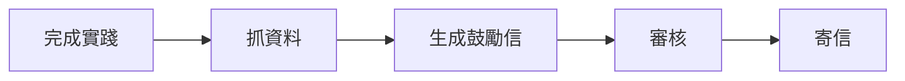
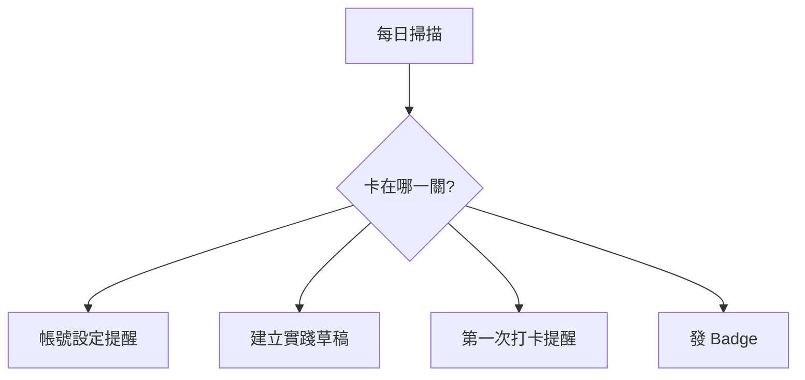

# Daodao Workflow：PM / 產品 / 營運指南

這份文件給 PM、產品設計、營運與成長團隊閱讀。重點是回答：

- Workflow 可以解決哪些產品問題？
- 哪些場景值得優先做？
- 最後可以觸發什麼行動？
- 哪些地方需要人工審核？
- 單一事件自動化與學習旅程漏斗怎麼區分？

## 1. 一句話

Daodao Workflow 是一套讓營運可配置的「學習旅程自動化」能力。它可以根據使用者行為、學習狀態、社群互動或營運條件，抓取資料、讓 AI 判斷或生成內容，經過必要關卡後執行通知、寫回、推薦、badge、草稿或外部 API。

Workflow 負責「何時觸發、抓哪些資料、經過哪些關卡、最後做什麼」。Skill 負責「某個領域任務要怎麼判斷、怎麼寫、用哪些範本與參考資料」。規劃時不要把 Skill 當成單一 prompt，而要把它當成可重用的能力包。

## 2. 三類場景

| 類別 | 主要受益者 | 核心問題 | 代表場景 |
|---|---|---|---|
| 營運自動化 | Admin / 營運 | 怎麼更有效率、更可控？ | A/B 測試、公告草稿、健康摘要、失敗任務重試 |
| 個人學習旅程體驗 | 單一使用者 | 使用者下一步需要什麼支持？ | Onboarding、第一次打卡、人物誌、留存重啟 |
| 學習生態圈 | 社群網絡 | 如何促進共鳴、連結、擴散？ | Inspire Feed、留言引導、Buddy、共同挑戰、複製實踐 |

## 3. 最後行動目錄

Workflow 最後通常會落在 `output`，或先經過 `approval-gate`。

| 最後行動 | 例子 | 是否建議審核 |
|---|---|---|
| 寄 Email | onboarding email、鼓勵信、週報、召回信 | 是，對外文案建議審核或抽樣 |
| 站內通知 | 任務提醒、互動提醒、挑戰提醒 | 視風險 |
| Push 通知 | 打卡提醒、連結請求 | 批量或 LLM 文案建議審核 |
| 寫回 DB | 推薦、狀態、標籤、AI 摘要 | 影響核心資料時要審核 |
| 建立草稿 | 公告、email、週報、匯出草稿 | 通常不需要，草稿本身可被審核 |
| 發放 Badge | early user、挑戰達標、人物誌完成 | 規則明確可免審 |
| 建立任務 / 實踐 | onboarding task、個人化實踐草稿 | 直接進入用戶工作區時建議審核 |
| 建立推薦卡 | 下一步推薦、Buddy 推薦 | 低風險可免審 |
| 呼叫外部 API | CRM、Email service、Slack、文件生成 | 對外或不可逆操作要審核 |
| dry-run | A/B 測試、prompt 比較 | 不寫回，不需審核 |

## 4. 單一事件 vs 學習旅程

**單一事件**適合明確觸發：



**學習旅程**適合長期陪伴：



## 5. 什麼時候要用 Skill

如果只是一次性的生成或判斷，用 `llm-call` 就夠。如果同一套判斷會被多個 Workflow 重複使用，或需要穩定的語氣、範例、範本、參考資料、可執行工具，就應該做成 Skill。

| 適合 `llm-call` | 適合 `skill-call` |
|---|---|
| 單次 email 草稿 | daodao 鼓勵信撰寫能力 |
| 單次摘要 | 學習週報分析能力 |
| 一個 prompt A/B | 任務推薦策略能力 |
| 臨時分類 | 社群留言引導能力 |

PM 規劃 Skill 時要寫清楚：

- 這個 Skill 何時應該被使用。
- 它需要哪些輸入資料。
- 它應該輸出什麼格式。
- 語氣、禁語、產品原則與範例。
- 是否需要人工審核後才能用在 production workflow。

## 6. 優先場景

### P0

| 場景 | 類別 | 為什麼先做 |
|---|---|---|
| Onboarding 漏斗 | 個人學習旅程 | 直接對齊「註冊後 3 天建立第一個實踐」 |
| 完成實踐後鼓勵信 | 個人學習旅程 | 能驗證 AI 內容、審核、email output |
| 任務推薦 A/B 測試 | 營運自動化 | 能驗證 dry-run、eval、prompt 比較 |
| 快速反應後留言引導 | 學習生態圈 | 低風險、高體感，對齊 Learn Out Loud |

### P1

| 場景 | 類別 | 價值 |
|---|---|---|
| 人物誌 Daily Probe | 個人學習旅程 | 支撐「漸進式顯影」 |
| 推薦 Match Reason | 個人學習旅程 | 讓推薦可理解 |
| P1/P2 通知分流 | 營運自動化 | 降低通知噪音 |
| 共同挑戰參與漏斗 | 學習生態圈 | 階段清楚，適合漏斗 |
| 複製實踐後個人化改寫 | 學習生態圈 | 降低啟動摩擦 |

### P2

| 場景 | 類別 | 注意事項 |
|---|---|---|
| 留存與重啟漏斗 | 個人學習旅程 | 需要控制打擾頻率 |
| 學習孤獨感共鳴推薦 | 學習生態圈 | 涉及敏感推論 |
| AI 回覆安全檢查 | 營運 / 生態圈 | 需要完整安全策略 |
| ESCO 技能標籤映射 | 個人 / 營運 | 對搜尋、推薦、匯出有長期價值 |

## 7. PM 寫需求時的模板

```text
當 [觸發條件 / 使用者階段]，
系統要抓取 [資料欄位]，
用 [規則 / LLM / Skill 名稱與版本] 判斷或生成 [內容]，
如果 [風險條件] 則進入 [人工關卡]，
最後執行 [寄信 / 站內通知 / 寫回 DB / 建草稿 / 發 badge / dry-run]。

成功指標：
- activation / retention / completion / CTR / comment rate / copy rate / cost / error rate

需要避免：
- 過度打擾
- AI 直接做不可逆操作
- 未審核的敏感推論
- 未進白名單的資料欄位
- 把可重用能力寫死在單一 workflow prompt 裡
```

## 8. 決策規則

- 對外發送的 AI 文案：預設加 `approval-gate` 或抽樣審核。
- 寫回核心資料：至少需要 schema 驗證，高風險要人工關卡。
- 旅程漏斗：Phase 1 可用 scheduled scan；Phase 2 再做正式 journey state tracking。
- A/B 測試：只 dry-run，不寫回業務資料。
- 資料欄位：只能使用資料來源白名單中已啟用欄位。
- 會被多個流程重用的領域能力：做成 Skill，Workflow pin 已審核版本。

## 9. PM Deep Dive

- 50 個場景細節、學習旅程、Funnel 分析模型與學習生態圈 Workflow：[application-scenarios.md](./application-scenarios.md)
- 三類場景分類：[scenario-taxonomy.md](./scenario-taxonomy.md)
- Workflow vs Skill 邊界：[skill-alignment.md](./skill-alignment.md)
