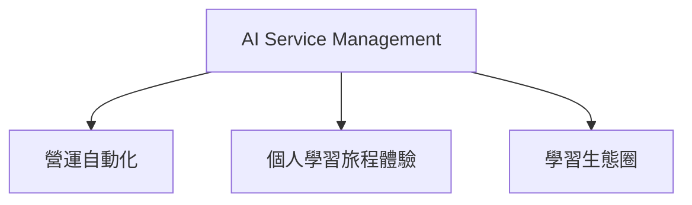
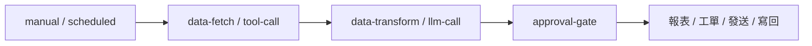
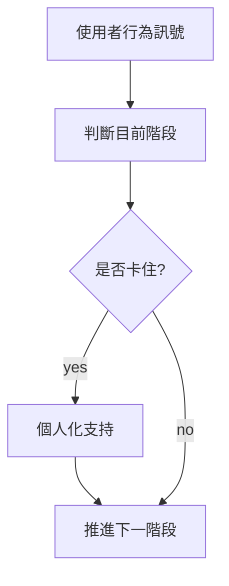
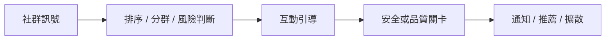

# AI Service Management：場景分類總覽

目前場景可以分成三大類：

1. **營運自動化**：幫 admin / 營運團隊降低重複工作、監控品質、批次處理與做實驗。
2. **個人學習旅程體驗**：圍繞單一使用者，從註冊、開始、持續、完成、重啟，提供個人化陪伴。
3. **學習生態圈**：圍繞人與人、實踐與實踐、挑戰與社群，促進共鳴、連結、擴散與社群健康。

## 1. 營運自動化

**核心問題**：營運團隊如何更快配置策略、監控品質、處理例外、做實驗？

這類場景通常以 admin 為主要受益者，重點是降低人工成本與提高可控性。

### 適合的 Workflow 形態

### 代表場景

| 場景 | 目的 | 最後行動 | 是否需要關卡 |
|---|---|---|---|
| 社群公告草稿生成 | 降低公告撰寫成本 | 建立公告草稿 / 發布 | 發布前需要 |
| 任務推薦 A/B 測試 | 比較 prompt / 策略品質 | dry-run 保存結果 / eval | 不一定 |
| Admin AI 服務健康摘要 | 監控 AI backend / task queue | dashboard note / Slack alert | 嚴重操作前需要 |
| 失敗任務重試建議 | 協助判斷 retry / cancel | retry / cancel task | 需要 |
| 優質可複製實踐偵測 | 找出值得推廣的實踐 | 標記 featured practice | 需要 |
| 隱私權限異常檢查 | 發現曝光風險 | 建立審核工單 | 需要 |
| 企業 / 合作方週報 | 對外整理學習成效 | 報告草稿 / email | 需要 |
| 內部營運資料摘要 | 加速營運決策 | dashboard note / Slack | 可選 |
| P1/P2 通知優先級分流 | 管理通知排序與批次 | notification batch | 不一定 |
| Email 退訂偏好同步 | 確保退訂即時生效 | 更新通知偏好 | 不需要 |

### 優先度

- **P0**：任務推薦 A/B 測試、P1/P2 通知分流、Email 退訂同步。
- **P1**：社群公告草稿、優質可複製實踐偵測、Admin 健康摘要。
- **P2**：企業週報、隱私異常檢查、失敗任務自動處理。

### 設計重點

- 要有 dry-run。
- 要能保留 run / node_run / eval。
- 高風險 output 必須走 `approval-gate`。
- 場景通常不需要很深的個人化，但需要批次與可觀測性。

---

## 2. 個人學習旅程體驗

**核心問題**：單一使用者現在處於哪個學習階段？下一步需要什麼支持？

這類場景是產品體驗的主軸。它不是單一事件，而是階段式、漏斗式、長期陪伴。

### 適合的 Workflow 形態

### 代表旅程

| 旅程 | 階段 | 卡住時動作 |
|---|---|---|
| Onboarding 漏斗 | 註冊 → 設定 → 測驗/人物誌 → 建立實踐 → 第一次打卡 → 留言 | onboarding email、站內提醒、AI 實踐草稿 |
| 第一次實踐啟動 | 建立實踐 → 設開始日 → 第一次打卡 → 連續 3 次 → 第一次反思 | 打卡提醒、低門檻提示、反思 probe |
| 實踐完成與資產化 | 進度 80% → 完成 → 覆盤 → 匯出草稿 → 分享 | 覆盤提醒、匯出草稿、分享圖 |
| 人物誌顯影 | 看見 probe → 回答 → 對等揭露 → 學習 DNA → 推薦 | daily probe、共鳴推薦、DNA 摘要 |
| 推薦到實踐轉換 | 看推薦 → 喜歡/不喜歡 → 點擊 → 加入實踐 → 打卡 | match reason、替補推薦、複製後改寫 |
| 留存與重啟 | 活躍 → 降頻 → 沉睡 → 召回 → 重啟 → 回歸打卡 | 週報、召回信、重啟實踐建議 |
| 訂閱轉換 | 使用核心功能 → 觸及高價值時刻 → 升級提示 → 續訂 | value-based CTA、方案文案 |

### 代表場景

| 場景 | 目的 | 最後行動 | 是否需要關卡 |
|---|---|---|---|
| Onboarding 階梯式 Email | 推進新手完成第一個實踐 | email / 站內提醒 | 文案模板需要 |
| Onboarding 任務完成偵測 | 根據完成狀態推下一步 | 更新任務 / badge / 通知 | 不一定 |
| 完成實踐後鼓勵信 | 強化完成回饋 | email | 建議 |
| 人物誌 Daily Probe | 漸進式收集學習 DNA | 顯示問題卡 | 題庫需要 |
| 人物誌摘要更新 | 形成個人化資料底座 | 更新 persona summary | 敏感推論需要 |
| 實踐完成後匯出建議 | 把歷程變成資產 | 匯出草稿 | 使用者確認 |
| Quiz 結果個人化解讀 | 把測驗轉成行動 | 保存 insight / 建議任務 | 模板需要 |
| 沉睡用戶召回 | 促進回訪 | email / 重啟草稿 | 建議抽樣 |
| 每週學習週報 | 提升回顧與自我覺察 | email | 建議抽樣 |

### 優先度

- **P0**：Onboarding 漏斗、第一次實踐啟動、完成實踐後鼓勵信。
- **P1**：人物誌 Daily Probe、推薦到實踐轉換、實踐完成資產化。
- **P2**：留存重啟、訂閱轉換、長期學習 DNA 更新。

### 設計重點

- 要避免打擾過度。
- 要根據階段給不同支持，不是所有人都收到同一封信。
- 需要 journey/funnel state tracking，Phase 1 可用 scheduled scan 模擬。
- LLM 主要用於語氣、解釋、反思與個人化建議。

---

## 3. 學習生態圈

**核心問題**：如何讓學習者彼此看見、產生共鳴、建立連結，並讓好的實踐在社群中擴散？

這類場景關注的是網絡效應與社群品質，不只是單一使用者的進展。

### 適合的 Workflow 形態

### 代表生態圈場景

| 場景 | 生態目的 | 最後行動 | 是否需要關卡 |
|---|---|---|---|
| Inspire Feed 卡片編排 | 讓打卡、互動、實踐有節奏曝光 | feed composition | 不需要 |
| Inspire Feed 冷啟動補位 | 讓新內容被看見 | 插入 fallback cards | 不需要 |
| 快速反應後留言引導 | 促進低摩擦互動變成留言 | placeholder / 建議回覆 | 不需要 |
| 留言品質與安全提示 | 維持互動品質 | publish / suggest rewrite / review | 高風險需要 |
| 連結請求原因輔助 | 降低建立夥伴關係門檻 | connect reason draft | 不需要 |
| 連結請求風險篩查 | 避免騷擾或低品質連結 | send / review / block | 需要 |
| 關注對象更新摘要 | 把關注轉成回訪理由 | email / in-app digest | 可選 |
| Buddy 請求時機偵測 | 幫使用者找到問責夥伴 | Buddy 推薦 / connect request | 使用者確認 |
| 學習孤獨感共鳴推薦 | 讓使用者看到相似掙扎 | resonance recommendations | 敏感內容需要 |
| 學習路徑傳播鏈分析 | 找出可擴散的學習路徑 | admin report / featured | 需要 |
| 複製實踐後個人化改寫 | 讓好路徑被採用但不照抄 | copied practice draft | 使用者確認 |
| 共同挑戰參與漏斗 | 從看見到參與、達標、分享 | badge / email / share card | 部分需要 |
| 共同挑戰 Pulse 摘要 | 顯示社群動能 | update challenge pulse | 不一定 |
| 非參與者挑戰導流 Banner | 促進轉換但不焦慮 | show banner | 文案需要 |
| 共同挑戰分享圖文案 | 擴散挑戰成果 | share image payload | 模板需要 |

### 優先度

- **P0**：Inspire Feed 編排、快速反應後留言引導、P1/P2 通知摘要。
- **P1**：共同挑戰漏斗、連結請求原因輔助、複製實踐後個人化改寫。
- **P2**：學習孤獨感共鳴推薦、傳播鏈分析、隱私異常檢查。

### 設計重點

- 生態圈場景要特別注意隱私與權限。
- 「連結」「共鳴」「人物誌」相關內容可能涉及敏感心理推論，不能只靠 LLM 自動寫回。
- 生態圈的好處常是間接的：提高留言、關注、連結、複製、挑戰參與率。
- 需要追蹤社群訊號，不只追蹤個人進度。

---

## 4. 三類場景的差異

| 維度 | 營運自動化 | 個人學習旅程體驗 | 學習生態圈 |
|---|---|---|---|
| 主要受益者 | Admin / 營運 | 單一使用者 | 使用者網絡 / 社群 |
| 核心問題 | 怎麼更有效率、更可控？ | 使用者下一步需要什麼？ | 如何促進共鳴、連結、擴散？ |
| 常見 trigger | manual / scheduled | event / scheduled / journey stage | event / scheduled / social signal |
| 常見 output | 報表、工單、草稿、告警 | email、任務、提示、badge | feed、通知、推薦、連結 |
| 是否需要 state | 中 | 高 | 中高 |
| 是否需要 approval | 高風險操作需要 | 對外訊息與敏感推論需要 | 安全、隱私、連結相關需要 |
| 衡量指標 | 節省時間、錯誤率、成本、實驗結果 | activation、retention、completion | reactions、comments、follows、connects、copies |

## 5. 建議文件閱讀方式

- 想看「有哪些案例」：讀 `application-scenarios.md`
- 想看「學習旅程、Funnel 分析模型、學習生態圈 Workflow」：讀 `application-scenarios.md`
- 想看「資料怎麼記錄」：讀 `database-recording.md`
- 想看「整體架構」：讀 `architecture-and-flows.md`

## 6. 建議 MVP 組合

第一階段不要只選單一事件，建議三類各挑一個：

| 類別 | MVP 場景 | 原因 |
|---|---|---|
| 營運自動化 | 任務推薦 A/B 測試 | 驗證 dry-run、eval、prompt 比較 |
| 個人學習旅程體驗 | Onboarding 漏斗 | 對齊核心 activation 指標 |
| 學習生態圈 | 快速反應後留言引導 | 對齊 Learn Out Loud，低風險高體感 |

再加一個橫跨三類的場景：

| 橫跨場景 | 覆蓋能力 |
|---|---|
| 完成實踐後鼓勵信 | event/manual、data-fetch、llm-call、approval-gate、email output、run 記錄 |
