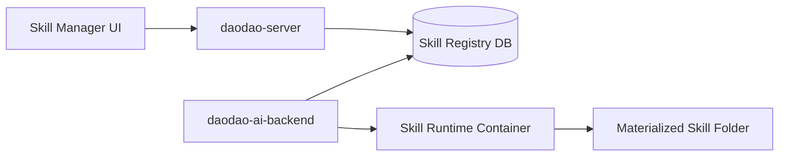
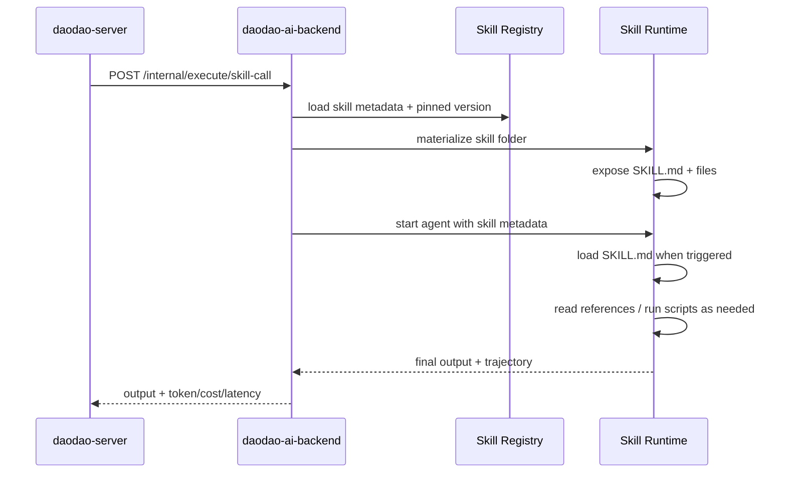
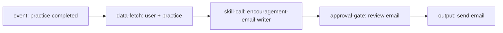

# Daodao Workflow：Skill 規劃對齊 Claude Agent Skills

本文件用來修正 daodao Workflow 規劃中 `workflow-skill-manager` / `skill-call` 與 Claude Agent Skills 官方模型之間的落差。

參考來源：

- Claude Agent Skills docs: https://platform.claude.com/docs/zh-TW/agents-and-tools/agent-skills/overview
- Anthropic skills repo: https://github.com/anthropics/skills

## 1. 官方模型重點

Claude Agent Skills 不是單純 prompt，也不是 workflow。它是可重用的能力包：

```text
skill-folder/
  SKILL.md
  scripts/
  references/
  assets/
  templates/
```

核心特性：

| 官方概念 | 意義 | 對 daodao 的要求 |
|---|---|---|
| `SKILL.md` 必備 | 每個 Skill 都是一個資料夾，入口是 `SKILL.md` | DB 不能只存 prompt，必須保存完整檔案包 |
| YAML frontmatter | 至少包含 `name`、`description` | UI/API 要驗證 frontmatter |
| `description` 是觸發條件 | Claude 依 description 判斷何時使用 skill | daodao Skill description 必須寫「何時使用」而不只是功能名 |
| 漸進式揭露 | metadata 先載入，SKILL.md 觸發時載入，scripts/references 需要時才讀 | `skill-call` 不能一次把所有檔案塞進 prompt |
| scripts 可執行 | scripts 提供 deterministic operations | scripts 需要 sandbox、審核、權限控管 |
| references/assets/templates 可按需讀取 | 大量資料不應全進 context | ai-backend 需支援按需 file access |
| Skills 可組合 | 多個 skills 可共同支援複雜任務 | Workflow 可串多個 `skill-call`，但每個 Skill 邊界要窄 |

## 2. Workflow vs Skill 邊界

| 問題 | Workflow | Skill |
|---|---|---|
| 什麼時候觸發？ | 是 | 否 |
| 要抓哪些 daodao 資料？ | 是 | 通常否 |
| 節點順序 / 分支 / 關卡？ | 是 | 否 |
| 是否寄信 / 寫 DB / 發通知？ | 是 | 否 |
| 特定領域如何判斷？ | 否 | 是 |
| daodao 語氣、教學策略、社群規範 | 否 | 是 |
| 可重用範例、reference、模板 | 否 | 是 |
| 可執行工具 scripts | 否 | 是 |

一句話：

> Workflow 負責 orchestration；Skill 負責 domain intelligence。

## 3. 舊規劃落差與修正方向

| 目前規劃 | 落差 | 調整 |
|---|---|---|
| `workflow_skills.skill_md` 存 SKILL.md 全文 | 只像 prompt store，沒有強化標準 skill folder | 保留 DB 儲存，但要把 Skill 視為 versioned file bundle |
| `workflow_skill_files` 有 scripts/references/assets | 方向正確，但缺少 templates、manifest/frontmatter 驗證、檔案安全策略 | 加 category `templates`，驗證 path/category/content |
| `skill-call` 載入 SKILL.md + scripts 工具 | 容易一次載入過多，違反漸進式揭露 | 只預載 metadata；觸發後讀 SKILL.md；references/scripts 按需讀取/執行 |
| UI Agent 可生成 Skill | 方向正確，但需要產出標準 `SKILL.md` 結構 | Agent 回傳 skill bundle diff，不只是 markdown diff |
| scripts 可作為 LLM 工具 | 官方模型是 Claude 透過 bash/file access 執行 scripts | daodao 要定義 sandbox/container 執行邊界，不應直接在 server 執行任意 script |

## 4. 修正後架構



### Skill Registry

DB 是 registry，不是 runtime。

Registry 保存：

- Skill metadata
- `SKILL.md`
- files
- versions
- review status
- author / updated_at
- safety audit metadata

### Skill Runtime

執行時，ai-backend 將 registry 中的 skill materialize 成標準資料夾：

```text
/tmp/skill-runtime/<run_id>/<skill_name>/
  SKILL.md
  scripts/
  references/
  assets/
  templates/
```

然後在 container/sandbox 中讓 agent 使用。

## 5. 建議 DB 調整

### `workflow_skills`

```sql
workflow_skills
- id
- name                    -- 對應 SKILL.md frontmatter name
- description             -- 對應 SKILL.md frontmatter description
- skill_md
- status: draft | active | archived
- current_version
- created_at
- updated_at
```

### `workflow_skill_files`

```sql
workflow_skill_files
- id
- skill_id
- version
- path                    -- scripts/foo.py, references/style.md
- category: scripts | references | assets | templates
- content
- bytes
- checksum
- executable
- created_at
```

### 新增 `workflow_skill_versions`

```sql
workflow_skill_versions
- id
- skill_id
- version
- skill_md
- changelog
- validation_status
- validation_errors
- safety_review_status: pending | approved | rejected
- created_at
```

## 6. `skill-call` 執行流程



Workflow node config 必須保存 `skill_id` 與建議保存 `skill_version`。正式啟用的 workflow 不應隱式跟隨 current version，避免 Skill 更新造成行為漂移。

## 7. Skill 設計規則

### Name

- lowercase
- hyphenated
- stable
- 不使用 `anthropic`、`claude`

例：

```yaml
name: encouragement-email-writer
```

### Description

Description 要描述「做什麼」與「何時使用」，因為它是觸發條件。

好：

```yaml
description: Generate warm, low-pressure encouragement emails for daodao learners after they complete a practice, using learner goals and practice reflections. Use when a workflow needs subject/body email copy for practice completion.
```

不好：

```yaml
description: Email writer.
```

### SKILL.md body

應包含：

- 任務邊界
- 輸入期待
- 輸出 schema
- 語氣規範
- 禁止事項
- 範例
- references/scripts 使用時機

## 8. daodao Skill 範例

```text
encouragement-email-writer/
  SKILL.md
  references/
    daodao-tone.md
    unsafe-phrases.md
  templates/
    practice-completion-email.json
```

`SKILL.md`：

```markdown
---
name: encouragement-email-writer
description: Generate warm, low-pressure encouragement emails for daodao learners after they complete a practice, using learner goals and practice reflections. Use when a workflow needs subject/body email copy for practice completion.
---

# Encouragement Email Writer

## Task

Generate email subject/body for a learner who completed a practice.

## Inputs

- learner name
- learner goals
- practice title
- completion context
- optional reflection

## Output

Return JSON:

{
  "subject": "...",
  "body": "..."
}

## Voice

- Warm, concrete, non-performative.
- Do not create pressure.
- Do not overpraise.
- Avoid claims about mental health or ability.

## References

Read `references/daodao-tone.md` if tone guidance is needed.
Read `references/unsafe-phrases.md` if writing external-facing copy.
```

## 9. Workflow 使用 Skill 的例子



Workflow 不寫完整文案規範，只指定：

- 何時觸發
- 抓哪些資料
- 使用哪個 skill
- 是否審核
- 最後寄去哪裡

Skill 才寫：

- 文案如何寫
- 語氣規範
- 輸出 schema
- examples
- references

## 10. 安全與治理

| 風險 | 控制 |
|---|---|
| 惡意 scripts | scripts 須 safety review，執行於 sandbox/container |
| references prompt injection | 外部來源 references 需審核與 checksum |
| Skill 描述過寬導致誤觸發 | description 寫清楚使用時機，UI 檢查 |
| Skill 修改影響多個 Workflow | versioning，Workflow pin skill version |
| 直接對外輸出錯誤內容 | Workflow 層 approval-gate |
| Token 過高 | 遵守漸進式揭露，不全量塞 prompt |

## 11. 規劃結論

daodao 應該把 Skill 規劃從「可編輯 prompt + 檔案」升級為：

> 符合 Claude Agent Skills 模型的 versioned skill bundle registry + sandboxed runtime。

Workflow 只 orchestration；Skill 才是可重用專業能力包。
