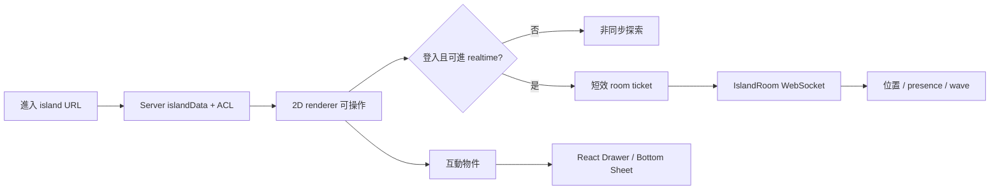

# 2D 空間小島（Spatial Island）PRD

> 狀態：P0 原型實作中，正式接線與上線驗收未完成
> 日期：2026-09-12
> 取代範圍：逐步取代 `/island/[identifier]` 的 3D renderer；不立即刪除既有 3D engine 與資產
> 相關文件：[3d-island-prd.md](./3d-island-prd.md)、[island/prd.md](./prd.md)、`openspec/changes/island-3d/`
> 2026-09-12 補充：[共同挑戰與活動情境](./shared-space-use-cases.md) 納入本 change；個人島與共享空間共用引擎，分別使用現有業務權限。

## 0. 執行摘要

將目前「單人、第三人稱、3D 展示島」改為 Gather-like 的 2D top-down 空間。保留每位使用者一座島、學習資料生成場景、訪島與互動物件；新增同島 co-presence，讓登入訪客能看見彼此並用 wave／emoji 打招呼。

第一版不複製 Gather 的完整視訊辦公室：不做 proximity audio/video、screen share、任意地圖編輯與公開文字聊天室。原因是個人島的同時在線密度不穩定，空島時仍必須能靠學習內容成立；即時互動是加值層，不是使用體驗的前置條件。

建議採雙軌 rollout：先以 feature flag 上線 2D renderer，再接多人即時層。既有 3D 保留一個版本作 rollback，驗證達標後才另案移除。

## 1. 需求背景與現況校準

原 3D PRD 的狀態文字已落後於程式碼。2026-09-12 實際盤點如下：

| 能力 | 真實狀態 | 本案處理 |
|---|---|---|
| `/island/[identifier]` 全螢幕頁 | 已實作 | 保留路由與 SSR shell |
| islandData 聚合與訪客隱私過濾 | 已實作，server 測試 15/15 通過 | 保留並 additive 擴充 world/capabilities |
| vanilla three.js engine | 已實作，engine 測試 76/76 通過 | 新建 2D engine，不原地改寫 |
| 群島、碼頭、船與換島 | 已部分超前原 OpenSpec | 保留「目的地探索」概念，改成 portal／碼頭 |
| 手機操作 | 有程式碼、未實機驗收 | 2D 改以 tap-to-walk 為預設並重驗 |
| 即時多人、presence、room | 未實作 | 本案新增 |
| 私訊／一般聊天 | `/messages` 仍是 placeholder | 不視為可沿用能力 |
| proximity audio/video | 未實作 | 不進 MVP |

這不是單純換皮。若只做 2D，是前端 renderer replacement；只要包含「同島看到其他人」，就會跨 `daodao-f2e`、`daodao-server`、`daodao-worker`，並可能需要 `daodao-storage` 保存島嶼設定。

## 2. 產品定位

> 使用者用 2D 分身走進一座由學習資料生成的島，藉由空間位置理解實踐、打卡、人物誌與連結；有人同時來訪時，可以看見彼此並以低壓力方式打招呼。

保留三個原始使用者意圖：

1. **看見累積**：將實踐與打卡變成可探索、會成長的空間。
2. **展示身份**：島嶼仍是一張可分享的學習名片。
3. **促成連結**：用 co-presence、wave 與連結 CTA 創造偶遇，但無人在線時仍能完整探索。

「Gather-like」在本案的明確定義是：2D top-down、tile/grid、角色走動、碰撞、互動物件、同房 presence。它不等於第一版就做視訊會議。

## 3. 目標與成功指標

### 3.1 產品目標

- 降低 3D 操作與裝置效能門檻，讓使用者更快理解島上內容。
- 提高訪島後的實踐瀏覽與連結行為。
- 驗證同島 co-presence 是否帶來有效互動，而非只增加技術成本。

### 3.2 Beta KPI

| 指標 | 建議門檻 | 說明 |
|---|---:|---|
| 入島後 30 秒內首次有效互動率 | ≥ 45% | 開啟實踐、人物誌、目的地或社交 CTA |
| 訪島 → 實踐詳情開啟率 | 相對現有 3D +20% | A/B 或 feature flag cohort 比較 |
| 訪島 → 關注／建立連結轉換率 | 相對現有 +10% | 排除島主本人 |
| 2D 走動放棄率 | < 20% | 入島後無移動、無 DOM 導覽、10 秒內離開 |
| p75 可操作時間 | 桌機 < 2.5s；中階手機 < 4s | avatar 可移動且核心物件可點 |
| 穩態 FPS | 桌機 60；中階手機 ≥ 30 | 20 人同島的 beta 上限情境 |
| WebSocket 重連失敗率 | < 2% | 斷線後 30 秒內未恢復 |

門檻需在 P0 用現況數據與目標裝置重新校準；以上不是 production 已達成值。

## 4. User Story

- As an 島主, I want 我的學習累積自動長成一座 2D 小島, so that 我能快速看見進度且不用手動蓋圖。
- As a 訪客, I want 走近營地就能查看公開實踐, so that 我能理解島主正在學什麼。
- As a 登入訪客, I want 看見同島上的其他人並打招呼, so that 偶遇可以自然變成連結。
- As a 手機使用者, I want 點選目的地即可移動, so that 我不需要精準操作虛擬搖杆。
- As a 鍵盤或螢幕閱讀器使用者, I want 透過 DOM 地點清單完成所有核心操作, so that Canvas 不會成為唯一入口。
- As an 島主, I want 控制誰能即時進島並移除干擾者, so that 我的個人空間可被安全管理。

## 5. 功能範圍

### 5.1 2D 地圖與資料映射

- 地圖採約 40×40 logical tiles；實際尺寸由 P0 可用性測試調整。
- 視覺 layer 與邏輯 layer 分離：background、decoration、collision、spawn、portal、interaction zone。
- `user_id + personaType + islandData + mapVersion` 決定 deterministic 佈局；同版本下島主與訪客所見一致。
- active practice → 帳篷／燃燒營火；completed practice → 小屋。
- checkin ids → 植栽與生態裝飾；recentCheckinCount 只增加熱鬧度，不做斷卡懲罰。
- persona → avatar、tileset 色盤與環境裝飾；未完成人格測驗使用中性主題。
- 人物誌 → 告示牌／日誌本；目的島 → 碼頭 portal。
- 內容詳情繼續用 React Drawer／Bottom Sheet，不在 Canvas 畫長文。

### 5.2 移動與互動

- 桌機：WASD／方向鍵移動；點地後 A* 自動尋路；`E`／Enter 互動。
- 手機：tap-to-walk 為預設；可選虛擬搖杆，不作唯一輸入。
- avatar 不互相碰撞，避免堵路；牆與物件依 collision layer 阻擋。
- 每個互動物件使用一致 contract：`id/type/position/activationRadius/visibility/action/payload`。
- 靠近物件顯示單一主要動作；點擊、鍵盤與觸控按鈕皆可觸發。
- 外部連結只開新分頁；MVP 不允許任意 iframe 或自訂 script。

### 5.3 同島 co-presence（MVP）

- 只有登入帳號能加入 realtime room；匿名訪客仍可非同步瀏覽公開內容。
- 每座島是一個 coordination room，beta 同房上限 20 人。
- 同步最小狀態：user id、display name、avatar、tile/position、方向、move/idle、availability、wave/emoji。
- 客戶端插值呈現；服務端驗證 room、速度、頻率、地圖邊界與合理碰撞 envelope，拒絕 teleport。
- 初次連線收到 snapshot；斷線 exponential backoff，重連後重新取得 snapshot。
- DND 使用者仍可見，但不顯示交談 CTA；被 block 的雙方互相不可見且不能互動。
- 島主可關閉 realtime、限制為 connections、kick 訪客；平台需有 report／ban 接點。
- 位置與 presence 是 ephemeral，不寫 PostgreSQL。

### 5.4 社交互動邊界

MVP 包含 wave／emoji、查看 profile、關注／建立連結。MVP 不含公開或近距文字聊天，以免在一般訊息、block/report 與 moderation 尚未完成時建立第二套訊息系統。

第二階段可做近距文字泡泡；若需要永久歷史，應先把尚未實作的 `group-messages` 設計泛化為 `cohort | island | space` scope，共用 `/messages`、未讀、刪除與檢舉契約，不另建 `island_messages`。

### 5.5 無障礙與 mobile 等價體驗

- 提供平行 DOM 地點清單：進行中的實踐、人物誌、碼頭、附近人物；使用者可直接跳轉或開啟內容。
- Canvas 取得 focus 時說明操作；Esc 可離開，不形成 keyboard trap。
- 使用 `aria-live` 宣告靠近物件、玩家進出與斷線狀態。
- 支援 `prefers-reduced-motion`；關閉鏡頭滑動、粒子與非必要動畫。
- 互動按鈕建議至少 44×44 CSS px，狀態不可只靠顏色表達。
- 螢幕閱讀器使用者不操作地圖也能查看所有有權看到的內容與社交動作。

## 6. 主要流程

1. 使用者由個人頁、連結或碼頭進入 `/island/[identifier]`。
2. Server 以觀看者身分聚合並過濾 islandData，回傳 2D world bootstrap 與 capabilities。
3. Client 載入 collision、spawn、avatar 與首屏物件；可操作後收掉 loading。
4. 未登入者停留在非同步探索模式；登入且有權者向 server 申請短效 room ticket。
5. Client 以 ticket 連到 realtime Worker；進入 owner 對應的 room，收到 snapshot。
6. 使用者走近物件，以 Canvas 或 DOM 控制開啟 React 詳情。
7. 遇到其他登入訪客時，可 wave／emoji、查看 profile 或建立連結。
8. 換島時先離開舊 room，再載入新島 bootstrap 與新 ticket；失敗則保留原島或顯示可恢復錯誤。

## 7. 權限與隱私

| 角色 | 看公開島 | 加入 realtime | 看 connections-only 實踐 | 管理訪客 |
|---|---:|---:|---:|---:|
| 島主 | 是 | 是 | 是 | 是 |
| connection | 依島設定 | 依島設定 | 是 | 否 |
| 登入訪客 | 依島設定 | 依島設定 | 否 | 否 |
| 匿名訪客 | 公開島可看 | 否 | 否 | 否 |
| 平台 moderator | 稽核需要時 | 稽核需要時 | 依內部權限 | kick/ban |

- 既有 practice privacy 規則維持 server-side deny-first；私有資料不得進前端 payload。
- realtime ticket 建議 60 秒內到期、一次 room scope、包含 user/role/capabilities；主站 auth token 不放 URL query。
- 島主 visibility 與 realtime 開關屬 durable product state；位置、方向、wave 屬 ephemeral state。

## 8. 技術方案與子專案分工

### 8.1 `daodao-f2e`

- 新增獨立 `packages/features/island-world-2d/`，不原地改寫 `island-engine`。
- P0 比較 Phaser + Tiled 與 PixiJS + 自建 grid；預設推薦 Phaser + Tiled，以降低 tilemap、碰撞、相機與輸入的自建成本。
- 保留現有 dynamic import 與 engine/React callback 邊界；抽出 renderer-neutral island shell。
- 新增 realtime adapter、remote avatar interpolation、DOM 導覽、斷線與重連狀態。
- 以 feature flag `3d | 2d` 漸進 rollout；禁止第一輪直接刪 GLB 與 3D package。

### 8.2 `daodao-server`

- 保留 `GET /api/v1/users/{identifier}/island`，additive 增加 `world` 與 `capabilities`。
- 新增 `POST /api/v1/users/{identifier}/island/session`：驗證登入、島設定、connection 與封鎖關係，簽發短效 room ticket。
- Server 與 PostgreSQL 維持身份、ACL、學習資料與 durable settings 的權威來源。
- 產出 OpenAPI contract，f2e generated types 禁止手改。

### 8.3 `daodao-worker`

- P0 建議驗證 Durable Objects + WebSocket Hibernation API；一島一個 `IslandRoom`，以 deterministic room name 分片，不建立 global DO。
- DO 處理 join/snapshot/move/leave/wave、rate limit、heartbeat、room broadcast；不保存學習內容。
- Hibernation 後連線 metadata 必須可恢復；不能只依賴 module-level 或一般 in-memory state。
- 加入 structured logging 與 room connections、reconnect、rejected movement、message drop 指標。

### 8.4 `daodao-storage`

P1 renderer replacement 不需 schema。多人 beta 前新增：

- `user_island_settings(user_id UNIQUE, access_level, realtime_enabled, map_template_key, map_version, updated_at)`。
- 若現有 block/report 無可用契約，再另案補 moderation tables；不能用 UI 假裝能力存在。
- 自由佈置延後才新增 `user_island_layouts(user_id UNIQUE, revision, layout JSONB, updated_at)`。
- 不建立 presence／position table。

### 8.5 `daodao-infra` / `daodao-ai-backend` / `daodao-admin-ui`

- infra：Worker domain、CORS/origin、secrets、preview/prod bindings、WebSocket smoke 與 observability。
- ai-backend：MVP 無需求。
- admin-ui：MVP 只在既有治理能力不足時新增 report/ban 查詢與處理頁；需另列明確 scope。

## 9. 分期與 Gate

| Phase | 範圍 | Gate | 粗估 |
|---|---|---|---:|
| P0 產品/技術 Spike | 一張 2D 圖、1 avatar、3 物件、桌機/手機、兩 client DO room | 品牌感、操作、mobile FPS、room auth、重連皆過 | 1–2 週 |
| P1 2D renderer beta | 完整資料映射、DOM 導覽、feature flag、3D rollback | owner/connection/visitor visual + privacy E2E；KPI 可量測 | 3–4 週 |
| P2 co-presence beta | settings、ticket、IslandRoom、remote avatar、wave、owner control | 20-client load、跨房隔離、冒用/超速/重連測試 | 3–4 週 |
| P3 近距文字與治理 | nearby bubble 或泛化 durable chat、block/report/mute | moderation、rate limit、audit、訊息權限完整 | 2–4 週 |
| P4 共有空間 | Circle/cohort/space map、編輯器；另案評估 A/V | 同時在線密度與使用需求已證明 | 另案 |

粗估假設：1 位 frontend、1 位 backend/worker、0.5 位 designer/artist，QA 參與各 gate；P1/P2 可局部平行。未經 P0 不承諾 production 日期。

## 10. 驗收條件

### AC-01 2D 島可探索

- Given 使用者有權查看某島
- When 開啟既有 island URL
- Then 看到 deterministic 2D 地圖，能用鍵盤或 tap-to-walk 移動，並可開啟有權查看的實踐內容

### AC-02 隱私不回歸

- Given 訪客不是島主或 connection
- When 取得 island bootstrap 或加入 realtime
- Then payload 不含 private/connections-only practice；無權者拿不到 room ticket

### AC-03 同島 presence

- Given 兩位已登入且有權的使用者進入同一座島
- When 任一方合法移動或 wave
- Then 另一方在目標延遲內看見更新；進入不同島時不會收到事件

### AC-04 防止 client 冒用

- Given client 修改 user id、room id、速度或座標
- When realtime service 收到事件
- Then 事件被拒絕、記錄安全 telemetry，且不廣播給其他使用者

### AC-05 斷線降級

- Given WebSocket 不可用或中途斷線
- When 使用者仍在島上
- Then 學習內容仍可探索；UI 清楚顯示離線並有限重試，不阻塞核心功能

### AC-06 可及性等價

- Given 使用者只用鍵盤或輔助科技
- When 不操作 Canvas
- Then 可從 DOM 清單到達每個核心內容與社交 CTA，且無 keyboard trap

### AC-07 rollback

- Given 2D beta 發生嚴重 regression
- When 管理者切回 3D feature flag
- Then 既有 URL、islandData 與主要內容可恢復，不需資料回滾

## 11. Edge Cases

| 情境 | 預期處理 |
|---|---|
| 空島／新使用者 | 中性地圖、熄滅營火與第一個實踐 CTA；仍可走動 |
| 物件太多 | 聚合／分區顯示，避免一 checkin 一 sprite 無上限成長 |
| 出生點被物件占用 | 從安全 spawn 清單選下一格；無可用點則用固定 fallback |
| 換島途中失敗 | 保留原島或回安全畫面；舊 room 正確 leave |
| 多分頁同帳號 | 每個 connection 有獨立 session id；presence UI 可合併同 user |
| DO hibernation／重啟 | 從 WebSocket attachment 與 client snapshot 恢復；不假設記憶體仍在 |
| 島主關閉 realtime | 已連線訪客收到關閉事件後斷線，非同步瀏覽依 visibility 決定 |
| 房間達 20 人 | 拒絕新 realtime join 並保持非同步瀏覽；不靜默分流造成看不到朋友 |
| blocked user 同島 | 雙向不顯示、不互動；server/worker 都需 enforce |
| reduced motion／低效能 | 關閉粒子和環境動畫、限制 30fps，不移除核心內容 |

## 12. 風險與緩解

- **產品密度風險**：個人島多數時間沒人。co-presence 只作 bonus；空島仍有完整內容與非同步 CTA。
- **scope 膨脹**：Gather 同時暗示多人、聊天、A/V、地圖編輯。以本 PRD 的 MVP/non-goals 作變更控制。
- **renderer regression**：現有 3D 完成度高。新 package + feature flag + 對照 E2E，驗證後才移除。
- **realtime 安全**：client-authoritative movement 可被濫用。ticket scope、server validation、rate limit、room isolation 測試缺一不可。
- **moderation 缺口**：現有一般 chat/block/report 不完整。MVP 不做公開文字；owner kick 與平台 ban 必須先於文字互動。
- **mobile/accessibility**：Canvas 容易形成操作與閱讀障礙。tap-to-walk、DOM parallel navigation、reduced motion 是 launch gate。
- **Cloudflare 鎖定與成本**：DO 適合一島一協調原子，但仍需 P0 驗證 hibernation、連線量、成本與 preview smoke。
- **文件互相衝突**：`island-3d`、`group-messages` 與本案有交叉。進入 implementation 前需標註 supersede/depends-on，避免三套 chat/room contract。

## 13. 明確 Non-goals（MVP）

- proximity audio/video、screen share、裝置權限流程
- 公開／nearby 文字聊天與永久聊天歷史
- 完整 Mapmaker、任意 tileset／iframe／script 上傳
- avatar 彼此物理碰撞
- 大型活動、百人同圖、自動 instance 分流
- 匿名使用者加入 realtime 或發言
- 跨島無縫航行
- 第一輪刪除 3D engine、GLB 或原 OpenSpec

## 14. 需求補洞報告

### PM 視角

- [ ] 決定「2D 畫風」是 pixel art 或品牌插畫；兩者素材成本差異大。
- [ ] 確認第一個 beta cohort 與現況 3D KPI baseline。
- [ ] 決定 realtime access 預設為 public 或 connections-only（建議 connections-only）。

### UI/UX 視角

- [ ] P0 實測 40×40 地圖密度、互動距離、tap-to-walk 與 DOM 導覽。
- [ ] 補 avatar、方向、wave、DND、斷線與 room full 的完整 state design。
- [ ] 定義手機 Bottom Sheet 與 Canvas focus 行為。

### Backend 視角

- [ ] 盤點並統一 block/report/ban 真實 contract；不存在就另列 storage/server/admin scope。
- [ ] 定義 ticket 簽章、rotation、origin、TTL、重放與撤銷策略。
- [ ] 若 P3 做 durable chat，先解決 `group-messages` scope 泛化，不平行建立島嶼專用訊息表。

### Frontend 視角

- [ ] P0 比較 Phaser/Tiled 與 PixiJS，量 bundle、首次可操作時間與 mobile FPS。
- [ ] 定義 renderer-neutral shell，避免 2D/3D React UI 複製。
- [ ] 建立 sprite atlas、map version 與 cache invalidation 規則。

### QA 視角

- [ ] 準備 empty/full/owner/connection/visitor 五組 deterministic fixtures。
- [ ] 補兩 browser contexts 的 join/move/leave/reconnect E2E。
- [ ] 定義 20-client preview load、封鎖、冒用、超速與跨房隔離測試。

## 15. 開發前必確認問題與建議預設

1. **是保留「每人一島」還是改成全站共同大廳？** 建議先保留每人一島；共有廣場等證明 co-presence 有價值後再做。
2. **MVP 是否一定要文字／語音／視訊？** 建議都不進；MVP 先用 presence + wave + 現有 profile/connection 行為驗證需求。
3. **畫風要多像 Gather？** 建議借互動語法，不複製視覺；以島島既有品牌色與角色重畫 2D sprites。
4. **手機是否要求與桌機相同操作？** 建議要求功能等價，不要求輸入相同；手機預設 tap-to-walk。
5. **何時移除 3D？** 建議 2D beta 達 KPI、跨裝置驗收完成且 rollback 觀察期結束後另開 cleanup change。

## 16. 改善摘要

| 維度 | 原始一句需求的缺口 | 本 PRD 的處理 |
|---|---|---|
| 結構 | 「像 Gather」無法直接估 scope | 拆成 2D renderer、co-presence、chat、A/V 四層 |
| 敘述 | 未定義保留個人島或共同大廳 | 推薦保留個人島，共有廣場後置 |
| 流程完整性 | 缺匿名、斷線、換島、滿房與降級 | 補主流程、edge cases 與 rollback |
| 命名一致性 | 3D 小島、Gather 模式混用 | 統一稱 2D 空間小島／Spatial Island |
| 需求明確度 | 未定義 MVP | 明確納入 2D、presence、wave；排除 chat/A/V/editor |

## 17. 參考資料

- [Gather Mapmaker Overview](https://support.gather.town/articles/9657827678-mapmaker-overview)
- [Gather Sizes](https://support.gather.town/articles/9253868124-sizes)
- [Gather Moving Around](https://support.gather.town/articles/1285650718-looking-moving-around-the-office)
- [Gather Spatial Audio & Video](https://support.gather.town/articles/4624155403-overview-of-spatial-audio-video)
- [Gather Chat](https://support.gather.town/articles/2360216656-overview-of-chat-for-remote-office-spaces)
- [Gather Mobile Browsers](https://support.gather.town/articles/7619450362-gather-1-0-on-mobile-browsers)
- [Gather Accessibility](https://support.gather.town/articles/1489858946-accessibility-best-practices-for-inclusive-space-design)
- [Gather Moderation Tools](https://support.gather.town/articles/3793376358-moderation-tools-mute-block-kick-ban-users)
- [W3C WCAG 2.2](https://www.w3.org/TR/WCAG22/)
- [Cloudflare Durable Objects WebSockets](https://developers.cloudflare.com/durable-objects/best-practices/websockets/)

> 研究工具註記：本次完整 callable inventory 未掛載 Groundlane；公開產品與平台資料以可用 fallback 讀取，不能作為 Groundlane 路徑已驗證的證據。
