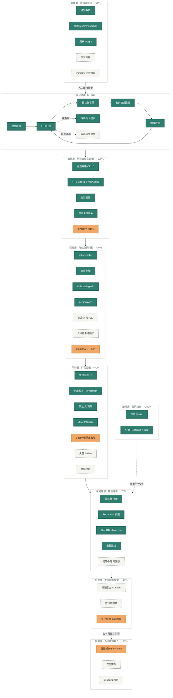

# 島島阿學的學習生態圈：完整描述

> 以「學習生態圈」框架重新梳理島島阿學的所有服務。
> 校準日期：2026-07-06。功能狀態以當日全 repo 程式碼盤點為準，docs/product 各 PRD/FRD 僅供對照（多份文件狀態落後於程式碼，見「結構性事實」第一點）。

## 一、為什麼要用生態圈的視角

島島阿學目前的服務清單超過二十項：主題實踐、打卡、Buddy、共同挑戰、靈感牆、我的小島、人物誌、許願池、學習週報、島島 AI、訂閱系統……如果用「功能列表」的方式看，它們是二十多個獨立的開發項目，彼此之間只有優先序的競爭關係。

但島島的產品文件裡有一句定位金句：「不是內容提供者，而是**學習連接器**」。這句話決定了正確的觀看方式不是功能列表，而是生態系——因為連接器的價值不在任何單一節點，而在**節點之間的能量流動**。生態圈視角回答的問題是：誰在生產養分？養分怎麼流動？誰消費它、誰分解再利用它？外部能量（金錢、注意力）從哪裡輸入？哪個環節斷掉會讓整個系統死亡？

用這個視角看，二十多個功能會重新排列成八個層次，而且會浮現出功能列表看不見的結構性問題。

## 二、核心命題：實踐（Practice）是生態圈的有機質

生態系運作的基礎是有機質的循環——生產者製造它，消費者使用它，分解者把它變回養分。島島這個生態圈的有機質，就是「主題實踐」。

島島最關鍵的設計，不是任何單一功能，而是**同一份學習實踐會在圈內轉化成至少五種不同的養分**：

1. **對學習者本人**，實踐加上打卡（心情、筆記、照片、標籤）是一份行動記錄，承載「想做 → 評估 → 盤點 → 規劃 → 達成」這條島島的核心方法論。
2. **對社群**，打卡進入靈感牆（Inspire Feed）之後，變成公共空間裡的內容。別人滑到你的打卡，看見「有人正在做跟我類似的事」——這正是 Buddy 文件裡定義的、對抗學習孤立感的核心價值。
3. **對其他學習者**，公開實踐可以被「複製至我的實踐」。複製只帶走結構與資源清單，不帶走打卡與進度，等於把一個人走過的路變成另一個人的起點。複製次數又回頭成為熱度信號，幫助好的實踐浮上來。
4. **對配對與推薦系統**，實踐的主題與技能標籤是 Buddy 配對和「探索相關主題」推薦的基質——系統靠它判斷誰跟誰相似、該推什麼給誰。
5. **對學習者的對外身份**，實踐加打卡加最終覆盤，未來可以匯出成帶數位驗證章的作品集（PDF 或可匯入 Obsidian 的 Markdown），變成履歷等級的信譽資產。

這就是養分循環：**建立實踐 → 打卡行動 → 被社群看見 → 收到回應 → 動機回流 → 更多行動**，主循環之外分岔出兩條支線——複製鏈（養分再利用，已上線）與資產匯出（果實收成，規劃中）。

一個關鍵的現實校正：逐一核對 server、ai-backend、f2e 的程式碼後確認，**這條主循環已經通電**。靈感牆 feed、六種快速回應（encourage、touched、fire、useful、sameHere、curious）、兩層留言含 @mention、關注與連結、複製實踐的 API 與前端全部已實作——儘管多份 PRD/FRD 仍標示「規劃中」。島島今天缺的不是迴圈本身，而是量測迴圈是否在轉的儀表，以及放大它的高階機制。

## 三、生態系全景圖

下圖以顏色標示通電度：🟩 已上線、🟧 部分實作、⬜ 規劃中（虛線）。三條虛箭頭是生態圈的關鍵動力學——先有果實才收費、節律層人工維持迴圈節奏、治理層的策展扮演分解者。

## 四、八層生態：每個服務的位置

### 第一層：個體層——學習者核心迴圈（通電度約 100%）

這是生態圈的最底層，也是唯一從第一天就完整運轉的一層。包含主題實踐的建立、讀取、更新、刪除；打卡流程（入口有實踐詳情、打卡記錄、首頁三處，含 24 小時冷卻警告、期間檢查、四步 Dialog：心情 → 筆記 → 照片 → 標籤）；複製實踐（`POST /practices/:id/copy`，且掛上了 onboarding hook，已經是啟動漏斗的一環）；以及第一個落地的主題實踐「買車決策助手」。卡片顏色階段一（前端循環配色）部分交付。

這一層體現了島島的四大設計哲學：順應而非對抗、利用現有行為模式、降低認知負擔（零決策）、順應人性弱點。具體到打卡設計：不顯示中斷天數、重啟零摩擦、警告但不阻止 24 小時內重複打卡——全部是「不製造壓力」的刻意選擇。

### 第二層：引導層——降低啟動門檻的共生者（通電度約 70%）

生態學裡的共生者幫宿主做它自己做不好的事。這一層幫學習者跨過「想做但不知道從哪開始」的門檻：action-maker（worker 上的 AI 行動產生器，已上線）、quiz 測驗（已上線）、Onboarding 三路徑引導（S1 直接註冊、S2 測驗導向、S3 AI 工具導向，API 已存在）、persona API（已存在）。

規劃中的部分是這一層的完全體：島島 AI 的雙軌入口（側邊欄全域探索＋建立頁情境輔助，把目標拆成一到三個 30 分鐘內可執行、少於 30 字的微行動，配每日額度分級制）、人物誌的「漸進式顯影」（不在註冊時問完，用每日探針卡片慢慢拼出學習 DNA，再注入 RAG 影響 AI 建議權重）。

這一層有個值得注意的空白：**mentor API 存在於 server 的路由裡，但 docs/product 沒有任何對應的產品規劃**。導師供給機制是整個引導層唯一沒有人負責思考的部分。

### 第三層：同儕層——群落互動（通電度約 70%）

生態圈的「群落」在這一層形成。輕互動已經全部通電：六種快速回應（設計上是「按讚的升級版」，點完自動聚焦留言框並依反應換 placeholder，解決空白留言框焦慮）、兩層留言與 @mention、關注（單向低承諾，可關注人也可關注單一實踐）、連結（雙向高承諾，需同意，設計中有互動少於三次強制填 50 字初衷、三次以上信任豁免的動態門檻）。

重承諾機制還在藍圖上：Buddy 目前只有請求的發送與接受，缺配對推薦（以同 template、標題關鍵字的「相似」而非精確配對）、每日聚合打卡通知、連續五天未打卡的守望相助、里程碑慶祝，以及整個核心設計物「火苗（Ember）」——每對 Buddy 共有一簇火苗，打卡是燃料，火苗轉暗時損失的是「我們的共同進度」而非對個人的懲罰。共同挑戰（官方發起的高可見性群體活動，參與者有完整留言權、圍觀者只能給快速回應的分層互動設計）完全未動工。

火苗有兩個未拍板的設計決策（數值公式、Buddy 留言的公開/私密策略），是實作的前置。

### 第四層：可見性層——能量傳導介質（通電度約 70%）

沒有可見性，個體層產生的能量就傳不出去。這一層已上線的有：靈感牆 feed（ai-backend 供給，設計上以五到六格固定節奏交替排列打卡、互動、實踐卡片，冷啟動時有保護機制）、Social Hub 頁面、展示廣場 showcase、瀏覽追蹤 view-tracking。

規劃中的是「我的小島」完整版——使用者的身份核心與成長地圖：Identity Header（Headline、About Me、社群連結）、成長雷達圖與近七天實踐次數放在視覺核心、刻意弱化人脈數（可隱藏連結數避免人脈焦慮）。展示廣場的完全體（過濾、排序、鼓勵上傳草稿與失敗經驗的反完美主義策展）也在這層。

### 第五層：信號層——生態圈的果實（通電度約 10%）

這是學習者「收成」的一層，幾乎全部待建：實踐歷程資產化匯出（品牌排版 PDF、帶 YAML front matter 的 Markdown）、數位驗證章（至少 14 天且三個洞察驗證的品質門檻）。設計上刻意捨棄按讚數，改用三個質化指標：Insightful（洞察標記數）、Referenced（被存入靈感庫次數）、Witnessed（同技能標籤者閱讀數）——其中 reaction 資料已經在累積（useful 反應約等於 Insightful 的前身）。

（原列於本層的 ESCO 標準化技能標籤，因實作難度高已先擱置——標準化技能分類牽涉龐大的 ESCO 對照資料與中英標籤維護，投報比不佳。信號層的技能標籤先用實踐既有的自由標籤支撐即可。）

這一層在生態圈裡的意義重大：它是學習過程轉成**可攜帶信譽**的地方，是「結業式」的成就感來源，也是最自然的付費點——這決定了它跟經濟層的先後關係。

### 第六層：節律層——生態圈的季節與氣候（通電度約 50%）

生態系有季節，學習生態圈也需要節奏機制。已上線：通知系統（反應/留言/關注/連結請求等觸發、In-App 與 Email 分流）、推薦（recommendation，設計上每張推薦卡必附「因為你正在練日文」式的推薦理由）、洞察（insight）。

規劃中：學習週報（每週一早上九點，把隱形努力轉成可見進度、給中斷者返回路徑而非負罪感）、以及最重要的 **workflow 旅程引擎**——一套營運可配置的「觸發 → 抓資料 → 判斷 → 關卡 → 行動」自動化系統，支撐 Onboarding 漏斗、完成鼓勵信、守望相助等五十個候選場景。用生態圈的語言說，workflow 引擎是**人工氣候系統**：在群落密度還不足以自我維持時，用自動化旅程人工維持能量循環的節律。

### 第七層：治理層——共同演化（通電度約 100%）

許願池與公開 Roadmap 已完整上線：兩層資料模型（原始許願僅團隊可見，策展改寫成公開路線圖項目）、一人一項目一票、免登入可瀏覽的公開 `/roadmap` 頁。

這一層有個被低估的意義：「團隊策展改寫」的模式，正是生態圈裡**分解者**的原型——把原始、參差的輸入提煉成公共資產。目前這個模式只用在產品回饋上，但它完全可以延伸到學習內容：誰來把大量中斷、失敗、品質不一的實踐提煉成好的模板？複製鏈的品質靠什麼維持？島島已經演練過答案，只是還沒把它用在最需要的地方。

### 第八層：經濟層——外部能量輸入（通電度約 10%）

訂閱系統的資料庫 schema、Prisma 模型、API 契約文件都已完成，但 API 端點、業務邏輯、支付整合全部未實現。四級方案（Free/Basic/Premium/Enterprise）的框架存在於紙上。

生態圈視角對這一層有明確的建議：**收費點應該對齊生態圈產生的價值，而不是功能解鎖**。對「卡片自訂色」收費，是在對裝飾收費；對「數位驗證章、AI 額度、資產匯出」收費，是在對學習者的收成收費——付費時刻與收穫時刻重合，付費就不是阻力而是收穫儀式。這也決定了經濟層必須排在信號層之後：先有果實，才有東西可賣。

## 五、這個視角揭露的四個結構性事實

**第一，島島已經從「單機版」畢業，但自己還不知道。** 文件狀態普遍落後程式碼：快速回應、留言、關注連結、複製、feed、許願池在 PRD/FRD 裡都還標「規劃中」，實際上全部已實作。這不只是文件債——每一次以文件為地圖的規劃討論，都建立在錯誤的現實上。依島島自己的工作守則「文件與 codebase 現實衝突時以現實為準並修正文件」，這需要一次系統性的回寫。

**第二，生產者結構單一，是最大的長期風險。** 目前所有內容都由學習者自產。沒有導師供給機制的規劃（mentor API 是孤兒）、沒有外部資源方的接入設計。設計哲學明說「連接 YouTube/Podcast/Line，不自建封閉生態」，但現有功能幾乎都是站內閉環。生態學的教訓是：單一物種的生產者結構極度脆弱——冷啟動期內容密度不足會讓靈感牆和推薦系統空轉，而任何讓學習者停止產出的因素都會讓整個系統窒息。

**第三，分解者缺位。** 平台會持續累積中斷和失敗的實踐，目前只有搜尋的關鍵字檢索和「鼓勵上傳失敗經驗」的文案態度，沒有系統性的策展機制。許願池的策展模式是現成的解答原型，值得移植。

**第四，指標體系量的是個體，不是生態。** 北極星「註冊三天內建立第一個實踐」、主題完成率、留存率——全部是個體迴圈指標。它們回答「單個學習者有沒有動起來」，回答不了「這是不是一個活的生態圈」。

## 六、生態指標：從個體升級為網絡

生態圈的健康要看能量是否在成員**之間**流動。以下六個指標全部可以從既有資料表計算，不需要新增任何埋點：

| 指標 | 定義 | 量什麼 | 資料來源（既有） |
|------|------|--------|------------------|
| 回應率 | 打卡後 72 小時內獲得 ≥1 個快速回應或留言的比例 | 迴圈最基本的心跳：能量有沒有有去有回 | check-ins × reactions × comments |
| 能量回流率 | 收到回應後 7 天內再次打卡的使用者比例 | 社會回饋是否真的轉成學習動機（核心假設驗證） | reactions／comments → 後續 check-ins |
| 複製鏈長度 | 每月被複製的實踐數；「複製的複製」（第二代以上）佔比 | 養分再利用——內容是否成為他人的起點 | 複製實踐的來源記錄 |
| 連結密度 | 月活躍用戶中擁有 ≥1 個連結（或 ≥3 個關注）的比例 | 群落是否在形成 | connections × follows |
| 生產者多樣性 | 內容來源的類型數（自產／模板策展／導師／外部資源） | 生態抗脆弱性——目前恆等於 1，把結構風險量化 | practices＋未來 mentor／資源接入 |
| Buddy 存活率 | 配對後 14 天內雙方皆仍有打卡的配對比例（火苗上線後） | 重承諾關係是否真的產生陪伴效果 | buddy-requests × check-ins |

同時延續島島既有的指標戒律：連續打卡天數、學習時長、嚴格 deadline 達成率**仍然禁用**。生態指標的原則是「量流動、不量壓力；量網絡、不量個人耐力」——所有指標衡量的都是「之間」發生的事，沒有一項會變成壓在使用者身上的計數器。

## 七、行動順序：量測 → 放大 → 對齊變現

**第一步：量測。** 兩件低成本高槓桿的事——(a) 生態儀表板：六個網絡指標的可視化，資料都在 PostgreSQL 裡，ai-backend 的 insight 路由和 admin-ui 骨架都是現成的，主要涉及 ai-backend 與 admin-ui 兩個 repo；(b) docs/product 狀態回寫，只動 daodao 主 repo 的文件。沒有儀表板，後面所有投入都無從得知有沒有讓生態更健康。

**第二步：放大。** 針對儀表板顯示最弱的環節投入：回應率低，先做快速回應後的留言引導（workflow 引擎的 MVP 場景之一）；回流率低，先做學習週報與 Buddy 火苗。火苗要先解決兩個未拍板的設計決策再開工，涉及 storage、server、ai-backend、f2e 四個 repo。資產匯出是相對獨立的工程（server＋f2e），不牽動跨 repo contract，可以並行。workflow 引擎按文件建議先用 scheduled scan 跑兩三條旅程驗證，再建正式的 journey state tracking。

**第三步：對齊變現。** 信號層有果實之後，訂閱才有生態價值可賣。訂閱的實作（server API、支付整合、f2e 前端、admin-ui 管理）排在資產匯出與驗證章之後，收費點綁定驗證章、AI 額度、資產匯出。

---

一句話總結這整個視角：**島島阿學已經建成了一個學習生態圈的骨架，而且主循環已經通電——現在它需要的不是更多器官，而是一套神經系統（量測）、幾個放大器（火苗、週報、旅程引擎），和一個跟收成對齊的能量入口（訂閱）。**
