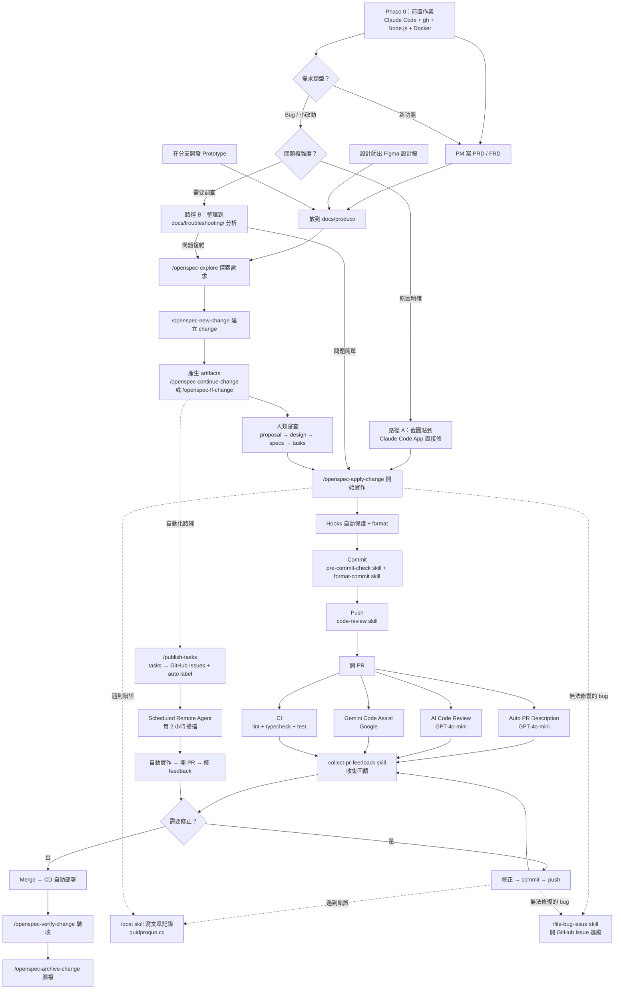
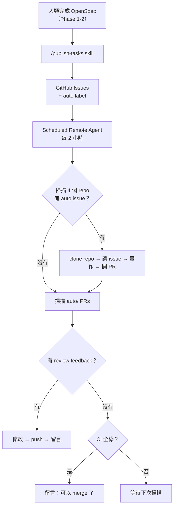

# 島島阿學開發工作流程

## 簡介

島島阿學（daodao）是一個由多個子專案組成的教育平台，涵蓋前端、後端、AI 服務、資料庫、基礎設施與背景任務。隨著專案規模成長，我們建立了一套從需求到部署的完整工作流程，核心理念是：

1. **規格先行** — 用 OpenSpec 將模糊需求轉化為可執行的工程任務，避免開發方向偏移
2. **自動化品質守護** — 透過 hooks、CI/CD、AI Code Review 等機制，讓品質檢查發生在每一個環節
3. **人類保有最終決策權** — 自動化處理繁瑣工作，但每個關鍵節點（規格審查、commit 確認、PR merge）都由人類做最終判斷

本文完整記錄這套流程的每一個階段。

---

## 全貌

整個開發流程可以分為 10 個階段（Phase 0-9）：



---

## Phase 0：前置作業

在進入開發流程之前，需要先把工具鏈設定好。以下是每位開發者加入時需要完成的環境設定。

### 0.1 AI 輔助開發工具

| 工具 | 用途 | 安裝方式 |
|------|------|---------|
| **Claude Code** | 主力 AI 開發工具，執行 skills、hooks、OpenSpec 流程 | `npm install -g @anthropic-ai/claude-code` |
| **GitHub Copilot CLI** | GitHub 的 CLI agent | `npm install -g @github/copilot` |
| **Codex CLI** | OpenAI 的 CLI agent，可作為替代方案 | `npm install -g @openai/codex` |

Claude Code 是這套工作流程的核心 — 文件中提到的所有 skills（`/openspec-*`、`/format-commit`、`/code-review` 等）都在 Claude Code 環境內執行。安裝後需要登入 Anthropic 帳號。

### 0.2 GitHub CLI（gh）

整個流程大量依賴 `gh` 指令：開 PR、建 issue、查看 CI 狀態、收集 review feedback。

```bash
# macOS
brew install gh

# 登入
gh auth login
```

登入後確認可以存取團隊的 repos：

```bash
gh repo list daodaoedu --limit 5
```

### 0.3 開發環境

| 項目 | 版本 / 工具 | 說明 |
|------|------------|------|
| **Node.js** | v20+ | 前端和後端專案都用 Node.js |
| **pnpm** | v9+ | 套件管理器，所有 JS/TS 專案統一用 pnpm |
| **Python** | 3.12+ | daodao-ai-backend 使用 |
| **Docker** | latest | 本地開發和部署都需要 |
| **Git** | 2.30+ | 需要支援 worktree 等功能 |

```bash
# 確認版本
node -v && pnpm -v && python3 --version && docker --version && git --version
```

### 0.4 Claude Code 設定

安裝 Claude Code 後，需要設定 hooks 和 skills 才能使用完整流程：

1. **Hooks** — `settings.json` 中定義了 `pre-write-guard.sh` 和 `post-write-format.sh`，確保 AI 寫入檔案時自動保護和格式化
2. **Skills** — 位於 `.claude/skills/` 目錄，隨 repo clone 下來即可使用
3. **Memory** — 位於 `~/.claude/projects/` 目錄，自動建立，用於跨對話記憶

第一次 clone repo 後，跑一次 Claude Code 確認 hooks 正常運作：

```bash
cd daodao
claude
# 在 Claude Code 內試寫一個測試檔案，確認 post-write-format hook 有觸發
```

### 0.5 MCP Servers（可選）

| MCP Server | 用途 | 何時需要 |
|------------|------|---------|
| **Figma MCP** | 從 Claude Code 直接讀取 Figma 設計稿 | 做前端 UI 開發時 |
| **Context7** | 查詢第三方套件的最新文件 | 需要查套件用法時 |

MCP Server 在 Claude Code 的 `settings.json` 中設定，不需要額外安裝。

### 0.6 快速確認清單

設定完成後，確認以下指令都能正常執行：

```bash
# GitHub CLI
gh auth status

# Claude Code
claude --version

# 子專案依賴安裝（以 daodao-f2e 為例）
cd daodao-f2e && pnpm install

# 品質檢查
pnpm run lint && pnpm run typecheck
```

全部通過後，就可以從 Phase 1 開始了。

---

## Phase 1：需求輸入

每一個功能的開發都從需求開始。需求大致分為兩類：**新功能開發**和**Bug 修復 / 小改動**，兩者有不同的處理流程。

### 新功能開發

需求可以從三個來源進入，最終都會放到 `docs/product/` 目錄作為 OpenSpec 的輸入素材。這確保了所有需求都有文字記錄，不會只存在於某個人的腦中或某次會議的口頭討論裡。

### 1.1 PM 撰寫 PRD / FRD

最正式的需求來源。PM 會在 `docs/product/` 目錄下撰寫兩種文件：

| 文件類型 | 全名 | 用途 | 典型內容 |
|---------|------|------|---------|
| **PRD** | Product Requirements Document | 定義「要做什麼」和「為什麼做」 | 產品目標、目標用戶、用戶故事、成功指標、優先級 |
| **FRD** | Functional Requirements Document | 定義「具體怎麼運作」 | 功能規格、介面行為、資料流程、邊界條件、錯誤處理 |

PRD 回答的是產品策略層面的問題，FRD 則是 PM 和工程師之間的溝通橋梁。不是每個功能都需要兩份文件 — 小功能可能只需要一份 FRD，大功能則建議兩份都寫。

### 1.2 設計師出 Figma 設計稿

視覺設計是需求的另一個重要來源。設計師在 Figma 完成 UI 設計後：

- 截圖放到 `docs/product/<功能>/` 目錄，或直接提供 Figma URL
- 開發時可以透過 Figma MCP 直接從 Claude Code 讀取設計稿（`get_design_context`、`get_screenshot`），不需要來回切換工具

這讓工程師可以一邊看設計稿一邊寫 code，減少「設計稿長這樣，但我記錯了」的問題。

### 1.3 在分支開發 Prototype

有些需求用文字和設計稿很難說清楚，特別是涉及互動體驗或技術可行性驗證的場景。這時候直接在 feature branch 上做一個 prototype，用 code 來回答「這樣行不行？」的問題。

Prototype 驗證完成後，將結論（截圖、關鍵發現、技術限制）整理到 `docs/` 作為正式開發的參考。

### 1.4 放置位置

所有需求素材統一放在 `docs/product/`，按功能模組分子目錄：

```
docs/product/
├── island/           ← 我的小島（PRD + FRD）
├── notification/     ← 通知系統
├── challenge/        ← 共同挑戰
├── social/           ← 社交功能
├── practice/         ← 實踐相關
├── search/           ← 展示與搜尋
├── onboarding/       ← 新手引導
├── admin/            ← 後台管理
├── quiz-store/       ← 題庫
├── subscription/     ← 訂閱
└── ...
```

這個結構讓任何人都能快速找到特定功能的所有需求文件 — 不用翻 Notion、不用搜 Slack，一個目錄搞定。

### Bug 修復 / 小改動

不是所有工作都需要走完整的 PRD → OpenSpec 流程。Bug 修復和小改動有兩種處理路徑：

#### 路徑 A：直接在 Claude Code App 修復

適合原因明確、範圍小的問題。把截圖、錯誤訊息、重現步驟直接貼到 Claude Code App 的對話中，讓 AI 分析並修復。

```
典型場景：
- 使用者回報按鈕點了沒反應（附截圖）
- console 出現特定錯誤訊息
- 文字顯示有誤、樣式跑版
```

這條路徑修完後直接進入 Phase 4（開分支 → commit → PR），跳過 Phase 2、3。

#### 路徑 B：整理到 `docs/troubleshooting/` 分析

適合原因不明、需要調查的問題。在 `docs/troubleshooting/` 下建立子目錄，用 `bug.md` 描述問題，並附上截圖或 log 作為佐證：

```
docs/troubleshooting/
├── auth-error/                  ← 範例：登入錯誤調查
│   ├── bug.md                   ← 問題描述（一句話說明現象）
│   ├── login_error.png          ← 截圖
│   └── analysis.md              ← Claude Code 分析後產生的調查報告
├── interest-bug/                ← 另一個調查案例
│   ├── bug.md
│   └── ...
└── android-oauth-login-fix.md   ← 已解決的簡單案例（不需要子目錄）
```

以 `auth-error` 為例，`bug.md` 只需簡短描述現象：

> 用戶點擊 Google 登入後，無法完成登入，最終停在 `/auth/login?redirect=%2Fauth%2Ferror%3Freason%3Dinvalid_state`

搭配截圖 `login_error.png` 提供視覺佐證。接著用 Claude Code 讀取這些素材進行分析、找出根因、規劃修復任務清單，分析結果會寫回同目錄（如 `analysis.md`）。

如果分析後發現問題複雜，可以轉入 Phase 2 用 OpenSpec 管理；如果原因明確，直接進入 Phase 4 修復。

---

## Phase 2：規格拆解（OpenSpec）

有了需求素材之後，下一步是將它們轉化為可執行的工程規格和任務。這是 OpenSpec 的工作。

### 2.1 為什麼需要這一步？

PRD/FRD 描述的是「產品要什麼」，但工程師需要的是「具體該做什麼」。中間有一段翻譯工作：

- 哪些 API 需要新增或修改？
- 資料模型需要怎麼調整？
- 前後端的分工是什麼？
- 有哪些 edge cases 需要處理？
- 任務之間的依賴順序是什麼？

OpenSpec 的 artifact workflow 就是在做這件事 — 一步步把模糊的需求變成具體的工程計畫。

### 2.2 完整流程

所有步驟都透過 Claude Code skills 執行，每個 skill 負責一個明確的階段：

| 順序 | Skill | 用途 | 產出 |
|------|-------|------|------|
| 0 | `/openspec-explore` | 探索需求、釐清問題、思考方案 | 對需求的理解和初步想法 |
| 1 | `/openspec-new-change` | 建立新 change | `proposal.md` — 提案 |
| 2 | `/openspec-continue-change` | 產生下一個 artifact | `design.md` — 技術設計 |
| 3 | `/openspec-continue-change` | 繼續 | `specs/` — 細部規格 |
| 4 | `/openspec-continue-change` | 繼續 | `tasks.md` — 工程任務清單 |
| — | `/openspec-ff-change` | 快速模式，一次產生所有 artifacts | 全部 |

`/openspec-explore` 是可選的，但建議在需求不夠清楚或範圍較大時使用。它像是跟 AI 做一場需求討論會 — 你提出問題、它幫你整理思路、找出模糊地帶。

### 2.3 Artifacts 結構

每個 change 會在 `openspec/changes/` 下建立一個目錄：

```
openspec/changes/<change-name>/
├── .openspec.yaml    ← change 的狀態追蹤（當前階段、完成狀態）
├── proposal.md       ← 提案：問題描述、解決方案、影響範圍、風險評估
├── design.md         ← 技術設計：架構決策、API 設計、資料模型變更
├── specs/            ← 細部規格：每個功能點的完整規格
│   ├── <feature-a>/spec.md
│   └── <feature-b>/spec.md
└── tasks.md          ← 工程任務清單：具體的實作步驟和預估
```

這些 artifacts 是逐步推導的：proposal 確認方向正確 → design 確認技術方案可行 → specs 確認每個細節 → tasks 確認執行計畫。每一步都是前一步的細化。

### 2.4 人類審查

在進入實作（`/openspec-apply-change`）之前，人類需要審查所有 artifacts。這是整個流程中最重要的品質關卡之一：

- **proposal** — 方向對不對？範圍會不會太大或太小？
- **design** — 技術方案合理嗎？有沒有更簡單的做法？
- **specs** — 有沒有漏掉的 edge cases？錯誤處理完整嗎？
- **tasks** — 粒度適當嗎？每個 task 建議控制在 2-4 小時。依賴順序合理嗎？

寧可在這一步多花時間，也不要在寫了一半的 code 裡才發現方向錯了。

---

## Phase 3：開發

規格確認後，正式進入寫 code 的階段。

### 3.1 開始開發

最常見的方式是直接從 OpenSpec tasks 開始：

```bash
/openspec-apply-change <change-name>
```

這會依照 `tasks.md` 的順序，逐一實作每個任務。Claude Code 會讀取對應的 specs，確保實作符合規格。

也可以手動開發 — 特別是在做小修正或不值得走完整 OpenSpec 流程的情境下，直接到對應的子專案寫 code 即可。

### 3.2 開發中的自動化（Hooks）

寫 code 的過程中，Claude Code hooks 會在背景自動保護程式碼品質：

| 時機 | Hook | 做了什麼 |
|------|------|---------|
| AI 寫入檔案**前** | `pre-write-guard.sh` | 攔截敏感檔案（.env、.pem、.key）防止覆寫、保護 database migration 檔案不被意外修改、載入各專案的 project-rules 確保 AI 遵循專案慣例 |
| AI 寫入檔案**後** | `post-write-format.sh` | 自動格式化剛寫入的檔案 — JavaScript/TypeScript 用 Biome 或 ESLint，Python 用 Black + Ruff |

這些 hooks 是防呆機制。AI 偶爾會做出意料之外的事（例如覆寫 .env 檔案），hooks 確保這些情況被攔截。

### 3.3 各專案品質指令

每個子專案有自己的品質檢查工具：

| 子專案 | 定位 | lint | typecheck | test | 自動修復 |
|--------|------|------|-----------|------|---------|
| daodao-f2e | Next.js 前端 | `pnpm run lint` | `pnpm run typecheck` | `pnpm test` | `pnpm run check:fix` |
| daodao-server | NestJS 後端 | `pnpm run lint` | `pnpm run typecheck` | `pnpm test` | `pnpm run lint:fix` |
| daodao-ai-backend | FastAPI AI 服務 | `make lint` | — | `make test` | `make format` |
| daodao-worker | Cloudflare Workers | — | `pnpm run typecheck` | `pnpm test` | — |

---

## Phase 4：Commit

寫完 code 之後，不是直接 `git commit` 就好。我們有一套兩步驟的 commit 流程，確保每次 commit 都是乾淨的。

### 4.1 Pre-commit 檢查

首先，`pre-commit-check` skill 會在 commit 前自動執行：

1. **格式化** — 用各專案對應的 formatter 格式化所有變更的檔案
2. **Lint** — 跑靜態分析，找出潛在問題
3. **Type check** — 型別檢查（TypeScript 專案）
4. **自動修復** — 能自動修的問題直接修，不能自動修的列出來讓你手動處理

這一步確保進到 commit 的 code 至少通過基本的品質門檻。

### 4.2 產生 Commit Message

通過 pre-commit 檢查後，`format-commit` skill 會引導你產生結構化的 commit message：

1. **選擇類型** — feat / fix / refactor / perf / docs / style / test / chore
2. **選擇範圍** — 這次改動影響的模組（例如：auth、api、ui）
3. **寫簡短描述** — 一句話說明做了什麼
4. **選擇原因（Why）** — 為什麼需要這次改動？skill 會根據 diff 推薦選項
5. **自動產生做法（How）** — skill 分析 `git diff` 自動歸納出具體做了什麼，不需要手動寫

最終產出的格式：

```
<type>(<scope>): 簡短描述

## Why is this necessary?

- 原因 1
- 原因 2

## How does it address?

- 做法 1（自動從 diff 推導）
- 做法 2
```

為什麼要這麼做？因為好的 commit message 是給未來的自己和隊友看的。三個月後你看到一個 commit，「Why」告訴你為什麼當時要改，「How」告訴你具體改了什麼。這比 `fix bug` 或 `update code` 有用太多了。

---

## Phase 5：Push 前 Code Review

commit 完成後、push 到遠端之前，還有一道本地 review。

### 5.1 流程

`code-review` skill 會審查整個 branch 相對於 base branch 的所有變更：

```
git push 前
  → Claude 問「要 review 嗎？」
    → Yes → code-review skill 審查整個 branch
      → 發現問題 → 修正 → 重新 commit
        → git push
    → No → 直接 git push
```

### 5.2 檢查項目

本地 code review 關注四個面向：

1. **邏輯錯誤** — 條件判斷是否正確？迴圈會不會無窮？null/undefined 有沒有處理？
2. **安全問題** — 有沒有 SQL injection、XSS、敏感資料洩漏的風險？
3. **效能問題** — N+1 query？不必要的 re-render？大量資料沒有分頁？
4. **架構一致性** — 是否符合各專案的 project-rules？命名慣例對不對？有沒有用錯 pattern？

這一步的價值是在 code 離開本機之前就抓到明顯問題，減少 PR 上的來回修正。

---

## Phase 6：開 PR

Push 到遠端並開 PR 後，GitHub Actions 會自動觸發四道平行的檢查：

### 6.1 四道自動化檢查

```
PR opened / updated
  ├── 1. Auto PR Description — 自動產生 PR 標題和描述
  ├── 2. AI Code Review — GPT-4o-mini 審查 diff
  ├── 3. Gemini Code Assist — Google AI 審查
  └── 4. CI — lint + typecheck + test + build
```

這四道是平行跑的，通常在 2-5 分鐘內全部完成。

### 6.2 Auto PR Description

| 項目 | 說明 |
|------|------|
| 觸發時機 | PR opened |
| 引擎 | GPT-4o-mini（GitHub Models） |
| 效果 | 根據 commit log 自動產生繁體中文的 Why / How 描述 |
| 設定檔 | `.github/workflows/auto-pr-description.yml` |

這不是取代你自己寫 PR description — 而是提供一個起點。自動產生的描述通常能涵蓋 80% 的內容，你只需要補充遺漏的部分。

### 6.3 AI Code Review

| 項目 | 說明 |
|------|------|
| 觸發時機 | PR opened + synchronize（每次 push 都會重新跑） |
| 引擎 | GPT-4o-mini（GitHub Models） |
| 效果 | 審查 diff，產生嚴重度分級的 review comment |
| 設定檔 | `.github/workflows/code-review.yml` |

Review comment 按嚴重度分級：

| 嚴重度 | 含義 | 處理方式 |
|--------|------|---------|
| 🔴 High | Bug、安全漏洞、會造成故障 | 必須修正 |
| 🟡 Medium | 效能問題、可維護性問題 | 建議修正 |
| 🟢 Low | 風格偏好、微小優化 | 可忽略 |

AI Code Review 不是完美的 — 它會有 false positive，也會漏掉某些問題。但它能穩定地抓到人類容易忽略的小問題（忘記 null check、未使用的 import、命名不一致等）。

### 6.4 Gemini Code Assist

| 項目 | 說明 |
|------|------|
| 觸發時機 | PR opened + synchronize |
| 引擎 | Google Gemini |
| 效果 | 額外的 AI code review + PR summary |
| 設定方式 | 透過 GitHub App 啟用，不需要 workflow 檔案 |

跟 AI Code Review 用的是不同的模型，所以會從不同角度發現問題。兩個 AI reviewer 疊加起來的覆蓋率比單一 reviewer 高。

### 6.5 CI 品質檢查

各專案的 CI workflow 會自動跑對應的品質檢查：

| 子專案 | CI 內容 | Workflow 檔案 |
|--------|---------|--------------|
| daodao-f2e | lint + typecheck + test + build | `linode-ci.yml` |
| daodao-server | lint + typecheck + test + build | `continuous-integration.yml` |
| daodao-ai-backend | format check + lint | `ci.yml` |
| daodao-storage | schema validation | `ci-postgres.yml` |
| daodao-worker | typecheck + test | `ci.yml`（待建立） |

CI 是最後一道客觀防線。不管 AI reviewer 怎麼說，CI 全綠才能 merge。

### 6.6 收集 PR Feedback

CI 和 AI review 跑完後，用 `collect-pr-feedback` skill 一次收集所有回饋：

```
使用者說「收集 feedback」或「看 PR review」
  → collect-pr-feedback skill
    1. 讀取 CI 狀態（gh pr checks）
    2. 收集所有 review comments
       - AI Code Review 的 comment
       - Gemini Code Assist 的 comment
       - 人類 reviewer 的 comment
    3. 分類整理：
       - 必須修 — CI 失敗、High 嚴重度、人類明確要求
       - 建議修 — Medium 嚴重度、Gemini 建議
       - 可忽略 — Low 嚴重度、風格偏好、false positive
    4. 詢問使用者：「這些要修哪些？」
    5. 確認後修正 → commit → push
    6. 可選：在 PR 上回覆 reviewer
```

這個 skill 解決的問題是：一個 PR 上可能有來自三個 AI reviewer 加一個人類 reviewer 的十幾條 comment，手動一條一條看很耗時。skill 幫你整理、分類、判斷優先級，你只需要做最終決策。

---

## Phase 7：Merge & Deploy

### 7.1 Merge 條件

一個 PR 要 merge 需要滿足：

- CI 全部通過（lint + typecheck + test + build）
- AI Code Review 無 🔴 High 嚴重度問題
- 人類 reviewer approved（如果有指定 reviewer 的話）

### 7.2 CD 自動部署

Merge 到 main（或 dev）後，GitHub Actions 會自動觸發部署：

| 子專案 | 部署方式 | 目標環境 | 網址 |
|--------|---------|---------|------|
| daodao-f2e | Docker build → 推送到 Linode | Linode VPS | `daodao.so` / `app.daodao.so` |
| daodao-server | Docker build → 推送到 Linode | Linode VPS | `server.daodao.so` |
| daodao-ai-backend | Docker build → 推送到 Linode | Linode VPS | `ai.daodao.so` |
| daodao-storage | SSH → 執行 migration scripts | PostgreSQL on Linode | — |
| daodao-worker | Wrangler deploy | Cloudflare Workers | — |
| daodao-infra | Docker restart nginx | Nginx on Linode | — |

部署流程是全自動的 — merge 之後不需要任何手動操作。如果部署失敗，GitHub Actions 會通知。

---

## Phase 8：驗收與歸檔

功能部署上線後，回到 OpenSpec 完成最後的閉環。

### 8.1 驗收

```bash
/openspec-verify-change <change-name>
```

這個 skill 會比對實際的 code 和 OpenSpec 的 specs，確認：

- 所有 tasks 都已實作
- 實作內容符合 specs 的要求
- 沒有遺漏的功能或 edge cases

如果驗收發現落差，回到 Phase 3 補完缺漏的部分。

### 8.2 歸檔

驗收通過後：

```bash
/openspec-archive-change <change-name>       # 歸檔單一 change
/openspec-bulk-archive-change                # 批次歸檔多個 changes
```

歸檔後，change 的所有 artifacts 會保留在 `openspec/` 目錄作為歷史紀錄。下一輪需求從 Phase 1 重新開始。

---

## Bug 追蹤

開發或 CI 過程中遇到無法立即修復的錯誤時，使用 `/file-bug-issue` skill 將問題開成 GitHub issue，避免遺忘或阻塞其他工作。

### 流程

```
遇到無法修復的 bug
  → /file-bug-issue
    1. 從對話上下文自動收集：錯誤訊息、重現步驟、已嘗試的修復、相關檔案、環境資訊
    2. 詢問目標 repo（例如 daodaoedu/daodao-storage）
    3. 預覽 issue 內容（繁體中文，錯誤訊息保持原文）
    4. 確認後用 gh issue create 建立，標記 bug label
```

### 適合使用的情境

- **CI 持續失敗** — 分析出根因但需要多方配合修復
- **環境問題** — Docker、雲端、第三方服務相關的問題
- **跨專案 bug** — 需要其他子專案配合修改
- **非緊急但需追蹤** — 不阻塞當前開發，但不能遺忘

---

## 錯誤記錄與知識分享

開發過程中遇到值得記錄的錯誤、踩坑經驗、或解決方案時，使用 `/post` skill 撰寫技術文章發佈到 [quidproquo.cc](https://quidproquo.cc/)。

### 適合記錄的情境

- **難以 debug 的錯誤** — 花了超過 30 分鐘才找到的 root cause
- **框架/套件的坑** — 文件沒寫、行為不如預期、版本相容問題
- **CI/CD 配置踩雷** — Docker、GitHub Actions、Cloudflare Workers 的各種陷阱
- **跨專案整合問題** — 前後端介接、API 規格不一致、資料同步問題

### 識別化處理

因為是公司專案，文章撰寫時會自動進行識別化處理：移除專案名稱、公司名稱、內部 URL、API key、業務邏輯細節等敏感資訊，只保留通用的技術問題和解法。目的是讓文章對任何遇到相同問題的開發者都有參考價值。

---

## 工具總覽

以下是整個工作流程中使用到的所有工具，按階段整理：

| 階段 | 工具 | 用途 |
|------|------|------|
| **前置** | Claude Code | 主力 AI 開發工具，執行 skills 和 hooks |
| **前置** | GitHub CLI（gh） | PR、issue、CI 狀態等 GitHub 操作 |
| **前置** | GitHub Copilot / Codex | IDE 內 code completion / CLI agent |
| **需求** | PRD / FRD | 產品和功能需求文件 |
| **需求** | Figma + Figma MCP | UI 設計稿和直接讀取 |
| **規格** | OpenSpec skills | 需求 → 提案 → 技術設計 → 規格 → 任務 |
| **開發** | Claude Code + hooks | AI 輔助開發 + 自動保護和格式化 |
| **品質** | Biome / ESLint / Black + Ruff | Lint + Format |
| **品質** | TypeScript / Pylint | 型別檢查 / 靜態分析 |
| **品質** | Jest / Vitest / pytest | 測試 |
| **Commit** | pre-commit-check skill | Commit 前自動 lint + typecheck + 修復 |
| **Commit** | format-commit skill | 結構化 commit message（Why / How） |
| **Review** | code-review skill | Push 前本地 code review |
| **PR** | Auto PR Description | GPT-4o-mini 自動產生 PR 描述 |
| **PR** | AI Code Review | GPT-4o-mini 自動審查 diff |
| **PR** | Gemini Code Assist | Google AI 額外審查 |
| **PR** | collect-pr-feedback skill | 收集所有 review 回饋，分類整理 |
| **CI** | GitHub Actions | 自動化品質檢查（lint + typecheck + test + build） |
| **CD** | GitHub Actions + Docker | 自動部署到 Linode / Cloudflare |
| **同步** | sync-claude-config workflow | 共用設定從 daodao repo 同步到子專案 |
| **自動化** | /publish-tasks skill | OpenSpec tasks → GitHub Issues + auto label |
| **自動化** | Scheduled Remote Agent | 雲端每 2 小時掃描 auto issues → 實作 → 開 PR → 修 feedback |
| **Bug 追蹤** | /file-bug-issue skill | 無法立即修復的 bug 開成 GitHub issue |
| **記錄** | /post skill → quidproquo.cc | 踩坑經驗記錄與知識分享 |

---

## Phase 9：自動化代理（Remote Agent）

Phase 1-8 是「半自動」流程 — 每一步由人類觸發，AI 執行。Phase 9 將其中可自動化的部分交給 Anthropic 雲端的 Scheduled Remote Agent，實現「人類只寫 issue，AI 自動做到開 PR」。

### 9.1 架構



### 9.2 Remote Agent 是什麼

Claude Code 的 Remote Trigger 功能。在 Anthropic 雲端以 cron 排程自動啟動獨立的 Claude Code session，不需要你的電腦開著。

| 項目 | 說明 |
|------|------|
| 執行環境 | Anthropic 雲端（非本地） |
| 排程 | 每 2 小時（`0 */2 * * *`） |
| 模型 | claude-sonnet-4-6 |
| 可用工具 | Bash、Read、Write、Edit、Glob、Grep |
| clone 的 repo | daodao-server、daodao-f2e、daodao-ai-backend、daodao-storage |
| 管理頁面 | https://claude.ai/code/scheduled |

### 9.3 兩個階段

Remote Agent 每次執行時依序完成兩個階段：

**階段 1：Issue 監聽**

掃描 4 個 repo 的 `auto` label issues。對每個沒有對應 PR 的 issue：
1. 讀取 issue 內容（Tasks、Technical Context、Specs）
2. cd 到對應的 repo 目錄
3. 建立 `auto/<issue-number>-<short-desc>` branch
4. 根據 issue 描述實作功能
5. 跑測試、commit、push
6. 開 PR（body 引用 `Closes #<number>`）
7. 在 issue 留言通知

**階段 2：PR 巡邏**

掃描 4 個 repo 的 open PRs，篩選 `auto/` 開頭的 branch：
- 有 review feedback → 修改、測試、push、留言
- CI 全綠 + 無未處理 review → 留言通知可以 merge

### 9.4 `/publish-tasks` skill

這是連接 OpenSpec 和 Remote Agent 的橋梁。跑完 OpenSpec 產出 `tasks.md` 後，用這個 skill 把未完成的 tasks 發到 GitHub：

```
/publish-tasks
```

它會：
1. 讀取 OpenSpec change 的 tasks、proposal、design、specs
2. 將未完成的 tasks 分組為 GitHub issues
3. 每個 issue 包含完整的 context（Why、Tasks、Technical Context、Specs、Acceptance Criteria）
4. 加上 `auto` label
5. 發到對應的 repo（server 的 tasks 發到 daodao-server，f2e 的發到 daodao-f2e，以此類推）

關鍵原則：**issue body 必須自給自足**。Remote Agent 沒有本地檔案存取權限，所有它需要的 context 都必須寫在 issue 裡。

### 9.5 完整的自動化流程

```
你本地跑 OpenSpec     你寫 issue 或      Remote Agent
（需求→規格→任務）    /publish-tasks      每 2 小時自動
       ↓                   ↓                   ↓
  proposal.md         GitHub Issues      掃描 auto issues
  design.md           + auto label       → 實作 → 開 PR
  specs/                                 → 修 review
  tasks.md                               → 通知 merge
       ↓                   ↓                   ↓
    人類審查            人類不用管           人類只需
    每個 artifact       AI 自己做            review + merge
```

人類的工作從「每步都要觸發」簡化為：
1. **寫需求** — OpenSpec 或直接寫 issue
2. **審查規格** — 確認方向正確
3. **Review + Merge** — 最終品質把關

### 9.6 限制

| 限制 | 說明 | 應對方式 |
|------|------|---------|
| 方案只能建 1 個 trigger | Anthropic 付費方案限制 | 用一個 trigger 掃描所有 repo |
| 最短間隔 1 小時 | cron 最小粒度 | 目前設定每 2 小時 |
| 無本地檔案存取 | 雲端環境隔離 | issue body 寫完整 context |
| 每次 session 無記憶 | 無狀態 | 用 GitHub issue/PR 作為狀態儲存 |
| 不適合複雜設計決策 | AI 判斷有限 | 需求分析和設計仍由人類主導（Phase 1-2） |

### 9.7 各 repo 開發規則（Remote Agent 遵循）

| Repo | 技術棧 | 關鍵規則 | 測試指令 |
|------|--------|---------|---------|
| daodao-server | Express + TypeScript + Prisma | 禁止 class，用 factory pattern + const object；RESTful + Zod + OpenAPI | `pnpm test` |
| daodao-f2e | Next.js + React Native + Expo | 禁止 any；用 @daodao/* packages | `pnpm test` |
| daodao-ai-backend | FastAPI + Python 3.12 | 使用 pytest；向量搜尋用 Qdrant | `pytest` |
| daodao-storage | PostgreSQL | Migration 在 migrate/sql/；Schema 在 schema/ | — |

---

## 結語

這套流程不是一天建立的，是隨著團隊踩過的坑逐步演化而來。它的核心價值在於：

- **減少認知負擔** — 不用記住每一步該做什麼，流程和工具會引導你
- **品質內建** — 品質檢查不是事後補做，而是嵌入在每一個環節裡
- **知識留存** — 從 PRD 到 commit message 到技術文章，每一個決策都有文字紀錄
- **漸進自動化** — 從半自動（每步人類觸發）逐步走向全自動（人類只做需求和 merge），每個階段都可獨立運作

流程是活的，會持續根據實際使用經驗調整。如果你發現某個環節卡住或不合理，那就是改進的機會。
