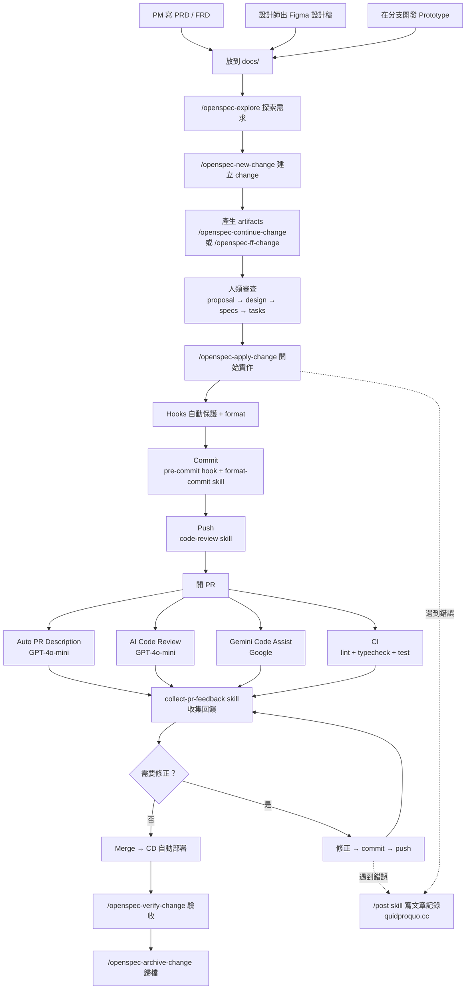

# daodao 開發工作流程

## 全貌



---

## Phase 1：需求輸入

需求可以從三個來源進入，最終都放到 `docs/` 作為 OpenSpec 的輸入。

### 1.1 PM 撰寫 PRD / FRD

PM 在 `docs/product/` 目錄撰寫需求文件，按功能分子目錄：

| 文件類型 | 用途 |
|---------|------|
| **PRD**（Product Requirements Document） | 產品目標、用戶故事、成功指標 |
| **FRD**（Functional Requirements Document） | 功能細節、介面規格、邏輯流程 |

### 1.2 設計師出 Figma 設計稿

- 設計師在 Figma 完成 UI 設計
- 截圖放到 `docs/product/<功能>/` 目錄，或提供 Figma URL
- 開發時可用 Figma MCP 直接讀取設計稿（`get_design_context`、`get_screenshot`）

### 1.3 在分支開發 Prototype

- 直接在 feature branch 上做 prototype
- 快速驗證互動和可行性
- 確認後截圖或文件放到 `docs/`

### 1.4 放置位置

所有需求素材統一放在 `docs/product/`：

```
docs/product/
├── island/           ← 我的小島相關（PRD + FRD）
├── notification/     ← 通知系統
├── challenge/        ← 共同挑戰
├── social/           ← 社交功能
├── practice/         ← 練習相關
├── search/           ← 搜尋
├── onboarding/       ← 新手引導
└── ...
```

---

## Phase 2：規格拆解（OpenSpec）

PRD/FRD 完成後，使用 OpenSpec 將需求轉為可執行的工程規格和任務。

### 2.1 完整流程

所有步驟皆透過 Claude Code skills 執行：

| Skill | 用途 |
|-------|------|
| `/openspec-explore` | 探索需求、釐清問題、思考方案 |
| `/openspec-new-change` | 建立新 change，產生 proposal |
| `/openspec-continue-change` | 逐步產生下一個 artifact（design → specs → tasks） |
| `/openspec-ff-change` | 一次產生所有 artifacts（快速模式） |
| `/openspec-apply-change` | 按 tasks 開始實作 |
| `/openspec-verify-change` | 驗證實作是否符合規格 |
| `/openspec-sync-specs` | 同步 delta specs 到主規格 |
| `/openspec-archive-change` | 歸檔完成的 change |
| `/openspec-bulk-archive-change` | 批次歸檔多個 changes |
| `/openspec-onboard` | 引導式教學，走過一次完整 OpenSpec 流程 |

### 2.2 Artifacts 結構

每個 change 會產生：

```
openspec/changes/<change-name>/
├── .openspec.yaml    ← change 狀態追蹤
├── proposal.md       ← 提案（問題、方案、影響範圍）
├── design.md         ← 技術設計（架構、API、資料模型）
├── specs/            ← 細部規格
│   ├── <feature-a>/spec.md
│   └── <feature-b>/spec.md
└── tasks.md          ← 工程任務清單
```

### 2.3 審查要點

在 `/openspec-apply-change` 前，確認：

- [ ] proposal 的範圍是否正確？
- [ ] design 的技術方案是否合理？
- [ ] specs 是否涵蓋所有 edge cases？
- [ ] tasks 是否粒度適當？（每個 task 2-4 小時）

---

## Phase 3：開發

### 3.1 開始開發

```bash
# 從 OpenSpec tasks 開始實作
/openspec-apply-change <change-name>

# 或手動開發
cd daodao-f2e   # 到對應的子專案
```

### 3.2 開發中的自動化（Hooks）

寫 code 時，hooks 會自動觸發：

| 時機 | Hook | 效果 |
|------|------|------|
| AI 寫檔案前 | `.claude/hooks/pre-write-guard.sh` | 攔截 .env/.pem/.key、保護 migration、載入 project-rules |
| AI 寫完檔案後 | `.claude/hooks/post-write-format.sh` | 自動 format（biome / eslint / black+ruff） |

### 3.3 各專案品質指令

| 子專案 | lint | typecheck | test | 自動修復 |
|--------|------|-----------|------|---------|
| daodao-f2e | `pnpm run lint` | `pnpm run typecheck` | `pnpm test` | `pnpm run check:fix` |
| daodao-server | `pnpm run lint` | `pnpm run typecheck` | `pnpm test` | `pnpm run lint:fix` |
| daodao-ai-backend | `make lint` | — | `make test` | `make format` |
| daodao-worker | — | `pnpm run typecheck` | `pnpm test` | — |

---

## Phase 4：Commit

### 4.1 流程

```
寫完 code
  → pre-commit-check skill 跑 lint + typecheck + 自動修復
    → format-commit skill 產生 commit message
      → 使用者確認
        → git commit
```

### 4.2 Commit Message 格式

```
<type>(<scope>): 簡短描述

## Why is this necessary?

- 原因 1
- 原因 2

## How does it address?

- 做法 1
- 做法 2
```

Type: `feat` / `fix` / `refactor` / `perf` / `docs` / `style` / `test` / `chore`

---

## Phase 5：Push 前 Code Review

### 5.1 流程

```
git push 前
  → Claude 問「要 review 嗎？」
    → Yes → code-review skill 審查整個 branch
      → 修正問題
        → git push
    → No → 直接 git push
```

### 5.2 Code Review 檢查項目

- 邏輯錯誤
- 安全問題
- 效能問題
- 架構一致性（是否符合 project-rules）

---

## Phase 6：開 PR

### 6.1 PR 自動化

開 PR 後，GitHub Actions 自動觸發：

```
PR opened
  ├── 1. Auto PR Description（自動產生標題和描述）
  ├── 2. AI Code Review（GPT-4o-mini 審查 diff）
  ├── 3. Gemini Code Assist（Google AI 審查）
  └── 4. CI 品質檢查（lint + typecheck + test + build）
```

### 6.2 Auto PR Description

- **觸發**: PR opened
- **引擎**: GPT-4o-mini（GitHub Models）
- **效果**: 根據 commit log 自動產生繁體中文的 Why / How 描述
- **設定**: `.github/workflows/auto-pr-description.yml`

### 6.3 AI Code Review

- **觸發**: PR opened + synchronize
- **引擎**: GPT-4o-mini（GitHub Models）
- **效果**: 審查 diff，產生嚴重度分級的 review comment
- **格式**:
  | 嚴重度 | 檔案 | 問題 | 建議 |
  |--------|------|------|------|
  | 🔴 High | bug / 安全 | | |
  | 🟡 Medium | 效能 / 維護 | | |
  | 🟢 Low | 風格 / 優化 | | |
- **設定**: `.github/workflows/code-review.yml`

### 6.4 Gemini Code Assist

- **觸發**: PR opened + synchronize
- **引擎**: Google Gemini
- **效果**: 額外的 AI code review + PR summary
- **設定**: 透過 GitHub App 啟用，無需 workflow 檔案

### 6.5 CI 品質檢查

各專案的 CI 會自動跑：

| 子專案 | CI 內容 | Workflow |
|--------|---------|----------|
| daodao-f2e | lint + typecheck + test + build | `linode-ci.yml` |
| daodao-server | lint + typecheck + test + build | `continuous-integration.yml` |
| daodao-ai-backend | format check + lint | `ci.yml` |
| daodao-storage | schema validation | `ci-postgres.yml` |
| daodao-worker | typecheck + test | `ci.yml`（待建立） |

### 6.6 收集 PR Feedback

CI 和 AI review 跑完後，使用 `collect-pr-feedback` skill 收集所有回饋：

```
使用者說「收集 feedback」或「看 PR review」
  → collect-pr-feedback skill
    1. 讀 CI 狀態（gh pr checks）
    2. 收集所有 review comments（AI Code Review + Gemini + 人類）
    3. 分類整理：
       - 必須修 — CI 失敗、High 嚴重度、人類明確要求
       - 建議修 — Medium 嚴重度、Gemini 建議
       - 可忽略 — Low 嚴重度、風格偏好、false positive
    4. 詢問使用者要修正哪些
    5. 修正 → commit → push
    6. 可選：在 PR 上回覆 reviewer
```

---

## Phase 7：Merge & Deploy

### 7.1 Merge 條件

- [ ] CI 全綠
- [ ] AI Code Review 無 🔴 High 問題
- [ ] 人類 reviewer approved（如有）

### 7.2 CD 自動部署

Merge 到 main/dev 後自動觸發：

| 子專案 | 部署方式 | 目標 |
|--------|---------|------|
| daodao-f2e | Docker build → Linode | `daodao.so` / `app.daodao.so` |
| daodao-server | Docker build → Linode | `server.daodao.so` |
| daodao-ai-backend | Docker build → Linode | `ai.daodao.so` |
| daodao-storage | SSH → run migrations | PostgreSQL on Linode |
| daodao-worker | Wrangler deploy | Cloudflare Workers |
| daodao-infra | Docker restart nginx | Nginx on Linode |

---

## Phase 8：驗收與歸檔

### 8.1 OpenSpec 驗收

```bash
/openspec-verify-change <change-name>    # 驗證實作是否符合規格
/openspec-archive-change <change-name>   # 歸檔完成的 change
```

### 8.2 歸檔後

- specs 保留在 `openspec/` 作為歷史記錄
- 下一輪需求從 Phase 1 重新開始

---

## 錯誤記錄

開發過程中遇到值得記錄的錯誤、踩坑經驗、或解決方案時，使用 `/post` skill 撰寫文章發佈到 [quidproquo.cc](https://quidproquo.cc/)。

適合記錄的情境：
- 難以 debug 的錯誤和最終解法
- 框架/套件的坑和 workaround
- CI/CD 配置踩雷
- 跨專案整合問題

公司專案會在撰寫文章時進行識別化處理，移除專案名稱、公司名稱、內部 URL、API key、業務邏輯細節等敏感資訊，只保留通用的技術問題和解法。

---

## 工具總覽

| 階段 | 工具 | 用途 |
|------|------|------|
| 需求 | PRD / FRD | 產品和功能需求文件 |
| 規格 | OpenSpec | 需求 → 工程規格 → 任務 |
| 開發 | Claude Code / Cursor / 其他 AI agent | 寫 code |
| 品質 | Biome / ESLint / Black+Ruff | Lint + Format |
| 品質 | TypeScript / Pylint | 型別檢查 / 靜態分析 |
| 品質 | Jest / Vitest / pytest | 測試 |
| Commit | pre-commit-check skill | Commit 前 lint + typecheck + 自動修復 |
| Commit | format-commit skill | 結構化 commit message |
| Review | code-review skill | Push 前本地 review |
| PR | Auto PR Description | 自動產生 PR 標題和描述 |
| PR | AI Code Review (GPT-4o-mini) | 自動審查 diff |
| PR | Gemini Code Assist | Google AI 額外審查 |
| PR | collect-pr-feedback skill | 收集所有 review，分類並詢問修正 |
| CI | GitHub Actions | 自動化品質檢查 |
| CD | GitHub Actions + Docker | 自動部署 |
| 同步 | sync-claude-config workflow | 共用設定同步到子專案 |
| 記錄 | /post skill → quidproquo.cc | 錯誤踩坑經驗記錄與分享 |
