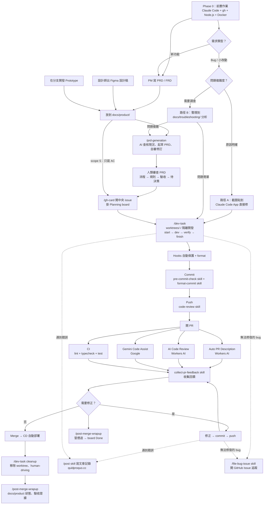

# 島島阿學開發工作流程

> 註（2026-09-20）：OpenSpec 已退役，舊 `openspec/` 封存於 `docs/archive/openspec/`，`/openspec-*` skills 不再使用。規格以 `docs/product/` 的 PRD／FRD 與中央 issue 的驗收契約為準；本文已依此改寫。同日退役自動派工 Routine A／B（#241）與 merge 回寫 Routine C；board 狀態由各 skill 呼叫 `bin/pipeline/board.ts` 寫回，所有開發走人工 `/dev-task`。

## 簡介

島島阿學（daodao）是一個由多個子專案組成的教育平台，涵蓋前端、後端、AI 服務、資料庫、基礎設施與背景任務。隨著專案規模成長，我們建立了一套從需求到部署的完整工作流程，核心理念是：

1. **規格先行、深淺分級** — PRD／FRD 是需求真相、中央 issue 的驗收契約是執行基準；scope 決定要寫到哪一層（Phase 1.5）
2. **自動化品質守護** — 透過 hooks、CI/CD、AI Code Review 等機制，讓品質檢查發生在每一個環節
3. **人類保有最終決策權** — 自動化處理繁瑣工作，但每個關鍵節點（規格審查、commit 確認、PR merge）都由人類做最終判斷

本文完整記錄這套流程的每一個階段。

---

## 全貌

整個開發流程分為 Phase 0–9，其中 Phase 1.5（規格層級判定）決定一件工作要走多深：


```mermaid
flowchart TD
    A0["Phase 0：前置作業<br/>Claude Code + gh + Node.js + Docker"] --> A1
    A0 --> BUG{"需求類型？"}

    BUG -- "新功能" --> A1
    A1[PM 寫 PRD / FRD] --> A4[放到 docs/product/]
    A2[設計師出 Figma 設計稿] --> A4
    A3[在分支開發 Prototype] --> A4
    A4 --> B["/prd-generation<br/>AI 查核現況、起草 PRD、自審修訂"]

    BUG -- "Bug / 小改動" --> BUGPATH{"問題複雜度？"}
    BUGPATH -- "原因明確" --> BUGA["路徑 A：截圖貼到<br/>Claude Code App 直接修"]
    BUGA --> F
    BUGPATH -- "需要調查" --> BUGB["路徑 B：整理到<br/>docs/troubleshooting/ 分析"]
    BUGB -- "問題簡單" --> F
    BUGB -- "問題複雜" --> B
    B --> E["人類審查 PRD<br/>流程 → 規則 → 驗收 → 待決策"]
    E --> E2["/gh-card 開中央 issue<br/>掛 Planning board"]
    A4 -- "scope S：只寫 AC" --> E2
    E2 --> F["/dev-task<br/>worktrees/<n>-<slug>/ 隔離開發<br/>start → dev → verify → finish"]
    F --> G["Hooks 自動保護 + format"]
    G --> H["Commit<br/>pre-commit-check skill + format-commit skill"]
    H --> I["Push<br/>code-review skill"]
    I --> J[開 PR]

    J --> K["Auto PR Description<br/>Workers AI"]
    J --> L["AI Code Review<br/>Workers AI"]
    J --> M["Gemini Code Assist<br/>Google"]
    J --> N["CI<br/>lint + typecheck + test"]

    K & L & M & N --> O["collect-pr-feedback skill<br/>收集回饋"]
    O --> P{需要修正？}
    P -- 是 --> Q[修正 → commit → push] --> O
    P -- 否 --> R[Merge → CD 自動部署]
    R --> S["/dev-task cleanup<br/>移除 worktree、human-driving"]
    S --> T["/post-merge-wrapup<br/>docs/product 狀態、驗收證據"]

    Q -. 遇到錯誤 .-> U["/post skill 寫文章記錄<br/>quidproquo.cc"]
    F -. 遇到錯誤 .-> U
    F -. 無法修復的 bug .-> Y["/file-bug-issue skill<br/>開 GitHub Issue 追蹤"]
    Q -. 無法修復的 bug .-> Y

    P --> Z["/post-merge-wrapup<br/>冒煙過 → board Done"]
```

---

## Phase 0：前置作業

在進入開發流程之前，需要先把工具鏈設定好。以下是每位開發者加入時需要完成的環境設定。

### 0.1 AI 輔助開發工具

| 工具 | 用途 | 安裝方式 |
|------|------|---------|
| **Claude Code** | 主力 AI 開發工具，執行 skills 與 hooks | `npm install -g @anthropic-ai/claude-code` |
| **GitHub Copilot CLI** | GitHub 的 CLI agent | `npm install -g @github/copilot` |
| **Codex CLI** | OpenAI 的 CLI agent，可作為替代方案 | `npm install -g @openai/codex` |

Claude Code 是這套工作流程的核心 — 文件中提到的所有 skills（`/prd-generation`、`/gh-card`、`/dev-task`、`/format-commit`、`/code-review` 等）都在 Claude Code 環境內執行。安裝後需要登入 Anthropic 帳號。Codex 有同名 `.codex/skills/` 入口。

### 0.2 GitHub CLI（gh）

整個流程大量依賴 `gh` 指令：開 PR、建 issue、查看 CI 狀態、收集 review feedback。

```bash
# macOS
brew install gh

# 登入
gh auth login
```

登入後確認可以存取團隊的 repos：

```bash
gh repo list daodaoedu --limit 5
```

### 0.3 開發環境

| 項目 | 版本 / 工具 | 說明 |
|------|------------|------|
| **Node.js** | v20+ | 前端和後端專案都用 Node.js |
| **pnpm** | v9+ | 套件管理器，所有 JS/TS 專案統一用 pnpm |
| **Python** | 3.12+ | daodao-ai-backend 使用 |
| **Docker** | latest | 本地開發和部署都需要 |
| **Git** | 2.30+ | 需要支援 worktree 等功能 |

```bash
# 確認版本
node -v && pnpm -v && python3 --version && docker --version && git --version
```

### 0.4 Claude Code 設定

安裝 Claude Code 後，需要設定 hooks 和 skills 才能使用完整流程：

1. **Hooks** — `.claude/settings.json` 掛了六支 hook（session-start、pre-write-guard、test-integrity-guard、pre-pr-gate、post-write-format、stop-quality-gate），涵蓋 session 開始、寫檔前後、開 PR 前與任務結束；完整說明見 [Phase 3.3](#33-開發中的自動化hooks)
2. **Skills** — 位於 `.claude/skills/` 目錄，隨 repo clone 下來即可使用
3. **Memory** — 位於 `~/.claude/projects/` 目錄，自動建立，用於跨對話記憶

第一次 clone repo 後，跑一次 Claude Code 確認 hooks 正常運作：

```bash
cd daodao
claude
# 在 Claude Code 內試寫一個測試檔案，確認 post-write-format hook 有觸發
```

### 0.5 MCP Servers（可選）

| MCP Server | 用途 | 何時需要 |
|------------|------|---------|
| **Figma MCP** | 從 Claude Code 直接讀取 Figma 設計稿 | 做前端 UI 開發時 |
| **Context7** | 查詢第三方套件的最新文件 | 需要查套件用法時 |

MCP Server 在 Claude Code 的 `settings.json` 中設定，不需要額外安裝。

### 0.6 快速確認清單

設定完成後，確認以下指令都能正常執行：

```bash
# GitHub CLI
gh auth status

# Claude Code
claude --version

# 子專案依賴安裝（以 daodao-f2e 為例）
cd daodao-f2e && pnpm install

# 品質檢查
pnpm run lint && pnpm run typecheck
```

全部通過後，就可以從 Phase 1 開始了。

---

## Phase 1：需求輸入

每一個功能的開發都從需求開始。需求分兩類：**新功能開發**走 PRD/FRD → PRD 定稿 → 開卡 → 隔離開發；**Bug 修復 / 小改動**直接修。分流依據見 [Phase 1.5](#phase-15規格層級判定)。

### 新功能開發

需求可以從三個來源進入，最終都會放到 `docs/product/` 目錄。這確保所有需求都有文字記錄，不會只存在於某個人的腦中或某次會議的口頭討論裡。

### 1.1 PM 撰寫 PRD / FRD

最正式的需求來源。PM 在 Google Doc 撰寫，定稿後落到 `docs/product/<功能>/`：

| 文件類型 | 全名 | 回答什麼 | 典型內容 |
|---------|------|------|---------|
| **PRD** | Product Requirements Document | 要做什麼、為什麼做 | 產品目標、目標用戶、用戶故事、成功指標、優先級 |
| **FRD** | Functional Requirements Document | 具體怎麼運作 | 功能規格、介面行為、資料流程、邊界條件、錯誤處理、**Test Points（驗收條件）** |

PRD 回答產品策略層面的問題，FRD 是 PM 和工程師之間的溝通橋梁。小功能可能只需要一份 FRD，大功能建議兩份都寫。FRD 的 Test Points 之後會成為 `/dev-task` verify 階段逐條驗收的清單，所以請寫成可以打勾的句子。

**工程審閱**：FRD 送工程審閱後常有定案（例如「統一 90 天／3 段／50 字上限」）。定案要回寫 PRD／FRD；來不及回寫時，記進中央 issue 的決策區塊，`/dev-task` 的驗收契約以它為準（見 Phase 2）。

### 1.2 設計師出 Figma 設計稿

設計師在 Figma 完成 UI 設計後：

- 截圖放到 `docs/product/<功能>/`，或直接提供 Figma URL
- 開發時透過 Figma MCP 直接從 Claude Code 讀取設計稿（`get_design_context`、`get_screenshot`）

### 1.3 在分支開發 Prototype

有些需求用文字和設計稿很難說清楚，特別是互動體驗或技術可行性。直接在 feature branch 上做 prototype，用 code 回答「這樣行不行」。驗證完成後，把結論（截圖、關鍵發現、技術限制）整理到 `docs/product/<功能>/` 作為正式開發的參考。

### 1.4 放置位置

所有需求素材統一放在 `docs/product/`，按功能模組分子目錄：

```
docs/product/
├── practice/         ← 實踐相關
├── challenge/        ← 共同挑戰
├── lighthouse/       ← 燈塔
├── notification/     ← 通知系統
├── social/           ← 社交功能
├── onboarding/       ← 新手引導
├── admin/            ← 後台管理
└── ...
```

### Bug 修復 / 小改動

不是所有工作都需要走 PRD → 規格 → 開卡。Bug 和小改動有兩條路徑：

**路徑 A：直接在 Claude Code 修復** — 原因明確、範圍小。把截圖、錯誤訊息、重現步驟貼給 Claude Code，修完直接進 Phase 4（commit → PR），不開卡、不寫 spec。

**路徑 B：整理到 `docs/troubleshooting/` 分析** — 原因不明、需要調查。建子目錄放 `bug.md`（一句話描述現象）＋截圖／log，讓 Claude Code 分析後寫回 `analysis.md`：

```
docs/troubleshooting/
├── auth-error/
│   ├── bug.md            ← 現象
│   ├── login_error.png   ← 佐證
│   └── analysis.md       ← 根因與修復計畫
└── android-oauth-login-fix.md   ← 已解決的簡單案例（不需要子目錄）
```

分析後原因明確 → Phase 4 直接修；發現問題複雜（跨 repo、要改資料模型）→ 當成新功能走 Phase 1.5 判定。

---

## Phase 1.5：規格層級判定

這一步決定「要寫多少規格才能開工」。過去的混亂來自於沒有明確規則——有時候寫完整規格、有時候只有 FRD、有時候什麼都沒有就開 issue。現在的規則：

> **PRD／FRD 是需求真相，中央 issue 的驗收契約是執行基準。**

兩份東西各有角色，不是二選一：

| | PRD / FRD | 中央 issue |
|---|---|---|
| 誰寫 | PM 描述，`/prd-generation` 查核起草，人審核定稿 | `/gh-card` 從對話與已定稿 PRD 推斷 |
| 回答什麼 | 要做什麼、為什麼、流程、規則、驗收條件（FR／TP／AC） | 現在做到哪、誰在做、本卡驗收契約（Acceptance snapshot） |
| 位置 | `docs/product/<功能>/` | daodaoedu/daodao issue + Planning board |
| 誰消費 | `/gh-card` 的輸入、`/dev-task` verify 的檢查清單 | `/dev-task` start／finish、`/post-merge-wrapup` 的 board 回寫 |

### 判定表

| scope | 條件 | 規格要求 | 進入方式 |
|---|---|---|---|
| **L / M** | 跨 repo（storage + server + f2e）、改資料模型、有待決事項（OQ）、FRD 與工程審閱有落差需定案 | **PRD 必須定稿**：含流程、規則、驗收與待決策清單（`/prd-generation`）；工程定案回寫 PRD 或記進 issue 決策區塊；issue body 的 Acceptance snapshot 指向該 PRD 版本 | Phase 2 → Phase 2.5 開卡 → Phase 3 `/dev-task` |
| **S** | 單 repo、工程決策少、一天內做完 | issue body 寫 **Acceptance Criteria** 即可，不必另寫 PRD | Phase 2.5 開卡 → `/dev-task` |
| **XS / bug** | 原因明確的修正、文案、樣式 | 不需要 spec，不需要 issue | 路徑 A 直接修 → Phase 4 |
| **CI / skill / 文件** | 只動 monorepo 自身的 `.github/`、`.claude/`、`docs/` | issue 寫 AC（給自己追蹤）；不進 sub-repo pipeline | 直接在 monorepo main 或 branch 改 |

判斷 L/M 的訊號只要中一個就算：跨 repo、要 migration、有 OQ、FRD 需要定案。定案一定要有文字落點——實踐建立流程（#141）的「統一 90 天／3 段／逐段行動同 50 字」定案當時沒回寫 Google Doc，只留在工程規格裡；現在這類定案回寫 PRD，或至少記進中央 issue 的決策區塊，讓 `/dev-task` 的驗收契約抓得到。

### 自動派工現況

自動派工 Routine A／B 已於 2026-09-20 退役（#241）：OpenSpec 退役後 Routine A 的 spec gate 失去輸入、只會退卡，Routine B 從未穩定跑通。**Ready for Dev 現在只是管理狀態**，不會觸發任何自動化；所有開發走人工 `/dev-task`。舊 prompt 封存於 `docs/archive/automation/`，要恢復自動派工需另開卡重新設計。

---

## Phase 2：PRD 定稿（prd-generation）

L/M 功能在這一步把想法、既有 FRD、POC 或 issue 整理成一份可驗收的 PRD。OpenSpec 的 proposal／design／specs／tasks 四層 artifacts 已於 2026-09-20 退役，舊 change 封存於 `docs/archive/openspec/`；現在只要一份 PRD，流程、規則與驗收都在裡面，既有 FRD 及其 FR／TP ID 沿用，不另寫 FRD。

### 2.1 為什麼需要這一步

FRD 描述「產品要什麼」，工程師需要知道「現況是什麼、要改成什麼、做到哪算完成」。`/prd-generation` 先查 codebase 現況（`product-status-check` 區分已實作、已測試、已部署、實際可用），再對照需求補洞，把工程審閱的定案和待決策事項寫進同一份文件，讓之後每個接手的 session 都有同一份真相。

### 2.2 流程：描述 → AI 查核與起草 → AI 自審修訂 → 人審核 → 更新定稿

| 順序 | 誰 | 做什麼 | 產出 |
|------|-----|--------|------|
| 1 | 提出者 | 用白話描述誰、在哪個情境、遇到什麼問題、希望怎麼改善；不用填 repo、SHA、負責人 | 對話或 issue |
| 2 | AI | 讀來源（PRD／FRD／Issue comments／POC／設計稿），依 `product-status-check` 查 codebase 現況，列出目前行為、期待改動、影響與未知 | 現況查核 |
| 3 | AI | 依 `templates/development/requirements-doc.md` 起草或補洞；已有文件就直接補，不另造同義規格 | PRD 草稿 |
| 4 | AI | 依 skill 的「交審前自審」檢核並修訂：規則衝突、驗收不可測、反面條件缺漏、與現況矛盾 | 修訂後草稿 + 檢核摘要 + 待決策清單 |
| 5 | 人 | 審核是否符合原意、做產品取捨；每輪只回一兩個關鍵決策 | 決策 |
| 6 | AI | 依決策更新，重新檢核受影響的規則與驗收條件 | 定稿到 `docs/product/<功能>/` |

草稿未指定位置時存 `docs/plans/requirements/`；定稿後落到 `docs/product/<功能>/`。

### 2.3 PRD 應包含什麼

- **問題與範圍** — 為誰解決什麼、包含／不包含、「不做什麼」也寫清楚
- **流程與行為** — 使用者操作步驟、每一步的系統行為、狀態轉換
- **規則** — 欄位限制、驗證規則、權限、edge cases、錯誤處理；工程審閱定案（例如「90 天／3 段／50 字」）直接寫在這
- **驗收條件** — 可打勾的 FR／TP／AC 句，含反面條件（不顯示什麼、不出現什麼）；這份清單就是 `/dev-task` verify 的檢查清單
- **待決策** — 尚未定案的 OQ，標明「本任務不做」或「開工前需定案」

技術設計（API、資料模型、跨 repo 拆分）不寫進 PRD；由 `/dev-task` start 的 repo 判定與 task.md phases 承接。

### 2.4 人類審查

進入開卡之前，人類審查 PRD：

- **範圍** — 方向對不對？會不會太大或太小？「不做什麼」有沒有寫？
- **規則** — 定案都記進去了嗎？OQ 有沒有標清楚「本任務不做」？
- **驗收** — edge cases 漏了嗎？反面條件寫了嗎？每條都能實際驗證嗎？
- **現況** — AI 查到的「程式已有但未部署」「文件說規劃中但已上線」有沒有處理？

寧可在這一步多花時間，也不要寫了一半的 code 才發現方向錯了。確認 PRD 不等於 Ready for Dev 或派工。

---

## Phase 2.5：開卡（gh-card）

規格確認後，用 `/gh-card` 在 **daodaoedu/daodao** 開一張中央 issue 並掛上 Planning board。這張卡是之後所有狀態的指標：`/dev-task` 從這裡讀需求並移 In Progress／Review，`/post-merge-wrapup` 冒煙後移 Done／Need Fix。

```
/gh-card（從對話推斷欄位，互動確認一次）
  Title    功能名稱（中文，與 board 既有卡片同風格）
  Body     共用模板：任務索引 + Acceptance snapshot（PRD／FRD 版本、FR／TP／AC ID）+ POC 連結 + 驗收要求
  Labels   scope:XS|S|M|L、repo:<sub-repo>（可多個）
  Status   Todo（預設，安全）
```

草稿先存本機（任務目錄的 `notes/issue-drafts/`，沒有任務目錄時用 `docs/plans/issue-drafts/`），預覽確認後才 `gh issue create`。

開發模式只有一種：人工 `/dev-task`。`human-driving` label 由 `/dev-task` start 自動掛上，作為 board 上的人工開工標記。`auto`／`auto:plan-only`／`auto:auto-pr` 等派工 labels 已隨 Routine A／B 退役（#241）不再使用，label 保留不刪。開卡預設 Todo；Ready for Dev 只是管理狀態。

---

## Phase 3：開發（dev-task）

開發不在 `projects/<repo>` 裡做——那裡永遠停在 `dev`，乾淨、供整合與 pipeline 用。每個 issue 在 `worktrees/<issue#>-<slug>/` 有自己的隔離資料夾，多個 session 可同時開發不同 issue 互不干擾。

```
daodao/
├── projects/<repo>/              ← 永遠 dev，不在這裡開發
└── worktrees/                    ← gitignored
    └── 141-practice-create-flow/
        ├── task.md               ← 任務 manifest：唯一入口，接手先讀
        ├── evidence/             ← verify 階段的截圖與結果
        ├── daodao-storage/       ← worktree @ feat/practice-create-flow
        ├── daodao-server/        ← 同名 branch
        └── daodao-f2e/
```

### 3.1 五個階段

`/dev-task` 依使用者輸入判斷進入哪個階段：

| 說什麼 | 階段 | 做什麼 |
|---|---|---|
| 「開發 issue #141」 | **start** | 建立任務 |
| 「接手 worktrees/141-…」或已在該資料夾內 | **dev** | 逐 phase 實作 |
| 「驗證」或全部 phase 完成 | **verify** | 對驗收契約總驗收 + 核心旅程矩陣 + Google 文件報告 |
| 「發 PR」 | **finish** | rebase、品質檢查、spec audit、code review、過 pre-pr 閘門、開 PR、回寫 issue |
| 「merge 了」 | **cleanup** | dev 冒煙 → 移除 worktree、label，歸檔 |

#### start — 建立任務

1. `gh issue view` 讀中央 issue：需求、PRD／FRD、POC 連結與 Acceptance snapshot
2. **判定涉及哪些 repo**：逐條需求分類（純 UI / API 行為 / 資料欄位）→ grep 程式碼查證（DTO 驗證、schema 欄位）；`repo:` label 只當參考
3. **防撞**：中央 issue 掛 `human-driving`（board 上的人工開工標記）；`git worktree list` 與 `gh pr list --base dev` 查同區域的 in-flight 工作，高重疊時先問
4. 每個 repo：`git worktree add worktrees/<n>-<slug>/<repo> -b feat/<slug> origin/dev`（所有 repo 同名 branch；fix 用 `fix/`）
5. 補 gitignored 檔案：複製 `.env*`、`pnpm install --ignore-workspace`（monorepo 根的 `pnpm-workspace.yaml` 會讓不加 flag 的 install 變 no-op）
6. 寫 `task.md`：連結、範圍、驗收契約（從 PRD／FRD Test Points／AC 展開，沿用 FR／TP／AC ID）、phases（依驗收契約與 repo 順序拆）、驗證、Status、PR、備註
7. 直接進 dev，不停下來建議換 session

#### dev — 逐 phase 實作

跨 repo 順序固定 **storage（migration）→ server（API）→ ai-backend → f2e**。每完成一個 phase 的預設動作序列，不問「要 commit 還是先看效果」：

1. **自行輕量驗證**：UI → 起 dev server 用瀏覽器看；API → curl；migration / script / skill → 依 `pre-commit-check` 的「變更類型 × 驗證」對照表。沒有「這種改動不用驗」。碰到 form／mutation／controller／DTO 的 phase 要**真的送出一次**：一筆真實輸入成功、一筆 server 會拒絕的輸入失敗且訊息顯示——先把核心旅程矩陣的列開出來
2. 跑 `bash .claude/hooks/stop-quality-gate.sh` 看高風險分類（migration / API / auth / env / CI），有標記的在 task.md 記「⚠ 高風險：<分類>」
3. 驗證過 → `/pre-commit-check` → `/format-commit`
4. 更新 `task.md` 的 checkbox 與 Status
5. 直接進下一個 phase；定期 `git push -u origin feat/<slug>`

只有四種情況停下來：全部 phase 完成（進 verify）、碰到 task.md 記載的待決事項且無法繞過、驗證失敗 2 次修不掉、使用者喊停。phase 邊界是繼續點，不是回報暫停點。

#### verify — 總驗收

有 UI 變更的任務必須通過；純後端改跑 API 驗證後直接 finish。

- 從 task.md 的驗收契約（PRD／FRD Test Points／AC）展開檢查清單，用瀏覽器（`claude-in-chrome` 或 Playwright 腳本）逐條走過，含窄螢幕（375px）、無障礙、反面條件
- **POC 並排比對**（有可互動 HTML 原型時必做）：用 `getComputedStyle` 量測產出差異表，每條 ❌ 不是修掉就是列進「### POC 差異決策」交使用者裁決，確認後 task.md 寫 `POC 差異決策已確認`。沒有「設計系統」這個免死金牌
- **核心旅程矩陣**（有任何寫入路徑就必做）：每條「建立／編輯／刪除／送出」旅程至少一列真實輸入成功、一列 server 拒絕的輸入失敗，「實際」欄要有 HTTP 狀態碼，FE／BE 規則來源寫 `檔案:行號`；前端手寫規則對不到 server 規則就是缺口，先修再驗。沒有寫入路徑寫 `核心旅程不適用：<原因>`。這是 #188「畫面像 POC 但無法建立場次」的直接對策，見 `.claude/skills/dev-task/references/journey-matrix.md`
- 每個檢查點截圖到 `evidence/`；task.md 新增「驗證」區塊記通過／失敗／未做 + 矩陣
- **產出 Google 文件驗證報告**（必做）：截圖嵌圖，連結記進 task.md「驗證」區塊第一行；截圖只留在本機或對話裡等於沒發
- 同一項失敗 2 次 → 停下來整理現象給使用者
- 全部通過 → Status `verified`

#### finish — 發 PR

前置：task.md Status = `verified`。**Deferred items 先開卡再發 PR**——task.md「## Deferred items」每項要有子 issue `#n` 或 `（待開卡：<原因>）`；task.md 在 cleanup 會被刪，只留在 comment 的「之後再做」等於消失（#171 → #188 的第二個根因）。

對每個有變更的 repo：

1. `git fetch origin dev && git rebase origin/dev`（衝突時列出檔案；openapi 生成物用官方腳本重產）
2. `typecheck && lint && test`；既有紅測試用 origin/dev 乾淨 worktree 對照確認非本任務造成
3. **Clean-context spec audit**：`scripts/build-spec-audit.py` 產 audit pack，spawn 不帶開發對話的獨立 subagent 逐 FR／TP／AC 標 PASS / FAIL / UNCERTAIN；FAIL 先修
4. `/code-review`（四引擎＋誤判知識庫，見 Phase 5）
5. push → `gh pr create --base dev --body-file …`；跨 repo 時各 PR body 互相引用並標 merge 順序。**子 PR 只用 `Refs daodaoedu/daodao#<n>`，不用 `Closes`**——`Closes` 會在第一支 PR merge 時就關掉中央卡、board 也跟著 Done，其他 repo 的 PR 還沒合就被當完成（#190 的教訓：f2e 先合、server 懸置一週，dev onboarding 卡死）
6. task.md Status → `in-review`，記 PR 連結
7. **回寫 issue**：`gh issue comment` 列 PR、驗證報告連結、核心旅程摘要、「尚未在 dev 冒煙」、Known incomplete scope

**pre-pr 閘門**（`.claude/hooks/pre-pr-gate.sh`，攔 `gh pr create`；Codex 或未裝 hook 時由 agent 主動做同等檢查）：

| 閘門 | 擋什麼 |
|---|---|
| `pr-status-not-verified` | task.md Status 不是 `verified` |
| `pr-poc-compare-missing` | 有可互動原型卻缺比對報告／差異決策確認行 |
| `pr-journey-matrix-missing` | 核心旅程矩陣缺、沒有錯誤路徑列、或有 ⬜／❌ |
| `pr-deferred-unlinked` | Deferred item 沒子 issue 也沒「待開卡」 |
| `pr-body-evidence-missing` | PR body 缺「## 驗證證據」（報告連結或不適用聲明） |
| `pr-fe-pattern-invalid` | 前端手寫 HTML `pattern` 編不過（#188 根因） |
| `pr-verify-unchecked` | 「## 驗證」有 `- [ ]` 未勾項目或「需要手動驗證」清單（#166：登入牆截圖當證據） |
| `pr-layout-probe-missing` | UI repo 缺「### 版面探針」表或表裡有 ❌（#233：settings 每頁多 132px） |

逃生口 `DEV_TASK_SKIP_GATE="<原因>"`，一律留痕到 gate ledger。完整規則與升級策略見 `.claude/hooks/ADR-0001-gates-over-guidelines.md`。

注意：sub-repo 的 Auto PR Description workflow 會在 opened 時覆寫標題與內文，開完 PR 等它跑完再 `gh pr edit` 還原。

#### cleanup — merge 後收尾

1. 確認**所有 repo** 的 PR merged（跨 repo 少一支就不算）
2. **dev 冒煙，通過前不刪任務資料夾**：等 CD run 跑到該 revision，用 task.md 的核心旅程矩陣在 dev 環境（app-dev + server-dev）重跑全部正常列 + 至少一列錯誤路徑，「dev 冒煙」表回寫 issue comment；失敗走 `file-bug-issue` 並標「已合併，dev 冒煙未過」。merge ≠ 可用（#179、#190 都是在 dev 撞到的）
3. `git worktree remove`、`git branch -d feat/<slug>`、`rm -rf worktrees/<n>-<slug>`（矩陣與冒煙結果已在 comment 才刪）
4. 移除 `human-driving`
5. `/post-merge-wrapup`：dev 冒煙、更新 `docs/product` 功能狀態；依冒煙結果 `board.ts set <n> done`（內建 workflow 順手 close issue）或 `needfix`
6. `ls worktrees/` 掃其他已 merge 未收尾的任務

### 3.2 平行開發約定

- 一個 issue 一個資料夾一個 session；2–3 個平行是甜蜜點
- M/L 任務（有中途決策點）→ 獨立 session；XS/S → 整包委派 subagent 或標 `auto` 走 pipeline
- 需要同時跑 dev server 的任務：後開的設 port offset 或用 clone 模式
- DB / docker 全機共享，migration 類任務一次只做一個
- issue 之間有依賴：B 的 worktree 從 A 的分支開，PR base 先設 A，A merge 後再 rebase 回 dev
- rebase 只在「發 PR 前」和「輪到自己 merge 前有 conflict」兩個時機做

### 3.3 開發中的自動化（Hooks）

六支 hook 都掛在 `.claude/settings.json`，隨 repo 生效：

| 時機 | Hook | 做了什麼 |
|------|------|---------|
| Session 開始 | `session-start.sh` | 印出工作區位置、`worktrees/` 進行中任務與 Status、`projects/` 是否偏離 dev、當日 gate 統計 |
| AI 寫入檔案**前** | `pre-write-guard.sh` | 攔截敏感檔案（.env、.pem、.key）、保護 migration 檔案、載入各專案的 project-rules |
| AI 寫入檔案**前** | `test-integrity-guard.py` | 攔截測試檔新加的 `.skip`／`.only`／`.todo`／`xit`／`pytest.mark.skip` 等標記與被刪掉的斷言，避免用關測試換綠燈（CI 端同規則 `test-integrity.yml`） |
| 執行 `gh pr create` **前** | `pre-pr-gate.sh` | 發 PR 閘門：task.md Status、POC 比對、核心旅程矩陣、Deferred items、PR body 驗證證據、前端 pattern、未勾驗證項、版面探針（見 Phase 3 finish） |
| AI 寫入檔案**後** | `post-write-format.sh` | 自動格式化——JS/TS 用 Biome 或 ESLint，Python 用 Black + Ruff |
| 任務結束（Stop） | `stop-quality-gate.sh` | 列出已變更檔案的就緒狀態、diff 統計與高風險分類（migration / API / auth / env / CI） |

閘門事件一律寫進 gate ledger，`analyze-ledger.sh` 可彙整；設計原則見 `.claude/hooks/ADR-0001-gates-over-guidelines.md`。

### 3.4 各專案品質指令

| 子專案 | 定位 | lint | typecheck | test | 自動修復 |
|--------|------|------|-----------|------|---------|
| daodao-f2e | Next.js 前端 | `pnpm run lint` | `pnpm run typecheck` | `pnpm test` | `pnpm run check:fix` |
| daodao-server | Express 後端 | `pnpm run lint` | `pnpm run typecheck` | `pnpm test` | `pnpm run lint:fix` |
| daodao-storage | DB schema / migration | — | `make check-schema` | `make migrate-sql-dev` 冪等 | — |
| daodao-ai-backend | FastAPI AI 服務 | `make lint` | — | `make test` | `make format` |
| daodao-worker | Cloudflare Workers | — | `pnpm run typecheck` | `pnpm test` | — |
| daodao-admin-ui | 管理後台 UI | `pnpm run lint` | `pnpm run typecheck` | `pnpm test` | `pnpm run check:fix` |

server 跑 jest 會重寫 `openapi.json` / `openapi.yaml`，commit 前 `git checkout -- openapi.json openapi.yaml` 再用 `pnpm run openapi:generate && pnpm run openapi:generate-types` 重產。

---

## Phase 4：Commit

寫完 code 之後，不是直接 `git commit` 就好。我們有一套兩步驟的 commit 流程，確保每次 commit 都是乾淨的。

### 4.1 Pre-commit 檢查

首先，`pre-commit-check` skill 會在 commit 前自動執行：

1. **格式化** — 用各專案對應的 formatter 格式化所有變更的檔案
2. **Lint** — 跑靜態分析，找出潛在問題
3. **Type check** — 型別檢查（TypeScript 專案）
4. **自動修復** — 能自動修的問題直接修，不能自動修的列出來讓你手動處理

這一步確保進到 commit 的 code 至少通過基本的品質門檻。

### 4.2 產生 Commit Message

通過 pre-commit 檢查後，`format-commit` skill 會引導你產生結構化的 commit message：

1. **選擇類型** — feat / fix / refactor / perf / docs / style / test / chore
2. **選擇範圍** — 這次改動影響的模組（例如：auth、api、ui）
3. **寫簡短描述** — 一句話說明做了什麼
4. **選擇原因（Why）** — 為什麼需要這次改動？skill 會根據 diff 推薦選項
5. **自動產生做法（How）** — skill 分析 `git diff` 自動歸納出具體做了什麼，不需要手動寫

最終產出的格式：

```
<type>(<scope>): 簡短描述

## Why is this necessary?

- 原因 1
- 原因 2

## How does it address?

- 做法 1（自動從 diff 推導）
- 做法 2
```

為什麼要這麼做？因為好的 commit message 是給未來的自己和隊友看的。三個月後你看到一個 commit，「Why」告訴你為什麼當時要改，「How」告訴你具體改了什麼。這比 `fix bug` 或 `update code` 有用太多了。

---

## Phase 5：Push 前 Code Review

commit 完成後、push 到遠端之前，還有一道本地 review。

### 5.1 流程

`code-review` skill 會審查整個 branch 相對於 base branch 的所有變更：

```
git push 前
  → Claude 問「要 review 嗎？」
    → Yes → code-review skill 審查整個 branch
      步驟 0   建共用 review input：diff + Context Pack + <known_false_positives>（誤判知識庫）
      步驟 2–5 Codex / OMP / OpenCode / Haiku 四引擎獨立 review
      步驟 6.5 對各引擎表格套誤判知識庫 filter（C 類自承看不到 → drop；D 類假設性 → 降 Low）
      步驟 7   cross-model 分析（幾個引擎共同回報）
      步驟 8   High 逐條用程式碼證據查證
      步驟 8.5 查證為誤判的每一條 → review-knowledge.cjs record --source local（必做）
      → 真問題 → 修正 → 重新 commit
        → git push
    → No → 直接 git push
```

### 5.2 檢查項目

本地 code review 關注四個面向：

1. **邏輯錯誤** — 條件判斷是否正確？迴圈會不會無窮？null/undefined 有沒有處理？
2. **安全問題** — 有沒有 SQL injection、XSS、敏感資料洩漏的風險？
3. **效能問題** — N+1 query？不必要的 re-render？大量資料沒有分頁？
4. **架構一致性** — 是否符合各專案的 project-rules？命名慣例對不對？有沒有用錯 pattern？

這一步的價值是在 code 離開本機之前就抓到明顯問題，減少 PR 上的來回修正。

### 5.3 誤判知識庫（與 CI 共用）

四引擎會有誤判——2026-08-29 首批 24 筆中，High 幾乎全是誤判。查證的功不能只留在對話裡，所以本機 review 與 CI review 共用一份紀錄：

| | 位置 |
|---|---|
| 紀錄 | `.github/review-knowledge/false-positives.jsonl`（monorepo 單一來源，sync 派發唯讀副本到各 sub-repo） |
| 腳本 | `.github/scripts/review-knowledge.cjs` — `prompt-block`（彙整已知樣態餵模型）、`filter`（確定性過濾）、`record --db auto`（從任何 worktree 往上找 monorepo 寫回）、`test`（每筆 `sample`+`expected` 當 fixture） |
| 樣態 | A absent-claim（對 diff 外程式碼做「找不到／缺少」斷言）、B deletion、C unverifiable、D hypothetical、E format、F misattribution — 定義與對策見 [.github/review-knowledge/README.md](../.github/review-knowledge/README.md) |

兩條鐵律：**查證為誤判的 finding 必 `record`**；**改 `UNVERIFIABLE_RE`／`HYPOTHETICAL_RE` 必附 `--sample` + `--expected`**，`review-knowledge.cjs test` 要綠。記完在 monorepo commit + push main，sync 自動派發。

知識庫解不了的（A 類過半、記錄靠人、關鍵字過濾脆弱）在 [docs/automation/review-false-positive-research.md](automation/review-false-positive-research.md) 有文獻對照與落地順序（#168 Context Pack 補脈絡、#169 verify 後置查證）。

---

## Phase 6：開 PR

Push 到遠端並開 PR 後，GitHub Actions 會自動觸發四道平行的檢查：

### 6.1 四道自動化檢查

```
PR opened / updated
  ├── 1. Auto PR Description — 自動產生 PR 標題和描述
  ├── 2. AI Code Review — Cloudflare Workers AI 審查 diff
  ├── 3. Gemini Code Assist — Google AI 審查
  ├── 4. CI — lint + typecheck + test + build
  └── 5. PR evidence gate — 讀 PR body「## 驗證證據」（目前 advisory，repo variable `PR_EVIDENCE_GATE_MODE=block` 升為阻擋）
```

前四道是平行跑的，通常在 2-5 分鐘內全部完成。第 5 道由 `sync-claude-config` 同步到各 sub-repo，是本機 `pre-pr-gate.sh` 的 CI 版，涵蓋 Codex／手動 gh／pipeline runner 開的 PR。

### 6.2 Auto PR Description

| 項目 | 說明 |
|------|------|
| 觸發時機 | PR opened |
| 引擎 | Cloudflare Workers AI（GLM 4.7 Flash，Gemma 4 26B fallback） |
| 效果 | 根據 commit log 自動產生繁體中文的 Why / How 描述 |
| 設定檔 | `.github/workflows/auto-pr-description.yml` |

需要在 GitHub Actions secrets 設定 `CLOUDFLARE_WORKERS_AI_ACCOUNT_ID` 與
`CLOUDFLARE_WORKERS_AI_API_TOKEN`。API token 只需具備 Workers AI Read 權限。

這不是取代你自己寫 PR description — 而是提供一個起點。自動產生的描述通常能涵蓋 80% 的內容，你只需要補充遺漏的部分。

### 6.3 AI Code Review

| 項目 | 說明 |
|------|------|
| 觸發時機 | PR opened + synchronize（每次 push 都會重新跑） |
| 引擎 | Cloudflare Workers AI（Gemma 4 26B，GPT-OSS 120B fallback） |
| 效果 | 審查 diff + 確定性 Context Pack，追蹤 caller、importer、同模式漏改與 in-flight 衝突，產生嚴重度分級的 review comment |
| 設定檔 | `.github/workflows/code-review.yml`（monorepo 單一來源，sync 派發） |

流程（全部從 **base ref** 載入腳本與知識庫，PR head 改不到帶 `pull-requests: write` 的程式）：

```
Get diff        排除 openapi.json / generated/** / lockfile，截 12KB 給模型；完整 diff 另存供修復器用
Context Pack    retrieve-context.sh：caller / importer / 同模式 ⚠ / in-flight PR
Known FP        review-knowledge.cjs prompt-block → <known_false_positives> 進 user prompt
Workers AI      Gemma 4 26B → 不合格式 fallback GPT-OSS 120B
Normalize       OpenCC 簡→繁 → 修復器（嚴重度中文、行號範圍、檔案欄只取路徑 token、
                漏 :line 從完整 diff 補第一個新增行）
Filter          review-knowledge.cjs filter（C 類 drop、D 類降 Low；全 drop 收斂成「✅ 沒有發現明顯問題」）
Strict validate 每列必須 path:line；不合 → warning + 跳過留言（不讓 check 紅）
Post            同 head PATCH、新 head POST；comment 帶 <!-- daodao-ai-code-review-head:<sha> --> marker
```

Review comment 按嚴重度分級：

| 嚴重度 | 含義 | 處理方式 |
|--------|------|---------|
| 🔴 High | Bug、安全漏洞、會造成故障 | 必須修正 |
| 🟡 Medium | 效能問題、可維護性問題 | 建議修正 |
| 🟢 Low | 風格偏好、微小優化 | 可忽略 |

AI Code Review 不是完美的 — 它會有 false positive，也會漏掉某些問題。但它能穩定地抓到人類容易忽略的小問題（忘記 null check、未使用的 import、命名不一致等）。

**對誤判的回覆方式**：在 PR 上回 `/fp <第幾條> <A-F> <一句為什麼>`（例：`/fp 1 A route 已掛 authenticate，引用行號指到別的函式`），`collect-pr-feedback` 會收割進誤判知識庫（見 5.3）。下次 review 這個樣態會出現在模型的 `<known_false_positives>` 裡。

**Debug**：job log 有 `review-knowledge filter report` 與 `Invalid review body` group——run 顯示 success 但 PR 沒留言時先看這兩個。

### 6.4 Gemini Code Assist

| 項目 | 說明 |
|------|------|
| 觸發時機 | PR opened + synchronize |
| 引擎 | Google Gemini |
| 效果 | 額外的 AI code review + PR summary |
| 設定方式 | 透過 GitHub App 啟用，不需要 workflow 檔案 |

跟 AI Code Review 用的是不同的模型，所以會從不同角度發現問題。兩個 AI reviewer 疊加起來的覆蓋率比單一 reviewer 高。

### 6.5 CI 品質檢查

各專案的 CI workflow 會自動跑對應的品質檢查：

| 子專案 | CI 內容 | Workflow 檔案 |
|--------|---------|--------------|
| daodao-f2e | lint + typecheck + test + build | `linode-ci.yml` |
| daodao-server | lint + typecheck + test + build | `continuous-integration.yml` |
| daodao-ai-backend | format check + lint | `ci.yml` |
| daodao-storage | schema validation | `ci-postgres.yml`（另有 `migration-regression.yml`、`schema-sync-check.yml`） |
| daodao-worker | typecheck | `ci.yml`（test 尚未進 CI，本機 `pnpm test`） |
| daodao-admin-ui | test + lint + typecheck | `ci.yml` |
| daodao-infra | nginx 設定驗證 | `nginx-validation.yml` |

CI 是最後一道客觀防線。不管 AI reviewer 怎麼說，CI 全綠才能 merge。

### 6.6 收集 PR Feedback

CI 和 AI review 跑完後，用 `collect-pr-feedback` skill 一次收集所有回饋：

```
使用者說「收集 feedback」或「看 PR review」
  → collect-pr-feedback skill
    1. 讀取 CI 狀態（gh pr checks）
    2. 收集所有 review comments
       - AI Code Review 的 comment
       - Gemini Code Assist 的 comment
       - 人類 reviewer 的 comment
    3. 分類整理：
       - 必須修 — CI 失敗、High 嚴重度、人類明確要求
       - 建議修 — Medium 嚴重度、Gemini 建議
       - 可忽略 — Low 嚴重度、風格偏好、false positive
       - 收割 `/fp <n> <A-F> <why>` 回覆 → review-knowledge.cjs record --source ci
    4. 詢問使用者：「這些要修哪些？」
    5. 確認後修正 → commit → push
    6. 可選：在 PR 上回覆 reviewer
```

這個 skill 解決的問題是：一個 PR 上可能有來自三個 AI reviewer 加一個人類 reviewer 的十幾條 comment，手動一條一條看很耗時。skill 幫你整理、分類、判斷優先級，你只需要做最終決策。

---

## Phase 7：Merge & Deploy

### 7.1 Merge 條件

一個 PR 要 merge 需要滿足：

- CI 全部通過（lint + typecheck + test + build）
- AI Code Review 無 🔴 High 嚴重度問題
- 人類 reviewer approved（如果有指定 reviewer 的話）
- **跨 repo 依 PR body 標的順序合併**（storage → server → ai-backend → f2e），不要先合前端；前端一合就會打尚未部署的 API

### 7.2 CD 自動部署

Merge 到 main（或 dev）後，GitHub Actions 會自動觸發部署：

| 子專案 | 部署方式 | 目標環境 | 網址 |
|--------|---------|---------|------|
| daodao-f2e | Docker build → 推送到 Linode | Linode VPS | `daodao.so` / `app.daodao.so` |
| daodao-server | Docker build → 推送到 Linode | Linode VPS | `server.daodao.so` |
| daodao-ai-backend | Docker build → 推送到 Linode | Linode VPS | `ai.daodao.so` |
| daodao-storage | SSH → 執行 migration scripts | PostgreSQL on Linode | — |
| daodao-worker | Wrangler deploy | Cloudflare Workers | — |
| daodao-admin-ui | Docker build → 推送到 Linode | Linode VPS | — |
| daodao-infra | Docker restart nginx | Nginx on Linode | — |

部署流程是全自動的 — merge 之後不需要任何手動操作。如果部署失敗，GitHub Actions 會通知。

---

## Phase 8：收尾與歸檔

merge 不是終點。少了收尾，worktree 會堆積、`docs/product` 的狀態標示會腐爛（文件寫「規劃中」但功能早已上線）、中央卡永遠停在 In Progress。

### 8.1 `/dev-task` cleanup

PR 全部 merged 後，在任務資料夾的 session 說「merge 了」：

1. 確認所有 repo 的 PR merged（`gh pr view`）
2. **dev 冒煙**（有寫入路徑必做）：CD 跑到該 revision 後，用核心旅程矩陣在 dev 重跑，結果回寫 issue comment；沒過不往下
3. 每個 repo：`git worktree remove`、`git branch -d feat/<slug>`、`git fetch origin dev`
4. `rm -rf worktrees/<n>-<slug>`（矩陣與冒煙結果已在 issue comment 才刪）
5. 移除中央 issue 的 `human-driving` label
6. 接 `/post-merge-wrapup`
7. `ls worktrees/` 掃其他已 merge 未收尾的任務

### 8.2 `/post-merge-wrapup`

1. 核對合併範圍與證據：程式實作／測試／部署／目標環境操作各自要有證據；未執行就記未驗證
2. 目標環境冒煙（同 8.1 步驟 2），表格格式 `## 🔥 dev 冒煙（<環境>，revision <sha>，<日期>）`；全部 ✅ 才能在 docs/product 標「已驗收」
3. 更新 `docs/product/<功能>/` 的狀態標示（已合併／已測試／已部署／已驗收，附日期與 PR／run）——不可跳過，這是根治「文件說規劃中、程式碼已上線」的關鍵；沒有部署證據不寫已上線
4. 校準地圖文件（codebase-map、system-map）若本次變更動到結構
5. 用既有開發文件與 issue 驗收契約記錄完成與剩餘事項；OpenSpec 已退役，不再歸檔 change（舊的封存於 `docs/archive/openspec/`）

### 8.3 Board 與 issue

board 六欄由流程各步驟寫回（`bin/pipeline/board.ts set`）：`/dev-task` start → In Progress、finish → Review（merged 後仍留 Review）、`/post-merge-wrapup` 冒煙通過 → Done（內建「Auto-close issue」workflow 順手 close 中央卡）、失敗 → Need Fix。沒有 cron；子 PR 不用 `Closes` 關中央卡（見 Phase 3 finish），內建 workflow 也認不到 sub-repo 的 `Refs`。六欄語意見 [gh-pipeline skill](../.claude/skills/gh-pipeline/SKILL.md)。

驗收若發現與 PRD／FRD 有落差 → 回到 Phase 1.5 判定：小落差開 S 卡直接修，大落差用 `/prd-generation` 重新定稿再開卡。

---

## Bug 追蹤

開發或 CI 過程中遇到無法立即修復的錯誤時，使用 `/file-bug-issue` skill 將問題開成 GitHub issue，避免遺忘或阻塞其他工作。

### 流程

```
遇到無法修復的 bug
  → /file-bug-issue
    1. 從對話上下文自動收集：錯誤訊息、重現步驟、已嘗試的修復、相關檔案、環境資訊
    2. 詢問目標 repo（例如 daodaoedu/daodao-storage）
    3. 預覽 issue 內容（繁體中文，錯誤訊息保持原文）
    4. 確認後用 gh issue create 建立，標記 bug label
```

### 適合使用的情境

- **CI 持續失敗** — 分析出根因但需要多方配合修復
- **環境問題** — Docker、雲端、第三方服務相關的問題
- **跨專案 bug** — 需要其他子專案配合修改
- **非緊急但需追蹤** — 不阻塞當前開發，但不能遺忘

---

## 錯誤記錄與知識分享

開發過程中遇到值得記錄的錯誤、踩坑經驗、或解決方案時，使用 `/post` skill 撰寫技術文章發佈到 [quidproquo.cc](https://quidproquo.cc/)。

### 適合記錄的情境

- **難以 debug 的錯誤** — 花了超過 30 分鐘才找到的 root cause
- **框架/套件的坑** — 文件沒寫、行為不如預期、版本相容問題
- **CI/CD 配置踩雷** — Docker、GitHub Actions、Cloudflare Workers 的各種陷阱
- **跨專案整合問題** — 前後端介接、API 規格不一致、資料同步問題

### 識別化處理

因為是公司專案，文章撰寫時會自動進行識別化處理：移除專案名稱、公司名稱、內部 URL、API key、業務邏輯細節等敏感資訊，只保留通用的技術問題和解法。目的是讓文章對任何遇到相同問題的開發者都有參考價值。

---

## 工具總覽

以下是整個工作流程中使用到的所有工具，按階段整理：

| 階段 | 工具 | 用途 |
|------|------|------|
| **前置** | Claude Code | 主力 AI 開發工具，執行 skills 和 hooks |
| **前置** | GitHub CLI（gh） | PR、issue、CI 狀態等 GitHub 操作 |
| **前置** | GitHub Copilot / Codex | IDE 內 code completion / CLI agent |
| **需求** | PRD / FRD | 產品和功能需求文件 |
| **需求** | Figma + Figma MCP | UI 設計稿和直接讀取 |
| **規格** | prd-generation + product-status-check skills | 描述 → AI 查核現況與起草 PRD → 自審修訂 → 人審核 → 定稿（L/M 必要；OpenSpec 已退役） |
| **開卡** | gh-card skill | 中央 issue + Planning board（共用模板、Acceptance snapshot）；`human-driving` 標記人工開工 |
| **開發** | dev-task skill | issue 隔離 worktree（start → dev → verify → finish → cleanup）；projects/ 永遠停在 dev |
| **開發** | Claude Code + hooks（六支） | session 狀態注入、寫檔保護與格式化、測試完整性、發 PR 閘門、Stop 品質清單 |
| **品質** | Biome / ESLint / Black + Ruff | Lint + Format |
| **品質** | TypeScript / Pylint | 型別檢查 / 靜態分析 |
| **品質** | Jest / Vitest / pytest | 測試 |
| **Commit** | pre-commit-check skill | Commit 前自動 lint + typecheck + 修復 |
| **Commit** | format-commit skill | 結構化 commit message（Why / How） |
| **Review** | code-review skill | Push 前本地 code review（四引擎） |
| **Review** | review-knowledge.cjs + false-positives.jsonl | 誤判知識庫：本機 skill 與 CI 共用的紀錄、prompt 提示、確定性過濾、fixture |
| **PR** | Auto PR Description | Workers AI 自動產生 PR 描述 |
| **PR** | AI Code Review | Workers AI 自動審查 diff |
| **PR** | Gemini Code Assist | Google AI 額外審查 |
| **PR** | collect-pr-feedback skill | 收集所有 review 回饋，分類整理 |
| **CI** | GitHub Actions | 自動化品質檢查（lint + typecheck + test + build） |
| **CD** | GitHub Actions + Docker | 自動部署到 Linode / Cloudflare |
| **同步** | sync-claude-config workflow | 共用設定從 daodao repo 同步到子專案；sync PR 在目標 repo required checks 全綠後自動 squash merge，紅燈留給人 |
| **收尾** | post-merge-wrapup skill | 核對合併／驗收／部署證據、dev 冒煙、更新 docs/product 狀態 |
| **board 回寫** | `bin/pipeline/board.ts` | gh-card／dev-task／post-merge-wrapup 各自移卡；`audit` 找落差（Routine A／B／C 已於 2026-09-20 退役，見 Phase 9） |
| **自動化** | /publish-tasks skill | 把已確認計畫的未完成任務批次發成 sub-repo 子 issue（人工發布，不觸發自動化） |
| **Bug 追蹤** | /file-bug-issue skill | 無法立即修復的 bug 開成 GitHub issue |
| **記錄** | /post skill → quidproquo.cc | 踩坑經驗記錄與知識分享 |

---

## Phase 9：自動化 Pipeline（已退役）

Phase 1–8 是「人類觸發、AI 執行」。Phase 9 原本把 **Ready for Dev 之後**的工作交給三個每小時跑的 routine；2026-09-20 起全部退役：Routine A／B（#241）因 OpenSpec 退役失去輸入、從未穩定跑通；Routine C 只認 `auto` label PR，退役後 259 次 run 全是 no-op，還每小時吃共用 PAT 額度（稽核見 [docs/plans/actions-audit-2026-09-20.md](plans/actions-audit-2026-09-20.md)）。

> 退役文件見 [docs/archive/automation/](archive/automation/README.md)；現行 board 操作見 [gh-pipeline skill](../.claude/skills/gh-pipeline/SKILL.md)。

### 9.1 Routine 清單

| Routine | 載體 | 狀態 |
|---|---|---|
| **A** Board → Dispatch | GitHub Actions script（`bin/pipeline/dispatch.ts`） | **已退役**：OpenSpec 退役後 spec gate 失去輸入；程式與 workflow 已刪除 |
| **B** Dispatch + PR Patrol | Claude cloud routine | **已退役**：依賴 Routine A 的鏡像 issue，從未穩定跑通 |
| **C** Merge → Done | GitHub Actions script（`bin/pipeline/board-sync.ts`） | **已退役**：輸入為零、全是 no-op；由 skill 呼叫 `bin/pipeline/board.ts` 取代 |

### 9.2 人類在流程裡的位置

```
寫 PRD（/prd-generation 定稿）→ /gh-card 開卡（board Todo）
        ↓ 人工確認規格 OK
   Status → Ready for Dev            ← 管理狀態，選用
        ↓ /dev-task start（board In Progress + human-driving、開 worktree）
   人工／AI 協作實作 → verify → 發 PR（board Review）
        ↓ 人工
   review + merge                    ← 品質最後把關；卡留 Review
        ↓ /post-merge-wrapup dev 冒煙
   ✅ board Done（issue 自動 close）／❌ board Need Fix → 下次 /dev-task start 移回 In Progress
```

### 9.3 手動版

`/publish-tasks` 把已確認計畫的未完成任務（沿用 FR／TP／AC ID）批次發成 sub-repo 子 issue，先檢核與預覽，依授權才發布；發布後仍由人工 `/dev-task` 開工，不會有任何 routine 接手。

### 9.4 限制

| 限制 | 應對 |
|---|---|
| 沒有自動派工 | 要恢復需另開卡重新設計（不再讀 OpenSpec，改讀 issue 驗收契約） |
| 高風險 repo（storage、infra） | migration／IaC 由人工 `/dev-task` 做 |
| 複雜設計決策 | 留在 Phase 2 由人類定案，寫進 PRD 或中央 issue 決策區塊 |
| 同一區域多人並行 | `/dev-task` start 的防撞檢查 + `human-driving` |

---

## 結語

這套流程不是一天建立的，是隨著團隊踩過的坑逐步演化而來。它的核心價值在於：

- **減少認知負擔** — 不用記住每一步該做什麼，流程和工具會引導你
- **品質內建** — 品質檢查不是事後補做，而是嵌入在每一個環節裡
- **知識留存** — 從 PRD 到 commit message 到技術文章，每一個決策都有文字紀錄
- **漸進自動化** — 從半自動（每步人類觸發）逐步走向全自動（人類只做需求和 merge），每個階段都可獨立運作

流程是活的，會持續根據實際使用經驗調整。如果你發現某個環節卡住或不合理，那就是改進的機會。
