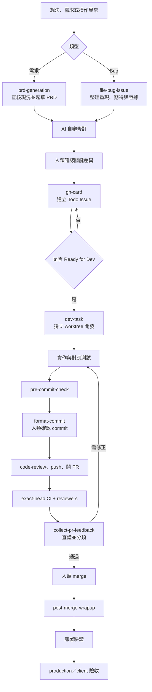

# 島島阿學開發工作流程

> 更新日期：2026-09-18
>
> 本文件是開發流程的導覽與現況摘要。詳細規則以
> [`development-skills-and-workflow.md`](development-skills-and-workflow.md)、
> [`automation/ai-human-review-workflow.md`](automation/ai-human-review-workflow.md)
> 與各 skill 的 `SKILL.md` 為準。

## 目前完成度

整個流程已具備可操作的主幹，但還不能稱為「全部完善」。需求整理、隔離開發、品質檢查、PR 查核與合併收尾已有明確入口；雲端自動實作、模型行為驗證、跨服務部署證據及監控回修閉環仍未完整。

| 環節 | 狀態 | 可確認的能力或缺口 |
|---|---|---|
| 需求與 bug intake | 可用 | AI 查核 codebase、起草與自審，人類確認關鍵差異；skill 行為契約已補 draft-first／read-workspace-first 指令（2026-09-18） |
| Issue 與 Planning | 可用 | 共用模板、Todo／Ready for Dev 分離、中央與子 Issue 流程 |
| 隔離開發 | 可用 | `dev-task` 使用獨立 worktree 與 `task.md` manifest |
| 測試與 commit | 大幅強化 | 跨 7 repo 新增 ~500 tests（server response contracts 125、domain rules 60、storage migration 329、ai-backend 14、admin-ui 17、worker 8）；發現並修正 birthDay PII 外洩與多個 controller 未經 Zod 驗證（2026-09-18） |
| Push、PR 與 feedback | 可用 | code review、CI／reviewer feedback 彙整及修正循環 |
| 跨 repo required checks | 已啟用並曾驗證 | root + server 有 enforced ruleset（strict=true）；其餘 5 repo CI 執行但未設為 required，可繞過 |
| Routine A／C | Workflow 已啟用 | 派工與 board sync 已有 workflow；個別 Issue 是否成功仍需回讀驗證 |
| Routine B | GitHub Actions 尚未啟用 | 目標是在 GitHub Actions 執行 agent router、隔離 writer／reviewer／publisher jobs 與 PR patrol；目前只有設計文件，workflow 與 harness 尚未落地 |
| 模型行為 gate | 部分完成 | 離線 skill 契約檢查已通過（4/4 contract tests pass）；真實模型試跑指令已備好（~$0.44），但尚未執行；人工 baseline 尚未閉環 |
| 部署與實際可用 | 依功能個別驗證 | Merge 不等於部署；部署也不等於瀏覽器／client 已可用 |
| 監控到自動修復 | 未完成 | 尚未形成可靠的 dedup → bug → fix → deploy → acceptance 閉環 |

## 核心原則

1. **先描述問題，再由 AI 查核**：需求提出者不需要先知道 repo、SHA、負責人或根因。
2. **一份 PRD 承接需求**：新需求以單一 PRD 記錄流程、規則與驗收；既有 FRD 與 FR／TP ID 保留並沿用。
3. **AI 先自審，人類做決策**：AI 負責蒐證、起草、查核及修正；產品取捨、發布授權與 merge 由人類確認。
4. **隔離工作內容**：Issue 開發使用獨立 worktree；共享 dirty worktree 只 stage 與 commit 自己擁有的路徑。
5. **分開陳述證據**：實作、local test、remote CI、merged、deployed、production/client usable 是不同狀態。
6. **不繞過品質 gate**：不得用 `--no-verify`、降低測試標準或 admin bypass 取代根因修復。
7. **遠端操作需要授權**：commit、push、merge、deployment 與 policy mutation 依當次明確授權執行。

## 流程全貌

```mermaid
flowchart TD
    A[想法、需求或操作異常] --> B{類型}
    B -->|需求| C[prd-generation<br/>查核現況並起草 PRD]
    B -->|Bug| D[file-bug-issue<br/>整理重現、期待與證據]
    C --> E[AI 自審修訂]
    D --> E
    E --> F[人類確認關鍵差異]
    F --> G[gh-card<br/>建立 Todo Issue]
    G --> H{是否 Ready for Dev}
    H -->|否| G
    H -->|是| I[dev-task<br/>獨立 worktree 開發]
    I --> J[實作與對應測試]
    J --> K[pre-commit-check]
    K --> L[format-commit<br/>人類確認 commit]
    L --> M[code-review、push、開 PR]
    M --> N[exact-head CI + reviewers]
    N --> O[collect-pr-feedback<br/>查證並分類]
    O -->|需修正| J
    O -->|通過| P[人類 merge]
    P --> Q[post-merge-wrapup]
    Q --> R[部署驗證]
    R --> S[production／client 驗收]
```

## 1. 需求與 Bug

### 新需求

使用 `prd-generation` 從想法、Issue、既有 PRD／FRD、POC 或分支開始。AI 應先盤點涉及的子專案與既有行為，再起草可驗收的 PRD，不能只根據請求文字假設現況。

跨專案功能依責任邊界拆分：

| 子專案 | 責任 |
|---|---|
| `daodao-f2e` | 前端、App、頁面與互動邏輯 |
| `daodao-server` | API、商業邏輯與後端服務 |
| `daodao-ai-backend` | AI、推薦、搜尋、統計分析 |
| `daodao-storage` | Schema、migration 與資料庫結構 |
| `daodao-infra` | CI/CD、部署與雲端資源 |
| `daodao-worker` | Cloudflare Workers 與免費服務 |
| `daodao-admin-ui` | 管理後台介面 |

既有 OpenSpec artifacts 可以作為輸入或歷史脈絡，但目前標準流程不依賴已退役的 OpenSpec slash skills。若要啟用自動派工，仍須先核對當前 dispatch parser 對 marker、tasks 或其他格式的實際要求。

### Bug 或 CI 異常

使用 `file-bug-issue` 整理：

- 發生位置與操作步驟
- 實際結果與期待結果
- 截圖、log、CI URL 或其他證據
- AI 查核出的可能 repo、分類與重複 Issue

未知資訊可列為 Todo；不得把使用者通報寫成「已重現」或「已確認根因」。只有取得建立 Issue 的授權後才發布遠端內容。

## 2. Issue 與 Ready for Dev

使用 `gh-card` 套用 `templates/development/` 的共用模板。建立卡片與啟動開發是兩個不同動作：

1. 新卡預設為 **Todo**。
2. PRD 與驗收條件經人類確認後，才設為 **Ready for Dev**。
3. 自動派工必須另外確認 label、marker、repo mapping 與 workflow 相容。
4. Routine A／C workflow 顯示 active，只代表自動化入口存在；個別 Issue 的 dispatch、同步與下游 PR 仍需逐項驗證。

## 3. 隔離開發與測試

Ready 的 Issue 使用 `dev-task` 建立 `worktrees/<issue>-<slug>/` 和 `task.md`。每個工作區只負責自己的 Issue，不能覆蓋其他 session 或使用者的變更。

測試原則：

- 新增純邏輯函式必須有測試。
- 修 bug 先建立會失敗的 regression test，再完成修復。
- React layout、樣式等 UI 呈現不強制寫單元測試，但仍須做適合的瀏覽器／視覺驗證。
- 測試放在相鄰 `__tests__/` 或 `src/__tests__/`。

| 子專案 | 測試 | 品質檢查 |
|---|---|---|
| `daodao-f2e` | `pnpm test` | `pnpm run lint`、`pnpm run typecheck` |
| `daodao-server` | `pnpm test` | `pnpm run lint`、`pnpm run typecheck` |
| `daodao-ai-backend` | `make test` | `make lint` |
| `daodao-worker` | `pnpm test` | `pnpm run typecheck` |
| `daodao-admin-ui` | `pnpm test` | `pnpm run lint`、`pnpm run typecheck` |

實際執行時以目標 repo 當前的 `package.json`、`Makefile`、CI workflow 與 lockfile 為準；本表是入口，不是 remote CI 成功的替代證據。

## 4. Commit、Push 與 PR

### Commit

依序執行：

1. `pre-commit-check` 跑格式、lint、typecheck 與相關測試。
2. `format-commit` 根據 diff 產生 Why／How 訊息。
3. 人類確認後才 commit。

共享工作區只能用 owned paths 精準 stage；不得使用 `git add .`。Commit 後應回讀 `git show --stat` 與 worktree status。

### Push 與 PR

使用者要求 push 時先確認是否 review；選擇 review 時執行 `code-review`，再 push。開 PR 後用 `collect-pr-feedback` 收集並查證：

- remote CI 與 required checks
- AI Code Review
- Gemini Code Assist
- 人類 reviewer feedback

分類為「必須修／建議修／可忽略」，已授權且可確定的問題由 AI 修正並重驗。只有 PR 最新 head SHA 的綠燈可以作為該版本通過的證據。

## 5. Merge、部署與驗收

Merge 後執行 `post-merge-wrapup`：

1. 回讀 PR 的 merged state、merge commit 與 checks。
2. 整理適用的計畫、PRD、產品文件與地圖狀態。
3. 記錄尚未完成的驗收、部署或後續 Issue。
4. 清理 worktree 前確認沒有未發布內容。

接著依功能取得分層證據：

| 證據層級 | 代表意義 |
|---|---|
| Implemented | 程式碼存在 |
| Locally tested | 指定 local tests 通過 |
| CI green | exact PR head 的 remote checks 通過 |
| Merged | 變更已進 default branch |
| Deployed | 目標環境已發布該版本 |
| Usable | 真實瀏覽器、API、client 或使用者流程已驗收 |

任何一層都不能自動推導下一層。尤其 merge 不代表自動部署成功，部署成功也不代表 client 已能使用。

## 6. 自動化 Pipeline 現況

| Routine | 目的 | 現況與使用限制 |
|---|---|---|
| Routine A | 從 Ready Issue 派工至目標 repo | Workflow 已啟用；每次仍需驗證 payload、mapping、權限與下游結果 |
| Routine B | 由 GitHub Actions 執行 agent 實作、測試、開 PR及修 feedback | 尚未建立 `agent-router.yml`、private repo 的 `dual-agent-task.yml` 與 `bin/agent/*` harness，因此尚未啟用 |
| Routine C | 同步 Issue／PR／Planning 狀態 | Workflow 已啟用；需以實際卡片欄位回讀確認同步結果 |

詳細操作、dispatch 契約與除錯方式見 [`automation/github-pipeline.md`](automation/github-pipeline.md)。

## 7. 模型行為與隔離 Gate

離線 evaluator 可以檢查輸出結構、關鍵字、路徑與規則，但不能單獨證明 agent 真正使用了正確 skill、工具與隔離工作區。模型 gate 至少需要：

1. 固定 corpus 與版本化期望結果。
2. 可重現的 workspace builder，且在建置失敗時 fail closed。
3. 真實 Claude／Codex 執行紀錄與 paired comparison。
4. AI annotation 與人工複核 baseline。
5. 可識別 provider／model 不可用，不能把 fallback 當成同模型驗證。

現況與未完成項目見 [`plans/2026-09-13-benchmark-gate-implementation.md`](plans/2026-09-13-benchmark-gate-implementation.md)。模型 baseline 與人工審閱 packet 仍在待合併的開發批次中；合併前不把它們列為 default branch 已具備的文件。

## 尚未完成的代辦

### Routine B：GitHub Actions 落地

#### Phase B0：安全基線與認證

- [ ] 選定第一個 private pilot repo；public root `daodao` 與 `daodao-f2e` 不載入 Codex subscription credentials。
- [ ] 建立 dedicated self-hosted runner、受限 runner group 與 ephemeral task workspace。
- [ ] 設定 Claude subscription token，且只注入 Claude model job。
- [ ] 在 runner 設定 Codex persistent `auth.json`，不得寫入 repository、cache、artifact 或 log。
- [ ] 建立 Claude／Codex auth smoke workflow，只輸出 provider、結果與時間。
- [ ] 驗證 token redaction、Codex serialized concurrency、credential revoke 與 reseed。
- [ ] 盤點 private repos 的 required checks、rulesets、runner access 與 protected environment。

**Exit gate**：兩個 provider 都能在無 GitHub write 權限的 model job 通過 smoke test，且 credentials 掃描為零洩漏。

#### Phase B1：Router 與契約

- [ ] 建立 root `.github/workflows/agent-router.yml`，先只支援 `workflow_dispatch`。
- [ ] 實作 `bin/agent/router.ts`，限定 private repo、`scope:XS/S`，並拒絕 storage／infra code mode。
- [ ] 實作單一 writer lease、idempotency、provider cooldown 與 stale lease reconciliation。
- [ ] 支援 `.automation-paused`、`human-driving`、`automation:hold` 的停止與 handoff。
- [ ] 補齊 `agent:claude`、`agent:codex`、`agent:auto`、`agent:running`、`agent:blocked` 與 `auto-pr-open` labels。
- [ ] 定義並驗證 Task Bundle、Patch Bundle、Gate Report、Review Verdict 與 Run Manifest schemas。
- [ ] 對 artifacts 加 digest、schema validation、保存期限與秘密掃描。

**Exit gate**：重複 dispatch 不會產生第二個 writer；不合規 repo、scope、label 或 artifact 必須 fail closed。

#### Phase B2：Private Repo 執行工作流

- [ ] 在 pilot repo 建立 `.github/workflows/dual-agent-task.yml`。
- [ ] 建立 `automation/repo-profile.json`，宣告 gates、allowed paths、changed-file cap 與 browser requirement。
- [ ] 分離 prepare、writer、verify、reviewer、repair 與 publisher jobs。
- [ ] Model jobs 僅有 contents read；唯一具有 GitHub write 權限的是 protected Publisher job。
- [ ] Writer 只產生 patch；verify job 執行 repo authoritative gates。
- [ ] Reviewer 使用另一 provider 的 clean context，並輸出符合 schema 的 verdict。
- [ ] Repair 最多一次；verification 或 review 失敗時不得建立 PR。
- [ ] Publisher 驗證 base SHA、artifact digest 與 protected paths 後才建立 draft PR。

**Exit gate**：Claude writer／Codex reviewer 與 Codex writer／Claude reviewer 各完成一條 draft PR，失敗路徑均不發布未驗證 patch。

#### Phase B3：手動 Pilot

- [ ] 先以 `workflow_dispatch` 執行，不啟用 schedule。
- [ ] 以 private repo 的 10 張 XS/S issue 試行，Claude／Codex writer 各 5 張。
- [ ] `agent:auto` 使用可重現的奇偶分配，不由模型主觀選擇 writer。
- [ ] 驗證同一 issue 的兩次 dispatch 不會建立兩個 branch 或 PR。
- [ ] 蒐集成功率、merge rate、review dissent、repair、latency、quota failure 與人工修改量。
- [ ] 驗證 quota／auth／runner failure 能清除 lease、留下去敏摘要並轉 `human-coding`。
- [ ] 所有 pilot PR 維持人工 review 與 merge。

**Exit gate**：兩個 provider 都有真實成功案例、credential incident 為零，且所有失敗都有可追蹤的分類或 handoff。

#### Phase B4：正式接入 Routine B

- [ ] 先 pause、drain 並停用舊 Routine B consumer，避免雙重派工。
- [ ] 讓 Routine A 傳遞 routing metadata 並 dispatch Agent Router。
- [ ] 啟用 scheduled router、provider cooldown、stale lease cleanup 與 PR patrol。
- [ ] 接入 CI／review feedback collector 與最多一次的自動 repair。
- [ ] 將 merge event fast path 接入 Routine C，同時保留定時 reconciliation。
- [ ] 演練 pause、drain、rollback、runner offline 與 publisher failure。
- [ ] 驗證連續兩週沒有重複 writer、遺失卡片或未分類失敗。

**Exit gate**：Routine B 才可標示為「GitHub Actions 已啟用」；在此之前只能標示 pilot 或部分完成。

### 模型行為 Gate

- [x] 固定 benchmark corpus、case IDs、期望結果與 schema 版本。（4 fixtures + scorer + CI 已合併；PR #194/#195/#207，2026-09-13–15）
- [ ] 完成 AI annotation，並由 maintainer 人工複核、核准 human-review baseline。（AI annotation 已產生，human review packet 已整理，待人工核准）
- [ ] 對相同 corpus 執行真實 Claude／Codex paired comparison，保存 provider、model、CLI 版本與 run manifest。（執行指令已備好，成本 ~$0.44，需手動觸發）
- [x] 修正 Claude 未呼叫預期 skill 的問題，不能只靠文字輸出推定 skill 已執行。（4 個 skill 補 draft-first + read-workspace-first 行為契約，4/4 offline contract tests pass；PR #223，2026-09-18）
- [ ] 排除指定 Codex model 被 provider／client 拒絕的阻塞。
- [ ] 將 unavailable、auth failure、quota failure、invalid output 與 behavioral failure 分類為不同結果。
- [ ] 禁止以其他 provider／model fallback 的結果冒充指定模型結果。
- [ ] 建立正式 CI workflow，執行 deterministic scorer、baseline comparison 與 threshold 判定。
- [ ] 版本化 threshold 變更，要求 review，不得在失敗時自動降低門檻。

**Exit gate**：同一版本 corpus 可重現 Claude／Codex 結果，人工 baseline 已核准，CI 對 unavailable 與行為不合格都能 fail closed。

### 隔離 Workspace Builder

- [ ] 合併現有 fail-closed workspace builder 開發批次。
- [ ] 將 builder 接入正式 evaluator，而不是只在測試或人工指令中使用。
- [ ] 每個 case 建立獨立暫存 workspace，不共用 source checkout、Git index 或未追蹤檔案。
- [ ] 僅複製 allowlisted fixtures、skills 與必要設定，記錄來源 digest。
- [ ] fixture、skill、設定或 checkout 建置失敗時立即終止，不得退回目前工作目錄執行。
- [ ] 執行後清理 workspace，並檢查沒有 credentials、patch 或 case state 跨 run 殘留。
- [ ] 補上 traversal、symlink escape、缺檔、dirty source 與並行 case regression tests。
- [ ] 在 CI artifact 保存去敏 manifest 與建置錯誤摘要，方便重現。

**Exit gate**：並行 cases 彼此隔離，任何建置異常都不會在真實 repository 執行 evaluator，且清理與逃逸測試通過。

### 跨 Repo 品質 Gate

#### `daodao-server`

- [x] 盤點 API response contract，為成功、validation、authorization 與 server error 建立 regression tests。（125 tests / 16 suites，覆蓋 16 route files；PR #474–#479 已合併，2026-09-18）
- [x] 補齊 authentication／authorization、個資遮蔽、敏感欄位與 log redaction 測試。（birthDay PII 外洩修正；connection/follow/reaction controller 補 Zod parse #481；buddy-request/onboarding 仍缺 Zod parse）
- [x] 為關鍵 business rules、狀態轉換、重試與 idempotency 建立 service-level tests。（practice 38 + cohort 22 = 60 domain rule unit tests；PR #477/#480，2026-09-18）
- [ ] 建立跨 route／service 的 integration tests，避免只測 isolated utility。
- [ ] 將 lint、typecheck、unit／integration tests 設為 required checks，並驗證 exact PR head 被保護。（benchmark required checks 已啟用，尚未納入 lint/typecheck）

#### `daodao-storage`

- [ ] 從空資料庫執行完整 migration chain。
- [ ] 從支援中的歷史 schema snapshots 執行 upgrade tests。
- [x] 驗證重複執行、已套用 migration、skip 規則與非預期缺號的行為。（329 個靜態分析測試，PR #242 已合併，2026-09-18；尚未做 runtime 驗證）
- [ ] 建立 migration checksum manifest，禁止未經核准修改既有 migration。
- [ ] 測試 migration failure、rollback／recovery 與 schema drift detection。
- [ ] 將 migration gate 設為 required check；storage 自動化仍維持 plan-only，不由 Routine B 自動發布 schema 變更。

**Exit gate**：server 的 response／privacy／business contracts 與 storage 的完整／歷史 migration paths 都在 remote CI 強制執行，且用測試 PR 證明無法繞過。

### 監控到修復閉環

- [ ] 定義可進入自動流程的 alert sources、severity、ownership 與必要證據欄位。
- [ ] 以 fingerprint 對相同事件 dedup，並建立 reopen／cooldown／noise suppression 規則。
- [ ] 由結構化 alert 建立或更新 bug Issue，保留來源、時間、環境與去敏證據。
- [ ] 使用 `file-bug-issue` 契約補齊實際／期待結果；未重現不得標示已確認。
- [ ] 依 repo、風險與 scope 路由至人工處理或 Routine B；production、storage、infra 高風險事件預設人工接手。
- [ ] 修復 PR 必須帶 regression test、alert／Issue 關聯與 exact-head CI 證據。
- [ ] 部署後執行 health、API、browser／client 驗收，並觀察設定的 stabilization window。
- [ ] 只有原 alert 恢復、回歸驗收通過且沒有新 regression，才能關閉 Issue。
- [ ] 保存 detection-to-triage、time-to-fix、reopen rate、false-positive rate 與人工介入率。

**Exit gate**：至少完成一個可重現的 staging 演練，證明 dedup、Issue、修復、部署、驗收與失敗 handoff 都有可回讀證據。

### 部署與實際可用證據

- [ ] 為每個 sub-repo 建立 version／commit SHA 到 deployment 的可追溯紀錄。
- [ ] 部署 workflow 回報 environment、artifact digest、開始／完成時間與 deployment URL，不只回報 job success。
- [ ] 每次部署執行最低限度 health check；API 變更補 contract smoke test。
- [ ] 前端與管理介面使用真實瀏覽器驗證主要流程、權限、錯誤狀態與 responsive viewport。
- [ ] Worker／AI 功能驗證實際 provider binding、tool availability、quota failure 與 fallback 顯示。
- [ ] DB 變更驗證 production migration state 與應用程式相容性，但不得在驗收中輸出敏感資料。
- [ ] Routine C 只在合併層同步進度；Done／關閉中央 Issue 前另檢查 deployment 與 acceptance evidence。
- [ ] 部署失敗或 client 不可用時，自動阻止 Done，建立可追蹤的 remediation 或 rollback 記錄。

**Exit gate**：每個跨 repo 功能都能從 Issue／PR 追到實際部署 SHA，並有 API、browser 或 client 的驗收結果；缺任一層不得宣告完成。

## 延伸文件

- [`development-skills-and-workflow.md`](development-skills-and-workflow.md)：Claude／Codex 共用入口與 skill 對照
- [`automation/ai-human-review-workflow.md`](automation/ai-human-review-workflow.md)：AI 自審與人類決策邊界
- [`automation/issue-to-acceptance-workflow.md`](automation/issue-to-acceptance-workflow.md)：Issue 到驗收的詳細階段
- [`automation/github-pipeline.md`](automation/github-pipeline.md)：GitHub pipeline 操作與查核
- [`plans/2026-09-13-benchmark-gate-implementation.md`](plans/2026-09-13-benchmark-gate-implementation.md)：benchmark gate 實作計畫與進度
