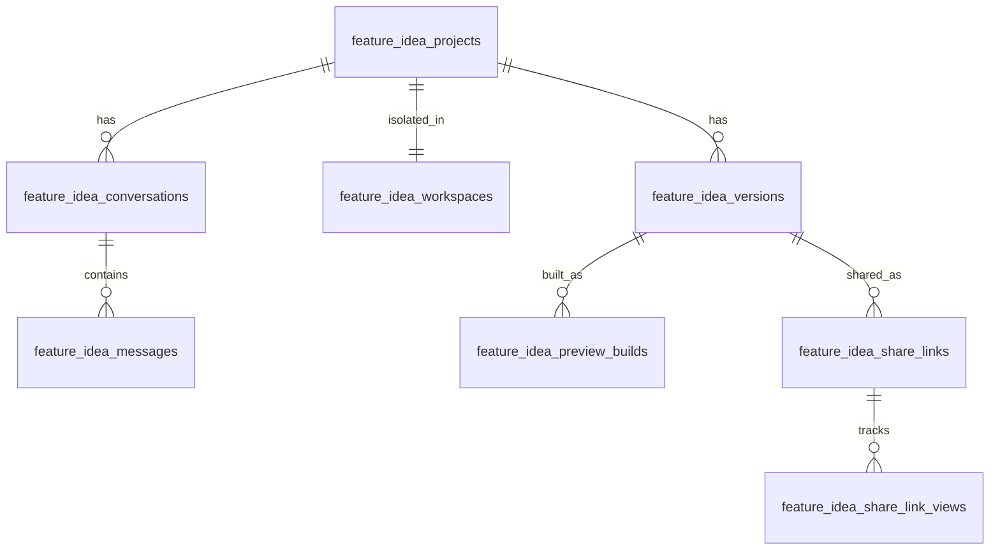
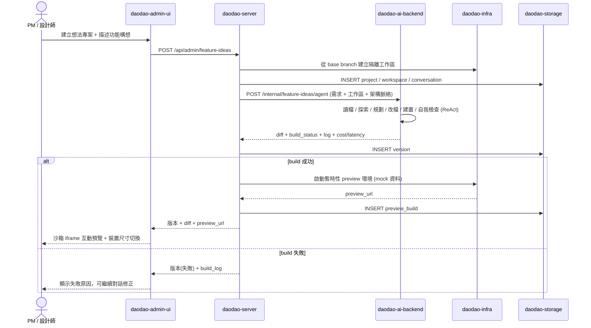
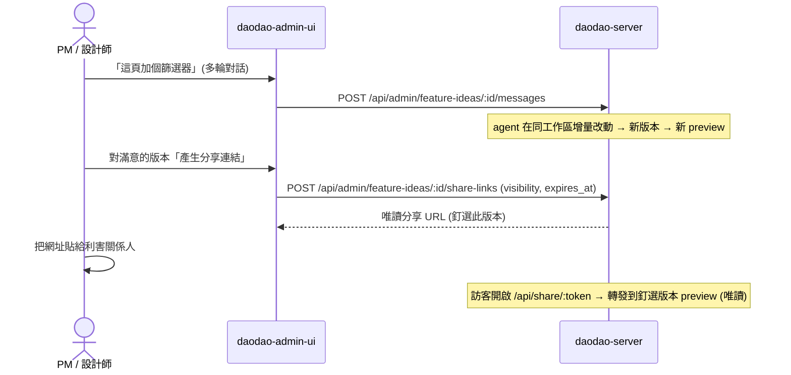

## Context

`add-ai-service-management` 建立了「後台 + 對話 + AI executor + 預覽」的基礎：admin 在 `daodao-admin-ui` 描述需求，`daodao-server` 作 orchestrator，`daodao-ai-backend` 作 AI executor（含 sandbox runtime 與 ReAct loop），結果以可審核的 draft 形式預覽。但該預覽只到 **Workflow 結構**層級（trigger / nodes / edges），無法呈現真實產品 UI。

本設計把「對話 → 預覽」延伸到**真實 daodao app**：PM / 設計師描述功能構想，AI coding agent **以 daodao-f2e 既有程式碼為基礎**做改動，建置出**可互動的 preview 環境**，並能 publish 成唯讀分享網址。本質上是把「Claude Code on the web 在隔離分支改 code → 跑 preview」的能力，產品化成 PM / 設計師可用的後台工具。

**Phase 1 範圍**：手動觸發、單一 base branch（預設 f2e `main`）、純前端改動為主、preview 用 mock 資料、公開唯讀分享連結。
**Phase 2 預留**：把採用版本升級成正式 PR / OpenSpec proposal、交棒給 Workflow generator、團隊協作留言、跨 server 改動。

## Goals / Non-Goals

**Goals:**

- PM / 設計師可用自然語言描述功能構想，不需要工程介入即可看到**可互動**的成果
- 改動以 **daodao 真實 codebase 為基礎**，原型貼近真實產品（真實元件、設計系統、頁面結構、資料實體）
- 每個想法在**隔離工作區**進行，永不影響 main 與生產環境
- 可多輪迭代，並保存每一版的 diff、建置結果與可分享預覽
- 可 publish **唯讀分享網址**，預設公開、可選團隊限定，連結釘選特定版本
- 預覽在**安全沙箱**中執行，使用 mock / 唯讀資料，不接觸生產 API 與後台 session

**Non-Goals（Phase 1）:**

- 不自動把原型 diff 合併進 main 或開正式 PR（需 Phase 2 人工觸發）
- 不支援同時改動多個 repo / 後端商業邏輯（Phase 1 聚焦 f2e 前端改動）
- 不做即時多人協作編輯（分享連結為唯讀預覽，留言為 Phase 2）
- preview 不連接生產資料庫；不保證原型程式碼品質達到可直接上線標準
- 不取代正式工程實作流程；原型用於溝通與驗證，採用後仍需正規開發

## Decisions

### 1. 以「隔離工作區 + 暫時性 preview 環境」為核心，而非憑空生成 mockup

**決定**：每個想法專案綁定一個從指定 base branch（預設 daodao-f2e `main`）切出的**隔離工作區**（git worktree / 暫時性分支）。AI coding agent 在此工作區對真實檔案做增量改動，建置成一個**可拋棄的 preview deploy**。

**理由**：使用者要的是「在現有 daodao app 上套用構想長什麼樣」，而非通用樣板。以真實 codebase 為基礎才能復用真實元件、設計系統與資料結構，原型才有溝通與驗證價值。

**取捨**：比「生成獨立 HTML」重（需 build pipeline 與 preview 託管），但這正是「以專案程式碼為基礎」需求的本質成本。Phase 1 用單一 base branch 與前端改動降低複雜度。

### 2. 工作區生命週期與隔離

| 階段 | 行為 |
|---|---|
| 建立想法專案 | 從 base branch fork 出 `feature_idea_workspaces` 記錄（branch ref / 工作區位置 / base commit） |
| agent 改動 | 在工作區內讀檔 / 改檔 / 建置；每回合產生一個 `feature_idea_versions`（含 diff、建置 log、狀態） |
| 預覽 | 對成功建置的版本啟動 `feature_idea_preview_builds`（preview URL、狀態、TTL） |
| 閒置 / 到期 | preview deploy 依 TTL 回收；工作區可在專案封存時清理 |

**隔離保證**：工作區分支永不被 push 到 main；preview deploy 跑在獨立沙箱，使用 mock 資料；agent 只能存取該工作區檔案，不能觸及生產設定或祕密。

### 3. AI coding agent：復用 ai-backend ReAct loop，加上 codebase tooling

**決定**：`daodao-ai-backend` 新增 coding agent endpoint，復用 `add-ai-service-management` 既有的 sandbox runtime 與 ReAct loop，提供針對 codebase 的工具：`read_file`、`list_dir`、`search_code`、`edit_file`、`run_build`、`run_lint_typecheck`。agent 流程：理解需求 → 探索相關檔案 → 規劃改動 → 編輯 → 建置與自我檢查 → 失敗時修復或回報。

**理由**：不重造輪子；coding agent 與既有 skill-call executor 共用 sandbox、budget（`max_iterations`）、dead-loop detection 與 cost / latency 記錄。

**取捨**：agent 改動可能失敗或不完美；因此每回合保存 diff 與建置 log，建置失敗的版本不可被 publish 成分享連結，UI 明確標示版本狀態。

### 4. 架構脈絡注入（grounding）

**決定**：agent 改動前注入 daodao 既有架構脈絡：設計系統 token、元件目錄（可用元件與用法）、頁面 / 路由結構、資料實體 schema（practices / users / challenges / badges / 推薦 等）。Phase 1 採**策展式 registry**（由 f2e 提供元件目錄與 token 來源 + server 維護實體 schema 摘要），不讓 agent 自由臆測。

**理由**：與既有 `ai-data-source-config` 白名單同精神——以受控、策展的脈絡來源確保產出貼近真實且安全，而非放任 AI 幻想出不存在的元件或欄位。

### 5. 互動預覽渲染與沙箱

**決定**：後台以**沙箱 iframe** 內嵌 preview deploy URL，支援桌機 / 平板 / 手機尺寸切換。iframe 套用嚴格 CSP 與 `sandbox` 屬性，preview app 以 mock 資料啟動，不能呼叫生產 API、不能讀取後台 session 或 cookie。

**理由**：preview 是會執行任意 agent 生成程式碼的環境，必須與後台與生產嚴格隔離以防資料外洩或越權。

### 6. 唯讀分享網址與存取控制

**決定**：`feature_idea_share_links` 以不可猜測 token 產生穩定 URL，**釘選**某一具體 `feature_idea_versions`（後續迭代不影響已分享版本）。

| 可見性 | 行為 |
|---|---|
| `public`（預設） | 任何人有連結即可互動試用，唯讀，不需登入 |
| `team` | 需登入且為 daodao 團隊成員才可開啟 |

連結支援設定到期時間（`expires_at`）、隨時撤銷（`revoked_at`），並記錄每次瀏覽到 `feature_idea_share_link_views`。公開連結經 `daodao-server` 的 `/api/share/:token` 端點轉發到對應 preview，不暴露後台路徑與內部 ID。

**理由**：對應使用者「做成網址分享給別人看」的需求，同時兼顧公開易用與內部敏感原型的存取控制。釘選版本避免「分享出去的東西後來被改掉」。

### 7. 安全與治理邊界

- 工作區分支永不自動合併 main；升級成正式 PR / OpenSpec proposal 為 Phase 2 且需人工觸發
- preview 只用 mock / 唯讀資料；agent 工具不暴露祕密與生產連線字串
- 分享連結不附帶任何後台或使用者 session
- 每個想法版本的 agent 執行記錄 cost / latency / iteration，受 budget 限制（復用既有 guard）

## Data Model

| Table | 用途 | 重點欄位 |
|---|---|---|
| `feature_idea_projects` | 想法專案 | `owner_id`、`title`、`description`、`base_repo`、`base_branch`、`status` |
| `feature_idea_workspaces` | 隔離工作區（1:1 專案） | `project_id`、`branch_ref`、`base_commit`、`workspace_location`、`status` |
| `feature_idea_conversations` | 對話 | `project_id` |
| `feature_idea_messages` | 對話訊息 | `conversation_id`、`role`、`content` |
| `feature_idea_versions` | 每回合改動版本 | `project_id`、`version_no`、`diff`、`build_status`、`build_log`、`cost_usd`、`latency_ms` |
| `feature_idea_preview_builds` | 暫時性 preview 環境 | `version_id`、`preview_url`、`status`、`expires_at` |
| `feature_idea_share_links` | 唯讀分享連結 | `version_id`、`token`、`visibility`(public/team)、`expires_at`、`revoked_at` |
| `feature_idea_share_link_views` | 瀏覽記錄 | `share_link_id`、`viewed_at`、`viewer_hint` |

## Flows

### 想法 → 改動 → 預覽

### 迭代與分享

## Risks / Trade-offs

| 風險 | 說明 | 緩解 |
|---|---|---|
| Preview build pipeline 成本與延遲 | 每個版本都要建置 + 託管 | 暫時性可拋棄環境 + TTL 回收；增量建置；建置失敗版本不託管 |
| Agent 改動失敗或品質不一 | AI 對真實 codebase 改動可能 build 失敗 | 每回合自我檢查（lint/typecheck/build），保存 build log，失敗版本不可分享，可對話修正 |
| 沙箱外洩風險 | 預覽執行 agent 生成程式碼 | 嚴格 iframe sandbox + CSP、mock 資料、無生產連線、分享連結不帶 session |
| 公開分享連結外流 | 敏感原型被未授權者看到 | 不可猜測 token、可設到期 / 撤銷、團隊限定模式、釘選版本避免內容被替換 |
| 與 main 漂移 | base branch 演進使工作區過時 | 記錄 `base_commit`；提供「以最新 base 重建工作區」選項（Phase 2） |
| 範圍蔓延成正式開發工具 | 易被誤用為實際出貨管道 | 明確定位為原型 / 驗證；不自動合併；升級正式 PR 須人工觸發（Phase 2） |

## Migration / Rollout

- Phase 1 為純新增能力，不改動既有 spec 與資料表，可獨立 migration 與 rollback。
- 先以單一 base branch（f2e `main`）、前端改動、公開唯讀分享連結上線，再逐步加入團隊限定、PR / OpenSpec 升級與 Workflow generator 銜接。
