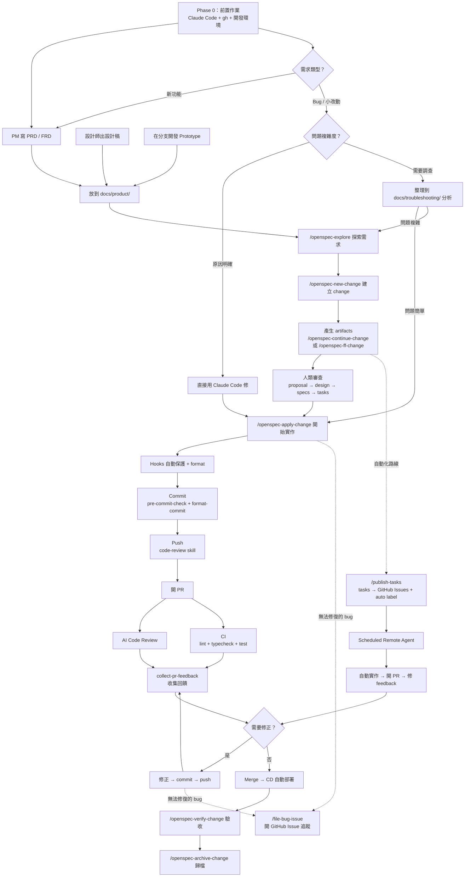

# 開發工作流程

## 簡介

這套工作流程的核心理念：

1. **規格先行** — 用 OpenSpec 將模糊需求轉化為可執行的工程任務，避免開發方向偏移
2. **自動化品質守護** — 透過 hooks、CI/CD、AI Code Review 等機制，讓品質檢查發生在每一個環節
3. **人類保有最終決策權** — 自動化處理繁瑣工作，但每個關鍵節點都由人類做最終判斷

---

## 全貌

整個開發流程分為 10 個階段（Phase 0-9）：



---

## Phase 0：前置作業

### 0.1 AI 輔助開發工具

| 工具 | 用途 | 安裝方式 |
|------|------|---------|
| **Claude Code** | 主力 AI 開發工具，執行 skills、hooks、OpenSpec 流程 | `npm install -g @anthropic-ai/claude-code` |

### 0.2 GitHub CLI（gh）

```bash
# macOS
brew install gh

# 登入
gh auth login
```

### 0.3 Claude Code 設定

安裝後，repo 內的 `.claude/` 目錄已包含所有設定：

1. **Hooks** — `settings.json` 中定義了 `pre-write-guard.sh` 和 `post-write-format.sh`
2. **Skills** — 位於 `.claude/skills/` 目錄，隨 repo clone 下來即可使用

---

## Phase 1：需求輸入

### 新功能開發

需求素材統一放在 `docs/product/`，按功能模組分子目錄。

### Bug 修復 / 小改動

- **路徑 A**：原因明確 → 直接用 Claude Code 修復
- **路徑 B**：需要調查 → 整理到 `docs/troubleshooting/` 分析

---

## Phase 2：規格拆解（OpenSpec）

| 順序 | Skill | 用途 | 產出 |
|------|-------|------|------|
| 0 | `/openspec-explore` | 探索需求、釐清問題 | 對需求的理解 |
| 1 | `/openspec-new-change` | 建立新 change | `proposal.md` |
| 2 | `/openspec-continue-change` | 產生下一個 artifact | `design.md` |
| 3 | `/openspec-continue-change` | 繼續 | `specs/` |
| 4 | `/openspec-continue-change` | 繼續 | `tasks.md` |
| — | `/openspec-ff-change` | 快速模式 | 全部 |

### Artifacts 結構

```
openspec/changes/<change-name>/
├── .openspec.yaml    ← 狀態追蹤
├── proposal.md       ← 提案
├── design.md         ← 技術設計
├── specs/            ← 細部規格
│   ├── <feature-a>/spec.md
│   └── <feature-b>/spec.md
└── tasks.md          ← 工程任務清單
```

---

## Phase 3：開發

```bash
/openspec-apply-change <change-name>
```

### Hooks 自動保護

| 時機 | Hook | 做了什麼 |
|------|------|---------|
| 寫入檔案**前** | `pre-write-guard.sh` | 攔截敏感檔案、載入 project-rules |
| 寫入檔案**後** | `post-write-format.sh` | 自動格式化（Biome / ESLint / Black + Ruff） |

---

## Phase 4：Commit

1. `/pre-commit-check` — 格式化 + Lint + Type check + 自動修復
2. `/format-commit` — 結構化 commit message（type + scope + Why / How）

---

## Phase 5：Push 前 Code Review

`/code-review` 審查整個 branch：邏輯錯誤、安全問題、效能問題、架構一致性。

---

## Phase 6：開 PR

PR 開出後觸發自動化檢查（CI、AI Code Review 等），然後用 `/collect-pr-feedback` 收集回饋。

---

## Phase 7：Merge & Deploy

CI 全綠 + Review 通過 → Merge → CD 自動部署。

---

## Phase 8：驗收與歸檔

```bash
/openspec-verify-change <change-name>   # 驗收
/openspec-archive-change <change-name>  # 歸檔
```

---

## Phase 9：自動化代理（Remote Agent）

用 `/publish-tasks` 把 OpenSpec tasks 發到 GitHub Issues，Scheduled Remote Agent 自動實作。

---

## 工具總覽

| 階段 | 工具 | 用途 |
|------|------|------|
| **規格** | OpenSpec skills | 需求 → 提案 → 設計 → 規格 → 任務 |
| **開發** | Claude Code + hooks | AI 輔助開發 + 自動保護和格式化 |
| **Commit** | pre-commit-check + format-commit | 品質檢查 + 結構化 commit message |
| **Review** | code-review | Push 前本地 code review |
| **PR** | collect-pr-feedback | 收集所有 review 回饋 |
| **Bug** | file-bug-issue | 開 GitHub issue 追蹤 |
| **自動化** | publish-tasks + Remote Agent | tasks → Issues → 自動實作 |
| **同步** | sync-shared-config workflow | 共用設定同步到子專案 |
